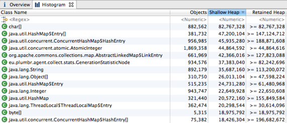

搞定内存溢出(part 3) – 从哪里下手?
==

How do I know that the application is actually suffering from memory leaks? Where and how can I find the cause of the possible memory leak? An experienced developer usually begins its troubleshooting by answering the aforementiond fundamental questions.

我怎么知道应用真的发生了内存泄漏(memory leak)? 又该在哪里、如何找到可能的内存泄漏的根源? 有经验的开发者, 通常会从回答上述几个基本问题开始排查。

Lets see a typical flow when trying to answer those two simple questions.

我们来看看回答这两个简单问题时, 一个典型的流程是怎样的。

1. First – you should find evidence hidden somewhere in the logs. If you are lucky you can have a peek at production logs. In most cases there is a pack of angry Kerberos – like guys guarding the access – both from operations and security units of the corporation.

1. 首先——你需要在日志里的某个角落找到证据。运气好的话, 你能瞄一眼生产日志。但大多数情况下, 都有一群像刻耳柏洛斯(Kerberos)一样凶神恶煞的家伙把守着访问入口——运维部门和安保部门都算上。

2. Lets assume that you can bypass the walls separating you from the vital information. Is it anyhow helpful? Most likely not. You find your good’ol friend Exception in thread “main” java.lang.OutOfMemoryError: while grepping through logs, but nothing interesting seems to precede its creation. There might be hints from monitoring logs that performance degradation started minutes before the actual error. But besides this – business as usual.

2. 假设你能绕过那道把你和关键信息隔开的墙。这有用吗? 多半没用。你在日志里 grep 来 grep 去, 找出老朋友 `Exception in thread "main" java.lang.OutOfMemoryError:`, 但在它出现之前, 似乎并没有什么值得注意的东西。监控日志里倒可能有一些线索, 说明性能在实际报错前几分钟就开始下降了。但除此之外——一切照旧。

When you have reached thus far you have successfully answered the first question – for some reason the application has run out of the heap space available. Great! But this was the easy part – how can you now find the cause of the problem?

走到这一步, 你已经成功回答了第一个问题——应用出于某种原因耗尽了可用的堆空间。很好! 但这只是简单的那部分——现在你该怎么找到问题的根源?

First, lets try to get our hands on memory dump right before we run out of heap space. If you already have -XX:+HeapDumpOnOutOfMemoryError parameter in your JVM startup script – good for you. You now just have to get the dump from the Kerberos, but you are good at it anyway, so no problems here. If not, then you have to ask the operations to create the dump manually right before they restart the JVM by invoking jmap -dump on the process.

首先, 让我们设法在堆空间耗尽之前拿到内存转储(memory dump)。如果你的 JVM 启动脚本里已经有 `-XX:+HeapDumpOnOutOfMemoryError` 参数——那算你走运。你现在只需要从"守门人"那里把 dump 文件取出来, 反正你擅长这个, 没问题。要是没有这个参数, 你就得请运维人员在重启 JVM 之前, 对进程执行 `jmap -dump` 手动生成 dump。

If you have sucessfully received the dump, you should dig into it with your favourite tool – most of us tend to be familiar with Eclipse MAT, so lets assume you have parsed the dump with MAT and are now looking something like this:

如果顺利拿到了 dump, 你就该用最趁手的工具去分析它——我们大多数人比较熟悉 Eclipse MAT, 所以假设你已经用 MAT 解析了 dump, 现在看到的是类似这样的界面:

What can you conclude from here? Should you use less Strings or char arrays in you application? It takes a lot of knowledge to find out what is actually leaking while looking at the analysis results. And even if you find the class whose instances are leaking – you still have no clue where those object references are kept and where the objects were created.

从这里你能得出什么结论? 是不是应该在应用里少用 String 或 char 数组? 光盯着分析结果, 要找出究竟谁在泄漏, 需要相当多的经验。而且就算你找到了实例正在泄漏的那个类——你依然不知道这些对象引用被保存在哪里、对象又是在哪里创建的。

> **广告:** 你知道大约 20% 的Java系统存在内存泄漏(memory leak)吗? 不要老是去杀进程,你可以通过 [Plumbr](https://plumbr.eu/memory-leak) 来快速排查问题.

You might try to reproduce the problem in your test environment to understand the usage patterns causing the leakage. You would then also attach the JVM profiler (Yourkit, VisualVM, …) to gather vital information about the cause. If you are lucky you have some testing scripts simulating end-user behavior ready. In most cases you don’t, though. Creating those scripts would take days you don’t have. At least when The Boss is breathing down your neck.

你可能会想在测试环境里复现问题, 以理解导致泄漏的使用模式。然后再挂上 JVM 分析器(profiler, 如 Yourkit、VisualVM 等)来收集关于病因的关键信息。运气好的话, 你手头已经有能模拟终端用户行为的测试脚本。但大多数情况下你并没有。编写这些脚本要花上好几天, 而你根本没这个时间。至少当老板盯着你的时候是这样。

Nevertheless – lets assume some heavenly force helped you with the scripts you now can play back using your favorite tool. You configure the test to simulate ten times the load the application is supposed to face in production, but without much success – the application just won’t break.

不过——假设有神仙相助, 你搞到了脚本, 现在可以用趁手的工具回放了。你把测试配置成模拟生产环境预期负载的十倍, 但没多大用——应用就是不崩。

Now what? You have a (repeatedly) dying patient, who just before death seems completely fine. And you are not allowed to see nor speak to the patient. But you have given your Hippocratic oath to cure him, so you just cannot give up.

那接下来怎么办? 你有一个(反复)垂死的病人, 临死前看上去却一切正常。而且你既不能见病人, 也不能和病人说话。但你宣读过希波克拉底誓言要治好他, 所以你就是不能放弃。

—

In our next article we will look into more details about which tools you can use and what they are actually able to show you. This will cover (in more details) the arsenal already referred in this article, but we will also look into other standard equipment, such as jhat, jconsole, visualvm and others.

在下一篇文章里, 我们会更详细地看看有哪些工具可用, 以及它们到底能展示什么。我们会更深入地介绍本文已经提到的那些武器, 也会研究其他标准装备, 比如 jhat、jconsole、visualvm 等等。

### 搞定内存溢出系列文章

- [搞定内存溢出(part 1) – 程序员的那些事](01_story_of_a_developer.md)

- [搞定内存溢出(part 2) – 为什么运营搞不定?](02_why_did_not_operations_solve_it.md)

- [搞定内存溢出(part 3) – 从哪里下手?](03_where_do_you_start.md)

- [搞定内存溢出(part 4) – 内存分析器](04_memory_profilers.md)

- [搞定内存溢出(part 5) – JDK自带的工具](05_JDK_Tools.md)

- [搞定内存溢出(part 6) – Dump 没想象中那么麻烦](06_Dump_is_not_a_waste.md)

原文日期: 2011年08月29日

翻译日期: 2015年10月26日

翻译人员: [铁锚 http://blog.csdn.net/renfufei](http://blog.csdn.net/renfufei)
