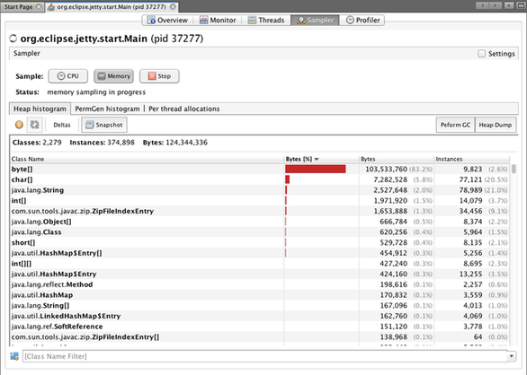
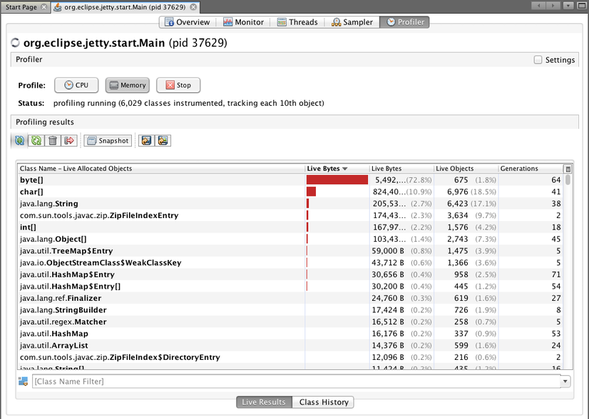
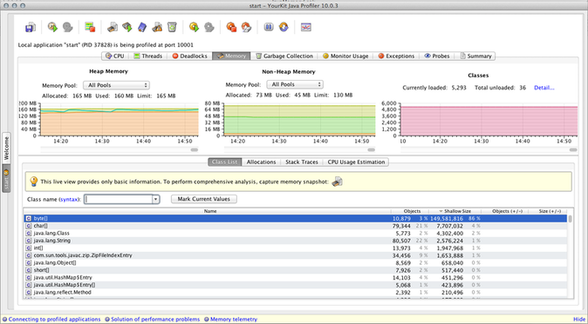
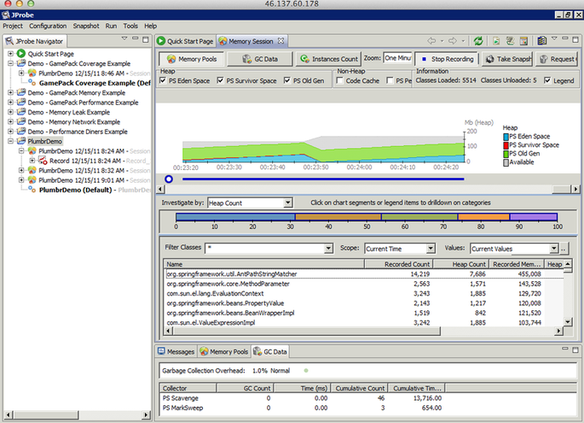

Solving OutOfMemoryError (part 4) – memory profilers
==

It is about time to continue our Solving OutOfMemoryError blog post series. In retrospect, so far we have covered: Part 1 described the Story of solving an OutOfMemoryError [through the eyes of a Developer](https://plumbr.eu/blog/blog/solving-outofmemoryerror-story-of-a-developer), Part 2 explained how [the Ops usually tackle the OutOfMemoryError problem](https://plumbr.eu/blog/blog/solving-outofmemoryerror-why-didnt-operations-solve-it), and Part 3  started looking at [where to start solving the OutOfMemoryError](https://plumbr.eu/blog/blog/solving-outofmemoryerror-where-do-you-start). A couple of next posts will now look at the existing tools that you can use to find a Java memory leak.

Our past experience, which is supported by a quick search on Google and Stackoverflow, shows that the first set of tools people tend to jump to when solving memory problems in production is memory profilers. Among them, VisualVM, YourKit and JProbe seem to be the most popular.

Let’s use our leaking Pet Clinic sample application as our “dying patient” and, using these three tools, try to find out why it crashes with OutOfMemoryError.

So, to recap the previous articles:

- You know that your application crashes with `java.lang.OutOfMemoryError`.
- You can reproduce the crash at your own will in reasonable time (sometimes doesn’t hold true, and the leak only takes effect in production, but let’s assume it for simplicity). A week is not reasonable.
- You are able to run the profilers on some machine that can open a socket connection to your crashing application.

And to remind you, dear reader, based on our experience – these are quite bold assumptions, you are one really lucky bastard if you have all those preconditions filled to start with.

Please also note, that in this post only profiling tools are covered. Other techniques, namely memory snapshot comparison or memory dump analysis, will be discussed in future posts.

Second note:  no previous experience or proficiency with these tools is expected from the reader. In all described cases only  instructions in “Getting started” or demo video were followed, as every newcomer would do. It is quite possible, that there are some more advanced techniques, which lead to more satisfying results.

### VisualVM

The first profiler product to enter the ring – [VisualVM](http://visualvm.java.net/). A quick introduction about how to use VisualVM is available [here](http://visualvm.java.net/gettingstarted.html).

So here you have run VisualVM and connected it to our demo application. VisualVM provides you with CPU and Memory Samplers, which allow you to connect to your running application and “view” which methods consume CPU and which objects consume memory. Here is a screenshot from our demo application memory usage using VisualVM’s built-in Memory Sampler:

According to this, you would guess to have problems with arrays of bytes. So, should you dig into my application’s source code (or may be that of 3rd party libraries that your application uses?) for usages of byte[] and try to eliminate them? I don’t think so.

Another way to use VisualVM is its Memory Profiler. The difference between the Sampler and the Profiler lies in the way they ask for info. The sampler periodically polls the application for live objects’ historgram. Profilers instrument your classes’ bytecode to record creations of new objects. The output of the Profiler is very similar to that of the Sampler:

Again, not much help from seeing that we should get rid of bytes somehow. But this view adds one truly interesting piece of information: Generations. You can think of it as the number of GC intervals, in which the instances of the given class are created and at least one of those instances is still alive. For example – while looking at the screenshot above, ZipFileIndexEntry class has currently instances from five different GC cycles. It appears that if generations count is significantly  higher for some classes, they are very good leak candidates. So, lets try to make a screenshot from Profiler’s output sorted by generations count. If you are now as unlucky as me then you just cannot. Three times out of three VisualVM stopped responding after trying to sort by Generations column. More than that, the application died too, all its threads were blocked on calls to VisualVM. Even killing VisualVM did not allow the Pet Clinic application to continue.

Some more remarks concerning VisualVM as a tool of finding a memory leak in production environment:

1. According to VisualVM documentation both the Sampler and the Profiler work only when the VisualVM and Java application run on the same machine. Which means, that you cannot use it in production environment, as those usually lack an option to run GUI programs. And not all testing environments provide such luxury.

2. Measured by JMeter, the average response time during our tests increased from around 2 times with VisualVM Sampler attached, to almost 15 times with VisualVM Profiler. It is hard to imagine a product owner who would allow such overhead.

3. VisualVM Profiler sometimes blocks the whole application waiting to some user input from his GUI! Sounds like a NO GO for production.

But maybe this was just a bad luck, lets try out some other popular profilers!

### YourKit

The next tool down the line – [YourKit](http://www.yourkit.com/). Take a quick look into [YourKit documentation](http://www.yourkit.com/docs/index.jsp) and to their demo video “[Finding a memory leak](http://www.yourkit.com/docs/demo/JavaMemoryLeak/JavaMemoryLeak.htm)” and you should be set to discover the tool. Plug it in and you should see:

Our old friend byte[] is again leading the pack without any useful hints where to start digging. YourKit demo video proposes that as the next step you should Capture the Memory Snapshot. But that will be covered in the next article where we will look for different memory snapshots or memory dumps analyzers. So, again the profilers seem to be out of luck today.

Unlike VisualVM, YourKit can profile local and remote java applications. For the latter you need to integrate YourKit with your application using provided scripts. Please consult documentation on how to achieve that.

Oh, and the performance of our application with YourKit attached degraded for about 3-4 times compared to vanilla application. Each request being served up to four times slower – makes it questionable whether you could use such tool in production.

### JProbe

But you are a really thorough guy and you just do not give up that easily. Lets grab a third profiler, maybe with more luck this time. When trying to get your hands on  JProbe you might actually find it not being too easy. In order to download the trial version you have to make three clicks before you get to “Download JProbe” button. Then you have to register and provide your postal address. Why on earth is this necessary? You better send me a postcard for Christmas! After that, you are asked about how often you develop SQL code. We’ll leave finding the connection between your problem with memory leaks and SQL, an exercise for the reader.

After handing out all your personal information (and your first-born child), you will discover that JProbe ships without Mac OS X support. So you have to fall back to Eclipse plugin. Which  for IntelliJ users on Mac is another “good news”. Well, after downloading it (and that is 221MB compared to YourKit’s 5MB), how do you proceed installing it to  Eclipse? 33 pages long JProbe installation manual tells you: “For information about installing the JProbe Plugins for Eclipse and setting up your JProbe environment within Eclipse, see the JProbe Plugins for Eclipse section in Help.”  Arghhhhh.

So you go into the basement, drag out the old Win XP box you had hidden there, blow off the dust and start a Windows machine. And install JProbe onto it by following the process described in  [Demo of JProbe v9](http://bcove.me/xvv6eth1) video. The next surprise will be discovering that unlike other tools, JProbe does not support just arbitrary Java process. It needs to be either integrated with supported containers (and Jetty that we use for our demo is not among them) or to be able to start your application via java class or executable jar. So you will have some more struggles ahead while tweaking the configuration. But about half an hour and a billion dead brain cells later you will succeed connecting JProbe to your application.

Following the JProbe demo video instructions you now should turn on object allocations recording. It will impose a small overhead though. **The overhead of 350x**. But you can look into it as a good thing – because of the CPU overhead in place, your application will live a lot longer. Our demo app lived the record long 30 minutes, instead of 2 minutes without JProbe. So you will find a good way to postpone the OutOfMemoryError crash: make your application much-much slower. Nevertheless, here is a screenshot of JProbe:

From here you need more than luck to deduce anything leading to the cause of the memory leak. If you follow the instructions from JProbe demo video you should let the application run for some time with recording turned on, then switch it off and disconnect JProbe from the application. Next, the video suggests that you should compare different moments from application lifetime  in order to draw any conclusions. Depending on what moments you will try, you get very different sets of “suspicious” objects. Sometimes they might contain a real leak, sometimes not. In conclusion it seems that JProbe can be used to verify if the given suspect is a leak or not. Not to find it in the first place.

> **广告:** Did you know that 20% of Java applications have memory leaks? Don’t kill your application – instead find and fix leaks with [Plumbr](https://plumbr.eu/memory-leak) in minutes.

###Conclusion

Profilers will not help you find memory leaks. No, really. Just by profiling/sampling your application you will not find the reason for those OutOfMemoryErrors. You just make your application 2-15 times slower.

In the next article we will see if memory dump analyzers can come to the rescue. VisualVM and YourKit will have a second chance. Also we will look into Eclipse Memory Analyzer Tool and some little helpful critters that come with your JDK. Till the next time!

### Solving OutOfMemoryError 系列文章

- [Solving OutOfMemoryError (part 1) – story of a developer](01_story_of_a_developer.md)

- [Solving OutOfMemoryError (part 2) – why didn’t operations solve it?](02_why_did_not_operations_solve_it.md)

- [Solving OutOfMemoryError (part 3) – where do you start?](03_where_do_you_start.md)

- [Solving OutOfMemoryError (part 4) – memory profilers](04_memory_profilers.md)

- [Solving OutOfMemoryError (part 5) – JDK Tools](05_JDK_Tools.md)

- [Solving OutOfMemoryError (part 6) – Dump is not a waste](06_Dump_is_not_a_waste.md)

原文日期: 2011年08月29日

翻译日期: 2015年10月26日

翻译人员: [铁锚 http://blog.csdn.net/renfufei](http://blog.csdn.net/renfufei)
