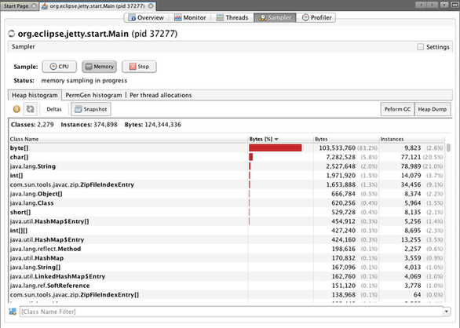
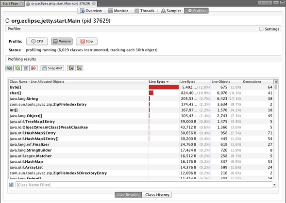
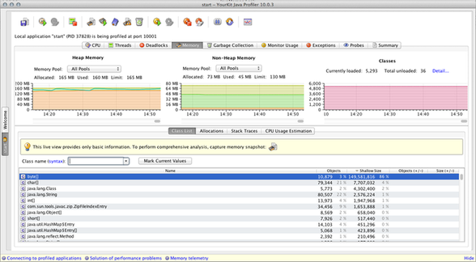
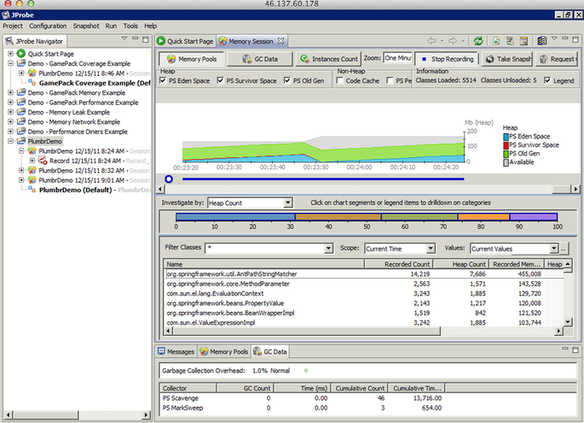

搞定内存溢出(part 4) – 内存分析器
==

It is about time to continue our 搞定内存溢出blog post series. In retrospect, so far we have covered: Part 1 described the Story of solving an OutOfMemoryError [through the eyes of a Developer](https://plumbr.eu/blog/blog/solving-outofmemoryerror-story-of-a-developer), Part 2 explained how [the Ops usually tackle the OutOfMemoryError problem](https://plumbr.eu/blog/blog/solving-outofmemoryerror-why-didnt-operations-solve-it), and Part 3  started looking at [where to start solving the OutOfMemoryError](https://plumbr.eu/blog/blog/solving-outofmemoryerror-where-do-you-start). A couple of next posts will now look at the existing tools that you can use to find a Java memory leak.

是时候继续我们的"搞定内存溢出"系列博客了。回顾一下, 到目前为止我们已经讲过: 第 1 篇以[开发者的视角](https://plumbr.eu/blog/blog/solving-outofmemoryerror-story-of-a-developer)讲述了解决 OutOfMemoryError 的故事, 第 2 篇解释了[运维通常如何应对 OutOfMemoryError 问题](https://plumbr.eu/blog/blog/solving-outofmemoryerror-why-didnt-operations-solve-it), 第 3 篇则开始探讨[该从哪里下手解决 OutOfMemoryError](https://plumbr.eu/blog/blog/solving-outofmemoryerror-where-do-you-start)。接下来几篇文章, 我们要看看有哪些现成的工具可以用来查找 Java 内存泄漏(memory leak)。

Our past experience, which is supported by a quick search on Google and Stackoverflow, shows that the first set of tools people tend to jump to when solving memory problems in production is 内存分析器. Among them, VisualVM, YourKit and JProbe seem to be the most popular.

根据我们过去的经验(在 Google 和 Stack Overflow 上简单搜一下也能印证), 人们解决生产环境内存问题时最先想到的一类工具就是分析器(profiler)。其中 VisualVM、YourKit 和 JProbe 似乎最受欢迎。

Let’s use our leaking Pet Clinic sample application as our “dying patient” and, using these three tools, try to find out why it crashes with OutOfMemoryError.

我们就用那个存在泄漏的 Pet Clinic 示例应用当作"垂死的病人", 借助这三种工具, 试着找出它为什么会因 OutOfMemoryError 崩溃。

So, to recap the previous articles:

那么, 先回顾一下前几篇文章:

- You know that your application crashes with `java.lang.OutOfMemoryError`.
- You can reproduce the crash at your own will in reasonable time (sometimes doesn’t hold true, and the leak only takes effect in production, but let’s assume it for simplicity). A week is not reasonable.
- You are able to run the profilers on some machine that can open a socket connection to your crashing application.

- 你知道你的应用会因 `java.lang.OutOfMemoryError` 崩溃。
- 你可以在合理的时间内随意复现这次崩溃(有时并不成立, 泄漏只在生产环境才发作, 但为了简单起见先这么假设)。一星期可不算合理。
- 你能在某台机器上运行分析器, 并且这台机器能与你那个正在崩溃的应用建立 socket 连接。

And to remind you, dear reader, based on our experience – these are quite bold assumptions, you are one really lucky bastard if you have all those preconditions filled to start with.

亲爱的读者, 还得提醒你一句, 根据我们的经验——这些假设相当激进, 如果这些前提条件你都能满足, 那你可真是个走了大运的家伙。

Please also note, that in this post only profiling tools are covered. Other techniques, namely memory snapshot comparison or memory dump analysis, will be discussed in future posts.

另外请注意, 本文只涉及分析(profiling)工具。其他技术, 比如内存快照对比或内存转储(memory dump)分析, 会在后续文章中讨论。

Second note:  no previous experience or proficiency with these tools is expected from the reader. In all described cases only  instructions in “Getting started” or demo video were followed, as every newcomer would do. It is quite possible, that there are some more advanced techniques, which lead to more satisfying results.

第二点说明: 读者无需事先具备这些工具的使用经验或熟练度。下文描述的所有场景中, 我们都只是按照"快速上手(Getting started)"文档或演示视频来操作, 就像任何一个新手会做的那样。完全可能存在一些更高级的技巧, 能带来更令人满意的结果。

### VisualVM

The first profiler product to enter the ring – [VisualVM](http://visualvm.java.net/). A quick introduction about how to use VisualVM is available [here](http://visualvm.java.net/gettingstarted.html).

第一个登场亮相的分析器产品——[VisualVM](http://visualvm.java.net/)。想快速了解如何使用 VisualVM, 可以看[这里](http://visualvm.java.net/gettingstarted.html)。

So here you have run VisualVM and connected it to our demo application. VisualVM provides you with CPU and Memory Samplers, which allow you to connect to your running application and “view” which methods consume CPU and which objects consume memory. Here is a screenshot from our demo application memory usage using VisualVM’s built-in Memory Sampler:

现在你启动了 VisualVM 并把它连到了我们的示例应用。VisualVM 提供了 CPU 采样器(CPU Sampler)和内存采样器(Memory Sampler), 让你能连到正在运行的应用, "查看"哪些方法消耗 CPU、哪些对象占用内存。下面是使用 VisualVM 内置内存采样器对示例应用内存使用情况的截图:

According to this, you would guess to have problems with arrays of bytes. So, should you dig into my application’s source code (or may be that of 3rd party libraries that your application uses?) for usages of byte[] and try to eliminate them? I don’t think so.

据此, 你会猜测问题出在字节数组上。那么, 你是不是该翻遍应用的源代码(或者应用所用的第三方库的代码?), 找出所有用到 `byte[]` 的地方并设法消除它们? 我觉得未必。

Another way to use VisualVM is its Memory Profiler. The difference between the Sampler and the Profiler lies in the way they ask for info. The sampler periodically polls the application for live objects’ historgram. Profilers instrument your classes’ bytecode to record creations of new objects. The output of the Profiler is very similar to that of the Sampler:

使用 VisualVM 的另一种方式是它的内存分析器(Memory Profiler)。采样器和分析器的区别在于它们获取信息的方式: 采样器定期向应用轮询存活对象的直方图(histogram); 分析器则对你的类的字节码进行插桩(instrument), 以记录新对象的创建。分析器的输出和采样器非常相似:

Again, not much help from seeing that we should get rid of bytes somehow. But this view adds one truly interesting piece of information: Generations. You can think of it as the number of GC intervals, in which the instances of the given class are created and at least one of those instances is still alive. For example – while looking at the screenshot above, ZipFileIndexEntry class has currently instances from five different GC cycles. It appears that if generations count is significantly  higher for some classes, they are very good leak candidates. So, lets try to make a screenshot from Profiler’s output sorted by generations count. If you are now as unlucky as me then you just cannot. Three times out of three VisualVM stopped responding after trying to sort by Generations column. More than that, the application died too, all its threads were blocked on calls to VisualVM. Even killing VisualVM did not allow the Pet Clinic application to continue.

同样, 看到我们应该设法干掉 byte 也帮不上什么忙。但这个视图多了一条真正有趣的信息: 代数(Generations)。你可以把它理解为若干 GC 时间间隔, 在这些间隔内, 某个类的实例被创建, 且其中至少有一个实例仍然存活。比如——看上方的截图, ZipFileIndexEntry 类当前有分属五个不同 GC 周期的实例。看起来, 如果某些类的代数计数明显偏高, 它们就是很好的泄漏嫌疑对象。那么, 我们试着按代数计数排序, 给分析器的输出截个图吧。如果你和我一样倒霉, 那你就做不到。三次尝试, VisualVM 在按 Generations 列排序后三次都失去响应。更糟的是, 应用也跟着死了, 它所有的线程都阻塞在对 VisualVM 的调用上。甚至杀掉 VisualVM 也没能让 Pet Clinic 应用继续运行。

Some more remarks concerning VisualVM as a tool of finding a memory leak in production environment:

关于把 VisualVM 当作生产环境内存泄漏排查工具, 还有几点补充:

1. According to VisualVM documentation both the Sampler and the Profiler work only when the VisualVM and Java application run on the same machine. Which means, that you cannot use it in production environment, as those usually lack an option to run GUI programs. And not all testing environments provide such luxury.

1. 根据 VisualVM 文档, 采样器和分析器只有在 VisualVM 与 Java 应用运行在同一台机器上时才有效。这意味着你没法在生产环境使用它, 因为生产环境通常没有运行 GUI 程序的条件。而且也不是所有测试环境都能提供这样的奢侈配置。

2. Measured by JMeter, the average response time during our tests increased from around 2 times with VisualVM Sampler attached, to almost 15 times with VisualVM Profiler. It is hard to imagine a product owner who would allow such overhead.

2. 用 JMeter 测量, 在我们的测试中, 挂上 VisualVM 采样器后平均响应时间增加到约 2 倍, 挂上 VisualVM 分析器后则增加到近 15 倍。很难想象哪个产品负责人会容忍这么大的开销。

3. VisualVM Profiler sometimes blocks the whole application waiting to some user input from his GUI! Sounds like a NO GO for production.

3. VisualVM 分析器有时会把整个应用阻塞住, 只为了等待用户在它 GUI 上的某项输入! 这在生产环境听起来就是个禁区(NO GO)。

But maybe this was just a bad luck, lets try out some other popular profilers!

不过也许只是我们运气不好, 换几个其他流行的分析器试试!

### YourKit

The next tool down the line – [YourKit](http://www.yourkit.com/). Take a quick look into [YourKit documentation](http://www.yourkit.com/docs/index.jsp) and to their demo video “[Finding a memory leak](http://www.yourkit.com/docs/demo/JavaMemoryLeak/JavaMemoryLeak.htm)” and you should be set to discover the tool. Plug it in and you should see:

下一个登场的工具——[YourKit](http://www.yourkit.com/)。快速浏览一下 [YourKit 文档](http://www.yourkit.com/docs/index.jsp)和它的演示视频"[Finding a memory leak](http://www.yourkit.com/docs/demo/JavaMemoryLeak/JavaMemoryLeak.htm)", 你差不多就能上手这个工具了。把它接上去, 你应该会看到:

Our old friend byte[] is again leading the pack without any useful hints where to start digging. YourKit demo video proposes that as the next step you should Capture the Memory Snapshot. But that will be covered in the next article where we will look for different memory snapshots or memory dumps analyzers. So, again the profilers seem to be out of luck today.

我们的老朋友 `byte[]` 又一次高居榜首, 却没有任何有用的线索告诉该从哪里查起。YourKit 的演示视频建议下一步"捕获内存快照(Capture Memory Snapshot)"。不过这留到下一篇文章再讲, 到时会研究各种内存快照或内存转储分析器。所以, 看来今天分析器又一次不走运。

Unlike VisualVM, YourKit can profile local and remote java applications. For the latter you need to integrate YourKit with your application using provided scripts. Please consult documentation on how to achieve that.

和 VisualVM 不同, YourKit 既能分析本地 Java 应用, 也能分析远程 Java 应用。对于远程应用, 你需要用官方提供的脚本把 YourKit 集成进你的应用, 具体做法请查阅文档。

Oh, and the performance of our application with YourKit attached degraded for about 3-4 times compared to vanilla application. Each request being served up to four times slower – makes it questionable whether you could use such tool in production.

哦对了, 挂上 YourKit 后, 应用的性能比原始版本下降了约 3-4 倍, 每个请求的处理速度最多慢到原来的四分之一——这让人怀疑这种工具到底能不能用在生产环境。

### JProbe

But you are a really thorough guy and you just do not give up that easily. Lets grab a third profiler, maybe with more luck this time. When trying to get your hands on  JProbe you might actually find it not being too easy. In order to download the trial version you have to make three clicks before you get to “Download JProbe” button. Then you have to register and provide your postal address. Why on earth is this necessary? You better send me a postcard for Christmas! After that, you are asked about how often you develop SQL code. We’ll leave finding the connection between your problem with memory leaks and SQL, an exercise for the reader.

但你是个特别较真的人, 不会这么轻易放弃。我们抓第三个分析器来试试, 也许这次运气会好些。等你想弄到 JProbe 的时候, 可能就会发现它并不那么好搞。要下载试用版, 你得点三次才能看到"Download JProbe"按钮。然后还得注册、填上你的邮寄地址。这到底有什么必要? 你不如圣诞节给我寄张明信片! 之后, 它还会问你多久写一次 SQL 代码。至于你排查内存泄漏和 SQL 之间有什么关系, 就留给读者自己去想吧。

After handing out all your personal information (and your first-born child), you will discover that JProbe ships without Mac OS X support. So you have to fall back to Eclipse plugin. Which  for IntelliJ users on Mac is another “good news”. Well, after downloading it (and that is 221MB compared to YourKit’s 5MB), how do you proceed installing it to  Eclipse? 33 pages long JProbe installation manual tells you: “For information about installing the JProbe Plugins for Eclipse and setting up your JProbe environment within Eclipse, see the JProbe Plugins for Eclipse section in Help.”  Arghhhhh.

等你交出了所有个人信息(还有你的头胎孩子), 你会发现 JProbe 根本不支持 Mac OS X, 于是你只能退而求其次用 Eclipse 插件。对于 Mac 上的 IntelliJ 用户来说, 这又是"好消息"。好吧, 下载完之后(足足 221MB, 而 YourKit 才 5MB), 接下来该怎么把它装进 Eclipse? 长达 33 页的 JProbe 安装手册告诉你: "关于如何为 Eclipse 安装 JProbe 插件、以及在 Eclipse 中配置 JProbe 环境的信息, 请参阅帮助中的 JProbe Plugins for Eclipse 章节。" 啊啊啊啊。

So you go into the basement, drag out the old Win XP box you had hidden there, blow off the dust and start a Windows machine. And install JProbe onto it by following the process described in  [Demo of JProbe v9](http://bcove.me/xvv6eth1) video. The next surprise will be discovering that unlike other tools, JProbe does not support just arbitrary Java process. It needs to be either integrated with supported containers (and Jetty that we use for our demo is not among them) or to be able to start your application via java class or executable jar. So you will have some more struggles ahead while tweaking the configuration. But about half an hour and a billion dead brain cells later you will succeed connecting JProbe to your application.

于是你钻进地下室, 拖出藏在那里的老 Win XP 机器, 吹掉灰尘, 启动 Windows。然后照着 [Demo of JProbe v9](http://bcove.me/xvv6eth1) 视频里描述的流程把 JProbe 装上。接下来你会发现一个意外: 和其他工具不同, JProbe 并不支持任意 Java 进程。它要么得集成到受支持的容器中(我们示例用的 Jetty 可不在其列), 要么得能通过 java class 或可执行 jar 来启动你的应用。所以你在调整配置时还会遇到不少麻烦。但半小时后、外加死了十亿个脑细胞之后, 你终于成功地把 JProbe 连上了应用。

Following the JProbe demo video instructions you now should turn on object allocations recording. It will impose a small overhead though. **The overhead of 350x**. But you can look into it as a good thing – because of the CPU overhead in place, your application will live a lot longer. Our demo app lived the record long 30 minutes, instead of 2 minutes without JProbe. So you will find a good way to postpone the OutOfMemoryError crash: make your application much-much slower. Nevertheless, here is a screenshot of JProbe:

按照 JProbe 演示视频的说明, 现在你该打开对象分配记录功能了。不过它会带来一点点开销——**350 倍的开销**。但你可以往好处想: 因为有了这些 CPU 开销, 你的应用能活得更久。我们的示例应用创纪录地活了 30 分钟, 而不用 JProbe 时只能活 2 分钟。所以你想找一个推迟 OutOfMemoryError 崩溃的好办法: 把你的应用弄得慢得多、慢得多。不管怎样, 下面是 JProbe 的截图:

From here you need more than luck to deduce anything leading to the cause of the memory leak. If you follow the instructions from JProbe demo video you should let the application run for some time with recording turned on, then switch it off and disconnect JProbe from the application. Next, the video suggests that you should compare different moments from application lifetime  in order to draw any conclusions. Depending on what moments you will try, you get very different sets of “suspicious” objects. Sometimes they might contain a real leak, sometimes not. In conclusion it seems that JProbe can be used to verify if the given suspect is a leak or not. Not to find it in the first place.

到了这一步, 光靠运气已经不足以推断出任何指向内存泄漏根源的东西了。如果照 JProbe 演示视频的说明操作, 你应该让应用在开启记录的情况下跑一段时间, 然后关掉记录、断开 JProbe 与应用。接着, 视频建议你比较应用生命周期中的不同时间点, 从而得出结论。你选择的时间点不同, 得到的"可疑"对象集合会大相径庭。有时其中可能真的包含泄漏, 有时则没有。总之, JProbe 似乎可以用来验证某个嫌疑对象到底是不是泄漏, 而不是用来首先发现泄漏。

> **广告:** 你知道大约 20% 的Java系统存在内存泄漏(memory leak)吗? 不要老是去杀进程,你可以通过 [Plumbr](https://plumbr.eu/memory-leak) 来快速排查问题.

### 结论

Profilers will not help you find memory leaks. No, really. Just by profiling/sampling your application you will not find the reason for those OutOfMemoryErrors. You just make your application 2-15 times slower.

分析器帮不了你找内存泄漏。不, 是真的。光靠对应用做分析/采样, 你根本找不出那些 OutOfMemoryError 的原因。你只会把应用拖慢 2-15 倍。

In the next article we will see if memory dump analyzers can come to the rescue. VisualVM and YourKit will have a second chance. Also we will look into Eclipse Memory Analyzer Tool and some little helpful critters that come with your JDK. Till the next time!

下一篇文章里, 我们来看看内存转储分析器能否救场。VisualVM 和 YourKit 还会有第二次机会。另外我们也会研究 Eclipse Memory Analyzer Tool, 以及 JDK 自带的一些小巧好用的工具。下次见!

### 搞定内存溢出系列文章

- [搞定内存溢出(part 1) – 程序员的那些事](01_story_of_a_developer.md)

- [搞定内存溢出(part 2) – 为什么运营搞不定?](02_why_did_not_operations_solve_it.md)

- [搞定内存溢出(part 3) – 从哪里下手?](03_where_do_you_start.md)

- [搞定内存溢出(part 4) – 内存分析器](04_memory_profilers.md)

- [搞定内存溢出(part 5) – JDK自带的工具](05_JDK_Tools.md)

- [搞定内存溢出(part 6) – Dump 没想象中那么麻烦](06_Dump_is_not_a_waste.md)

原文日期: 2011年08月29日

翻译日期: 2015年10月26日

翻译人员: [铁锚 http://blog.csdn.net/renfufei](http://blog.csdn.net/renfufei)
