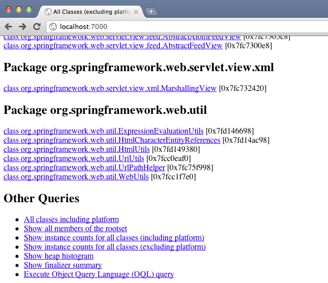
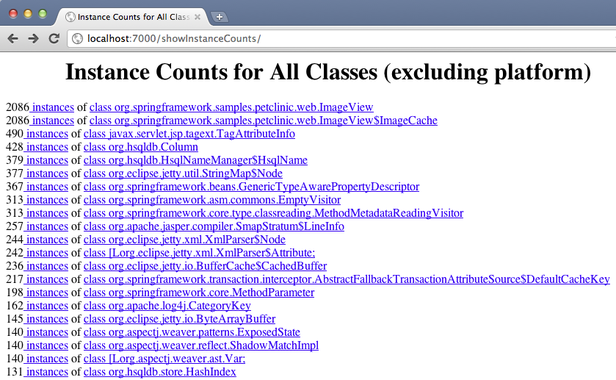
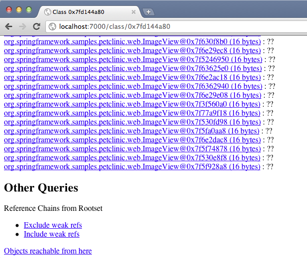
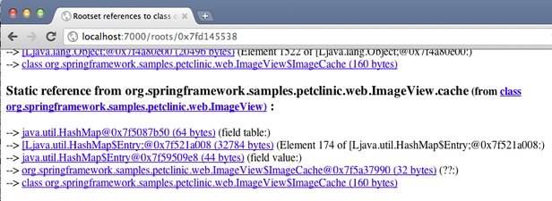

搞定内存溢出(part 5) – JDK自带的工具
==

In our last blog post on the “Solving OutOfMemoryError” series we looked at [profilers and concluded that profiling alone doesn’t help you solve memory leaks](https://plumbr.eu/blog/blog/solving-outofmemoryerror-memory-profilers).

Today we will talk about the command line tools that are bundled with the Oracle JDK and can be used to find memory leaks. The benefit of knowing the bundled tooling is obvious: they are available everywhere where Oracle’s Java is installed, i.e. often also in these test and production environments where other fancy tools are either not installed.

Contents

- Introduction
- jps
- jmap
- jhat
- Conclusions

### Introduction

An attentive reader might ask – why did I mention only command line tools and not jconsole or jvisualvm? Well, from my experience often the only available access channel to the problematic environment (that is, if you have access at all) is the ssh shell. In addition to that, your target machine may also be hidden behind a couple firewalls, so tunneling X server over multiple machines is tedious and also slow. A working tunneled RMI connection  (to connect with jconsole and visualVM remotely) is the thing I still hope to witness some day. Another benefit of these command line tools is that they work equally well on all platforms where HotSpot runs.

To illustrate the usage I’ll use our tried and truely leaking Pet Clinic app ([bundled with Plumbr](https://plumbr.eu/blog/try-it)).

Before we begin, let’s quickly recap our scenario – you know that your application is leaking some memory, unfortunately that happens only in production, you don’t know how to reproduce the problem locally and the only access you have to the “patient” is the ssh connection.

### jps

When we log in to the server, the first thing we will want to know – what is the process ID of our Java application, as all command line tools expect to get it from us.

For that we’ll use the jps command, which lists all running Java processes. It’s output looks like this:

>$ jps
 
	45108 Jps 
	44840 start.jar

That’s pretty concise and if you have several JVMs running on the machine you still have to figure out which one is yours. Fortunately jps has flags that can show us a lot of interesting data:

>$ jps -lvm

	45328 sun.tools.jps.Jps -vlm -Dapplication.home=/System/Library/Java/JavaVirtualMachines/1.6.0.jdk/Contents/Home -Xms8m
	44840 /Users/volli/plumbr_demo/jetty-7.5.4/start.jar --pre=etc/jetty-logging.xml -Djetty.home=/Users/volli/plumbr_demo/jetty-7.5.4 -Djava.io.tmpdir=/var/folders/rw/q2mhv1m53j3_3n74d1fw9pjr0000gn/T/

jps manual page describes these flags as follows:

- `-m` Output the arguments passed to the main method. The output may be null for embedded JVMs.
- `-l` Output the full package name for the application’s main class or the full path name to the application’s JAR file.
- `-v` Output the arguments passed to the JVM.

When looking through all of the parameters you should be able to distinguish similarly looking processes and spot the right one.

There is one caveat with the jps on JDK versions below Java 6 update 21 (and also jconsole and visualvm listing local processes): your Tomcat  process is not listed, regardless of you knowing that it is there. The trick is the java.io.tmpdir system property that is redefined by  Tomcat by default and that is somehow used internally by command line tools to detect running processes.

So, if command line tools can’t see your process, then add the following parameter to the command line:

	-J-Djava.io.tmpdir=<same as your target process has>

For Tomcat, the default directory is **$CATALINA_BASE/temp**.

###jmap

By now we have the process id for the Petstore application: 44840. In your own case it will obviously be different). What’s next? We can query the memory map with jmap and check out the class histogram!

>$ jmap -histo 44840

	 num     #instances         #bytes  class name
	----------------------------------------------
	   1:          8571      116868088  [B
	   2:         55312        7886368  <constMethodKlass>
	   3:         55312        7531584  <methodKlass>
	   4:         66656        6418288  [C
	   5:          5121        5715968  <constantPoolKlass>
	   6:         87158        5100480  <symbolKlass>
	   7:          5121        3921288  <instanceKlassKlass>
	   8:          4371        3536056  <constantPoolCacheKlass>
	   9:         69129        2212128  java.lang.String
	 ...
	  36:          2086          50064  org.springframework.samples.petclinic.web.ImageView$ImageCache
	 ...

Luckily, in our simple case, the first class in the histogram which belongs to Petclinic code is actually the leaking one. However, note that even in this synthetic example it is nowhere near the very top (116 MB worth of byte arrays and only 50 KB worth of ImageCache objects). In large applications with complex object structures the actual sources of the leak will be buried in the noise deep down the list, so I wouldn’t be too optimistic to be able to find the actual memory leak that easily. However, probably the most valuable feature of jmap is the ability to create heap dumps, which we will use next to find out who is holding the leaking ImageCache objects.

>$ jmap -dump:format=b,file=snapshot.bin 44840>

With this command we ask jmap to create a binary heap dump and store it in the file called snapshot.bin.

Additionally, in *NIX environments jmap can display the number of objects pending finalization (-finalizerinfo option), heap summary (-heap option) and finally it can parse core files, which are created when process crashes. For some reason, on Windows jmap only supports -histo and -dump options.

Last note on jmap on Linux – if jps shows you the process, but jmap fails to connect, use sudo jmap.

###jhat

jhat is a tool to parse dump files. It reads a dump file, starts up a http server and lets you browse around the dump using your browser. So if you’re on the production server behind firewalls you first have to somehow download the snapshot to your local machine.

Usage of jhat is as simple as this:

>$ jhat snapshot.bin

	Reading from snapshot.hprof...
	Dump file created Thu Jan 19 11:35:59 EET 2012
	Exception in thread "main" java.lang.OutOfMemoryError: Java heap space ...

Wow. Ok, so I’ll use the -J parameter to pass max heap size to jhat:

>$ jhat snapshot.bin -J-Xmx1g

	...
	Snapshot resolved.Started HTTP server on port 7000
	Server is ready.

That’s better. Now I can use my browser to browse the heap dump. I suggest you to browse right down to the end of the list to see Other queries

“Show heap histogram” will show you the same list that we’ve already seen with jmap -histo, which contains a lot of noise because of Java’s own classes.

So, the useful thing here is ‘Show instance counts for all classes (excluding platform)’. It will show us this:

In this list ImageView and ImageCache are on top of the list with distinguishably high number of instances compared to other classes. If I follow the link, I’ll see a list of all instances of the class. There, again, for next useful links scroll down the list:

What the ‘Reference Chains from Rootset exclude weak ref’link shows is all the paths that lead from GC roots to ImageCache.

In my example I counted 915 roots. All I have to do now is to find the one responsible for the leak. As soon as I know that the source of my leak is the cache field in ImageView, I can find that it is the reference number 15 in this list:

However, If i wouldn’t know what to look for I’d have to use better tools (like Eclipse MAT) to find that path.

Another feature of jhat that I should mention is the -baseline parameter. The manual says that I can use it to Specify a baseline object dump. Objects in both heap dumps with the same ID and same class will be marked as not being “new”. Sounds nice, but there is one gotcha with this feature – it doesn’t work with heap dumps acquired with jmap. You can find a discussion about that [in stackoverflow](http://stackoverflow.com/questions/1279346/why-doesnt-the-baseline-option-of-jhat-work).

> **广告:** 你知道大约 20% 的Java系统存在内存泄漏(memory leak)吗? 不要老是去杀进程,你可以通过 [Plumbr](https://plumbr.eu/memory-leak) 来快速排查问题.

###Takeaway points

- Bundled JDK自带的工具 can gather valuable data for memory leak analysis even in production environment without any GUI.
- They won’t find the leak for you – you still have to do analysis manually.

###References

- [Troubleshooting Guide for Java SE 6 with HotSpot VM](http://www.oracle.com/technetwork/java/javase/toc-135973.html)

### 搞定内存溢出系列文章

- [搞定内存溢出(part 1) – 程序员的那些事](01_story_of_a_developer.md)

- [搞定内存溢出(part 2) – 为什么运营搞不定?](02_why_did_not_operations_solve_it.md)

- [搞定内存溢出(part 3) – 从哪里下手?](03_where_do_you_start.md)

- [搞定内存溢出(part 4) – 内存分析器](04_memory_profilers.md)

- [搞定内存溢出(part 5) – JDK自带的工具](05_JDK_Tools.md)

- [搞定内存溢出(part 6) – Dump 没想象中那么麻烦](06_Dump_is_not_a_waste.md)

原文日期: 2012年01月18日

翻译日期: 2015年10月26日

翻译人员: [铁锚 http://blog.csdn.net/renfufei](http://blog.csdn.net/renfufei)
