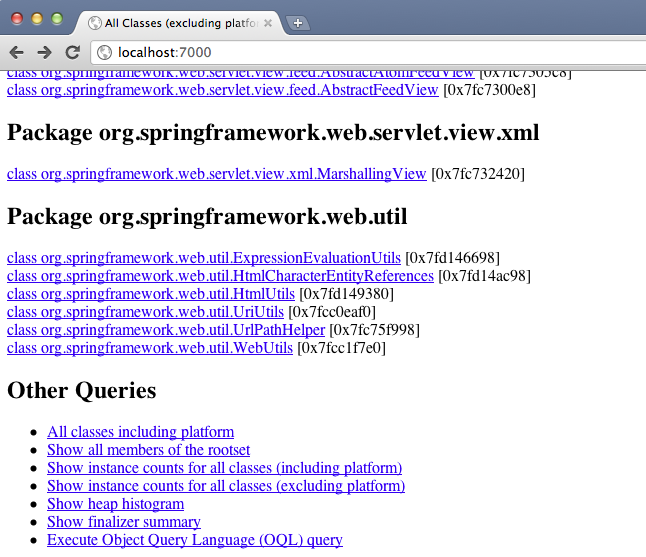
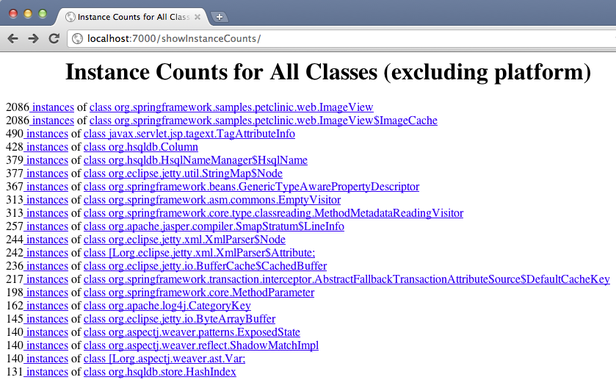
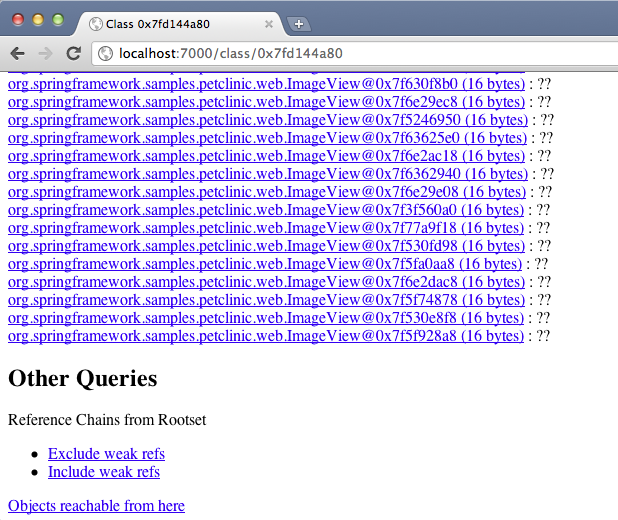
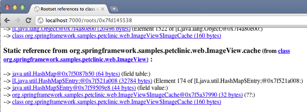

搞定内存溢出(part 5) – JDK自带的工具
==

In our last blog post on the “Solving OutOfMemoryError” series we looked at [profilers and concluded that profiling alone doesn’t help you solve memory leaks](https://plumbr.eu/blog/blog/solving-outofmemoryerror-memory-profilers).

在"搞定内存溢出"系列的上一篇文章中, 我们研究了[分析器, 并得出结论: 单靠 profiling 并不能帮你解决内存泄漏](https://plumbr.eu/blog/blog/solving-outofmemoryerror-memory-profilers)。

Today we will talk about the command line tools that are bundled with the Oracle JDK and can be used to find memory leaks. The benefit of knowing the bundled tooling is obvious: they are available everywhere where Oracle’s Java is installed, i.e. often also in these test and production environments where other fancy tools are either not installed.

今天我们要讲的是 Oracle JDK 自带的命令行工具, 它们可以用来查找内存泄漏。了解这些自带工具的好处显而易见: 凡是装了 Oracle Java 的地方, 它们都可用, 也就是说, 那些没装其他高级工具的测试环境和生产环境往往也能用。

Contents

- Introduction
- jps
- jmap
- jhat
- Conclusions

目录

- 简介(Introduction)
- jps
- jmap
- jhat
- 结论(Conclusions)

### 简介(Introduction)

An attentive reader might ask – why did I mention only command line tools and not jconsole or jvisualvm? Well, from my experience often the only available access channel to the problematic environment (that is, if you have access at all) is the ssh shell. In addition to that, your target machine may also be hidden behind a couple firewalls, so tunneling X server over multiple machines is tedious and also slow. A working tunneled RMI connection  (to connect with jconsole and visualVM remotely) is the thing I still hope to witness some day. Another benefit of these command line tools is that they work equally well on all platforms where HotSpot runs.

细心的读者可能会问——为什么我只提命令行工具, 而不提 jconsole 或 jvisualvm? 因为根据我的经验, 通往出问题环境的唯一可用访问通道(如果真有访问权限的话), 往往就是 ssh shell。除此之外, 你的目标机器可能还藏在好几层防火墙后面, 通过多台机器转发 X server 既繁琐又慢。一条能用的隧道化 RMI 连接(用来远程连接 jconsole 和 visualVM), 是我至今仍盼望着有生之年能见到的。这些命令行工具的另一个好处是, 在 HotSpot 运行的任何平台上它们都同样好使。

To illustrate the usage I’ll use our tried and truely leaking Pet Clinic app ([bundled with Plumbr](https://plumbr.eu/blog/try-it)).

为了演示用法, 我会用我们那个一试就灵的泄漏版 Pet Clinic 应用([随 Plumbr 一起打包](https://plumbr.eu/blog/try-it))。

Before we begin, let’s quickly recap our scenario – you know that your application is leaking some memory, unfortunately that happens only in production, you don’t know how to reproduce the problem locally and the only access you have to the “patient” is the ssh connection.

开始之前, 先快速回顾一下我们的场景——你知道应用存在内存泄漏, 可惜只在生产环境发生, 你不知道如何在本地复现, 而你对"病人"唯一的访问途径就是 ssh 连接。

### jps

When we log in to the server, the first thing we will want to know – what is the process ID of our Java application, as all command line tools expect to get it from us.

登录服务器后, 我们首先想弄清楚的就是——Java 应用的进程 ID 是多少, 因为所有命令行工具都指望我们把它传进去。

For that we’ll use the jps command, which lists all running Java processes. It’s output looks like this:

为此我们要用 jps 命令, 它会列出所有正在运行的 Java 进程。输出大致如下:

>$ jps
 
	45108 Jps 
	44840 start.jar

That’s pretty concise and if you have several JVMs running on the machine you still have to figure out which one is yours. Fortunately jps has flags that can show us a lot of interesting data:

输出很简洁, 如果机器上跑着好几个 JVM, 你还是得弄清楚哪个才是你的。好在 jps 有一些参数能展示很多有用的数据:

>$ jps -lvm

	45328 sun.tools.jps.Jps -vlm -Dapplication.home=/System/Library/Java/JavaVirtualMachines/1.6.0.jdk/Contents/Home -Xms8m
	44840 /Users/volli/plumbr_demo/jetty-7.5.4/start.jar --pre=etc/jetty-logging.xml -Djetty.home=/Users/volli/plumbr_demo/jetty-7.5.4 -Djava.io.tmpdir=/var/folders/rw/q2mhv1m53j3_3n74d1fw9pjr0000gn/T/

jps manual page describes these flags as follows:

jps 手册页对这些参数的解释如下:

- `-m` Output the arguments passed to the main method. The output may be null for embedded JVMs.
- `-l` Output the full package name for the application’s main class or the full path name to the application’s JAR file.
- `-v` Output the arguments passed to the JVM.

- `-m` 输出传给 main 方法的参数。对于内嵌式 JVM, 输出可能为 null。
- `-l` 输出应用主类的完整包名, 或应用 JAR 文件的完整路径名。
- `-v` 输出传给 JVM 的参数。

When looking through all of the parameters you should be able to distinguish similarly looking processes and spot the right one.

翻看所有这些参数, 你应该就能把看起来相似的进程区分开, 找到正确的那个。

There is one caveat with the jps on JDK versions below Java 6 update 21 (and also jconsole and visualvm listing local processes): your Tomcat  process is not listed, regardless of you knowing that it is there. The trick is the java.io.tmpdir system property that is redefined by  Tomcat by default and that is somehow used internally by command line tools to detect running processes.

在 Java 6 update 21 以下的 JDK 版本上, jps 有一个坑(列出本地进程的 jconsole 和 visualvm 也一样): 你的 Tomcat 进程不会被列出来, 哪怕你明知它就在那儿。窍门在于 `java.io.tmpdir` 这个系统属性——Tomcat 默认会重新定义它, 而命令行工具在内部又用某种方式靠它来探测运行中的进程。

So, if command line tools can’t see your process, then add the following parameter to the command line:

所以, 如果命令行工具看不到你的进程, 就在命令行里加上下面这个参数:

	-J-Djava.io.tmpdir=<same as your target process has>

For Tomcat, the default directory is **$CATALINA_BASE/temp**.

对于 Tomcat, 默认目录是 **$CATALINA_BASE/temp**。

### jmap

By now we have the process id for the Petstore application: 44840. In your own case it will obviously be different). What’s next? We can query the memory map with jmap and check out the class histogram!

现在我们拿到了 Petstore 应用的进程 id: 44840(你自己的情况显然会不同)。接下来呢? 我们可以用 jmap 查询内存映射, 看看类的直方图(histogram)!

>$ jmap -histo 44840

	 num     #instances         #bytes  class name
	----------------------------------------------
	   1:          8571      116868088  [B
	   2:         55312        7886368  <constMethodKlass>
	   3:         55312        7531584  <methodKlass>
	   4:         66656        6418288  [C
	   5:          5121        5715968  <constantPoolKlass>
	   6:         87158        5100480  <symbolKlass>
	   7:          5121        3921288  <instanceKlassKlass>
	   8:          4371        3536056  <constantPoolCacheKlass>
	   9:         69129        2212128  java.lang.String
	 ...
	  36:          2086          50064  org.springframework.samples.petclinic.web.ImageView$ImageCache
	 ...

Luckily, in our simple case, the first class in the histogram which belongs to Petclinic code is actually the leaking one. However, note that even in this synthetic example it is nowhere near the very top (116 MB worth of byte arrays and only 50 KB worth of ImageCache objects). In large applications with complex object structures the actual sources of the leak will be buried in the noise deep down the list, so I wouldn’t be too optimistic to be able to find the actual memory leak that easily. However, probably the most valuable feature of jmap is the ability to create heap dumps, which we will use next to find out who is holding the leaking ImageCache objects.

幸运的是, 在我们这个简单的例子里, 直方图中第一个属于 Petclinic 代码的类恰好就是泄漏的那个。不过要注意, 即便在这个人为构造的示例里, 它也远没排到最前面(116 MB 的字节数组, 而 ImageCache 对象只有 50 KB)。在对象结构复杂的大型应用中, 真正的泄漏源头会被淹没在噪声里, 深埋在列表下方, 所以我并不乐观地认为能这么容易就找到真正的内存泄漏。不过, jmap 最有价值的功能大概是创建堆转储(heap dump), 接下来我们就会用它来查出是谁一直持有那些泄漏的 ImageCache 对象。

>$ jmap -dump:format=b,file=snapshot.bin 44840>

With this command we ask jmap to create a binary heap dump and store it in the file called snapshot.bin.

这条命令让 jmap 创建一个二进制堆转储, 保存到名为 snapshot.bin 的文件中。

Additionally, in *NIX environments jmap can display the number of objects pending finalization (-finalizerinfo option), heap summary (-heap option) and finally it can parse core files, which are created when process crashes. For some reason, on Windows jmap only supports -histo and -dump options.

此外, 在 *NIX 环境下, jmap 可以显示等待 finalization 的对象数量(-finalizerinfo 选项)、堆摘要(-heap 选项), 最后还能解析进程崩溃时产生的 core 文件。不知为何, 在 Windows 上 jmap 只支持 -histo 和 -dump 选项。

Last note on jmap on Linux – if jps shows you the process, but jmap fails to connect, use sudo jmap.

关于 Linux 上 jmap 的最后一点——如果 jps 能列出你的进程, 但 jmap 却连接失败, 那就用 sudo jmap。

### jhat

jhat is a tool to parse dump files. It reads a dump file, starts up a http server and lets you browse around the dump using your browser. So if you’re on the production server behind firewalls you first have to somehow download the snapshot to your local machine.

jhat 是一个解析 dump 文件的工具。它读取 dump 文件, 启动一个 http 服务器, 让你用浏览器在 dump 里四处浏览。所以如果你身处防火墙后的生产服务器, 首先得想办法把快照下载到本地。

Usage of jhat is as simple as this:

jhat 的用法就是这么简单:

>$ jhat snapshot.bin

	Reading from snapshot.hprof...
	Dump file created Thu Jan 19 11:35:59 EET 2012
	Exception in thread "main" java.lang.OutOfMemoryError: Java heap space ...

Wow. Ok, so I’ll use the -J parameter to pass max heap size to jhat:

哇。好吧, 那我来用 -J 参数给 jhat 传一个最大堆大小:

>$ jhat snapshot.bin -J-Xmx1g

	...
	Snapshot resolved.Started HTTP server on port 7000
	Server is ready.

That’s better. Now I can use my browser to browse the heap dump. I suggest you to browse right down to the end of the list to see Other queries

好多了。现在我可以打开浏览器浏览堆转储了。我建议你一直滚到列表最底部, 看看 Other queries(其他查询)。

“Show heap histogram” will show you the same list that we’ve already seen with jmap -histo, which contains a lot of noise because of Java’s own classes.

"Show heap histogram"会显示和之前 jmap -histo 一样的那份列表, 因为包含了 Java 自身的类, 噪声很多。

So, the useful thing here is ‘Show instance counts for all classes (excluding platform)’. It will show us this:

所以, 这里真正有用的是 'Show instance counts for all classes (excluding platform)'(显示所有类的实例数量, 排除平台类)。它会显示如下内容:

In this list ImageView and ImageCache are on top of the list with distinguishably high number of instances compared to other classes. If I follow the link, I’ll see a list of all instances of the class. There, again, for next useful links scroll down the list:

在这个列表里, ImageView 和 ImageCache 排在最上面, 实例数量相比其他类明显偏高。如果点进链接, 我会看到该类的所有实例列表。在那里同样要滚到列表底部去找接下来有用的链接:

What the ‘Reference Chains from Rootset exclude weak ref’link shows is all the paths that lead from GC roots to ImageCache.

'Reference Chains from Rootset exclude weak ref'(从 Rootset 出发排除弱引用后的引用链)链接展示的是所有从 GC roots 通向 ImageCache 的路径。

In my example I counted 915 roots. All I have to do now is to find the one responsible for the leak. As soon as I know that the source of my leak is the cache field in ImageView, I can find that it is the reference number 15 in this list:

在我的例子里, 我数出了 915 个 roots。现在我要做的就是从里面找出造成泄漏的那个。一旦知道泄漏的源头是 ImageView 里的 cache 字段, 我就能查到它是这个列表里编号 15 的引用:

However, If i wouldn’t know what to look for I’d have to use better tools (like Eclipse MAT) to find that path.

不过, 如果我并不知道该找什么, 就得借助更好的工具(比如 Eclipse MAT)来找出那条路径。

Another feature of jhat that I should mention is the -baseline parameter. The manual says that I can use it to Specify a baseline object dump. Objects in both heap dumps with the same ID and same class will be marked as not being “new”. Sounds nice, but there is one gotcha with this feature – it doesn’t work with heap dumps acquired with jmap. You can find a discussion about that [in stackoverflow](http://stackoverflow.com/questions/1279346/why-doesnt-the-baseline-option-of-jhat-work).

jhat 还有一个我该提一下的功能——`-baseline` 参数。手册说可以用它指定一个基线(baseline)对象 dump。两份堆转储中 ID 相同、类也相同的对象会被标记为不是"新"对象。听起来不错, 但这个功能有个坑——它对用 jmap 获取的堆转储不起作用。相关讨论可以看[这篇 stackoverflow 帖子](http://stackoverflow.com/questions/1279346/why-doesnt-the-baseline-option-of-jhat-work)。

> **广告:** 你知道大约 20% 的Java系统存在内存泄漏(memory leak)吗? 不要老是去杀进程,你可以通过 [Plumbr](https://plumbr.eu/memory-leak) 来快速排查问题.

### 要点(Takeaway points)

- Bundled JDK自带的工具 can gather valuable data for memory leak analysis even in production environment without any GUI.
- JDK 自带的工具即使在没有 GUI 的生产环境, 也能为内存泄漏分析收集到有价值的数据。
- They won’t find the leak for you – you still have to do analysis manually.
- 它们不会替你找出泄漏——你仍然得手动分析。

### 参考资料(References)

- [Troubleshooting Guide for Java SE 6 with HotSpot VM](http://www.oracle.com/technetwork/java/javase/toc-135973.html)

### 搞定内存溢出系列文章

- [搞定内存溢出(part 1) – 程序员的那些事](01_story_of_a_developer.md)

- [搞定内存溢出(part 2) – 为什么运营搞不定?](02_why_did_not_operations_solve_it.md)

- [搞定内存溢出(part 3) – 从哪里下手?](03_where_do_you_start.md)

- [搞定内存溢出(part 4) – 内存分析器](04_memory_profilers.md)

- [搞定内存溢出(part 5) – JDK自带的工具](05_JDK_Tools.md)

- [搞定内存溢出(part 6) – Dump 没想象中那么麻烦](06_Dump_is_not_a_waste.md)

原文日期: 2012年01月18日

翻译日期: 2015年10月26日

翻译人员: [铁锚 http://blog.csdn.net/renfufei](http://blog.csdn.net/renfufei)
