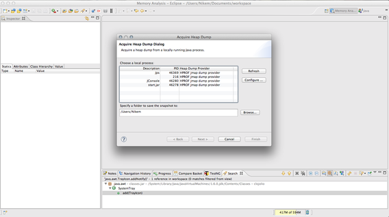
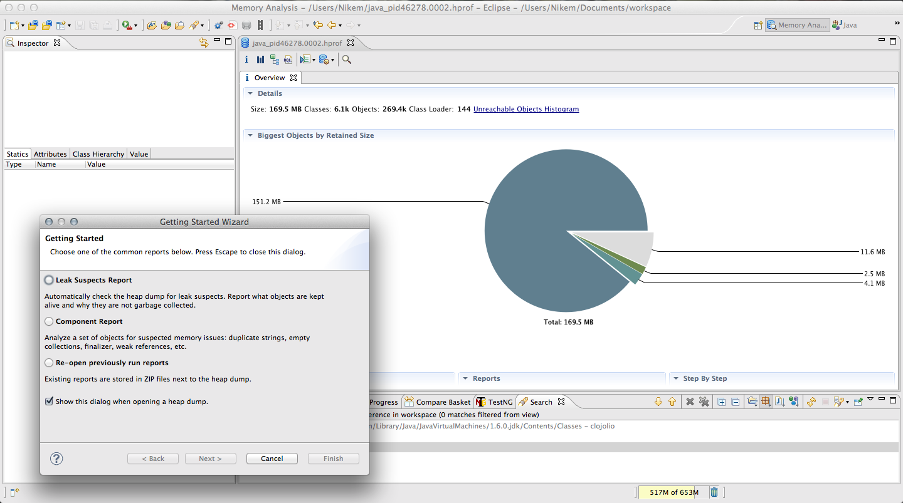
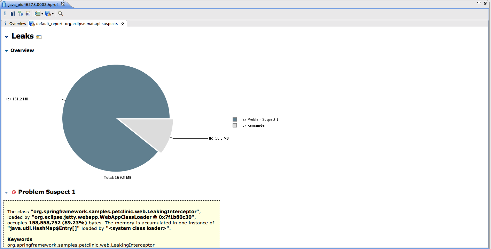
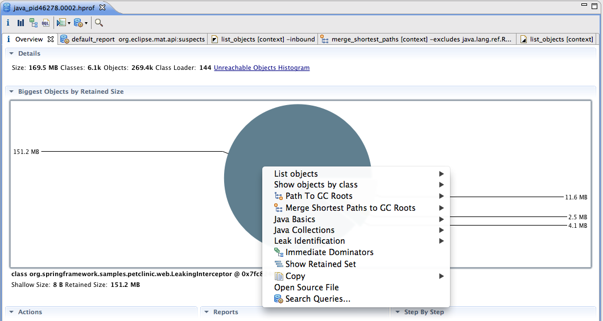

搞定内存溢出(part 6) – Dump 没想象中那么麻烦
==

Let us continue our series of posts about solving the OutOfMemoryError in our hypothetical production system. We have described  different methods to tackle the problem, and today’s post concentrates on what you can learn from heap dumps. Spoiler alert: with a bit of luck, you can get very close to solving the OOM.

In retrospect, these are the methods we have already tried:

1. [We have added more physical memory to that machine](https://plumbr.eu/blog/blog/solving-outofmemoryerror-why-didnt-operations-solve-it). Nothing changed.
2. [We have attached memory profiler to it](https://plumbr.eu/blog/blog/solving-outofmemoryerror-memory-profilers). Our application became ten times slower, and lived ten times longer.
3. [We have wrestled with command line tools](https://plumbr.eu/blog/blog/solving-outofmemoryerror-jdk-tools) and saw some magic numbers.

None of them actually helped us solve the actual cause of the problem. Today we will try the next weapon in our arsenal: the memory dumps and the tools that help you work with them – the memory dump analyzers.

Analyzing dumps is the most universal way of solving OutOfMemory problems and, until Plumbr came to existence, was the only reliable way. In this post I will use [Eclipse MAT](http://www.eclipse.org/mat/), since that is the tool I have the most experience with – but you can take a similar approach with any other similar tool.

Just one more remark before we begin – note that some authors use the term “heap dump” for describing memory dumps. In the Java world, most of the time heap dump and memory dump mean the same thing. I in this post I will use them both interchangeably.

###What is a “memory dump”?

Memory dump is a snapshot of Java Virtual Machine’s memory, taken at one specific moment. Usually it is saved on the disk for further analysis.

Using the dump, JVM memory contents can be investigated at developer’s leisure, using a wide range of tools, in the developer’s comfortable environment far away from the sensitive production site. The ultimate goal of that investigation is to find objects that consume too much memory and where those objects are being held in the running application.

The practical examples below will once more be based on our sample leaking PetClinic application, distributed with the Plumbr release package.

> **广告:** 你知道大约 20% 的Java系统存在内存泄漏(memory leak)吗? 不要老是去杀进程,你可以通过 [Plumbr](https://plumbr.eu/memory-leak) 来快速排查问题.

### How can you create the memory dump?

The memory dump can be created in two ways:

- By adding “-XX:+HeapDumpOnOutOfMemoryError” to your java start command, like this:

  - java -XX:+HeapDumpOnOutOfMemoryError -Xmx512m … When you start your JVM like this, whenever an OutOfMemoryError (OOM) is thrown by the JVM,  a full memory dump will be written to the disk just before crashing/exiting/whatever your JVM does at an OOM.Although waiting for the JVM to crash before starting to look for the causes of the problem could be a little harsh, I strongly suggest that no JVM run in production without this parameter. Let me stress that again: Go and add that parameter in your production server configuration now! The reason is very straightforward: if your production server  would ever suffer from an OutOfMemoryError, you will want to possess that memory dump. It will be the most useful data for postmortem analysis and often the dump alone will be sufficient to find out the cause of the crash.

- Creating the memory dump of the running application. That can be achieved using VisualVM, Eclipse MAT or the jmap command line tool we described in the previous blog post. But before we get there, let me note one very important thing: you should choose wisely the point in time when you make that dump. Your goal is to solve the OutOfMemory problem that pesters your application. As I explained in another post, in order to find the cause of a memory leak you must let it manifest itself. There is no point in trying to find the memory leak in your application 2 seconds after it is started (unless it crashes with OOM 5 seconds after that). Let your users use the application, let it consume enough memory, let garbage collector try to free that memory. As a rule of thumb I wouldn’t recommend making the memory dump until, after a couple of garbage collection cycles, at least 50-60% of your maximum heap is used up.

This is how acquiring a memory dump with the Eclipse MAT tool looks like:

I should note here, that the making of a memory dump usually means “freezing” your application memory, in a similar way to a full garbage collection. As a result, your application does not respond to users’ requests during that time. How long does it take? A little bit more than needed to write raw data in the amount corresponding to you application’s heap to your server’s hard disk. In some cases it may take up to a few minutes.

### Analysis of the memory dump

Alright, now the memory dump is done, and transferred from production site to the developer’s machine. When you open it with MAT, you get the following picture (after some lengthy process of parsing that multi-gigabyte file):

On the background you can see a visual representation of the heap dump with the fattest objects highlighted. We will get to that shortly. On the foreground the MAT tool proposes some “Getting started” options. For the time being let’s select the first one, “Leak Suspects Report”. After some analysis your MAT will show you this:

As you can see, MAT has found one leak suspect, which occupies 89% of application’s memory, taken by instances of class `org.springframework.samples.petclinic.web.LeakingInterceptor`. If you click on the “Details” link you will see some more info about where the instances reside and why they are so big.

Now let us come back to that pie MAT displays when you open the dump.

When you click on the largest slice, you can select “Paths to GC Roots” or “Merge Shortest Paths to GC Roots” in order to find what is holding that large amount of instances. Or click on “List objects with outgoing references” to see what has been accumulated in it. In my experience the above info is all you need to go to your source code and start thinking about fixing the bug.

However, on a final note I would like to point out that memory dumps are not silver bullets. Working with them has some disadvantages as well.

1. Taking them from live application makes it unresponsive for your clients for a period of time. Getting them from a crashed application is free, if we don’t account for the cost of the crashed application.
2. Analyzing multi-gigabyte memory dumps requires at least as much memory from the developer machine. And 32GB+ servers are much more common nowadays than 32GB developer workstations.
3. If the memory dump is taken at a wrong time, it contains a significant amount of  noise. You can lose a lot of time searching for the needle in that haystack (and in some cases, might need to acquire an additional haystack).

We are approaching the end of the blog post series on Solving the OutOfMemoryError. There will be a couple of more posts on the tools you can use, and then a summarizing post drawing the conclusions. If you want to be notified of the next articles, follow @JavaPlumbr in Twitter or the [RSS feed](https://plumbr.eu/blog/blog.rss). If you want to contribute, describe your best tips on how you find and solve memory leaks in the comments! Or better yet – try out Plumbr (see the box on the right) and let us know how you like it!

### 搞定内存溢出系列文章

- [搞定内存溢出(part 1) – 程序员的那些事](01_story_of_a_developer.md)

- [搞定内存溢出(part 2) – 为什么运营搞不定?](02_why_did_not_operations_solve_it.md)

- [搞定内存溢出(part 3) – 从哪里下手?](03_where_do_you_start.md)

- [搞定内存溢出(part 4) – 内存分析器](04_memory_profilers.md)

- [搞定内存溢出(part 5) – JDK自带的工具](05_JDK_Tools.md)

- [搞定内存溢出(part 6) – Dump 没想象中那么麻烦](06_Dump_is_not_a_waste.md)

原文日期: 2012年03月27日

翻译日期: 2015年10月26日

翻译人员: [铁锚 http://blog.csdn.net/renfufei](http://blog.csdn.net/renfufei)
