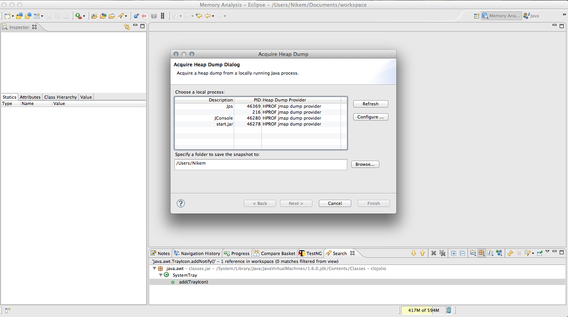
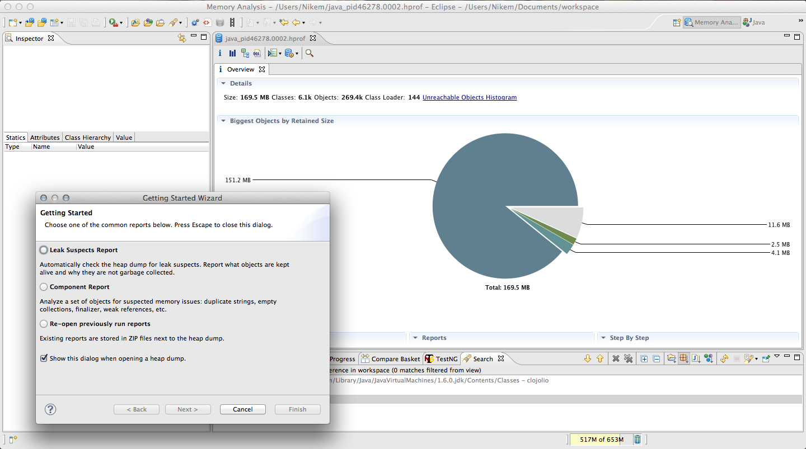
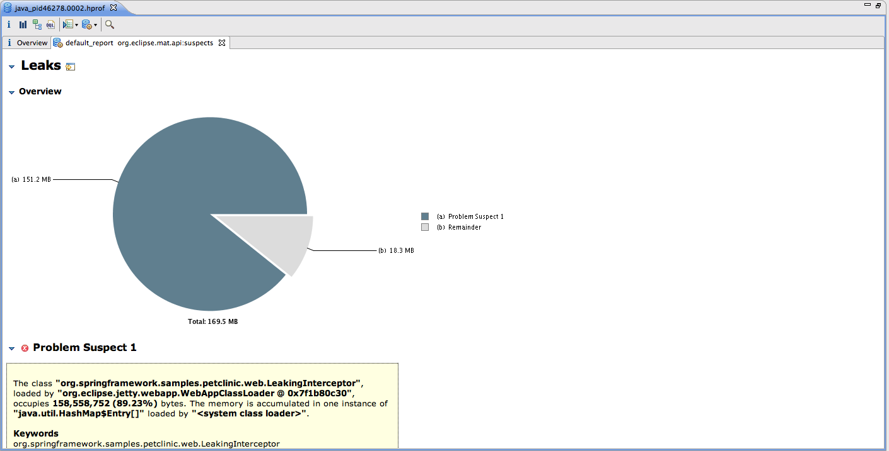
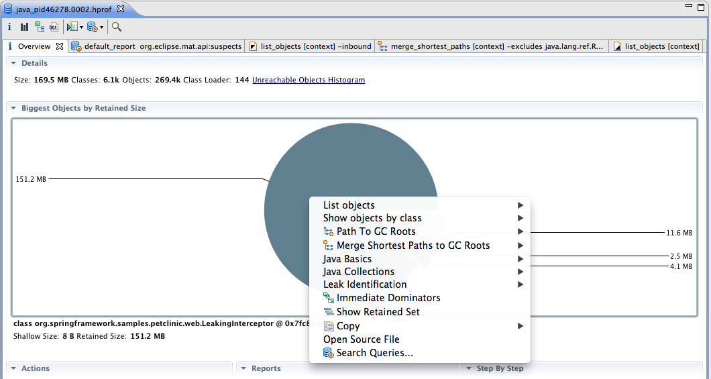

搞定内存溢出(part 6) – Dump 没想象中那么麻烦
==

Let us continue our series of posts about solving the OutOfMemoryError in our hypothetical production system. We have described  different methods to tackle the problem, and today’s post concentrates on what you can learn from heap dumps. Spoiler alert: with a bit of luck, you can get very close to solving the OOM.

让我们继续这个解决假想生产系统中 OutOfMemoryError 的系列文章。我们已经介绍过各种应对该问题的方法, 今天这篇文章则聚焦于你能从堆转储(heap dump)中学到什么。剧透一下: 运气好的话, 你可能离解决 OOM 只有一步之遥。

In retrospect, these are the methods we have already tried:

回顾一下, 这些是我们已经试过的方法:

1. [We have added more physical memory to that machine](https://plumbr.eu/blog/blog/solving-outofmemoryerror-why-didnt-operations-solve-it). Nothing changed.
2. [We have attached memory profiler to it](https://plumbr.eu/blog/blog/solving-outofmemoryerror-memory-profilers). Our application became ten times slower, and lived ten times longer.
3. [We have wrestled with command line tools](https://plumbr.eu/blog/blog/solving-outofmemoryerror-jdk-tools) and saw some magic numbers.

1. [我们给那台机器加了更多的物理内存](https://plumbr.eu/blog/blog/solving-outofmemoryerror-why-didnt-operations-solve-it)。没有任何改变。
2. [我们给它挂上了内存分析器](https://plumbr.eu/blog/blog/solving-outofmemoryerror-memory-profilers)。我们的应用慢了十倍, 但也多活了十倍的时间。
3. [我们和命令行工具较过劲](https://plumbr.eu/blog/blog/solving-outofmemoryerror-jdk-tools), 看到了一些神奇的数字。

None of them actually helped us solve the actual cause of the problem. Today we will try the next weapon in our arsenal: the memory dumps and the tools that help you work with them – the memory dump analyzers.

这些方法实际上都没能帮我们解决真正的问题根源。今天我们来试试武器库里的下一件兵器: 内存转储(memory dump), 以及帮你处理它的工具——内存转储分析器。

Analyzing dumps is the most universal way of solving OutOfMemory problems and, until Plumbr came to existence, was the only reliable way. In this post I will use [Eclipse MAT](http://www.eclipse.org/mat/), since that is the tool I have the most experience with – but you can take a similar approach with any other similar tool.

分析 dump 是解决 OutOfMemory 问题最通用的办法, 而且在 Plumbr 出现之前, 它也是唯一可靠的办法。本文我会使用 [Eclipse MAT](http://www.eclipse.org/mat/), 因为那是我用得最熟的工具——不过你也可以用其他类似的工具采用相似的做法。

Just one more remark before we begin – note that some authors use the term “heap dump” for describing memory dumps. In the Java world, most of the time heap dump and memory dump mean the same thing. I in this post I will use them both interchangeably.

开始之前再说明一点——注意, 有些作者会用"堆转储(heap dump)"这个词来描述内存转储。在 Java 世界里, 大多数时候堆转储和内存转储指的是同一回事。本文中我会不加区分地使用这两个词。

### 什么是"内存转储(memory dump)"?

Memory dump is a snapshot of Java Virtual Machine’s memory, taken at one specific moment. Usually it is saved on the disk for further analysis.

内存转储是 Java 虚拟机内存在某一特定时刻的快照。通常它会保存到磁盘上, 以供进一步分析。

Using the dump, JVM memory contents can be investigated at developer’s leisure, using a wide range of tools, in the developer’s comfortable environment far away from the sensitive production site. The ultimate goal of that investigation is to find objects that consume too much memory and where those objects are being held in the running application.

有了 dump, 开发者就能在远离敏感生产现场的舒适环境里, 从容地、用各种工具来研究 JVM 的内存内容。这项调查的最终目标, 是找出哪些对象占用了过多内存, 以及这些对象在运行中的应用里被哪些地方持有。

The practical examples below will once more be based on our sample leaking PetClinic application, distributed with the Plumbr release package.

下面的实例仍将基于我们那个存在泄漏的 PetClinic 示例应用, 它随 Plumbr 发布包一起分发。

> **广告:** 你知道大约 20% 的Java系统存在内存泄漏(memory leak)吗? 不要老是去杀进程,你可以通过 [Plumbr](https://plumbr.eu/memory-leak) 来快速排查问题.

### 如何创建内存转储?

The memory dump can be created in two ways:

内存转储可以通过两种方式创建:

- By adding “-XX:+HeapDumpOnOutOfMemoryError” to your java start command, like this:

  - java -XX:+HeapDumpOnOutOfMemoryError -Xmx512m … When you start your JVM like this, whenever an OutOfMemoryError (OOM) is thrown by the JVM,  a full memory dump will be written to the disk just before crashing/exiting/whatever your JVM does at an OOM.Although waiting for the JVM to crash before starting to look for the causes of the problem could be a little harsh, I strongly suggest that no JVM run in production without this parameter. Let me stress that again: Go and add that parameter in your production server configuration now! The reason is very straightforward: if your production server  would ever suffer from an OutOfMemoryError, you will want to possess that memory dump. It will be the most useful data for postmortem analysis and often the dump alone will be sufficient to find out the cause of the crash.

- 在 java 启动命令中加入 "-XX:+HeapDumpOnOutOfMemoryError", 像这样:

  - java -XX:+HeapDumpOnOutOfMemoryError -Xmx512m … 用这种方式启动 JVM 后, 每当 JVM 抛出 OutOfMemoryError(OOM), 就会在崩溃/退出/发生 OOM 时 JVM 所做的任何动作之前, 把一份完整的内存转储写到磁盘上。虽然要等到 JVM 崩溃之后才开始查找问题原因有点残酷, 但我强烈建议生产环境中的任何 JVM 都带上这个参数。我再强调一遍: 现在就去把这个参数加到你的生产服务器配置里! 道理非常直接: 如果你的生产服务器哪天真的遭遇 OutOfMemoryError, 你会希望手里有那份内存转储。它是事后分析(postmortem)最有用的数据, 很多时候光靠这份 dump 就足以找出崩溃的原因。

- Creating the memory dump of the running application. That can be achieved using VisualVM, Eclipse MAT or the jmap command line tool we described in the previous blog post. But before we get there, let me note one very important thing: you should choose wisely the point in time when you make that dump. Your goal is to solve the OutOfMemory problem that pesters your application. As I explained in another post, in order to find the cause of a memory leak you must let it manifest itself. There is no point in trying to find the memory leak in your application 2 seconds after it is started (unless it crashes with OOM 5 seconds after that). Let your users use the application, let it consume enough memory, let garbage collector try to free that memory. As a rule of thumb I wouldn’t recommend making the memory dump until, after a couple of garbage collection cycles, at least 50-60% of your maximum heap is used up.

- 为正在运行的应用创建内存转储。这可以用 VisualVM、Eclipse MAT, 或者上一篇博客中讲过的 jmap 命令行工具来实现。不过在动手之前, 我要特别说明一件非常重要的事: 你得明智地选择做 dump 的时机。你的目标是解决困扰应用的那个 OutOfMemory 问题。正如我在另一篇文章里解释过的, 要想找到内存泄漏的根源, 你必须让它充分暴露出来。在应用启动 2 秒后就试图找出内存泄漏毫无意义(除非它 5 秒后就因 OOM 崩溃)。让用户去用这个应用, 让它消耗足够多的内存, 让垃圾收集器去尝试释放那些内存。一般来说, 我建议在经历几个 GC 周期、最大堆至少用掉 50-60% 之前, 不要去做内存转储。

This is how acquiring a memory dump with the Eclipse MAT tool looks like:

下面是用 Eclipse MAT 工具获取内存转储的样子:

I should note here, that the making of a memory dump usually means “freezing” your application memory, in a similar way to a full garbage collection. As a result, your application does not respond to users’ requests during that time. How long does it take? A little bit more than needed to write raw data in the amount corresponding to you application’s heap to your server’s hard disk. In some cases it may take up to a few minutes.

这里我要说明一点: 制作内存转储通常意味着把应用内存"冻结", 效果类似于一次完整的垃圾收集。因此, 在这段时间内应用不会响应用户请求。这要花多久? 大致就是把你应用堆那么多原始数据写到服务器硬盘上所需的时间, 可能再多一点点。某些情况下可能长达几分钟。

### 内存转储分析

Alright, now the memory dump is done, and transferred from production site to the developer’s machine. When you open it with MAT, you get the following picture (after some lengthy process of parsing that multi-gigabyte file):

好了, 现在内存转储已经生成, 并从生产现场传输到了开发者机器上。用 MAT 打开它, (在经历了分析那个好几 GB 文件的一番漫长过程之后)你会看到下面这样的画面:

On the background you can see a visual representation of the heap dump with the fattest objects highlighted. We will get to that shortly. On the foreground the MAT tool proposes some “Getting started” options. For the time being let’s select the first one, “Leak Suspects Report”. After some analysis your MAT will show you this:

背景中可以看到堆转储的可视化表示, 最"胖"的对象被高亮显示出来。我们稍后会讲到它。前景中, MAT 工具给出了一些"快速上手(Getting started)"选项。我们暂且选择第一个, "Leak Suspects Report"(泄漏嫌疑报告)。分析一会儿之后, MAT 会显示这样的内容:

As you can see, MAT has found one leak suspect, which occupies 89% of application’s memory, taken by instances of class `org.springframework.samples.petclinic.web.LeakingInterceptor`. If you click on the “Details” link you will see some more info about where the instances reside and why they are so big.

如你所见, MAT 找到了一个泄漏嫌疑对象, 它占据了应用内存的 89%, 由 `org.springframework.samples.petclinic.web.LeakingInterceptor` 类的实例占用。如果点击 "Details" 链接, 你会看到更多信息, 说明这些实例位于何处, 以及它们为什么这么大。

Now let us come back to that pie MAT displays when you open the dump.

现在我们回到打开 dump 时 MAT 显示的那个饼图。

When you click on the largest slice, you can select “Paths to GC Roots” or “Merge Shortest Paths to GC Roots” in order to find what is holding that large amount of instances. Or click on “List objects with outgoing references” to see what has been accumulated in it. In my experience the above info is all you need to go to your source code and start thinking about fixing the bug.

点击最大的那一块, 你可以选择 "Paths to GC Roots" 或 "Merge Shortest Paths to GC Roots", 从而找出是谁在持有那么大一批实例。或者点击 "List objects with outgoing references", 看看里面到底累积了什么。以我的经验, 有了上面这些信息, 你完全可以回到源代码, 开始思考如何修复这个 bug 了。

However, on a final note I would like to point out that memory dumps are not silver bullets. Working with them has some disadvantages as well.

不过, 最后我要指出一点: 内存转储并不是万灵药。使用它也有一些缺点。

1. Taking them from live application makes it unresponsive for your clients for a period of time. Getting them from a crashed application is free, if we don’t account for the cost of the crashed application.
2. Analyzing multi-gigabyte memory dumps requires at least as much memory from the developer machine. And 32GB+ servers are much more common nowadays than 32GB developer workstations.
3. If the memory dump is taken at a wrong time, it contains a significant amount of  noise. You can lose a lot of time searching for the needle in that haystack (and in some cases, might need to acquire an additional haystack).

1. 从运行中的应用抓取 dump, 会让它在一段时间内无法响应客户端。从已经崩溃的应用抓取则是"免费"的, 前提是不计崩溃应用本身的代价。
2. 分析好几 GB 的内存转储, 至少需要开发者机器有同样大的内存。而如今 32GB+ 的服务器, 可比 32GB 的开发者工作站常见多了。
3. 如果内存转储是在错误的时机抓取的, 其中会包含大量噪声。你可能要浪费大把时间在草堆里找那根针(某些情况下, 可能还得再搞一个草堆)。

We are approaching the end of the blog post series on Solving the OutOfMemoryError. There will be a couple of more posts on the tools you can use, and then a summarizing post drawing the conclusions. If you want to be notified of the next articles, follow @JavaPlumbr in Twitter or the [RSS feed](https://plumbr.eu/blog/blog.rss). If you want to contribute, describe your best tips on how you find and solve memory leaks in the comments! Or better yet – try out Plumbr (see the box on the right) and let us know how you like it!

我们正接近"搞定内存溢出"系列博客的尾声。之后还会有几篇介绍可用工具的文章, 然后是一篇总结性的结论。如果你想收到后续文章的通知, 可以在 Twitter 上关注 @JavaPlumbr, 或者订阅 [RSS feed](https://plumbr.eu/blog/blog.rss)。如果你想出一份力, 就在评论区说说你查找和解决内存泄漏的独门技巧吧! 或者更好——试用一下 Plumbr(见右侧方框), 然后告诉我们你觉得它怎么样!

### 搞定内存溢出系列文章

- [搞定内存溢出(part 1) – 程序员的那些事](01_story_of_a_developer.md)

- [搞定内存溢出(part 2) – 为什么运营搞不定?](02_why_did_not_operations_solve_it.md)

- [搞定内存溢出(part 3) – 从哪里下手?](03_where_do_you_start.md)

- [搞定内存溢出(part 4) – 内存分析器](04_memory_profilers.md)

- [搞定内存溢出(part 5) – JDK自带的工具](05_JDK_Tools.md)

- [搞定内存溢出(part 6) – Dump 没想象中那么麻烦](06_Dump_is_not_a_waste.md)

原文日期: 2012年03月27日

翻译日期: 2015年10月26日

翻译人员: [铁锚 http://blog.csdn.net/renfufei](http://blog.csdn.net/renfufei)
