创建微信订阅号全攻略
==

> 本文属于教程性质, 主要介绍如何创建订阅号，并演示最基础和常用的功能。

微信的平台分为**公众平台**和**开放平台**。

其中**开放平台**是给开发者或者软件公司用的。俗称第三方平台，注册成为开发者，缴费之后，就可以通过API以及授权的方式，为其他企业运营或者开发公众号。具体请参考: [https://open.weixin.qq.com/](https://open.weixin.qq.com/)

**公众平台**就是面向公众的平台。 分为3类：  

- 订阅号 : 发布信息用的,面向个人或企业俗称自媒体(无微信支付), 。
- 服务号 : 面向企业的公众平台，比如招行等企业的应用(和钱有关)。
- 企业号 : 给企业以及内部员工用的，如OA应用之类,有关注数量限制。

### 0. 准备工作

- **Email** 一个可用的电子邮箱； 用来注册账号 
- **手机号** 中国大陆的手机号; 验证用的,每个手机可注册5个公众号
-  **微信账号** 这你总的有一个吧; 也是验证用的,每个微信可注册5个公众号
-  **银行卡** 微信需要绑定银行卡，做实名认证
-  **身份证号** 和微信绑定的银行卡一起做实名认证

> 微信官方帮助有一个 **微信公众平台注册步骤示例图说明**。 但属于wiki性质，不属于教程性质。 在公众平台的首页，使用帮助, 最下方可以看到。地址: [http://kf.qq.com/faq/120911VrYVrA130619v6zaAn.html](http://kf.qq.com/faq/120911VrYVrA130619v6zaAn.html)

### 1. 注册账号

打开微信的官网首页:  [https://weixin.qq.com/](https://weixin.qq.com/)

首页地址应该很好记。打开以后的界面如下:

> 解释一下:  从图中的一级入口可以发现, 主要分2个平台: 公众平台与开放平台。 其中公众平台是面向公众的,包括订阅号,服务号，企业号等。 开放平台主要是面向开发者或者具有IT实力的公司。

然后点击【公众平台】进入公众平台的首页: [https://mp.weixin.qq.com/](https://mp.weixin.qq.com/)。

显示登录界面.
 

如上图所示,因为还没有账号,所以我们需要注册一个公众平台账号。

详细的公众平台帮助信息,可以点击右上角的【[使用帮助](http://kf.qq.com/faq/120911VrYVrA1509086vyumm.html)】查看。

注册的地址是很长的一串,这里就不列出来了。 打开后的界面如下所示:

在其中输入相关信息, 注意两次密码要一致,并且要用【数字+字母】的方式。

>注意这里的邮箱, 如果是企业,最好不要使用个人邮箱。 微信做的比较好，账号分为管理员账号(Admin) 以及运营账号(Operator)两种, 很方便进行多人协作。

> 可以看到提示: **每个邮箱仅能申请一种帐号：公众号或企业号**。 这时候QQ邮箱的好处就体现出来了,在 设置-账号 下面,可以帮绑定一个 英文名字作为邮箱账号, 这样一个QQ邮箱就有了2个邮箱地址。

然后点击【注册】按钮, 进入邮箱激活界面:

可以点击【登录邮箱】 按钮跳转，也可以自己登录你的邮箱查看, 收到的邮件大致如下所示:

点击其中的链接即可。 如果不方便打开，也可以点鼠标右键复制链接，想办法在其他窗口打开。

看到了吧, 在新的窗口中,选择帐号类型。 至于先前的那个窗口(标签页), 已经不需要了。

根据需要进行选择，此处我们选择【订阅号】 并继续。

弹出确认对话框, 说明是个比较重要的选择:

> 这里啰嗦一句, 一般来说使用的都是 **帐号** 这个词, 至于贝字旁的那个 “**账**”号,一般已不推荐使用, 偶尔会见于某些记账的地方。

下一步是信息登记: 

先选择主体类型, 是企业就选企业,是个人就选个人,其他的类似。

此处选择个人, 下方有界面显示出来, 需要你完善相关信息:

然后你需要:

- 输入真实姓名
- 输入身份证号
- 用微信扫描身份验证二维码,(确认遵从协议)
- 输入手机号,获取验证码请输入

如果没有绑定银行卡,你需要进行绑定。此处不进行讲解。【**绑定银行卡的目的主要是为了进行实名认证**】

完成之后,点击**继续** 按钮, 弹出确认提示。

确认即可。 然后还需要填写公众号的信息，比如叫什么名字，简介等：

然后是注册成功,等待审核的提示。

这时候需要等候**1个工作日**。一般来说信息完整，真实都是会通过的。

### 2. 基本使用

一个工作日之后,  打开 [微信官网首页 https://weixin.qq.com/](https://weixin.qq.com/), 选择 [公众平台](http://mp.weixin.qq.com/).

要求输入账号和密码:

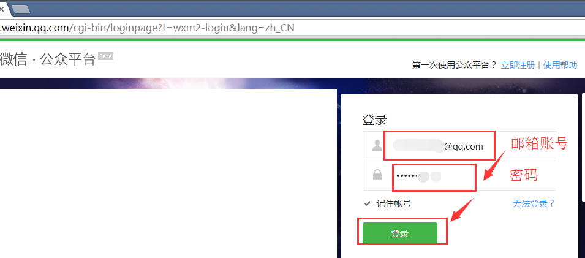

登录之后， 你最关心的功能应该就是 【**群发功能**】以及【**自动回复**】。

管理界面很人性化，最常用的功能列在最上方：

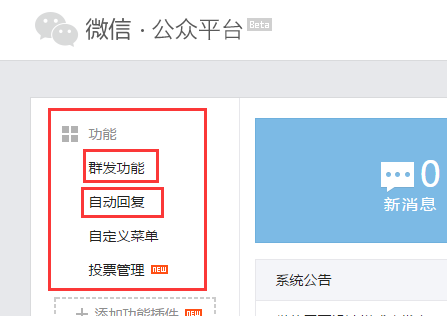

其中:

- 【**群发功能**】: 推送消息给粉丝
 + 推送消息，首先得有消息吧，消息也就是素材，可以先编辑好多个，然后某个时间点手动选择一条推送给粉丝。
 + 订阅号每天可以推送1条消息。
- 【**自动回复**】: 根据用户回复的内容按模式匹配，然后发送消息。
 + 简单的关键词匹配，回复某个关键词，推送某条消息。
 + 当然，高级一点的玩法那就是 [**如具备开发能力，可更灵活地使用该功能**](https://mp.weixin.qq.com/advanced/wiki)。

下面介绍这两个功能:

> 在群发之前，请通过搜索【**铁锚CSDN**】关注刚才创建的公众号，以查看效果。

#### 2.1 群发功能

点击【**群发功能**】菜单，会要求【**同意以上声明**】，大致是免责之类的，点击同意即可。

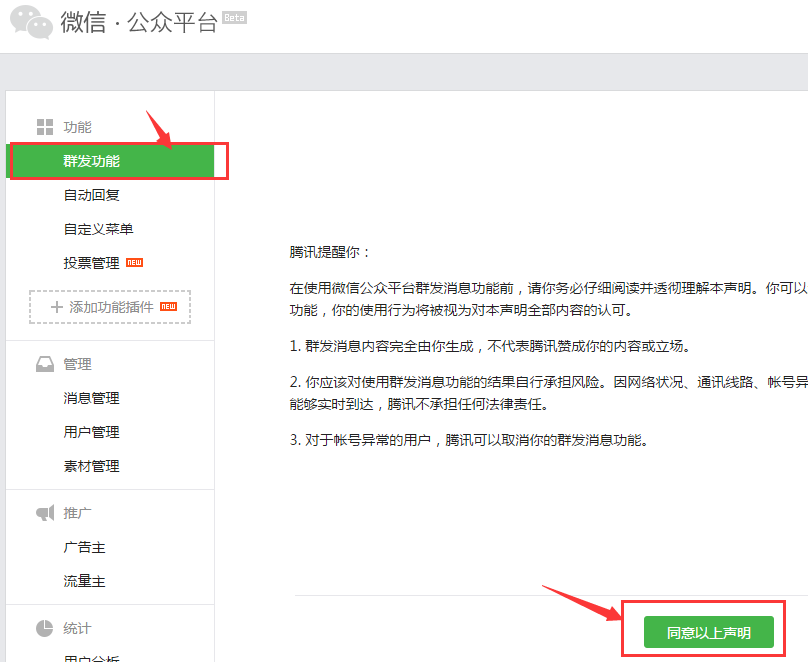

然后，在 [新建群发消息] 标签中，选择群发对象等，一般默认即可。

接着【新建图文消息】，如果已经有编辑好的消息，则 [从素材库中选择] 即可。 界面如下：

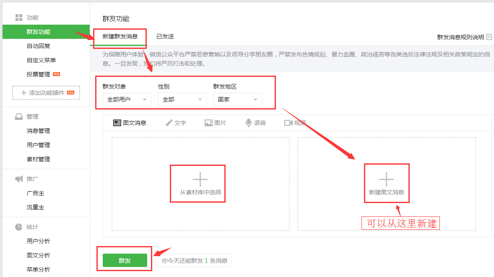

点击【**新建图文信息**】之后，进入编辑界面。 这个界面和其他的CMS内容管理系统差不多。

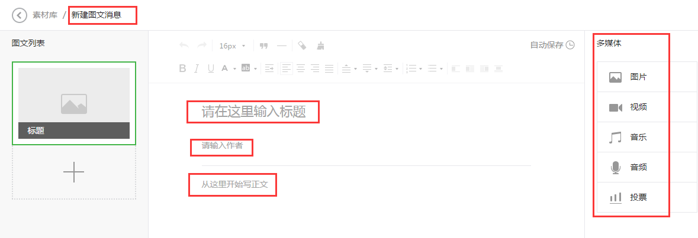

依次输入:

- 标题
- 作者
- 内容

其中内容可以插入多种多媒体内容，从本地选择上传即可。

这里以 铁锚CSDN 的一篇博客为例: 

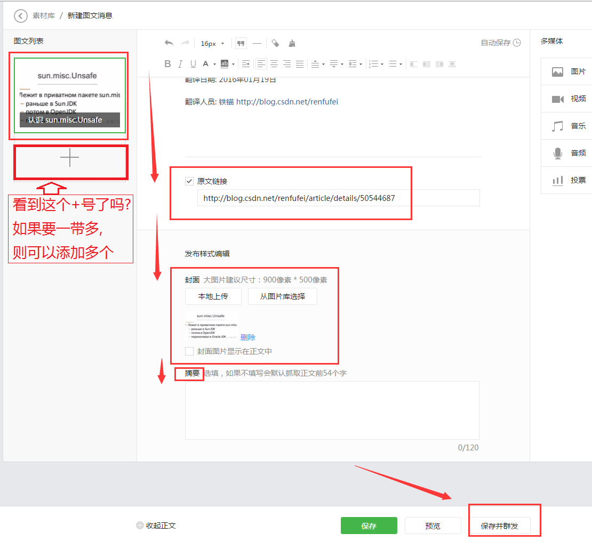

其中可以插入多种内容，但不能引用站外内容，只能从本地上传或者从库中选择，具体请自己实践一番。

超链接等内容也是不可以使用的，只有一个地方可以引用外部链接，就是 【**原文链接**】.

编辑完成后，选择【**保存并群发**】则返回上一步的界面, 如下图所示。

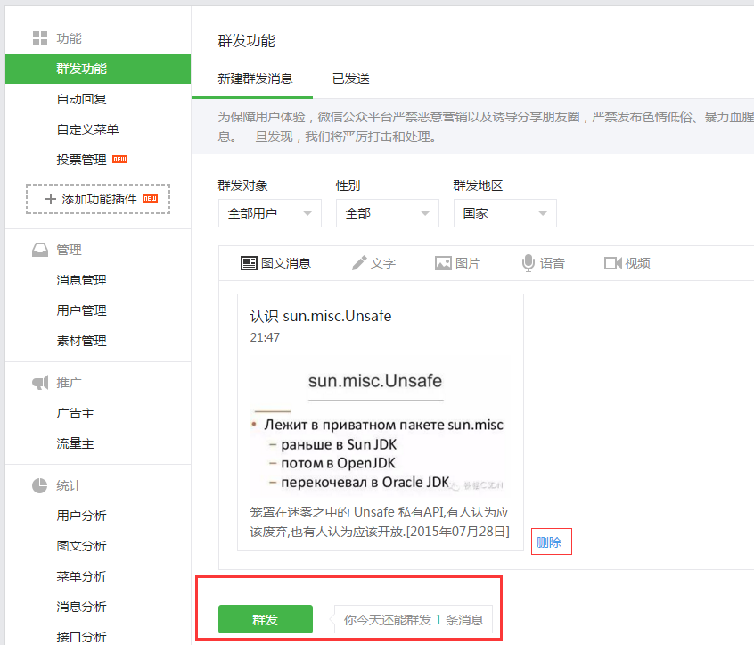

点击【**群发**】按钮, 然后系统用弹出窗口提示开启微信保护：

> 这一步的目的是绑定一个微信号来授权。

> 根据我国的相关规定，对于发布给公众的信息，必须要有责任人以及审核机制，所以这一步是免不了的。

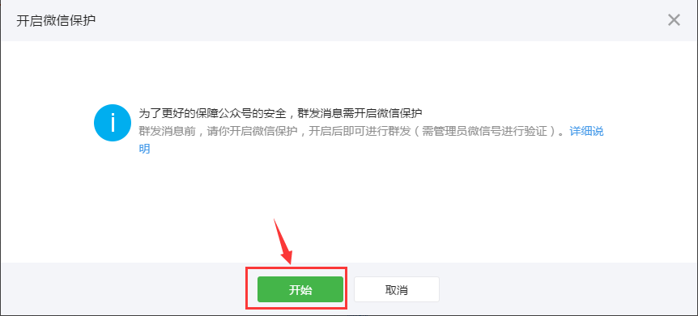

点击【**开始**】按钮，选择验证方式: 

默认是手机号验证, 核对一下，然后点击【**下一步**】按钮。

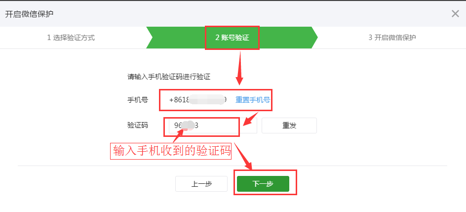

系统会自动发送短信验证码给你的手机，收到后输入即可，点击下一步。

然后会提示:  请用管理员微信(ren****i)扫描以上二维码进行验证。

> 管理员微信，可以是任意一个绑定了银行卡【即实名认证】后的微信号。

用手机微信扫描之后界面是这样的：

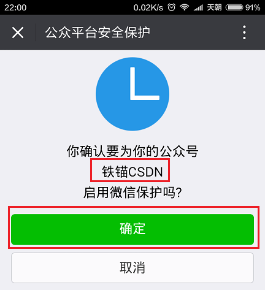

点击确定即可。然后是提示成功界面。

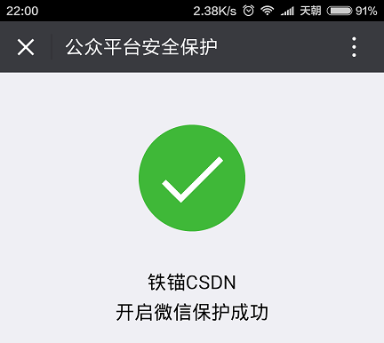

几秒种后，PC上的弹出界面关闭，返回到群发界面。 

继续点击群发按钮。系统提示【操作确认】：

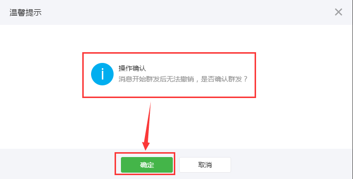

点击确定按钮。 这时候可以用刚才绑定的管理员微信账号扫描二维码:

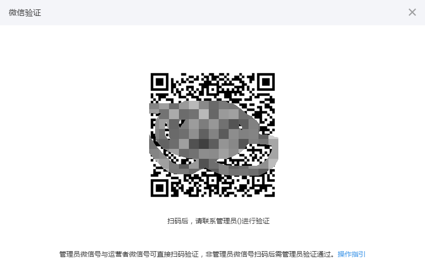

> 管理员微信号与运营者微信号可直接扫码验证，非管理员微信号扫码后需管理员验证通过。
> 
> 管理员微信号，运营者微信号，大致相当于老板和普通职工的关系，具体详情请参考官方的wiki。

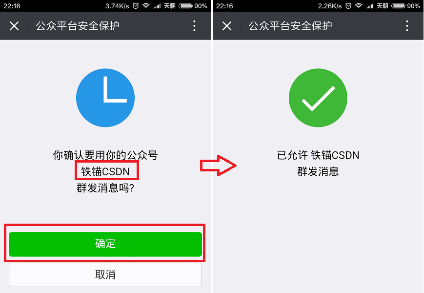

然后，系统就开始发送。 消息状态为 等待发送。 等到完全发送成功，则状态消失，变为【删除】按钮：

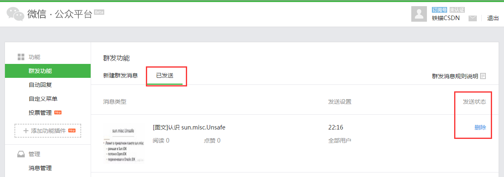

消息群发成功, 已关注的用户可以收到。 新关注的粉丝可以在历史消息之中看到。

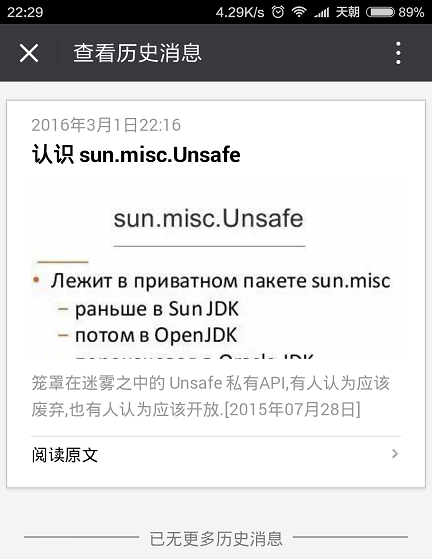

最新的公众号安全助手可以直接在手机上进行操作，但需要登录,菜单如下：

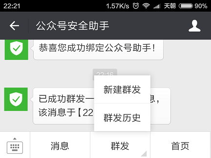

#### 2.2 自动回复

点击【**自动回复**】功能菜单，则可以设置自动回复。

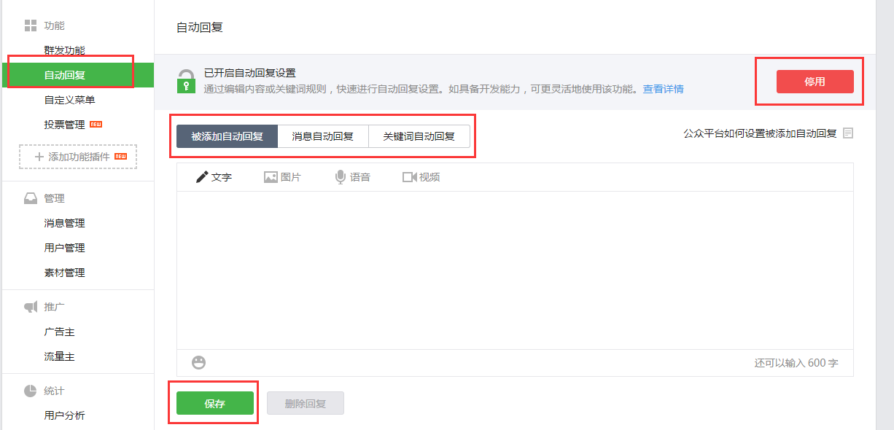

自动回复分为3类:

- **被添加自动回复**
 + 就是粉丝关注公众号时自动回复的信息
- **消息自动回复**
 + 如果不匹配关键字,则会使用消息自动回复。
 + 每小时只回复1-2条。多余的忽略。
- **关键词自动回复**
 + 根据关键字进行匹配,有一定规则。
 + 可以回复多种内容。

**被添加自动回复**

粉丝关注公众号时，自动回复的信息。 可以插入文字、图片、语言、视频、表情等，一般可以设置为引导用户的信息以及欢迎词。

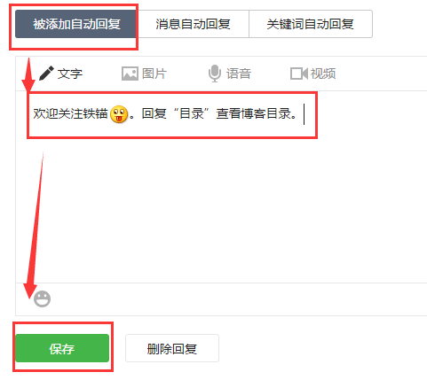

**消息自动回复**

官方说明如下:

> 在微信公众平台设置用户消息回复后，会在粉丝给您发送微信消息时，会自动回复您设置的文字/语言/图片/视频给粉丝。

> 设置方法：通过在微信公众平台=》功能=》自动回复=》消息自动回复，可设置的文字/语言/图片/视频为用户消息回复。

> 温馨提示：
>
1. 消息自动回复：1个小时内回复1—2条内容；
2. 暂不支持设置图文、网页地址消息回复；
3. 消息自动回复只能设置一条信息回复。

即用户给你发消息时，只能回复固定的单种内容.

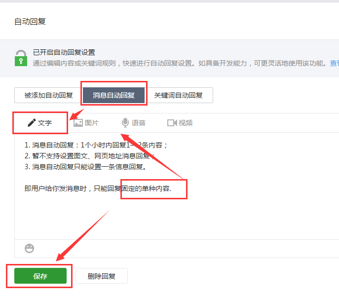

**关键词自动回复**

这就有点交互的味道了。

这是用的比较多的，用户回复某个关键字，然后推送适当的内容。

用户回复一次，你可以推送一条内容。 

一般是有多个历史文章内容时，和用户进行互动。可以有多个规则。

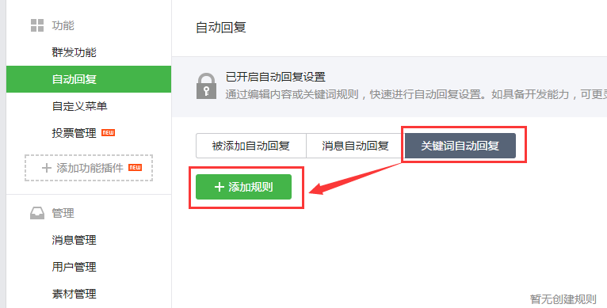

在【关键词自动回复】标签下，点击【**+添加规则**】按钮即可添加规则：

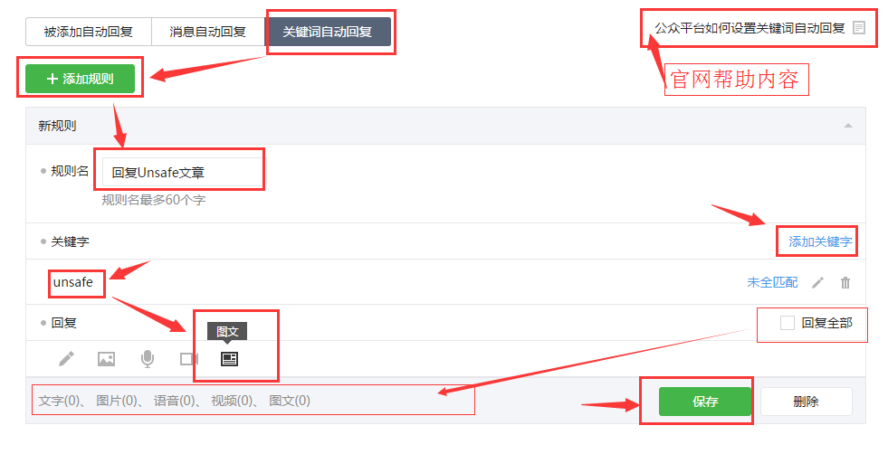

在下方的表单内填写相应的内容：

- 规则名：自定义的名字，让管理员维护使用的，最好有意义好识别。
- 关键字：可以添加多条，每个条目内还可以有多个，用换行符分隔。
- 回复内容： 可以是文字，图片等，还可以是“**图文**”， 如上图所示。

点击图文以后，会弹出对话框让你选择素材：

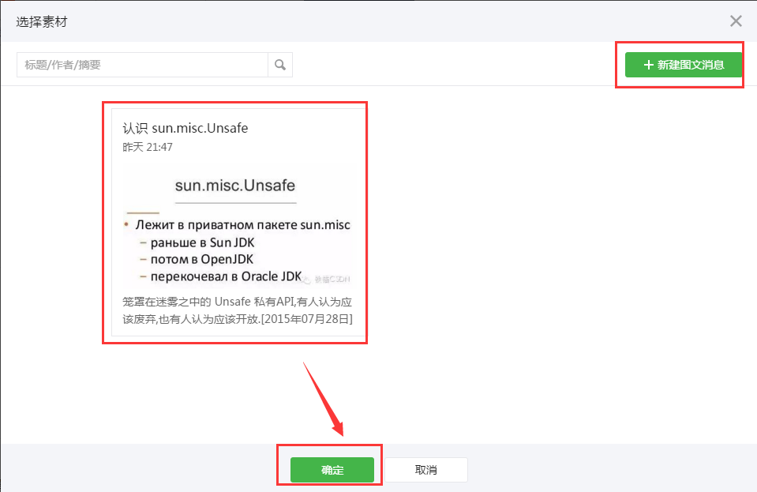

可以选择，也可以新建。

此处，我们选择原来编辑好的图文素材。 然后点击【确定】按钮。

然后【**保存**】。

此时，可以使用微信号测试，回复 "unsafe" 试试!

效果如下图所示:

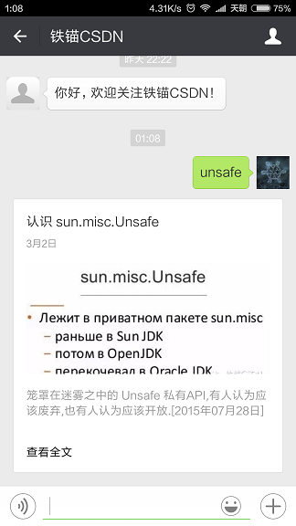

更多信息请参考官网: [公众平台如何设置关键词自动回复？](http://kf.qq.com/faq/120322fu63YV130422rYNjYB.html)

**开发程序进行交互**

> 通过编辑内容或关键词规则，快速进行自动回复设置。如具备开发能力，可更灵活地使用该功能。点击【**查看详情**】按钮:

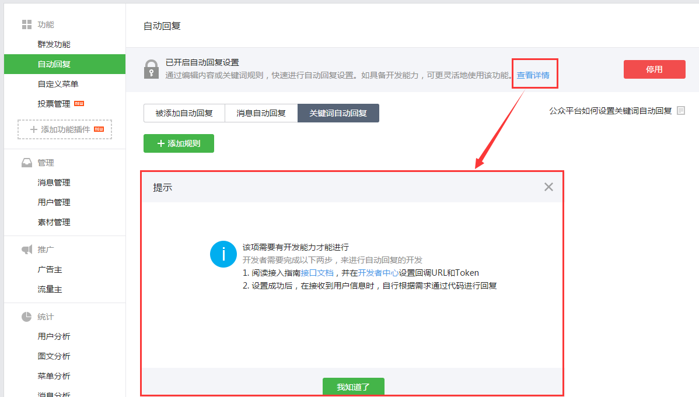

请参考官网 WIKI: [https://mp.weixin.qq.com/advanced/wiki](https://mp.weixin.qq.com/advanced/wiki)

### 3. 高级玩法

登录之后的界面如下:

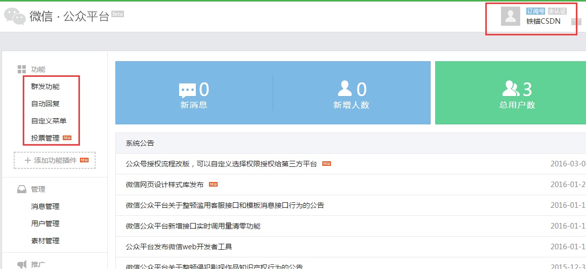

其中有2个功能是 【**自定义菜单**】和【**素材管理**】。

#### 3.1 **自定义菜单**

首先我们点击【**自定义菜单**】,页面如下所示:

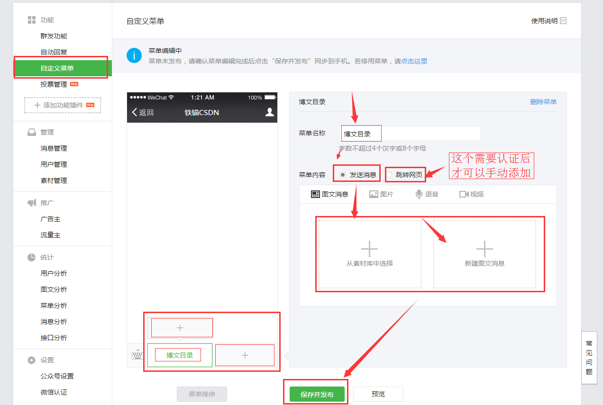

首先，修改菜单名称,如上图中的“博文目录”。

我们准备做一个二级目录。所以【博文目录】这一级的菜单，就不需要设置消息。

> 这里有个小坑，父目录不要设置内容，但需要新增子目录之后，才能【**保存并发布**】。

可以看到在上图中，类似于手机的下方，有3个可以点击的框。

两个加号(**+**)的按钮，很明显，就是增加一级菜单和二级菜单的地方。

**新增子菜单**

点击博文目录上方的加号按钮，新增子菜单。 

很简单，输入子菜单名称，并选择回复的消息。

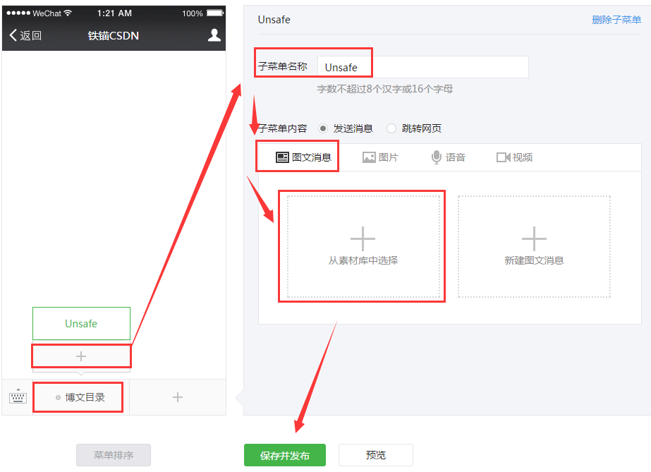

此处我们选择图文信息，从素材库中选择。

在弹出的对话框中选择即可。 此处不再演示。

选择完成之后，如下图所示：

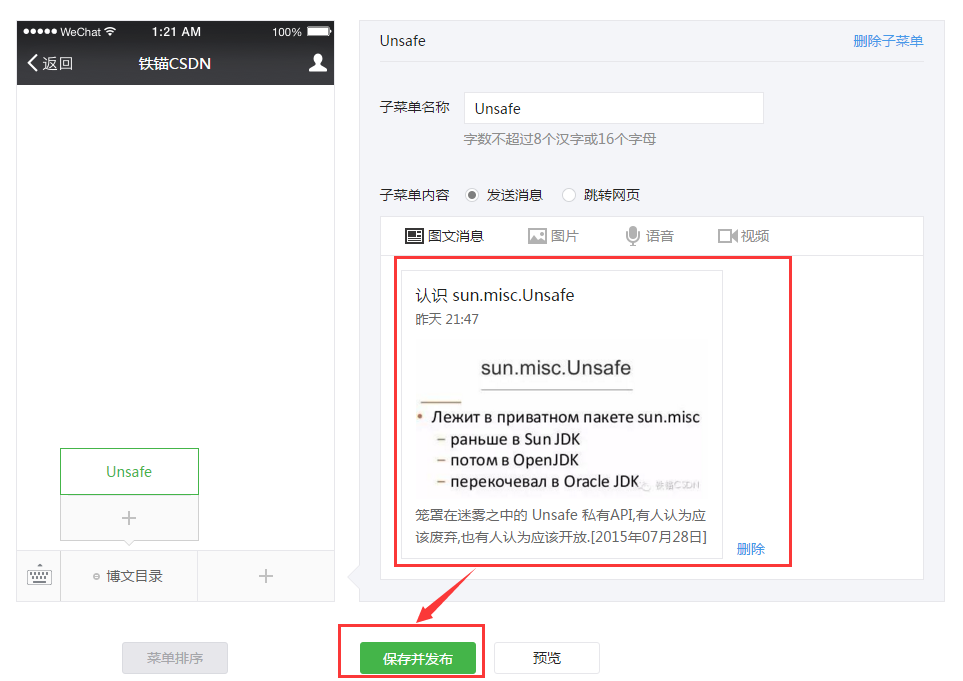

点击【**保存并发布**】按钮。

系统提示确认发布，需要24小时生效：

> 菜单已发布

> 24小时后可在手机查看菜单内容

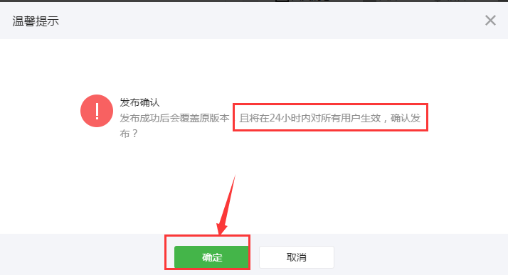

确认即可。

怎么测试? 取消关注订阅号，重新关注，应该就能看到效果了。

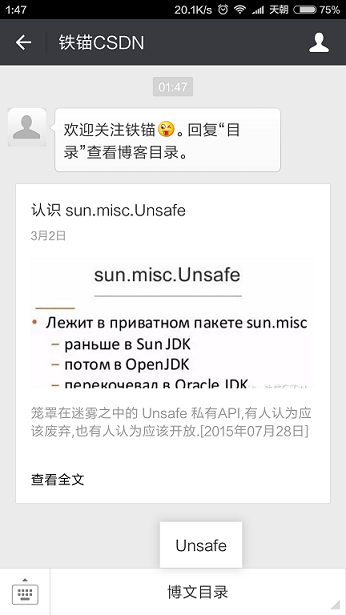

当然，一般来说，可能需要2个1级菜单才会比较好看，一样的道理，自己试试吧！

> 如果是认证后的公众号，那么就可以在点击菜单后，直接跳转网页，比如官网之类的。更加好用。

> 个人号不能认证，所以不能手动输入地址,如下图所示：

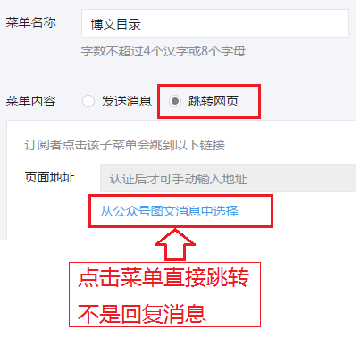

#### 3.2 **素材管理**

通过在 微信公众平台=》管理 =》素材管理

素材包括4类:

- 图文
- 图片
- 语音
- 视频。

支持的操作包括：

- 根据类型进行分类
- 根据关键字检索
- 查看列表
- 新增/上传对应类型的素材
- 编辑、删除对应的素材。

示意图如下所示： 

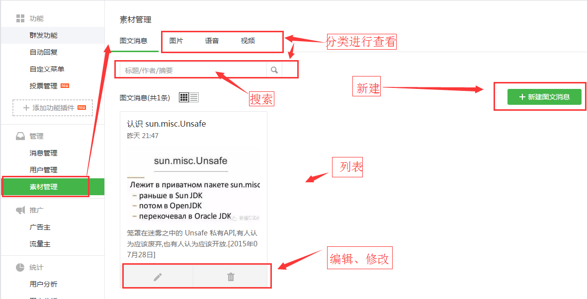

### 相关资源 ###

更多玩法，需要你参考官网文档进行设置。

官网 WIKI: [https://mp.weixin.qq.com/advanced/wiki](https://mp.weixin.qq.com/advanced/wiki)

### 作者信息 ##

- 作者: [铁锚 http://blog.csdn.net/renfufei](http://blog.csdn.net/renfufei)
- : [欢迎加入【CNC开源组件开发交流 316630025】](http://shang.qq.com/wpa/qunwpa?idkey=68f416f83b8a247d3178f9934492dd5df28e9f386e1ca480e82b5ef4ca4e6539)
- 日期: 2015年12月08日

