微信订阅号入门手册
==

## 说明 ##

### 0. 准备工作

- **Email** 一个可用的电子邮箱； 用来注册账号 
- **手机号** 中国大陆的手机号; 验证用的
-  **微信账号** 这你总的有一个吧; 也是验证用的

### 1. 注册账号

打开微信的官网首页:  [https://weixin.qq.com/](https://weixin.qq.com/)

首页地址应该很好记。打开以后的界面如下:

> 解释一下:  从图中的一级入口可以发现, 主要分2个平台: 公众平台与开放平台。 其中公众平台是面向公众的,包括订阅号,服务号，企业号等。 开放平台主要是面向开发者或者具有IT实力的公司。

然后点击【公众平台】进入公众平台的首页: [https://mp.weixin.qq.com/](https://mp.weixin.qq.com/)。

显示登录界面.
 
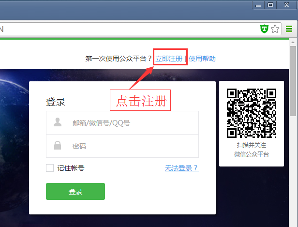

如上图所示,因为还没有账号,所以我们需要注册一个公众平台账号。

详细的公众平台帮助信息,可以点击右上角的【[使用帮助](http://kf.qq.com/faq/120911VrYVrA1509086vyumm.html)】查看。

注册的地址是很长的一串,这里就不列出来了。 打开后的界面如下所示:

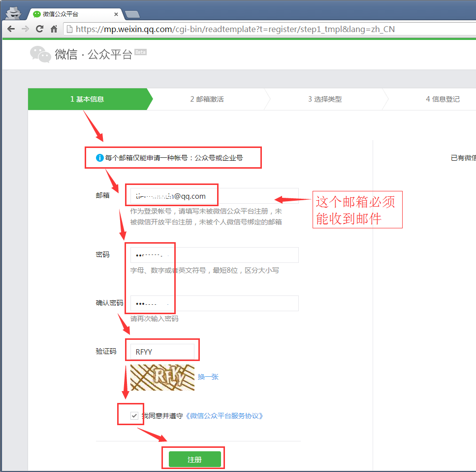

在其中输入相关信息, 注意两次密码要一致,并且要用【数字+字母】的方式。

>注意这里的邮箱, 如果是企业,最好不要使用个人邮箱。 微信做的比较好，账号分为管理员账号(Admin) 以及运营账号(Operator)两种, 很方便进行多人协作。

> 可以看到提示: **每个邮箱仅能申请一种帐号：公众号或企业号**。 这时候QQ邮箱的好处就体现出来了,在 设置-账号 下面,可以帮绑定一个 英文名字作为邮箱账号, 这样一个QQ邮箱就有了2个邮箱地址。

然后点击【注册】按钮, 进入邮箱激活界面:

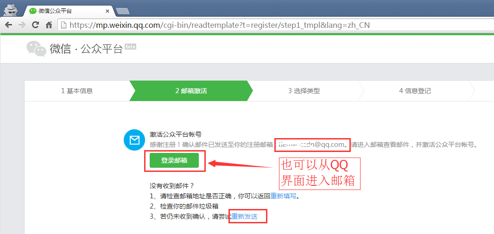

可以点击【登录邮箱】 按钮跳转，也可以自己登录你的邮箱查看, 收到的邮件大致如下所示:

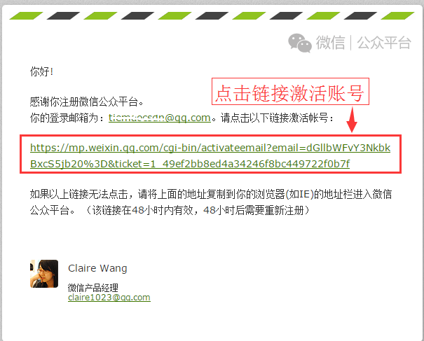

点击其中的链接即可。 如果不方便打开，也可以点鼠标右键复制链接，想办法在其他窗口打开。

看到了吧, 在新的窗口中,选择帐号类型。 至于先前的那个窗口(标签页), 已经不需要了。

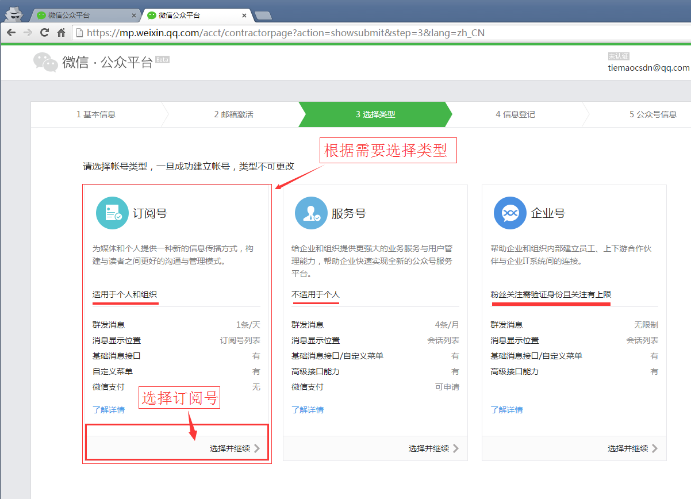

根据需要进行选择，此处我们选择【订阅号】 并继续。

弹出确认对话框, 说明是个比较重要的选择:

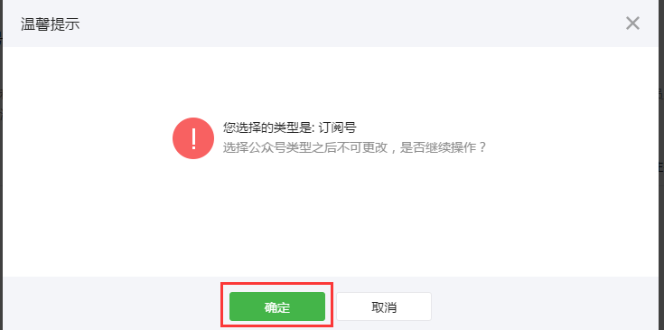

> 这里啰嗦一句, 一般来说使用的都是 **帐号** 这个词, 至于贝字旁的那个 “**账**”号,一般已不推荐使用, 偶尔会见于某些记账的地方。

下一步是信息登记: 

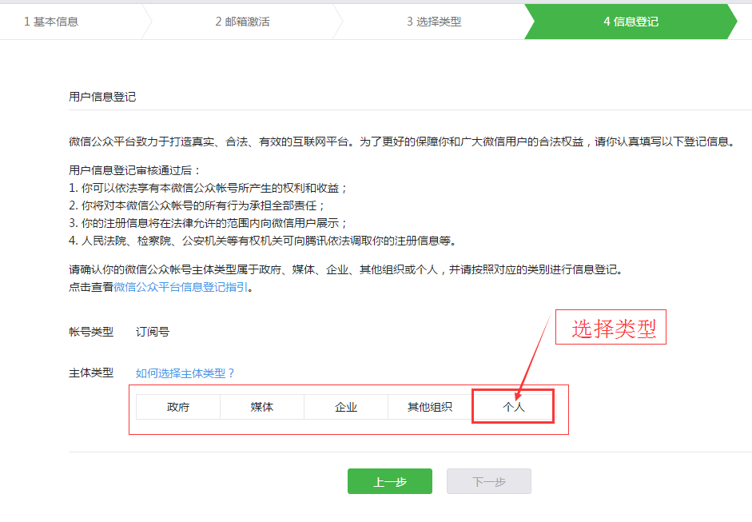

先选择主体类型, 是企业就选企业,是个人就选个人,其他的类似。

此处选择个人, 下方有界面显示出来, 需要你完善相关信息:

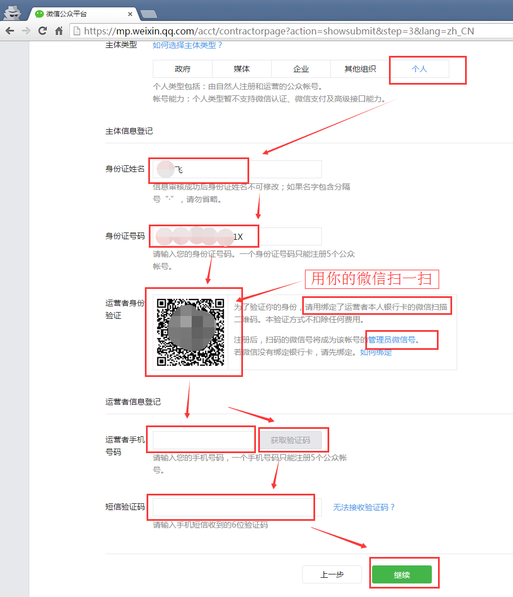

然后你需要:

- 输入真实姓名
- 输入身份证号
- 用微信扫描身份验证二维码,(确认遵从协议)
- 输入手机号,获取验证码请输入

如果没有绑定银行卡,你需要进行绑定。此处不进行讲解。【**绑定银行卡的目的主要是为了进行实名认证**】

完成之后,点击**继续** 按钮, 弹出确认提示。

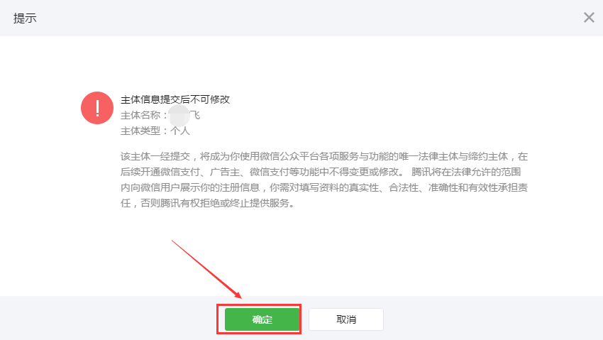

确认即可。 然后还需要填写公众号的信息，比如叫什么名字，简介等：

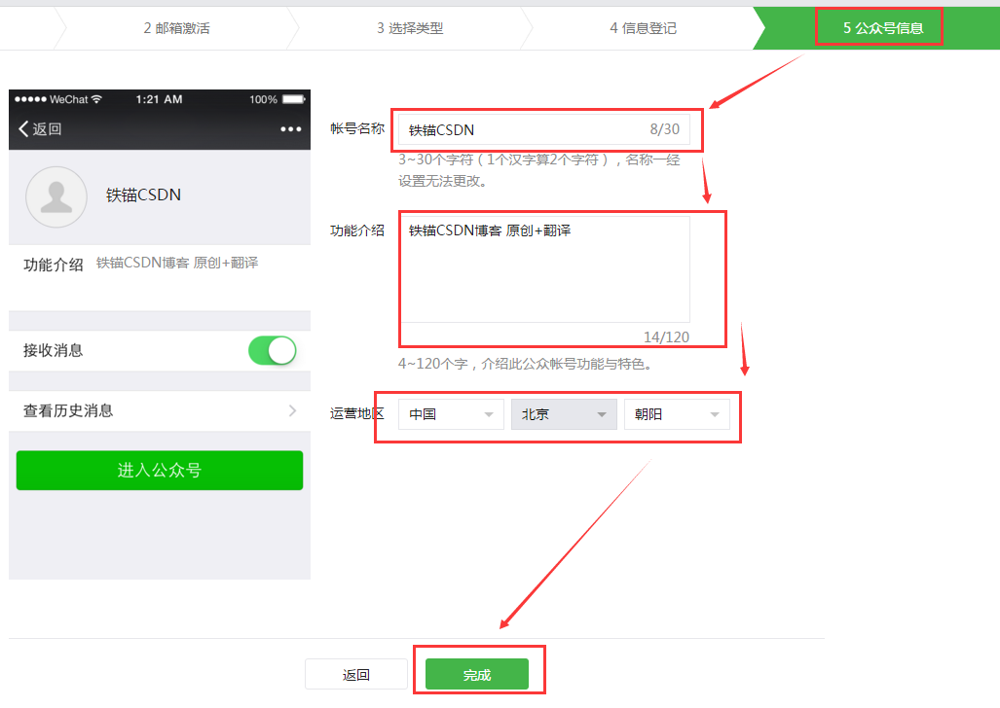

然后是注册成功,等待审核的提示。

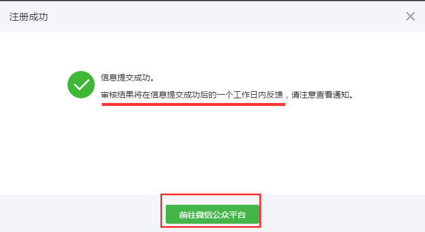

这时候需要等候**1个工作日**。一般来说信息完整，真实都是会通过的。

### 2. 基本使用

### 3. 高级玩法

### 4. 其他事项

### 相关资源 ###

更多相关信息请参考以下网站链接.

### 作者信息 ##

- 作者: [铁锚 http://blog.csdn.net/renfufei](http://blog.csdn.net/renfufei)
- : [欢迎加入【CNC开源组件开发交流 316630025】](http://shang.qq.com/wpa/qunwpa?idkey=68f416f83b8a247d3178f9934492dd5df28e9f386e1ca480e82b5ef4ca4e6539)
- 日期: 2015年12月08日

