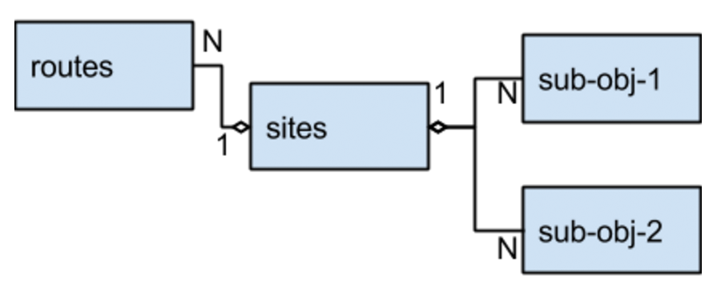
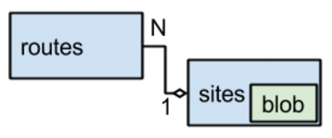

Scaling to 100M: MySQL is a Better NoSQL
==

# MySQL 作为 NoSQL 解决方案: 轻松应对亿级数据

MySQL is a better NoSQL. When considering a NoSQL use case, such as key/value storage, MySQL makes more sense in terms of performance, ease of use, and stability. MySQL is a solid engine with lots of online material, ranging from operations and failure cases, to replication and different patterns of usage. For this reason, it has an advantage over newer NoSQL engines that are not as battle tested.

MySQL是一个更好的NoSQL。当考虑NoSQL用例,如键/值存储、MySQL更有意义的性能、易用性和稳定性。MySQL是固体发动机有很多在线材料,从操作和故障情况下,复制和不同的使用模式。出于这个原因,它有一个优势新NoSQL引擎,没有战斗的考验。

In recent years, NoSQL engines have become mainstream. Many developers look at NoSQL engines—such as MongoDB, Cassandra, Redis, or Hadoop—as their first choice for building applications, considering them a single family of products that deprecates the old SQL engines.

近年来,NoSQL引擎已经成为主流。许多开发人员看NoSQL MongoDB引擎,卡桑德拉,复述,或Hadoop-as首选构建应用程序,考虑一个家庭的产品,不赞成旧的SQL引擎。

The choice to use a NoSQL database is often based on hype, or a wrong assumption that relational databases cannot perform as well as a NoSQL database. Operational costs, as well as other stability and maturity concerns, are often overlooked by engineers when it comes to selecting a database. For more information about the limitations and shortcomings of different NoSQL (and SQL) engines, take a look at the Jepsen series of articles from Aphyr.

选择使用NoSQL数据库通常是基于炒作,或者一个错误的假设关系数据库不能执行以及NoSQL数据库。运营成本,以及其他的稳定和成熟度问题,往往忽视了工程师的时候选择一个数据库。更多信息的局限性和缺点不同的NoSQL(SQL)引擎,看看从Aphyr Jepsen系列文章。

This post will explain why we’ve found that using MySQL for the key/value use case is better than most of the dedicated NoSQL engines, and provide guidelines to follow when using MySQL in this way.

这篇文章将解释为什么我们发现使用MySQL的键/值用例比大多数的专用NoSQL引擎,并提供指导方针,遵循以这种方式使用MySQL时。

##Wix Site Resolution

## Wix 网站的解决方案

When someone clicks a link to a Wix site, his browser sends an HTTP request to a server at Wix with the site address. This happens whether the address is to a Wix premium site with a custom domain (e.g., domain.com) or a free site on a subdomain of the Wix domain (e.g., user.wix.com/site). That server has to resolve the requested site from the site address by performing a key/value lookup URL to a site. We denote the URL as a route for the following discussion.

当有人点击一个链接到一个站点,款浏览器向服务器发送一个HTTP请求Wix的网站地址。这种情况是否Wix优质网站的地址是一个自定义的域(例如,domain.com)或者一个免费网站Wix域的子域(如。user.wix.com/site)。服务器必须解决请求的站点的站点地址通过执行一个键/值查找网站URL。我们表示URL作为以下讨论的路线。

The routes table is used to resolve the site address to a site object. Because sites may be exposed on multiple routes, the relation is many to one. Once the site is found, the application loads it for use. The site object itself has a complex structure that includes two lists of child objects—different services that the site utilizes. Here is a sample model of our objects, assuming a standard SQL database and a normalized schema:

路由表是用来解决网站地址网站对象。因为网站可能暴露在多个航线,是许多人的关系。一旦找到网站,应用程序负载使用。网站对象本身有一个复杂的结构,包括两个子objects-different服务列表的网站利用。这是我们对象的示例模型,假设一个标准的SQL数据库和规范化的模式:

When updating a site with the traditional normalized model, we need to use a transaction to update multiple tables to ensure we preserve data consistency. (Note that a transaction is using a DB-level lock that prevents concurrent writes—and sometimes reads—from the affected tables.) Continuing with this model, we would probably have a serial key in each table, foreign keys, and an index in the URL field in the routes table.

当更新网站与传统的归一化模型,我们需要使用一个事务更新多个表,以确保我们保持数据一致性。(注意,事务使用DB-level锁,防止并发写操作和有时看影响表。)继续这种模式下,我们可能会有一个串行关键在每个表,外键和索引的URL字段在路由表中。

However, there are a number of issues with the normalized schema way of modeling:

然而,有许多问题建模的规范化模式的方法:

- Locks limit access to the table, so on a high throughput use case it may limit our performance.
- Reading the object involves either a few SQL queries (4 in this case) or joins—with latency implications again.
- Serial keys impose locks and again limit the write throughput.

——锁限制访问表,所以在高吞吐量的用例可能会限制我们的性能。
——阅读对象包含一些SQL查询(4)或与延迟的影响。
——系列钥匙再次实施锁和限制写吞吐量。

Those issues amount to limitations in the throughput and concurrency we can get from MySQL (or any other SQL engine). Because of those shortcomings, and the fact that the use case is actually key/value, many developers opt to look for a NoSQL solution that provides better throughput and concurrency, even at the expense of stability, consistency, or availability.

这些问题数量限制在吞吐量和并发性我们可以从MySQL(或任何其他SQL引擎)。因为这些缺点,以及用例实际上是键/值,许多开发人员选择寻找一个NoSQL的解决方案,提供了更好的吞吐量和并发性,甚至不惜牺牲稳定性、一致性、可用性。

At Wix we’ve found that MySQL, when used creatively as a key/value store, can do a better job compared to MySQL with a normalized data model (like the one above)—and to most NoSQL engines. Simply use MySQL as a NoSQL engine. Our existing system has scaling / throughput / concurrency / latency figures that are impressive for any NoSQL engine. Here’s some of our data:

Wix我们发现MySQL,创造性地键/值存储,使用时可以做得更好而MySQL规范化数据模型(如上图)——大多数NoSQL引擎。简单地使用MySQL作为NoSQL引擎。我们现有的系统扩展/吞吐量/并发/延迟数据,令人印象深刻的NoSQL引擎。这是我们的一些数据:

- An active-active-active setup across three data centers.
- Throughput is of the order of magnitude of 200,000 RPM.
- The routes table is of the order of magnitude of 100,000,000 records, 10GB of storage.
- The sites table is of the order of magnitude of 100,000,000 records, 200GB of storage.
- Read latency is 1.0-1.5 msec average (in fact, 0.2-0.3 msec in one data center).

在三个数据中心——一个active-active-active设置。
——吞吐量是200000 RPM的数量级。
的路由表是100000000条记录的数量级,10 gb的存储。
——网站表100000000数量级的记录,200 gb的存储。
——读延迟平均1.0 - -1.5毫秒(事实上,在一个数据中心0.2 - -0.3毫秒)。

Note that latency of around 1.0 msec is considered impressive with most key/value engines, both open source and cloud-based! And we achieve that with MySQL (considered to be the basic SQL engine).

注意的1.0毫秒的延迟与大多数键/值被认为是令人印象深刻的引擎,开源和云!我们实现这个MySQL(被认为是基本的SQL引擎)。

Here is the actual schema we are using:

这是我们正在使用的实际模式:

	CREATE TABLE `routes` (
	  `route` varchar(255) NOT NULL,
	  `site_id` varchar(50) NOT NULL,
	  `last_update_date` bigint NOT NULL,
	  PRIMARY KEY (`key`),
	  KEY (`site_id`)
	)
	 
	CREATE TABLE `sites` (
	  `site_id` varchar(50) NOT NULL,
	  `owner_id` varchar(50) NOT NULL,
	  `schema_version` varchar(10) NOT NULL DEFAULT '1.0',
	  `site_data` text NOT NULL,
	  `last_update_date` bigint NOT NULL,
	  PRIMARY KEY (`site_id`)
	) /*ENGINE=InnoDB DEFAULT CHARSET=utf8 
		ROW_FORMAT=COMPRESSED KEY_BLOCK_SIZE=16*/;

Any field that is not used as a condition in a query has been folded into a single blob field (the site_data text field). This includes the sub-obj tables, as well as any field on the object table itself. Also notice that we are not using serial keys; instead, we are using varchar(50), which stores client-generated GUID values—more about that in the next section.

不使用任何字段作为查询条件已经并入一个blob字段(site_data文本字段)。这包括sub-obj表,以及任何字段的对象表本身。也请注意,我们不使用串行键;相反,我们使用varchar(50),商店客户端生成的GUID更珍视在下一节。

Below is the query we are using, which has high throughput and low latency:

下面是我们正在使用的查询,高吞吐量和低延迟:

	select * from sites where site_id = (
	  select site_id from routes where route = ?
	)

It works by first performing a query on the routes table by a unique index, which should return only one result. Then we look up the site by primary key, again looking for one record. The nested query syntax ensures that we are doing only one round-trip to the database to run both SQL queries.

它首先执行一个查询路由表由一个惟一的索引,这应该只返回一个结果。然后我们通过主键查找网站,再次寻找一个记录。嵌套查询语法确保我们所做的只有一个往返数据库运行SQL查询。

The result, shown above, is an average ~1 msec consistent performance, given high traffic and a high update rate. The updates are semitransactional, even without using transactions. This is because we enter the full site in one insert statement, and until we enter the routes, it will not be found in queries. So if we enter the site first, and then the routes, we are ensured to have a consistent state, even in edge cases where we may have orphan data in the sites table.

如上所示,结果是平均~ 1毫秒一致的性能,在高流量和高更新率。semitransactional更新,即使没有使用事务。这是因为我们在一个insert语句输入完整的网站,直到我们进入的路线,它不会在查询。如果我们首先进入网站,然后路线,我们确保有一个一致的状态,即使是在边缘的情况下我们可能孤儿网站表中的数据。

##Guidelines for Using MySQL as a NoSQL Engine

## MySQL变NoSQL引擎指南

Using the experience gained from the above example (and other such cases at Wix), we have crafted a short list of guidelines for using MySQL as a NoSQL engine.

The main thing to keep in mind when using MySQL as a NoSQL engine is to avoid using DB locks or complex queries.

从上面的例子中使用经验(和其他此类案件Wix),我们精心制作了一个简短的列表使用MySQL作为指南NoSQL引擎。

最主要的要记住当使用MySQL作为NoSQL引擎是避免使用DB锁或复杂的查询。

- Do not use transactions, which introduce locks. Instead, use applicative transactions.
- Do not use serial keys. Serial keys introduce locks and complicate active-active configurations.
- Use client-generated unique keys. We use GUIDs.

不使用事务,介绍锁。相反,使用应用事务。
——不使用串行钥匙。串行键介绍锁和复杂的主配置。
——使用客户端生成的独特的键。我们使用guid。

When designing your schema to be optimized for reads, here are some additional guidelines to follow:

要优化设计模式读取时,这里有一些额外的指导方针:

- Do not normalize.
- Fields only exist to be indexed. If a field is not needed for an index, store it in one blob/text field (such as JSON or XML).
- Do not use foreign keys.
- Design your schema to enable reading a single row on query.
- Do not perform table alter commands. Table alter commands introduce locks and downtimes. Instead, use live migrations.

——不正常。
——字段只存在被索引。如果不需要索引字段,将其存储在一个blob /文本字段(比如JSON或XML)。
——不要使用外键。
——设计模式,使阅读一行查询。
——不改变命令执行表。表改变命令介绍锁和宕机。相反,使用居住迁移。

When querying data:

当查询数据:

- 使用主键(primary key)和索引(index)来进行查询(query).
- 不使用 join.
- 不使用聚合函数(aggregation).
- 只在副本(replica)中执行辅助查询(housekeeping queries),如商业智能(BI), 数据研究(data exploration)等, 而不在主库(master database)上执行.

We intend to write another blog post with further information about live migrations and applicative transactions.

我们打算再写一篇博客文章来深入介绍实时迁移(live migrations)和应用事务(applicative transactions)。

## Summary

The most important takeaway from this post is that you are allowed to think differently. It is great to use MySQL as a NoSQL engine, which is not the way it was designed to work. As demonstrated in this post, an example of this is using MySQL instead of dedicated NoSQL engines that are built for key/value access. 

At Wix, MySQL is the engine of choice for key/value cases (among others) because it is easy to use and operate, and it’s a great ecosystem. And as a bonus, it provides latency, throughput, and concurrency metrics that match, if not surpass, most NoSQL engines.

本文最主要的目的是让你认识 MySQL 的新特性。将 MySQL 作为NoSQL引擎是很棒的, 虽然MySQL不是专为NoSQL设计的。作为示例, 文中展示了如何使用 MySQL 代替专用 NoSQL引擎来存储 键/值(key/value) 信息。

在 Wix, 保存键/值信息(等情况下)会选择MySQL引擎, 原因是其易于使用和操作, 且是一个庞大的生态系统。另外,比起多数NoSQL引擎来说,在延迟(latency)、吞吐量(throughput)和并发性(concurrency)等指标(metrics)方面并不逊色。

原文链接: [http://engineering.wix.com/2015/12/10/scaling-to-100m-mysql-is-a-better-nosql/](http://engineering.wix.com/2015/12/10/scaling-to-100m-mysql-is-a-better-nosql/)

原文日前: 2015年12月10日

翻译日期: 2015年12月27日

作者: [铁锚 http://blog.csdn.net/renfufei](http://blog.csdn.net/renfufei)

