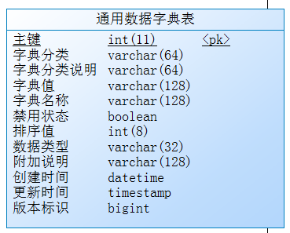
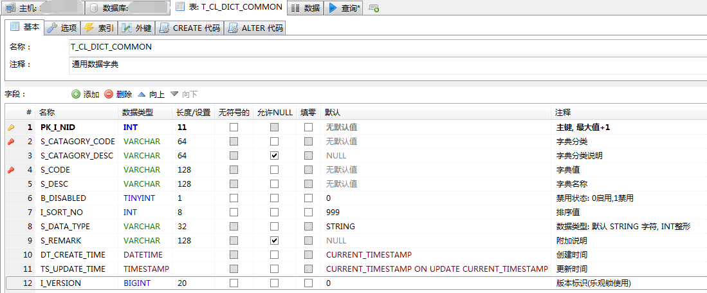

# 通用数据字典表结构设计

>本文基于初学者的角度来分析数据字典表的设计。 对于有经验的程序员来说可能有点墨迹了,所以如果你对数据字典的设计比较熟悉,那么粗略看一下即可。

## 简述

什么是数据字典? 字典的英文是 `Dict`, 翻译过来是`字典、词典`。

和字典同类的东西呢，就是 `Map`。 Map 就是`地图、映射`的意思。 

所以字典的本质就是 **映射，对应**。

在编辑或者展示的时候， `table` ，表格，其实和`对应`也是有一定关系的，当然，这和我们在理解世界和事物的时候，通常使用 `关系数据理论` 是分不开的。 因为对应关系也是关系中的一种。

字典一般分为两部分： 名称 和 描述信息。 用计算机术语说，就是 `键-值`对(Key-Value pair), 名值对、还有 `Code-Name` 等。

在系统中，因为有很多标准、规范、约定， 为了执行这些规范，**对数据分类、数据状态进行精确定位**，又或者因为多个系统之间需要进行数据交换，但叫法和显示上有差别，在存储数据时需要存储`码值`，而不能只存储显示时使用的名称。 

例如状态值和状态名称。标准做法是只存储 VALUE， 不存储名称。 如果考虑优化，减少数据表的关联查询(join),那么可以在存储 VALUE 的同时冗余存储 NAME。 当然，需要根据具体情况来设计， 如果 NAME 或者描述信息太长，占用空间较大，那么可能就不会进行冗余。 顺便提一句， **减少空间占用** 也是使用数据字典的一个原因。

## 最简设计

**名称-值**

一般来说, **名称**是为了让使用者方便(客户、运维人员、管理人员进行选择、审阅等)；而**值**是为了计算机系统和程序方便而设置的。

最常见的字典类型就是“状态”和“类型”。 

例如某种状态:

	|状态值|状态名|
	|  0  |未通过|
	|  1  |已通过|

某种分类/类型示例:

	|职业编码|职业名称|
	|   0   | 程序员 |
	|   1   |  教师  |
	|   2   |  客服  |
	|   3   | 会计师 |

要存储类似这样的数据,可以使用最简单的数据字典表,只包含两个字段： “**名称**” 和 “**值**”。

	CREATE TABLE dict_xx_status (
		code INT(11),
		name VARCHAR(64)
	)
	COMMENT='xx状态字典';

当然,为了使用方便,一般会加上自增,非空等选项,MySQL建表语句如下:

	CREATE TABLE dict_xx_status (
		code INT(11) NOT NULL AUTO_INCREMENT COMMENT '编码',
		name VARCHAR(64) NOT NULL COMMENT '名称',
		PRIMARY KEY (code)
	)
	COMMENT='xx状态字典';

这里有一个小坑: 一般来说, “编码”是字符串类型(`VARCHAR`), 而编号、序号等可以使用整数类型。 所以在实际使用中, `code` 字段的类型可能为 VARCHAR。 

> 当然, 字符串就不能使用自增了。 Oracle中倒是可以将序列值插入到字符串类型的字段。

再补充一点, "键值对"(Key --> Value) 多数情况下是根据键来查找值（当然,反向也是可以的）。所以对应到上面的字段中, KEY应该是 code, 而 VALUE 是 name。(希望初学者思考一下。就像“长宽”和“宽高”类型,由语境决定某个字的含义。)

> 语境就是上下文(context), `context` 也可以理解为所处的情境、环境.

## 通用设计

分类

## 简单优化

ID、排序、分类描述

## 运维审查方便

创建时间、更新时间、创建人、修改人

## 考虑其他情况

数据类型、附加说明、乐观所版本号

## 最终结果

设计如下:

截图如下:

建表语句: MySQL

	CREATE TABLE `T_CL_DICT_COMMON` (
		`PK_I_NID` INT(11) NOT NULL AUTO_INCREMENT COMMENT '主键',
		`S_CATAGORY_CODE` VARCHAR(64) NOT NULL COMMENT '字典分类',
		`S_CATAGORY_DESC` VARCHAR(64) NULL DEFAULT NULL COMMENT '字典分类说明',
		`S_CODE` VARCHAR(128) NOT NULL COMMENT '字典值',
		`S_DESC` VARCHAR(128) NOT NULL COMMENT '字典名称',
		`B_DISABLED` TINYINT(1) NOT NULL DEFAULT '0' COMMENT '禁用状态: 0启用,1禁用',
		`I_SORT_NO` INT(8) NOT NULL DEFAULT '999' COMMENT '排序值',
		`S_DATA_TYPE` VARCHAR(32) NOT NULL DEFAULT 'STRING' COMMENT '数据类型: 默认 STRING 字符, INT整形',
		`S_REMARK` VARCHAR(128) NULL DEFAULT NULL COMMENT '附加说明',
		`DT_CREATE_TIME` DATETIME NOT NULL DEFAULT CURRENT_TIMESTAMP COMMENT '创建时间',
		`TS_UPDATE_TIME` TIMESTAMP NOT NULL DEFAULT CURRENT_TIMESTAMP ON UPDATE CURRENT_TIMESTAMP COMMENT '更新时间',
		`I_VERSION` BIGINT(20) NOT NULL DEFAULT '0' COMMENT '版本标识(乐观锁使用)',
		PRIMARY KEY (`PK_I_NID`),
		UNIQUE INDEX `IDX_DICT_COMMON_UNIQ` (`S_CATAGORY_CODE`, `S_CODE`)
	)
	COMMENT='通用数据字典'
	COLLATE='utf8mb4_general_ci'
	ENGINE=InnoDB;

