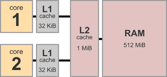
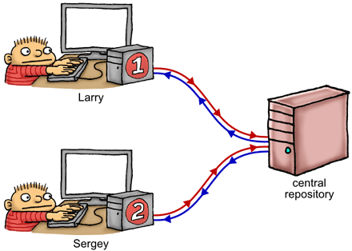
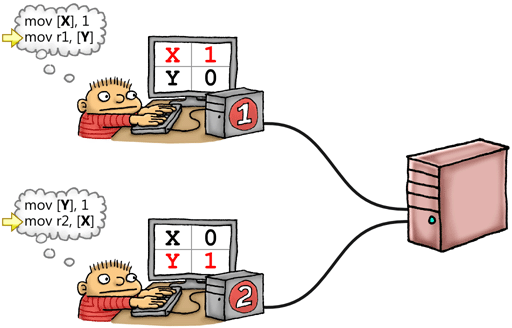
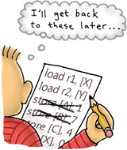

# 内存屏障(Memory Barriers): 和版本控制很像

If you use source control, you’re on your way towards understanding memory ordering, an important consideration when writing lock-free code in C, C++ and other languages.

如果你用过版本控制工具(如SVN), 那么就很容易理解内存排序(memory ordering), 这是在 C, c++ 或者其他语言编写 **无锁**(lock-free)代码时要着重考虑的地方。

In my last post, I wrote about memory ordering at compile time, which forms one half of the memory ordering puzzle. This post is about the other half: memory ordering at runtime, on the processor itself. Like compiler reordering, processor reordering is invisible to a single-threaded program. It only becomes apparent when lock-free techniques are used – that is, when shared memory is manipulated without any mutual exclusion between threads. However, unlike compiler reordering, the effects of processor reordering are only visible in multicore and multiprocessor systems.

我在上一篇文章中,介绍了 [编译期内存排序](http://preshing.com/20120625/memory-ordering-at-compile-time), 但这只是内存排序难题的一部分。这篇文章就是剩下的另一半: 处理器内部的运行时内存排序。和编译期重排序(compiler reordering)一样, 处理器重排序(processor reordering)对单线程应用来说也是不可见的。只有在使用[无锁技术(lock-free techniques)](http://preshing.com/20120612/an-introduction-to-lock-free-programming) 时才会出现 —— 也就是说, 在操作线程之间的共享内存(shared memory)却不使用互斥锁(mutual exclusion)的情况。但与编译器重排序不同, 处理器重排序 [只在多核或者多处理器系统中可见](http://preshing.com/20120515/memory-reordering-caught-in-the-act)。

You can enforce correct memory ordering on the processor by issuing any instruction which acts as a memory barrier. In some ways, this is the only technique you need to know, because when you use such instructions, compiler ordering is taken care of automatically. Examples of instructions which act as memory barriers include (but are not limited to) the following:

可以通过发送充当 内存屏障(memory barrier)的指令, 来强制按预定的顺序执行。在某种程度上,你只需要知道这种技术就够了,因为在使用这类指令时, 编译器排序会自动进行特殊处理。部分作为内存屏障的指令示例如下:

- Certain inline assembly directives in GCC, such as the PowerPC-specific asm volatile("lwsync" ::: "memory")
- Any Win32 Interlocked operation, except on Xbox 360
- Many operations on C++11 atomic types, such as load(std::memory_order_acquire)
- Operations on POSIX mutexes, such as pthread_mutex_lock

 

- 某些内联汇编指令在GCC,比如PowerPC-specific asm： volatile("lwsync" ::: "memory")
- Win32的内联锁(Interlocked)操作, 但不包括 Xbox 360
- C++11 中的许多原子类型(atomic types)操作,如 load(std::memory_order_acquire)
- POSIX上的互斥锁(mutexes)操作,例如 pthread_mutex_lock

Just as there are many instructions which act as memory barriers, there are many different types of memory barriers to know about. Indeed, not all of the above instructions produce the same kind of memory barrier – leading to another possible area of confusion when writing lock-free code. In an attempt to clear things up to some extent, I’d like to offer an analogy which I’ve found helpful in understanding the vast majority (but not all) of possible memory barrier types.

就像有很多可以作为内存屏障的指令一样,也存在多种不同类型的内存屏障。事实上,上面的这些指令所产生的并不是同一类型的内存屏障,导致在编写无锁代码是可能会有一些困扰。为了更清楚地说明,我们做一个类比, 应该会有助于理解大部分的内存屏障类型(但不是全部)。

To begin with, consider the architecture of a typical multicore system. Here’s a device with two cores, each having 32 KiB of private L1 data cache. There’s 1 MiB of L2 cache shared between both cores, and 512 MiB of main memory.

首先, 考虑一个典型的多核系统的体系结构。这里有一个设备,有两个核心,各有32KiB的私有L1数据缓存. 两个核心之间有1MiB共享的L2高速缓存,以及 512 MiB的主内存。

A multicore system is a bit like a group of programmers collaborating on a project using a bizarre kind of source control strategy. For example, the above dual-core system corresponds to a scenario with just two programmers. Let’s name them Larry and Sergey.

多核系统有点像程序员合作开发项目时的一种源代码版本控制策略。例如,上述双核系统对应于只有两个程序员的场景。假设他们的名字叫 拉里(Larry)和谢尔盖(Sergey)。

> 这俩哥们是Google的创始人 ^_^

On the right, we have a shared, central repository – this represents a combination of main memory and the shared L2 cache. Larry has a complete working copy of the repository on his local machine, and so does Sergey – these (effectively) represent the L1 caches attached to each CPU core. There’s also a scratch area on each machine, to privately keep track of registers and/or local variables. Our two programmers sit there, feverishly editing their working copy and scratch area, all while making decisions about what to do next based on the data they see – much like a thread of execution running on that core.

在右边, 有一个共享的中央仓库Server, 类比为系统中的内存和L2缓存。 拉里的PC中有一个完整的工作副本, 谢尔盖的PC也一样, 类比为每个 CPU 核心的L1缓存。在每台机器上都有划痕区域(scratch area), 用来私下跟踪寄存器(registers) 和/或 局部变量(local variables). 现在两个程序员坐在那里, 狂热地编辑他们的工作副本以及划痕区域, 决定下一步要做什么完全取决于他们看到的数据 —— 就像在CPU核心上执行的线程一样。

##
##
##
##
##

Which brings us to the source control strategy. In this analogy, the source control strategy is very strange indeed. As Larry and Sergey modify their working copies of the repository, their modifications are constantly leaking in the background, to and from the central repository, at totally random times. Once Larry edits the file X, his change will leak to the central repository, but there’s no guarantee about when it will happen. It might happen immediately, or it might happen much, much later. He might go on to edit other files, say Y and Z, and those modifications might leak into the respository before X gets leaked. In this manner, stores are effectively reordered on their way to the repository.

这就是我们所说的源代码版本控制策略。在这个比喻中,源代码版本控制策略是非常奇怪的。拉里和谢尔盖修改他们的工作副本的存储库,他们在后台修改不断泄漏,并从中央存储库,完全随机。一旦拉里编辑文件X,他的变化将泄漏到中央存储库中,但是不能保证什么时候会发生。它可能会立即发生,也可能发生得晚。他可能继续编辑其他文件,说Y和Z,之前,这些修改可能泄漏到资源库中X被泄露。通过这种方式,商店都有效地重排序在存储库。

Similarly, on Sergey’s machine, there’s no guarantee about the timing or the order in which those changes leak back from the repository into his working copy. In this manner, loads are effectively reordered on their way out of the repository.

同样,谢尔盖的机器,没有保证这些变化的时间或顺序泄漏从存储库到他的工作副本。以这种方式,负载上有效地重排序的存储库。

Now, if each programmer works on completely separate parts of the repository, neither programmer will be aware of these background leaks going on, or even of the other programmer’s existence. That would be analogous to running two independent, single-threaded processes. In this case, the cardinal rule of memory ordering is upheld.

现在,如果每个程序员工作的完全独立的部分存储库,既不是程序员将会意识到这些背景泄漏,甚至其他的程序员的存在.这将是类似于运行两个独立的单线程的过程。在这种情况下,内存排序是维持的基本规则。

The analogy becomes more useful once our programmers start working on the same parts of the repository. Let’s revisit the example I gave in an earlier post. X and Y are global variables, both initially 0:

《关于analogy becomes more programmers我们在裁武会谈盲人The same subject份额of The持有人。《学校读书在发生一例口追究犯有严重汉服。X和Y are全面变量,最初两个0:

Think of X and Y as files which exist on Larry’s working copy of the repository, Sergey’s working copy, and the central repository itself. Larry writes 1 to his working copy of X and Sergey writes 1 to his working copy of Y at roughly the same time. If neither modification has time to leak to the repository and back before each programmer looks up his working copy of the other file, they’ll end up with both r1 = 0 and r2 = 0. This result, which may have seemed counterintuitive at first, actually becomes pretty obvious in the source control analogy.

X和Y as Think of Larry’s workingpaper廉政which files有保存人,Sergey’s workingpaper照搬西方持有人的合作等等,中央and the持有人.拉里写1到他工作副本的X和Sergey写1到他工作副本的Y在大致相同的时间.如果修改都没有时间泄漏到存储库中,每个程序员查找之前他的其他文件的工作副本,他们最终会与r1 = 0和r2 = 0。这个结果,这可能似乎是违反直觉的,实际上在源代码版本控制类比会变得非常明显。

## 内存屏障的类型

Fortunately, Larry and Sergey are not entirely at the mercy of these random, unpredictable leaks happening in the background. They also have the ability to issue special instructions, called fence instructions, which act as memory barriers. For this analogy, it’s sufficient to define four types of memory barrier, and thus four different fence instructions. Each type of memory barrier is named after the type of memory reordering it’s designed to prevent: for example, #StoreLoad is designed to prevent the reordering of a store followed by a load.

幸运的是,拉里和谢尔盖并不完全的摆布这些随机的,不可预知的泄漏发生在后台。他们也有能力问题的特别指示,叫栅栏指令,它作为内存屏障。对于这个比喻,它足以定义四种类型的内存屏障,因此四个不同栅栏指令.每种类型的内存屏障命名类型的内存重排序旨在防止:例如,# StoreLoad旨在防止商店,后跟一个负载的重排序。

As Doug Lea points out, these four categories map pretty well to specific instructions on real CPUs – though not exactly. Most of the time, a real CPU instruction acts as some combination of the above barrier types, possibly in addition to other effects. In any case, once you understand these four types of memory barriers in the source control analogy, you’re in a good position to understand a large number of instructions on real CPUs, as well as several higher-level programming language constructs.

Doug Lea指出,这四个类别很好地映射到特定指令——尽管不是在真正的cpu。大部分的时间,针对社区劳教as a real指示上述认为some示范年东耶鲁撒冷。其他加法综合报告,一旦你理解了这四种类型的内存屏障的源代码版本控制类比,你在一个好的位置理解大量的说明真正的cpu,以及一些高级编程语言构造。

### #LoadLoad

# # # # LoadLoad

A LoadLoad barrier effectively prevents reordering of loads performed before the barrier with loads performed after the barrier.

LoadLoad障碍有效防止重排序的加载执行之前执行的障碍与负载之后的障碍。

In our analogy, the #LoadLoad fence instruction is basically equivalent to a pull from the central repository. Think git pull, hg pull, p4 sync, svn update or cvs update, all acting on the entire repository. If there are any merge conflicts with his local changes, let’s just say they’re resolved randomly.

在我们的类比,# LoadLoad栅栏指令基本上相当于将从中央仓库。认为git拉,hg拉,p4同步,svn cvs更新或更新,所有作用于整个存储库。如果有任何和他的本地更改合并冲突,假设他们解决随机。

Mind you, there’s no guarantee that #LoadLoad will pull the latest, or head, revision of the entire repository! It could very well pull an older revision than the head, as long as that revision is at least as new as the newest value which leaked from the central repository into his local machine.

请注意,不能保证# LoadLoad将最新的,或头,整个库的修改!它很可能将比头一个年长的修订,只要修改至少是一样新最新的价值从中央存储库泄露到本地机器上。

This may sound like a weak guarantee, but it’s still a perfectly good way to prevent seeing stale data. Consider the classic example, where Sergey checks a shared flag to see if some data has been published by Larry. If the flag is true, he issues a #LoadLoad barrier before reading the published value:

这可能听起来像一个虚弱的保证,但它仍然是一个完美的方法来防止看到陈旧的数据。考虑到经典的例子,谢尔盖在检查一个共享的国旗,看看一些数据已经发表的拉里。如果国旗是真的,他的问题# LoadLoad屏障前阅读发布的值:

	if (IsPublished)                   // Load and check shared flag
	{
	    LOADLOAD_FENCE();              // Prevent reordering of loads
	    return Value;                  // Load published value
	}

如果(发表)/ /加载和检查共享国旗

Obviously, this example depends on having the IsPublished flag leak into Sergey’s working copy by itself. It doesn’t matter exactly when that happens; once the leaked flag has been observed, he issues a #LoadLoad fence to prevent reading some value of Value which is older than the flag itself.

显然,这个例子取决于拥有发表标志本身泄漏到谢尔盖的工作副本。不管什么时候发生,一旦泄露的国旗被观察到,他问题# LoadLoad栅栏防止阅读一些价值的价值比国旗本身。

### #StoreStore

# # # # StoreStore

A StoreStore barrier effectively prevents reordering of stores performed before the barrier with stores performed after the barrier.

StoreStore障碍有效防止执行的商店之前执行障碍与商店重排序后障碍。

In our analogy, the #StoreStore fence instruction corresponds to a push to the central repository. Think git push, hg push, p4 submit, svn commit or cvs commit, all acting on the entire repository.

在我们的类比,# StoreStore栅栏指令对应一个推到中央存储库中。认为git push,hg push,p4提交、svn cvs提交或提交,所有作用于整个存储库。

As an added twist, let’s suppose that #StoreStore instructions are not instant. They’re performed in a delayed, asynchronous manner. So, even though Larry executes a #StoreStore, we can’t make any assumptions about when all his previous stores finally become visible in the central repository.

作为一个额外的扭转,假设# StoreStore指令不即时。他们在延迟执行,异步方式。所以,即使拉里执行# StoreStore,我们不能做出任何假设当所有他以前商店最终成为可见的中央存储库。

This, too, may sound like a weak guarantee, but again, it’s perfectly sufficient to prevent Sergey from seeing any stale data published by Larry. Returning to the same example as above, Larry needs only to publish some data to shared memory, issue a #StoreStore barrier, then set the shared flag to true:

这也可能听起来像一个虚弱的保证,但同样,它是完全足以防止Sergey看到任何陈旧的数据发表的拉里。回到上面的例子一样,拉里只需要发布一些数据共享内存,# StoreStore障碍问题,然后设置共享国旗真:

	Value = x;                         // Publish some data
	STORESTORE_FENCE();
	IsPublished = 1;                   // Set shared flag to indicate availability of data

值= x;/ /发布一些数据

Again, we’re counting on the value of IsPublished to leak from Larry’s working copy over to Sergey’s, all by itself. Once Sergey detects that, he can be confident he’ll see the correct value of Value. What’s interesting is that, for this pattern to work, Value does not even need to be an atomic type; it could just as well be a huge structure with lots of elements.

再次,我们指望的价值发表泄漏从拉里工作副本交给布林的本身。一旦Sergey检测到,他有信心他会看到正确的价值的价值.有趣的是,这种模式工作,甚至不需要一个价值原子类型;它可以是一个巨大的结构有很多元素。

### #LoadStore

# # # # LoadStore

Unlike #LoadLoad and #StoreStore, there’s no clever metaphor for #LoadStore in terms of source control operations. The best way to understand a #LoadStore barrier is, quite simply, in terms of instruction reordering.

与# LoadLoad和# StoreStore,巧妙的比喻# LoadStore源代码版本控制操作。要理解一个# LoadStore障碍的最好方法是,很简单,的指令重排序。

Imagine Larry has a set of instructions to follow. Some instructions make him load data from his private working copy into a register, and some make him store data from a register back into the working copy. Larry has the ability to juggle instructions, but only in specific cases. Whenever he encounters a load, he looks ahead at any stores that are coming up after that; if the stores are completely unrelated to the current load, then he’s allowed to skip ahead, do the stores first, then come back afterwards to finish up the load. In such cases, the cardinal rule of memory ordering – never modify the behavior of a single-threaded program – is still followed.

想象拉里有一组指令。一些指令让他从他的私人工作副本数据加载到一个寄存器,和一些使他从一个寄存器存储数据回工作副本。拉里有能力处理指令,但只有在特定的情况下。每当他遇到一个负载,之前他看起来在任何商店出现之后,如果商店是完全不相关的当前负载,然后他可以跳过,先做商店,然后回来之后完成加载。在这种情况下,内存的基本规则排序-不修改单线程程序的行为仍然是紧随其后。

On a real CPU, such instruction reordering might happen on certain processors if, say, there is a cache miss on the load followed by a cache hit on the store. But in terms of understanding the analogy, such hardware details don’t really matter. Let’s just say Larry has a boring job, and this is one of the few times when he’s allowed to get creative. Whether or not he chooses to do it is completely unpredictable. Fortunately, this is a relatively inexpensive type of reordering to prevent; when Larry encounters a #LoadStore barrier, he simply refrains from such reordering around that barrier.

等一个真正的CPU,指令重排序上可能发生某些处理器,如果小姐说,有一个缓存负载,后跟一个缓存命中的商店.但在理解类比,这样硬件细节真的不重要。假设拉里有一份无聊的工作,这是为数不多的时候,他可以得到创新.他选择这样做是否完全不可预测的。幸运的是,这是一种相对廉价的重排序,以防止;当拉里遇到一个# LoadStore障碍,他只是没有从这样的重排序,障碍。

In our analogy, it’s valid for Larry to perform this kind of LoadStore reordering even when there is a #LoadLoad or #StoreStore barrier between the load and the store. However, on a real CPU, instructions which act as a #LoadStore barrier typically act as at least one of those other two barrier types.

在我们的类比,拉里有效执行这种LoadStore重排序,即使有一个# LoadLoad或# StoreStore加载和存储之间的屏障。然而,在一个真正的CPU,指令通常作为# LoadStore屏障作为至少其他两个障碍类型之一。

### #StoreLoad

# # # # StoreLoad

A StoreLoad barrier ensures that all stores performed before the barrier are visible to other processors, and that all loads performed after the barrier receive the latest value that is visible at the time of the barrier. In other words, it effectively prevents reordering of all stores before the barrier against all loads after the barrier, respecting the way a sequentially consistent multiprocessor would perform those operations.

StoreLoad屏障确保所有商店之前执行其他处理器的障碍是可见的,障碍后,所有加载执行接收最新的价值,可见时的障碍。换句话说,prevents根源的reordering of all遮阳窗帘墙against all受理、报告员after the way a sequentially包括其他multiprocessor元。而使之配套

#StoreLoad is unique. It’s the only type of memory barrier that will prevent the result r1 = r2 = 0 in the example given in Memory Reordering Caught in the Act; the same example I’ve repeated earlier in this post.

# StoreLoad是独一无二的.这是唯一类型的内存屏障,防止结果r1 = r2 = 0的例子在内存中重排序在行为;同样的例子我重申稍早在这篇文章中。

If you’ve been following closely, you might wonder: How is #StoreLoad different from a #StoreStore followed by a #LoadLoad? After all, a #StoreStore pushes changes to the central repository, while #LoadLoad pulls remote changes back. However, those two barrier types are insufficient. Remember, the push operation may be delayed for an arbitrary number of instructions, and the pull operation might not pull from the head revision. This hints at why the PowerPC’s lwsync instruction – which acts as all three #LoadLoad, #LoadStore and #StoreStore memory barriers, but not #StoreLoad – is insufficient to prevent r1 = r2 = 0 in that example.

如果你一直密切关注,您可能想知道:# StoreLoad如何不同于# StoreStore后跟一个# LoadLoad吗?毕竟,# StoreStore推动改变中央存储库,虽然# LoadLoad拉远程更改。然而,这两个障碍类型是不够的。记住,推动操作为任意数量的指令可能会被推迟,不可能吸引和运作吸引from the head订正。at This hints why the PowerPC的lwsync as all,特地号——3 # # # # # # # # # # # # LoadLoad,LoadStore和StoreStore memory障碍,但不是# StoreLoad -不足以防止r1 = r2 = 0的例子。

In terms of the analogy, a #StoreLoad barrier could be achieved by pushing all local changes to the central repostitory, waiting for that operation to complete, then pulling the absolute latest head revision of the repository. On most processors, instructions that act as a #StoreLoad barrier tend to be more expensive than instructions acting as the other barrier types.

的类比,# StoreLoad障碍可以通过将所有本地更改中央repostitory等待操作完成,然后把绝对最新修订的存储库。在大多数的处理器,指令作为# StoreLoad障碍往往更昂贵的比其他指令充当障碍类型。

If we throw a #LoadStore barrier into that operation, which shouldn’t be a big deal, then what we get is a full memory fence – acting as all four barrier types at once. As Doug Lea also points out, it just so happens that on all current processors, every instruction which acts as a #StoreLoad barrier also acts as a full memory fence.

如果我们把# LoadStore屏障扔进操作,然后不应该是一个大问题,我们得到的是一个完整的内存栅栏,充当所有四个障碍类型。Doug Lea还指出,碰巧在所有当前的处理器,每个指令充当# StoreLoad栅栏屏障也作为一个完整的内存。

## 这个类比对你有多少帮助?

As I’ve mentioned previously, every processor has different habits when it comes to memory ordering. The x86/64 family, in particular, has a strong memory model; it’s known to keep memory reordering to a minimum. PowerPC and ARM have weaker memory models, and the Alpha is famous for being in a league of its own. Fortunately, the analogy presented in this post corresponds to a weak memory model. If you can wrap your head around it, and enforce correct memory ordering using the fence instructions given here, you should be able to handle most CPUs.

正如我前面所提到的, 各种处理器的内存排序行为都是不同的。尤其是 x86/64 家族,拥有强内存模型(strong memory model), 很少有内存重排序。而PowerPC和ARM 的是弱内存模型(weaker memory models),和 Alpha 而闻名的联盟。幸运的是, 这篇文章中给出的类比对应于一个弱内存模型(weak memory model)。如果你在大脑中记住, 并使用栅栏指令执行正确的内存排序, 你应该能应付大部分的 cpu。

The analogy also corresponds pretty well to the abstract machine targeted by both C++11 (formerly known as C++0x) and C11. Therefore, if you write lock-free code using the standard library of those languages while keeping the above analogy in mind, it’s more likely to function correctly on any platform.

这个类比也很好地对应了 C++11(原名 C++0x)和 C11中的抽象机器。因此,如果你写无锁代码时使用到这些语言的标准库,请记住上述的类比, 这可以让你的代码在任何平台都会正确执行。

In this analogy, I’ve said that each programmer represents a single thread of execution running on a separate core. On a real operating system, threads tend to move between different cores over the course of their lifetime, but the analogy still works. I’ve also alternated between examples in machine language and examples written in C/C++. Obviously, we’d prefer to stick with C/C++, or another high-level language; this is possible because again, any operation which acts as a memory barrier also prevents compiler reordering.

在这个比喻中,每个程序员代表运行在单独核心上的单个线程。在真正的操作系统中, 线程在生命周期中会在不同的 core 核之间执行, 但这个类比仍然是有效的。我也时常在机器语言和 C/C++ 程序的示例中选择. 显然,我们更喜欢 C/C++ 这样的高级语言, 这可能是因为, 充当内存屏障的任何操作同时也阻止了编译器重排序。

I haven’t written about every type of memory barrier yet. For instance, there are also data dependency barriers. I’ll describe those further in a future post. Still, the four types given here are the big ones.

我没有介绍所有类型的内存屏障。例如,存在数据依赖关系的屏障。我将在今后的博文中介绍这些。当然,这里介绍的四种类型是最常见的。

If you’re interested in how CPUs work under the hood – things like stores buffers, cache coherency protocols and other hardware implementation details – and why they perform memory reordering in the first place, I’d recommend the fine work of Paul McKenney & David Howells. Indeed, I suspect most programmers who have successfully written lock-free code have at least a passing familiarity with such hardware details.

如果你对cpu在幕后如何工作感兴趣 —— 如存储缓冲区(stores buffers), 缓存一致性协议(cache coherency protocols) 或者 硬件相关的实现细节, 为什么他们会先执行内存重排序? 我推荐 Paul McKenney & David Howells 的相关文档: [whymb.2010.07.23a.pdf](whymb.2010.07.23a.pdf), [memory-barriers.txt](http://www.kernel.org/doc/Documentation/memory-barriers.txt), 。 事实上,我怀疑大多数写过无锁代码的程序员都不清楚硬件实现的细节。

欢迎加入: [CNC开源组件交流群 316630025](http://jq.qq.com/?_wv=1027&k=Z4v6kn)

原文链接: [http://preshing.com/20120710/memory-barriers-are-like-source-control-operations/](http://preshing.com/20120710/memory-barriers-are-like-source-control-operations/)

原文日期: 2012年07月10日

翻译日期: 2016年03月05日

翻译人员: [铁锚 http://blog.csdn.net/renfufei](http://blog.csdn.net/renfufei)
