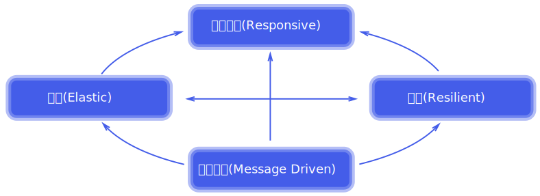

# 响应式宣言

Organisations working in disparate domains are independently discovering patterns for building software that look the same. These systems are more robust, more resilient, more flexible and better positioned to meet modern demands.

独立组织工作在不同的领域都发现模式构建软件,看起来是一样的。这些系统更健壮、更有弹性,更加灵活和更好地满足现代需求。

These changes are happening because application requirements have changed dramatically in recent years. Only a few years ago a large application had tens of servers, seconds of response time, hours of offline maintenance and gigabytes of data. Today applications are deployed on everything from mobile devices to cloud-based clusters running thousands of multi-core processors. Users expect millisecond response times and 100% uptime. Data is measured in Petabytes. Today's demands are simply not met by yesterday’s software architectures.

根据这些要求happening外汇are也各不相同,改变了对冲突进行了宣传。应当只在广泛实施了五年ago,后者servers在押人员的国籍of time模型,小时的离线维护和g的数据。今天从移动设备上的应用程序部署云计算集群运行成千上万的多核处理器.用户期望毫秒的响应时间和100%的正常运行时间。数据以pb。今天的要求不了昨天的软件架构。

We believe that a coherent approach to systems architecture is needed, and we believe that all necessary aspects are already recognised individually: we want systems that are Responsive, Resilient, Elastic and Message Driven. We call these Reactive Systems.

我们相信,正在开展approach to systems架构,我们相信,需要所有必要方面已经有recognised霜systems:我们加紧努力,有抵御性,顺应民需的,弹性和消息驱动的。我们称这些反应系统。

Systems built as Reactive Systems are more flexible, loosely-coupled and scalable. This makes them easier to develop and amenable to change. They are significantly more tolerant of failure and when failure does occur they meet it with elegance rather than disaster. Reactive Systems are highly responsive, giving users effective interactive feedback.

系统构建为反应系统更加灵活、松散耦合和可伸缩的。这使得他们更容易开发和顺从的改变.他们是更宽容他们遇到的故障,当故障发生时的优雅,而不是灾难。反应系统是高度敏感,让用户有效的互动反馈。

### Reactive Systems are:

### 反应系统:

Responsive: The system responds in a timely manner if at all possible. Responsiveness is the cornerstone of usability and utility, but more than that, responsiveness means that problems may be detected quickly and dealt with effectively. Responsive systems focus on providing rapid and consistent response times, establishing reliable upper bounds so they deliver a consistent quality of service. This consistent behaviour in turn simplifies error handling, builds end user confidence, and encourages further interaction.

及时响应:系统响应(如果可能的话)。响应性是可用性和效用的基石,但不止于此,响应性意味着问题可能会发现迅速和有效地处理。专注于提供快速响应系统和一致的响应时间,建立可靠的上界所以他们提供一致的服务质量。这种一致的行为反过来又简化了错误处理,建立终端用户的信心,并鼓励进一步互动。

Resilient: The system stays responsive in the face of failure. This applies not only to highly-available, mission critical systems — any system that is not resilient will be unresponsive after a failure. Resilience is achieved by replication, containment, isolation and delegation. Failures are contained within each component, isolating components from each other and thereby ensuring that parts of the system can fail and recover without compromising the system as a whole. Recovery of each component is delegated to another (external) component and high-availability is ensured by replication where necessary. The client of a component is not burdened with handling its failures.

弹性:系统保持响应面对失败。这不仅适用于可用性,关键任务系统,任何系统不是弹性失败后将反应迟钝。弹性是通过复制、密封、隔离和代表团.失败是包含在每个组件中,互相隔离组件,从而确保系统的部分可以失败和恢复不影响系统作为一个整体.复苏的每个组件都是委托给另一个组件(外部)和高可用性是确保在必要时通过复制.组件的客户端没有承担处理失败。

Elastic: The system stays responsive under varying workload. Reactive Systems can react to changes in the input rate by increasing or decreasing the resources allocated to service these inputs. This implies designs that have no contention points or central bottlenecks, resulting in the ability to shard or replicate components and distribute inputs among them. Reactive Systems support predictive, as well as Reactive, scaling algorithms by providing relevant live performance measures. They achieve elasticity in a cost-effective way on commodity hardware and software platforms.

弹性:不同工作负载下的系统仍然可以作出响应。反应系统可以应对变化的输入率增加或减少这些输入的资源分配服务.这意味着设计没有争用点或中央瓶颈,导致碎片的能力或复制组件和分发输入其中.反应系统支持预测,以及活性、缩放算法通过提供相应的现场表演措施.他们elasticity实现cost-effective in a way据commodity硬件和软件platforms。

Message Driven: Reactive Systems rely on asynchronous message-passing to establish a boundary between components that ensures loose coupling, isolation, location transparency, and provides the means to delegate errors as messages. Employing explicit message-passing enables load management, elasticity, and flow control by shaping and monitoring the message queues in the system and applying back-pressure when necessary. Location transparent messaging as a means of communication makes it possible for the management of failure to work with the same constructs and semantics across a cluster or within a single host. Non-blocking communication allows recipients to only consume resources while active, leading to less system overhead.

消息驱动:反应系统依赖于异步消息传递组件之间建立边界确保松散耦合、隔离、位置透明性,并提供委托错误消息的手段。采用显式消息传递支持负载管理,弹性,和流量控制通过塑造和监测系统中的消息队列和应用背压时必要的.位置透明的消息传递的通信使失败的管理工作具有相同结构和语义在集群或在一个主机.非阻塞通信允许收件人只消耗资源而活跃,导致更少的系统开销。

Large systems are composed of smaller ones and therefore depend on the Reactive properties of their constituents. This means that Reactive Systems apply design principles so these properties apply at all levels of scale, making them composable. The largest systems in the world rely upon architectures based on these properties and serve the needs of billions of people daily. It is time to apply these design principles consciously from the start instead of rediscovering them each time.

大型系统是由较小的,因此取决于他们的选民的反应特性.这意味着反应系统各级应用设计原则所以这些属性应用的规模,使它们可组合.世界上最大的系统依赖架构基于这些属性和服务每天数十亿人的需要.是时候从一开始就有意识地应用这些设计原则而不是每次都重新发现他们。

2014年9月16日

[http://www.reactivemanifesto.org/](http://www.reactivemanifesto.org/)

