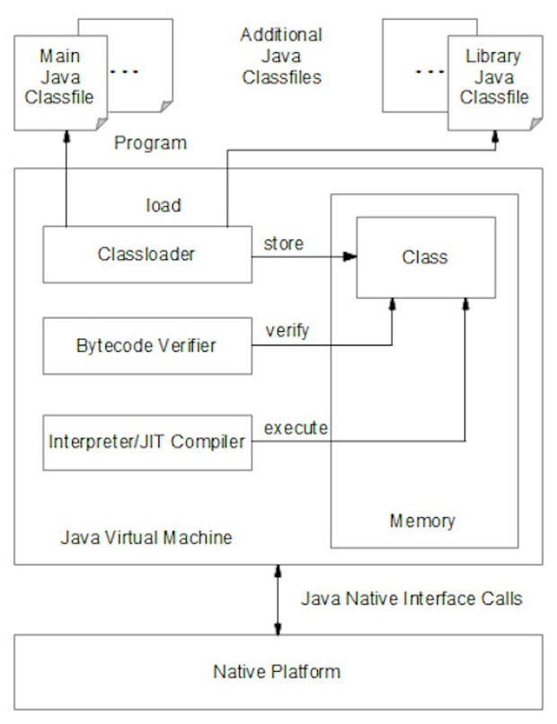

# 拼命的Java: 入门概览

A complete beginner's introduction to the Java platform

So, you want to program in Java? That's great, and you've come to the right place. The Java 101 series provides a self-guided introduction to Java programming, starting with the basics and covering all the core concepts you need to know to become a productive Java developer. This series is technical, with plenty of code examples to help you grasp the concepts as we go along. I will assume that you already have some programming experience, just not in Java.

This inaugural article introduces the Java platform and explains the difference between its three editions: Java SE, Java EE, and Java ME. You'll also learn about the role of the Java virtual machine (JVM) in deploying Java applications. I'll help you set up a Java Development Kit (JDK) on your system so that you can develop and run Java programs, and I'll get you started with the architecture of a typical Java application. Finally, you'll follow step-by-step instructions to compile and run a simple Java app.

> ##The Java 101: Foundations mini-series
>
> On March 31, 2000, JavaWorld launched the original "Learn Java from the ground up," the first article in the new Java 101 column by Jacob Weintraub. After three articles, Jacob passed the torch to me and I contributed 30 articles. Java has evolved greatly since then, so I've decided to update some of the most popular articles in the series with code and examples that are current with the Java platform today.
> 
> The Java 101: Foundations mini-series will start with the basics of Java's programming model, with updates to classic articles from the original Java 101 column. I will eventually cover all of the Java language features and key Java SE APIs through Java SE 8u45. I'll also introduce newer topics that were never addressed in the original Java 101 series, such as JavaFX, NIO, concurrency, and the Java Collections API. All topics will be introduced in a logical and easy-to-follow sequence, with plenty of code to bring you up to speed with Java programming today. There's a lot to learn about Java!

## What is Java?

You can think of Java as a general-purpose, object-oriented language that looks a lot like C and C++, but which is easier to use and lets you create more robust programs. Unfortunately, this definition doesn't give you much insight into Java. A more detailed definition from Sun Microsystems is as relevant today as it was in 2000:

> #### Java is a simple, object-oriented, network-savvy, interpreted, robust, secure, architecture-neutral, portable, high-performance, multithreaded, dynamic computer language.

Let's consider each of these definitions separately:

- Java is a simple language. Java was initially modeled after C and C++, minus some potentially confusing features. Pointers, multiple implementation inheritance, and operator overloading are some C/C++ features that are not part of Java. A feature not mandated in C/C++, but essential to Java, is a garbage-collection facility that automatically reclaims objects and arrays.

- Java is an object-oriented language. Java's object-oriented focus lets developers work on adapting Java to solve a problem, rather than forcing us to manipulate the problem to meet language constraints. This is different from a structured language like C. For example, whereas Java lets you focus on savings account objects, C requires you to think separately about savings account state (such a balance) and behaviors (such as deposit and withdrawal).

- Java is a network-savvy language. Java's extensive network library makes it easy to cope with Transmission Control Protocol/Internet Protocol (TCP/IP) network protocols like HTTP (HyperText Transfer Protocol) and FTP (File Transfer Protocol), and simplifies the task of making network connections. Furthermore, Java programs can access objects across a TCP/IP network, via Uniform Resource Locators (URLs), with the same ease as you would have accessing them from the local file system.

- Java is an interpreted language. At runtime, a Java program indirectly executes on the underlying platform (like Windows or Linux) via a virtual machine (which is a software representation of a hypothetical platform) and the associated execution environment. The virtual machine translates the Java program's bytecodes (instructions and associated data) to platform-specific instructions through interpretation. Interpretation is the act of figuring out what a bytecode instruction means and then choosing equivalent "canned" platform-specific instructions to execute. The virtual machine then executes those platform-specific instructions. 

Interpretation makes it easier to debug faulty Java programs because more compile-time information is available at runtime. Interpretation also makes it possible to delay the link step between the pieces of a Java program until runtime, which speeds up development.

- Java is a robust language. Java programs must be reliable because they are used in both consumer and mission-critical applications, ranging from Blu-ray players to vehicle-navigation or air-control systems. Language features that help make Java robust include declarations, duplicate type checking at compile time and runtime (to prevent version mismatch problems), true arrays with automatic bounds checking, and the omission of pointers. (We will discuss all of these features in detail later in this series.)

Another aspect of Java's robustness is that loops must be controlled by Boolean expressions instead of integer expressions where 0 is false and a nonzero value is true. For example, Java doesn't allow a C-style loop such as while (x) x++; because the loop might not end where expected. Instead, you must explicitly provide a Boolean expression, such as while (x != 10) x++; (which means the loop will run until x equals 10).

- Java is a secure language. Java programs are used in networked/distributed environments. Because Java programs can migrate to and execute on a network's various platforms, it's important to safeguard these platforms from malicious code that might spread viruses, steal credit card information, or perform other malicious acts. Java language features that support robustness (like the omission of pointers) work with security features such as the Java sandbox security model and public-key encryption. Together these features prevent viruses and other dangerous code from wreaking havoc on an unsuspecting platform. 
In theory, Java is secure. In practice, various security vulnerabilities have been detected and exploited. As a result, Sun Microsystems then and Oracle now continue to release security updates.

- Java is an architecture-neutral language. Networks connect platforms with different architectures based on various microprocessors and operating systems. You cannot expect Java to generate platform-specific instructions and have these instructions "understood" by all kinds of platforms that are part of a network. Instead, Java generates platform-independent bytecode instructions that are easy for each platform to interpret (via its implementation of the JVM).

- Java is a portable language. Architecture neutrality contributes to portability. However, there is more to Java's portability than platform-independent bytecode instructions. Consider that integer type sizes must not vary. For example, the 32-bit integer type must always be signed and occupy 32 bits, regardless of where the 32-bit integer is processed (e.g., a platform with 16-bit registers, a platform with 32-bit registers, or a platform with 64-bit registers). Java's libraries also contribute to portability. Where necessary, they provide types that connect Java code with platform-specific capabilities in the most portable manner possible.

- Java is a high-performance language. Interpretation yields a level of performance that is usually more than adequate. For very high-performance application scenarios Java uses just-in-time compilation, which analyzes interpreted bytecode instruction sequences and compiles frequently interpreted instruction sequences to platform-specific instructions. Subsequent attempts to interpret these bytecode instruction sequences result in the execution of equivalent platform-specific instructions, resulting in a performance boost.

- Java is a multithreaded language. To improve the performance of programs that must accomplish several tasks at once, Java supports the concept of threaded execution. For example, a program that manages a Graphical User Interface (GUI) while waiting for input from a network connection uses another thread to perform the wait instead of using the default GUI thread for both tasks. This keeps the GUI responsive. Java's synchronization primitives allow threads to safely communicate data between themselves without corrupting the data. (See threaded programming in Java discussed elsewhere in the Java 101 series.)

- Java is a dynamic language. Because interconnections between program code and libraries happen dynamically at runtime, it isn't necessary to explicitly link them. As a result, when a program or one of its libraries evolves (for instance, for a bug fix or performance improvement), a developer only needs to distribute the updated program or library. Although dynamic behavior results in less code to distribute when a version change occurs, this distribution policy can also lead to version conflicts. For example, a developer removes a class type from a library, or renames it. When a company distributes the updated library, existing programs that depend on the class type will fail. To greatly reduce this problem, Java supports an interface type, which is like a contract between two parties. (See interfaces, types, and other object-oriented language features discussed elsewhere in the Java 101 series.)

Unpacking this definition teaches us a lot about Java. Most importantly, it reveals that Java is both a language and a platform. I'll have more to say about Java platform components -- namely the Java virtual machine and Java execution environment -- later in this article.

### Three editions of Java

Sun Microsystems released the Java 1.0 software development kit (JDK) in 1995. The first JDK was used to develop desktop applications and applets, and Java subsequently evolved to encompass enterprise-server and mobile-device programming. Storing all of the necessary libraries in a single JDK would have made the JDK too large to distribute, especially because distribution in the 1990s was limited by small-size CDs and slow network speeds. Since most developers didn't need every last API (a desktop application developer would hardly need to access enterprise Java APIs), Sun solved the distribution issue by factoring Java into three main editions. These eventually became known as Java SE, Java EE, and Java ME:

- Java Platform, Standard Edition (Java SE) is the Java platform for developing client-side applications, which run on desktops, and applets, which run in web browsers.
- Java Platform, Enterprise Edition (Java EE) is the Java platform built on top of Java SE, which is used exclusively to develop enterprise-oriented server applications. Server-side applications include servlets, which are Java programs that are similar to applets but run on a server rather than a client. Servlets conform to the Java EE Servlet API.
- Java Platform, Micro Edition (Java ME) is also built on top of Java SE. It is the Java platform for developing MIDlets, which are Java programs that run on mobile information devices, and Xlets, which are Java programs that run on embedded devices.

Java SE is the foundation platform for Java and is the focus for this series. Code examples will be based on the most recent version of Java at the time of writing, which is currently Java SE 8 update 45.

> ## Who plays in the Java sandbox?
>
> Applets are subject to the Java sandbox security model. Applications are not subject to this security model by default, but can have the security model imposed on them by installing a security manager.

## Overview of the Java platform

Java is both a programming language and a platform for running compiled Java code. This platform consists mainly of the JVM, but also includes an execution environment that supports the JVM's execution on the underlying (native) platform. The JVM includes several components for loading, verifying, and executing Java code. Figure 1 shows how a Java program executes on this platform.

Figure 1. The JVM provides a classloader, a bytecode verifier, and an interpreter/just-in-time compiler for loading, verifying, and executing a class file.
At the top of the diagram is a series of program class files, and one of these class files is denoted as the main class file. A Java program consists of at least the main class file, which is the first class file to be loaded, verified, and executed.

The JVM delegates class loading to its classloader component. Classloaders load class files from various sources, such as file systems, networks, and archive files. They insulate the JVM from the intricacies of class loading.

A loaded class file is stored in memory and represented as an object created from the Class class. Once loaded, the bytecode verifier verifies the various bytecode instructions to ensure that they are valid and won't compromise security.

If the class file's bytecodes are not valid, the JVM terminates. Otherwise, its interpreter component interprets the bytecode one instruction at a time. Interpretation identifies bytecode instructions and executes equivalent native instructions.

Some bytecode instruction sequences execute more frequently than others. When the interpreter detects this situation, the JVM's just-in-time (JIT) compiler compiles the bytecode sequence to native code for faster execution.

During execution, the interpreter typically encounters a request to execute another class file's bytecode (belonging to the program or to a library). When this happens, the classloader loads the class file and the bytecode verifier verifies the loaded class file's bytecode before it's executed. Also during execution, bytecode instructions might request that the JVM open a file, display something on the screen, make a sound, or perform another task requiring cooperation with the native platform. The JVM responds by using its Java Native Interface (JNI) bridge technology to interact with the native platform to perform the task.

> ### The standard class library
>
> Java includes a large runtime library of class files, which store compiled classes and other types. I refer to this as the standard class library. You'll encounter standard class library types (such as Class) throughout the Java 101 series.

## Set up Java on your system

The Java platform is distributed as the Java Runtime Environment (JRE), which contains the JVM, a browser plugin for running applets, the standard class library, and a few other items. You will need both the JRE and a JDK in order to develop and run Java programs. The JDK download from Oracle includes the JRE and the basic development tools required to begin developing, debugging, and monitoring your applications in Java. At the time of this writing the most current version of the JDK is Java SE 8u45.

### Platform compatibility

The JDK is available for 32-bit/64-bit Linux, 64-bit Mac OS X, 64-bit Solaris SPARC, 64-bit Solaris, and 32-bit/64-bit Windows platforms.

After downloading and installing the JDK you should update your PATH environment variable to reference the JDK's bin subdirectory of the installation directory, so that you can execute JDK tools from any directory in the file system. If you need instructions for updating PATH you can find them here. (Note that my examples are based on using the command line with command-line Java tools, but you can just as easily use NetBeans or another IDE if you prefer.)

### Directory tip!

Pointing your JAVA_HOME environment variable to the JDK's installation directory enables any external Java-dependent software that you might subsequently install to locate your JDK installation.

The JDK installation directory contains various files and subdirectories, including the following three important subdirectories:

bin contains various JDK tools, such as the Java compiler (javac) and Java application launcher (java). You'll interact with these and other tools throughout the Java 101 series. (Note that the Java compiler and the JIT compiler are two different compilers.)
jre contains the JDK's private copy of the JRE, which lets you run Java programs without having to download and install the standalone JRE.
lib contains library files that are used by JDK tools. For example, tools.jar contains the Java compiler's class files -- the compiler is a Java application. (The javac tool isn't the compiler, but is a native-platform-specific convenience for starting the JVM and running the Java-based compiler.)
Now that you've installed the JDK and configured your development environment, you are ready to code your first Java application.

Access Java documentation

Oracle's Java Platform, Standard Edition (Java SE) page provides access to a wealth of online Java SE documentation for the most current version of Java. This documentation includes an API reference for all of the standard class library types. The API reference was generated by the JDK's javadoc tool, which you'll learn more about in the next Java 101 update.

## Developing Java applications

In this series, I'll present most examples in the form of applications. An application is minimally implemented as a single class that declares a main() method, as follows:

	class X
	{
	   public static void main(String[] args)
	   {
	   }
	}

Think of a class as a placeholder for declaring methods and data item storage locations. The class declaration begins with the reserved word class, which is followed by a mandatory name, which is represented by X, a placeholder for an actual name (e.g., Account). The name is followed by a body of methods and data item storage locations; the body is delimited by open brace ({) and close brace (}) characters.

Think of a method as a named block of code that processes inputs and returns an output. main() receives an array of String objects describing its inputs; the array is named args. Each object identifies a string, a double-quoted sequence of characters that (in this case) denotes a command-line argument, such as a file's name passed to the application as one of its arguments. main() doesn't return an output, and so it is assigned the void reserved word as its return type.

What's in a name?
There is nothing special about my choice of args. You could name this array Args, arguments, or even something_else. However, args is conventionally used.

Additionally, main()'s header is assigned public and static so that it can be called by the java application launcher. Following this method header is a body of code; as with a class body, the method body is delimited by brace characters.

This is all you need to know about classes and methods (especially main()) in order to code your first Java application. You'll learn more about these language features (along with strings, arrays, return types, and more) in future articles.

源代码: [http://images.techhive.com/assets/2015/05/12/java101ng-learn-java-src.zip](http://images.techhive.com/assets/2015/05/12/java101ng-learn-java-src.zip)

Saying hello

It's traditional to introduce a computer language by presenting a program that outputs the famous hello, world message. Listing 1 accomplishes this task:

Listing 1. HelloWorld.java (version 1)

	class HelloWorld
	{
	   public static void main(String[] args)
	   {
	      System.out.println("hello, world");
	   }
	}

The application's class is named HelloWorld. Its main() method executes System.out.println("hello, world"); to send the contents of the "hello, world" string to the standard output stream, which is typically the command line.

Store Listing 1 in a file named HelloWorld.java. Then, at the command line, execute the following command to compile this source file:

javac HelloWorld.java
Note that javac requires the .java file extension; otherwise, it generates an error message. If the source code compiles without an error, you should observe HelloWorld.class in the current directory.

HelloWorld.class contains the executable equivalent of HelloWorld.java. To run this class file via the java application launcher tool, execute the following command:

java HelloWorld
Note that java doesn't permit you to include the .class file extension; if you do so it will generate an error message.

Assuming you've written your program correctly, you should observe the following output:

hello, world
If you see this output, congratulate yourself. You've just compiled and run your first Java application! There will be many more examples throughout the rest of this series.

Personalizing hello

We can improve on Listing 1 by personalizing the application. For example, you might want to output hello, Java instead of hello, world. Listing 2 shows this enhancement of the original program:

Listing 2. HelloWorld.java (version 2)

	class HelloWorld
	{
	   public static void main(String[] args)
	   {
	      System.out.println("hello, " + args[0]);
	   }
	}

Listing 2 shortens "hello, world" to "hello, " and appends + args[0] to join the args array's first string to the message. The result is then output.

"hello, " + args[0] is an expression that appends the string in the first element of the args array to hello. (You'll learn more about expressions and this string concatenation later in the Java 101 series.)

Compile Listing 2 (javac HelloWorld.java) and run the application with a single command-line argument, as follows:

java HelloWorld Java
You should observe the following output:

hello, Java
Suppose you execute HelloWorld without any command-line arguments, as in java HelloWorld. This time, you will see something different:

Exception in thread "main" java.lang.ArrayIndexOutOfBoundsException: 0
	at HelloWorld.main(HelloWorld.java:5)

This error message refers to an exceptional condition that has arisen. Specifically, because there are no command-line arguments, args[0] doesn't contain anything. The attempt to access args[0]'s non-existent string is illegal.

As you develop Java applications, you'll run into many more exceptional messages like this one. Rather than be intimidated, think of these messages as tips for correcting problems.

In conclusion

We've covered a lot of ground in this article. You've learned that Java is a language and a platform. You're aware of the various Java editions. You know how the JVM executes Java class files. You've discovered the difference between the JRE and the JDK, and how to set up the JDK on your system. You've gained insight into the architecture of a Java application and learned how to compile source code and execute class files via the javac and java tools, respectively.

We'll build on this foundation in the next article in the Java 101: Foundations series, where I will begin introducing fundamental Java language features. Mastering these features will enable you to create applications that are similar in architecture to programs from the structured programming era. It will also give you the foundation to dive into Java's support for classes, objects, and related features.

May 12, 2015 9:47 AM PT

[http://www.javaworld.com/article/2076075/learn-java/core-java-learn-java-from-the-ground-up.html](http://www.javaworld.com/article/2076075/learn-java/core-java-learn-java-from-the-ground-up.html)

