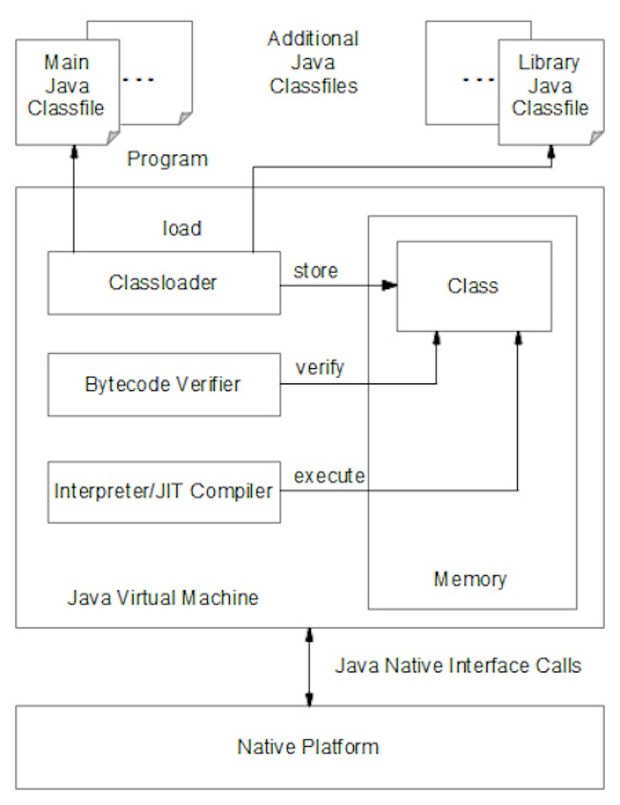

# 拼命的Java: 入门概览

A complete beginner's introduction to the Java platform

面向 Java 平台的完整入门教程

So, you want to program in Java? That's great, and you've come to the right place. The Java 101 series provides a self-guided introduction to Java programming, starting with the basics and covering all the core concepts you need to know to become a productive Java developer. This series is technical, with plenty of code examples to help you grasp the concepts as we go along. I will assume that you already have some programming experience, just not in Java.

你想用 Java 来编程吗? 那太好了, 你来对地方了。Java 101 系列是一套自学式的 Java 编程入门教程, 从基础知识讲起, 涵盖成为一名高效 Java 开发者所需掌握的全部核心概念。本系列偏重技术, 配有大量代码示例, 帮助你在学习过程中逐步理解相关概念。我会假设你已经具备一些编程经验, 只是不熟悉 Java 而已。

This inaugural article introduces the Java platform and explains the difference between its three editions: Java SE, Java EE, and Java ME. You'll also learn about the role of the Java virtual machine (JVM) in deploying Java applications. I'll help you set up a Java Development Kit (JDK) on your system so that you can develop and run Java programs, and I'll get you started with the architecture of a typical Java application. Finally, you'll follow step-by-step instructions to compile and run a simple Java app.

作为开篇, 本文介绍 Java 平台, 并解释其三个版本之间的区别: Java SE、Java EE 和 Java ME。你还会了解到 Java 虚拟机(JVM)在部署 Java 应用时所扮演的角色。我会帮助你在自己的系统上安装 Java Development Kit(JDK), 以便开发和运行 Java 程序, 并带你认识一个典型 Java 应用的架构。最后, 你将按照分步说明, 编译并运行一个简单的 Java 应用。

> ##The Java 101: Foundations mini-series
>
> ##Java 101: Foundations 迷你系列
>
> On March 31, 2000, JavaWorld launched the original "Learn Java from the ground up," the first article in the new Java 101 column by Jacob Weintraub. After three articles, Jacob passed the torch to me and I contributed 30 articles. Java has evolved greatly since then, so I've decided to update some of the most popular articles in the series with code and examples that are current with the Java platform today.
>
> 2000 年 3 月 31 日, JavaWorld 推出了最初的《Learn Java from the ground up》(从零开始学 Java), 这是 Jacob Weintraub 所著 Java 101 新专栏的第一篇文章。写了三篇文章之后, Jacob 把接力棒交给了我, 我贡献了 30 篇文章。自那以后 Java 发生了巨大的变化, 所以我决定更新该系列中一些最受欢迎的文章, 配上与当今 Java 平台同步的代码和示例。
> 
> The Java 101: Foundations mini-series will start with the basics of Java's programming model, with updates to classic articles from the original Java 101 column. I will eventually cover all of the Java language features and key Java SE APIs through Java SE 8u45. I'll also introduce newer topics that were never addressed in the original Java 101 series, such as JavaFX, NIO, concurrency, and the Java Collections API. All topics will be introduced in a logical and easy-to-follow sequence, with plenty of code to bring you up to speed with Java programming today. There's a lot to learn about Java!
>
> Java 101: Foundations 迷你系列将从 Java 编程模型的基础讲起, 并更新原 Java 101 专栏中的经典文章。我最终会覆盖到 Java SE 8u45 为止的全部 Java 语言特性和关键 Java SE API。同时我还会介绍一些原 Java 101 系列从未涉及的新话题, 例如 JavaFX、NIO、并发以及 Java Collections API。所有主题都会按照合乎逻辑、易于跟进的顺序介绍, 并配有大量代码, 让你迅速掌握当今的 Java 编程。关于 Java, 要学的东西还很多!

## What is Java?

## 什么是 Java?

You can think of Java as a general-purpose, object-oriented language that looks a lot like C and C++, but which is easier to use and lets you create more robust programs. Unfortunately, this definition doesn't give you much insight into Java. A more detailed definition from Sun Microsystems is as relevant today as it was in 2000:

你可以把 Java 看作一门通用、面向对象的语言, 它看起来很像 C 和 C++, 但更易于使用, 能让你编写出更健壮的程序。遗憾的是, 这个定义并不能让你深入了解 Java。Sun Microsystems 给出的更详细的定义, 在今天和在 2000 年时一样贴切:

> #### Java is a simple, object-oriented, network-savvy, interpreted, robust, secure, architecture-neutral, portable, high-performance, multithreaded, dynamic computer language.

> #### Java 是一门简单、面向对象、精通网络、解释执行、健壮、安全、与架构无关、可移植、高性能、多线程、动态的计算机语言。

Let's consider each of these definitions separately:

下面我们逐条来看这些定义:

- Java is a simple language. Java was initially modeled after C and C++, minus some potentially confusing features. Pointers, multiple implementation inheritance, and operator overloading are some C/C++ features that are not part of Java. A feature not mandated in C/C++, but essential to Java, is a garbage-collection facility that automatically reclaims objects and arrays.

- Java 是一门简单的语言。Java 最初模仿 C 和 C++ 设计, 去掉了一些可能令人困惑的特性。指针、多重实现继承以及运算符重载, 都是 C/C++ 中有而 Java 没有的特性。C/C++ 并未强制要求、但 Java 不可或缺的一项特性, 是垃圾回收(garbage-collection)机制, 它能自动回收对象和数组。

- Java is an object-oriented language. Java's object-oriented focus lets developers work on adapting Java to solve a problem, rather than forcing us to manipulate the problem to meet language constraints. This is different from a structured language like C. For example, whereas Java lets you focus on savings account objects, C requires you to think separately about savings account state (such a balance) and behaviors (such as deposit and withdrawal).

- Java 是一门面向对象的语言。Java 以面向对象为核心, 让开发者着力于让 Java 去适应问题本身, 而不是反过来扭曲问题去迁就语言的限制。这与 C 这样的结构化语言不同。例如, Java 让你专注于储蓄账户(savings account)对象, 而 C 则要求你分别思考储蓄账户的状态(如余额)和行为(如存款和取款)。

- Java is a network-savvy language. Java's extensive network library makes it easy to cope with Transmission Control Protocol/Internet Protocol (TCP/IP) network protocols like HTTP (HyperText Transfer Protocol) and FTP (File Transfer Protocol), and simplifies the task of making network connections. Furthermore, Java programs can access objects across a TCP/IP network, via Uniform Resource Locators (URLs), with the same ease as you would have accessing them from the local file system.

- Java 是一门精通网络的语言。Java 庞大的网络库让处理 TCP/IP 网络协议(如 HTTP(HyperText Transfer Protocol)和 FTP(File Transfer Protocol))变得轻松, 也简化了建立网络连接的工作。此外, Java 程序可以通过统一资源定位符(URL)跨越 TCP/IP 网络访问对象, 其便捷程度与从本地文件系统访问对象并无二致。

- Java is an interpreted language. At runtime, a Java program indirectly executes on the underlying platform (like Windows or Linux) via a virtual machine (which is a software representation of a hypothetical platform) and the associated execution environment. The virtual machine translates the Java program's bytecodes (instructions and associated data) to platform-specific instructions through interpretation. Interpretation is the act of figuring out what a bytecode instruction means and then choosing equivalent "canned" platform-specific instructions to execute. The virtual machine then executes those platform-specific instructions. 

- Java 是一门解释型语言。在运行时, Java 程序通过虚拟机(即对一个假设平台的软件表示)以及相关的执行环境, 间接地运行在底层平台(如 Windows 或 Linux)之上。虚拟机会通过解释, 把 Java 程序的字节码(bytecode, 即指令及相关数据)翻译成特定于平台的指令。解释, 就是弄清楚一条字节码指令的含义, 然后选择等价的、现成的平台专属指令去执行。随后虚拟机再执行这些平台专属指令。 

Interpretation makes it easier to debug faulty Java programs because more compile-time information is available at runtime. Interpretation also makes it possible to delay the link step between the pieces of a Java program until runtime, which speeds up development.

解释执行让调试有问题的 Java 程序更加容易, 因为运行时可以获得更多的编译期信息。解释执行还使得 Java 程序各组成部分之间的链接步骤可以推迟到运行时才进行, 从而加快开发速度。

- Java is a robust language. Java programs must be reliable because they are used in both consumer and mission-critical applications, ranging from Blu-ray players to vehicle-navigation or air-control systems. Language features that help make Java robust include declarations, duplicate type checking at compile time and runtime (to prevent version mismatch problems), true arrays with automatic bounds checking, and the omission of pointers. (We will discuss all of these features in detail later in this series.)

- Java 是一门健壮的语言。Java 程序必须是可靠的, 因为它们既用于消费类应用, 也用于关键任务应用, 范围涵盖从蓝光播放器到车辆导航乃至航空管制系统。有助于 Java 健壮的语言特性包括: 声明、编译期与运行期的重复类型检查(防止版本不匹配问题)、带自动边界检查的真正数组, 以及不使用指针。(这些特性我们将在本系列后续文章中详细讨论。)

Another aspect of Java's robustness is that loops must be controlled by Boolean expressions instead of integer expressions where 0 is false and a nonzero value is true. For example, Java doesn't allow a C-style loop such as while (x) x++; because the loop might not end where expected. Instead, you must explicitly provide a Boolean expression, such as while (x != 10) x++; (which means the loop will run until x equals 10).

Java 健壮性的另一个方面是: 循环必须由布尔表达式控制, 而不能用整数表达式(其中 0 为假、非零为真)。例如, Java 不允许像 C 语言那样写 `while (x) x++;`, 因为这样的循环可能不会在预期的地方结束。相反, 你必须显式地提供一个布尔表达式, 例如 `while (x != 10) x++;`(意思是循环会一直执行, 直到 x 等于 10)。

- Java is a secure language. Java programs are used in networked/distributed environments. Because Java programs can migrate to and execute on a network's various platforms, it's important to safeguard these platforms from malicious code that might spread viruses, steal credit card information, or perform other malicious acts. Java language features that support robustness (like the omission of pointers) work with security features such as the Java sandbox security model and public-key encryption. Together these features prevent viruses and other dangerous code from wreaking havoc on an unsuspecting platform. 

- Java 是一门安全的语言。Java 程序常用于网络/分布式环境中。由于 Java 程序可以迁移到网络中的各种平台上执行, 因此保护这些平台免受恶意代码的侵害就很重要, 这些恶意代码可能传播病毒、窃取信用卡信息或实施其他恶意行为。支持健壮性的 Java 语言特性(如不使用指针)与 Java 沙箱安全模型、公钥加密等安全特性协同工作。这些特性共同防止病毒和其他危险代码对毫无防备的平台造成破坏。 
In theory, Java is secure. In practice, various security vulnerabilities have been detected and exploited. As a result, Sun Microsystems then and Oracle now continue to release security updates.

理论上, Java 是安全的。但在实践中, 各种安全漏洞被陆续发现并被利用。因此, 当年的 Sun Microsystems 以及如今的 Oracle 都在持续发布安全更新。

- Java is an architecture-neutral language. Networks connect platforms with different architectures based on various microprocessors and operating systems. You cannot expect Java to generate platform-specific instructions and have these instructions "understood" by all kinds of platforms that are part of a network. Instead, Java generates platform-independent bytecode instructions that are easy for each platform to interpret (via its implementation of the JVM).

- Java 是一门与架构无关的语言。网络会把基于不同微处理器和操作系统的、具有不同架构的平台连接在一起。你不能指望 Java 生成平台专属指令, 还让网络中形形色色的平台都能“理解”这些指令。因此, Java 生成的是与平台无关的字节码指令, 便于各个平台(通过其 JVM 实现)进行解释。

- Java is a portable language. Architecture neutrality contributes to portability. However, there is more to Java's portability than platform-independent bytecode instructions. Consider that integer type sizes must not vary. For example, the 32-bit integer type must always be signed and occupy 32 bits, regardless of where the 32-bit integer is processed (e.g., a platform with 16-bit registers, a platform with 32-bit registers, or a platform with 64-bit registers). Java's libraries also contribute to portability. Where necessary, they provide types that connect Java code with platform-specific capabilities in the most portable manner possible.

- Java 是一门可移植的语言。与架构无关有助于实现可移植性。然而, Java 的可移植性不止体现在与平台无关的字节码指令上。要知道, 整数类型的长度绝不能变化。例如, 32 位整数类型必须始终是有符号的, 并且始终占用 32 位, 无论这个 32 位整数在何处处理(例如 16 位寄存器、32 位寄存器或 64 位寄存器的平台)。Java 的类库也有助于可移植性。在必要时, 它们以尽可能可移植的方式, 提供把 Java 代码与平台专属能力连接起来的类型。

- Java is a high-performance language. Interpretation yields a level of performance that is usually more than adequate. For very high-performance application scenarios Java uses just-in-time compilation, which analyzes interpreted bytecode instruction sequences and compiles frequently interpreted instruction sequences to platform-specific instructions. Subsequent attempts to interpret these bytecode instruction sequences result in the execution of equivalent platform-specific instructions, resulting in a performance boost.

- Java 是一门高性能的语言。解释执行所达到的性能水平通常绰绰有余。对于性能要求极高的应用场景, Java 会使用即时编译(just-in-time compilation), 它会分析被解释执行的字节码指令序列, 并把频繁被解释的指令序列编译成平台专属指令。之后再试图解释这些字节码指令序列时, 就会直接执行等价的平台专属指令, 从而带来性能提升。

- Java is a multithreaded language. To improve the performance of programs that must accomplish several tasks at once, Java supports the concept of threaded execution. For example, a program that manages a Graphical User Interface (GUI) while waiting for input from a network connection uses another thread to perform the wait instead of using the default GUI thread for both tasks. This keeps the GUI responsive. Java's synchronization primitives allow threads to safely communicate data between themselves without corrupting the data. (See threaded programming in Java discussed elsewhere in the Java 101 series.)

- Java 是一门多线程的语言。为了提升那些必须同时完成多项任务的程序的性能, Java 支持线程化执行的概念。例如, 一个既要管理图形用户界面(GUI)、又要等待来自网络连接输入的程序, 会使用另一个线程来执行等待, 而不是让默认的 GUI 线程同时承担这两项任务。这能让 GUI 保持响应。Java 的同步原语让线程之间可以安全地传递数据, 而不会破坏数据。(关于 Java 的线程编程, 请参阅 Java 101 系列中的其他文章。)

- Java is a dynamic language. Because interconnections between program code and libraries happen dynamically at runtime, it isn't necessary to explicitly link them. As a result, when a program or one of its libraries evolves (for instance, for a bug fix or performance improvement), a developer only needs to distribute the updated program or library. Although dynamic behavior results in less code to distribute when a version change occurs, this distribution policy can also lead to version conflicts. For example, a developer removes a class type from a library, or renames it. When a company distributes the updated library, existing programs that depend on the class type will fail. To greatly reduce this problem, Java supports an interface type, which is like a contract between two parties. (See interfaces, types, and other object-oriented language features discussed elsewhere in the Java 101 series.)

- Java 是一门动态的语言。由于程序代码与类库之间的互连是在运行时动态发生的, 因此无需显式地链接它们。这样一来, 当某个程序或其某个类库发生演进时(例如修复缺陷或提升性能), 开发者只需分发更新后的程序或类库即可。虽然动态行为减少了版本变更时需要分发的代码量, 但这种分发策略也可能导致版本冲突。例如, 开发者从某个类库中删除了一个类类型, 或者将其重命名。当公司分发更新后的类库时, 那些依赖该类型的现有程序就会失败。为了大幅减少这类问题, Java 支持接口(interface)类型, 它就像双方之间的契约。(关于接口、类型以及其他面向对象语言特性, 请参阅 Java 101 系列中的其他文章。)

Unpacking this definition teaches us a lot about Java. Most importantly, it reveals that Java is both a language and a platform. I'll have more to say about Java platform components -- namely the Java virtual machine and Java execution environment -- later in this article.

仔细拆解这个定义能让我们对 Java 了解很多。最重要的是, 它揭示了 Java 既是一门语言, 也是一个平台。关于 Java 平台的组成部分——也就是 Java 虚拟机和 Java 执行环境——我将在本文后面详细介绍。

### Three editions of Java

### 三个 Java 版本

Sun Microsystems released the Java 1.0 software development kit (JDK) in 1995. The first JDK was used to develop desktop applications and applets, and Java subsequently evolved to encompass enterprise-server and mobile-device programming. Storing all of the necessary libraries in a single JDK would have made the JDK too large to distribute, especially because distribution in the 1990s was limited by small-size CDs and slow network speeds. Since most developers didn't need every last API (a desktop application developer would hardly need to access enterprise Java APIs), Sun solved the distribution issue by factoring Java into three main editions. These eventually became known as Java SE, Java EE, and Java ME:

Sun Microsystems 于 1995 年发布了 Java 1.0 软件开发工具包(SDK, 即 JDK)。最初的 JDK 用于开发桌面应用和 applet, 后来 Java 不断演进, 覆盖了企业服务器和移动设备编程。如果把所有必需的类库都放进同一个 JDK, 会让 JDK 大到难以分发, 尤其是在 1990 年代, 分发还受限于小容量的 CD 和缓慢的网络速度。由于大多数开发者并不需要每一个 API(桌面应用开发者几乎用不到企业级 Java API), Sun 通过把 Java 拆分为三个主要版本来解决分发问题。这三个版本最终被称为 Java SE、Java EE 和 Java ME:

- Java Platform, Standard Edition (Java SE) is the Java platform for developing client-side applications, which run on desktops, and applets, which run in web browsers.

- Java Platform, Standard Edition(Java SE)是用于开发客户端应用(运行在桌面上)和 applet(运行在 Web 浏览器中)的 Java 平台。

- Java Platform, Enterprise Edition (Java EE) is the Java platform built on top of Java SE, which is used exclusively to develop enterprise-oriented server applications. Server-side applications include servlets, which are Java programs that are similar to applets but run on a server rather than a client. Servlets conform to the Java EE Servlet API.

- Java Platform, Enterprise Edition(Java EE)是构建在 Java SE 之上的 Java 平台, 专门用于开发面向企业的服务器应用。服务器端应用包括 servlet, 它是与 applet 类似、但运行在服务器而非客户端上的 Java 程序。Servlet 遵循 Java EE Servlet API。

- Java Platform, Micro Edition (Java ME) is also built on top of Java SE. It is the Java platform for developing MIDlets, which are Java programs that run on mobile information devices, and Xlets, which are Java programs that run on embedded devices.

- Java Platform, Micro Edition(Java ME)同样构建在 Java SE 之上。它是用于开发 MIDlet(运行在移动信息设备上的 Java 程序)和 Xlet(运行在嵌入式设备上的 Java 程序)的 Java 平台。

Java SE is the foundation platform for Java and is the focus for this series. Code examples will be based on the most recent version of Java at the time of writing, which is currently Java SE 8 update 45.

Java SE 是 Java 的基础平台, 也是本系列的重点。代码示例将基于撰写本文时最新的 Java 版本, 即当前的 Java SE 8 update 45。

> ## Who plays in the Java sandbox?
>
> ## 谁在 Java 沙箱里玩?
>
> Applets are subject to the Java sandbox security model. Applications are not subject to this security model by default, but can have the security model imposed on them by installing a security manager.
>
> Applet 受 Java 沙箱安全模型的约束。应用程序默认不受该安全模型约束, 但可以通过安装安全管理器(security manager)来强制施加该安全模型。

## Overview of the Java platform

## Java 平台概览

Java is both a programming language and a platform for running compiled Java code. This platform consists mainly of the JVM, but also includes an execution environment that supports the JVM's execution on the underlying (native) platform. The JVM includes several components for loading, verifying, and executing Java code. Figure 1 shows how a Java program executes on this platform.

Java 既是一门编程语言, 也是一个用于运行已编译 Java 代码的平台。这个平台主要由 JVM 组成, 但也包含一个执行环境, 用于支持 JVM 在底层(本机)平台上执行。JVM 包含若干组件, 用于加载、校验和执行 Java 代码。图 1 展示了 Java 程序是如何在该平台上执行的。

Figure 1. The JVM provides a classloader, a bytecode verifier, and an interpreter/just-in-time compiler for loading, verifying, and executing a class file.
At the top of the diagram is a series of program class files, and one of these class files is denoted as the main class file. A Java program consists of at least the main class file, which is the first class file to be loaded, verified, and executed.

图 1. JVM 提供了类加载器(classloader)、字节码校验器(bytecode verifier)以及解释器/即时编译器, 用于加载、校验和执行 class 文件。
图的最上方是一系列程序 class 文件, 其中一个 class 文件被标记为主 class 文件。一个 Java 程序至少由主 class 文件组成, 它是最先被加载、校验和执行的 class 文件。

The JVM delegates class loading to its classloader component. Classloaders load class files from various sources, such as file systems, networks, and archive files. They insulate the JVM from the intricacies of class loading.

JVM 把类加载工作委托给它的类加载器组件。类加载器从各种来源加载 class 文件, 例如文件系统、网络和归档文件。它们让 JVM 不必操心类加载的复杂细节。

A loaded class file is stored in memory and represented as an object created from the Class class. Once loaded, the bytecode verifier verifies the various bytecode instructions to ensure that they are valid and won't compromise security.

加载后的 class 文件存储在内存中, 表示为由 Class 类创建的一个对象。加载完成后, 字节码校验器会校验各种字节码指令, 确保它们有效且不会危害安全。

If the class file's bytecodes are not valid, the JVM terminates. Otherwise, its interpreter component interprets the bytecode one instruction at a time. Interpretation identifies bytecode instructions and executes equivalent native instructions.

如果 class 文件的字节码无效, JVM 就会终止。否则, 其解释器组件会一次一条地解释字节码。解释的过程就是识别字节码指令, 并执行等价的本地指令。

Some bytecode instruction sequences execute more frequently than others. When the interpreter detects this situation, the JVM's just-in-time (JIT) compiler compiles the bytecode sequence to native code for faster execution.

有些字节码指令序列的执行频率高于其他序列。当解释器检测到这种情况时, JVM 的即时(JIT)编译器会把这些字节码序列编译成本地代码, 以加快执行速度。

During execution, the interpreter typically encounters a request to execute another class file's bytecode (belonging to the program or to a library). When this happens, the classloader loads the class file and the bytecode verifier verifies the loaded class file's bytecode before it's executed. Also during execution, bytecode instructions might request that the JVM open a file, display something on the screen, make a sound, or perform another task requiring cooperation with the native platform. The JVM responds by using its Java Native Interface (JNI) bridge technology to interact with the native platform to perform the task.

在执行过程中, 解释器通常会遇到执行另一个 class 文件(属于本程序或某个类库)字节码的请求。此时, 类加载器会加载该 class 文件, 字节码校验器会在其执行前校验已加载 class 文件的字节码。同样在执行过程中, 字节码指令可能会请求 JVM 打开文件、在屏幕上显示内容、发出声音, 或执行其他需要与本机平台协作的任务。JVM 会使用其 Java Native Interface(JNI)桥接技术与本机平台交互, 以完成该任务。

> ### The standard class library
>
> ### 标准类库
>
> Java includes a large runtime library of class files, which store compiled classes and other types. I refer to this as the standard class library. You'll encounter standard class library types (such as Class) throughout the Java 101 series.
>
> Java 包含一个庞大的运行时 class 文件类库, 其中存放着已编译的类和其他类型。我把它称为标准类库。在整个 Java 101 系列中, 你会不断遇到标准类库中的类型(例如 Class)。

## Set up Java on your system

## 在系统上安装 Java

The Java platform is distributed as the Java Runtime Environment (JRE), which contains the JVM, a browser plugin for running applets, the standard class library, and a few other items. You will need both the JRE and a JDK in order to develop and run Java programs. The JDK download from Oracle includes the JRE and the basic development tools required to begin developing, debugging, and monitoring your applications in Java. At the time of this writing the most current version of the JDK is Java SE 8u45.

Java 平台以 Java Runtime Environment(JRE)的形式分发, 它包含 JVM、用于运行 applet 的浏览器插件、标准类库以及其他一些内容。要开发和运行 Java 程序, 你需要同时具备 JRE 和 JDK。从 Oracle 下载的 JDK 已包含 JRE, 以及开始用 Java 开发、调试和监控应用所需的基本开发工具。撰写本文时, JDK 的最新版本是 Java SE 8u45。

### Platform compatibility

### 平台兼容性

The JDK is available for 32-bit/64-bit Linux, 64-bit Mac OS X, 64-bit Solaris SPARC, 64-bit Solaris, and 32-bit/64-bit Windows platforms.

JDK 可用于 32 位/64 位 Linux、64 位 Mac OS X、64 位 Solaris SPARC、64 位 Solaris 以及 32 位/64 位 Windows 平台。

After downloading and installing the JDK you should update your PATH environment variable to reference the JDK's bin subdirectory of the installation directory, so that you can execute JDK tools from any directory in the file system. If you need instructions for updating PATH you can find them here. (Note that my examples are based on using the command line with command-line Java tools, but you can just as easily use NetBeans or another IDE if you prefer.)

下载并安装 JDK 之后, 你应该更新 PATH 环境变量, 让它指向 JDK 安装目录下的 bin 子目录, 这样你就能在文件系统的任意目录中执行 JDK 工具。如果需要更新 PATH 的说明, 可以在这里找到。(请注意, 我的示例都基于命令行和命令行 Java 工具, 但你如果愿意, 也可以同样方便地使用 NetBeans 或其他 IDE。)

### Directory tip!

### 目录小贴士!

Pointing your JAVA_HOME environment variable to the JDK's installation directory enables any external Java-dependent software that you might subsequently install to locate your JDK installation.

把 JAVA_HOME 环境变量指向 JDK 的安装目录, 可以让随后安装的任何依赖 Java 的外部软件找到你的 JDK 安装位置。

The JDK installation directory contains various files and subdirectories, including the following three important subdirectories:

JDK 安装目录包含各种文件和子目录, 其中包括以下三个重要的子目录:

bin contains various JDK tools, such as the Java compiler (javac) and Java application launcher (java). You'll interact with these and other tools throughout the Java 101 series. (Note that the Java compiler and the JIT compiler are two different compilers.)

bin 包含各种 JDK 工具, 例如 Java 编译器(javac)和 Java 应用程序启动器(java)。在整个 Java 101 系列中, 你都会与这些工具及其他工具打交道。(注意, Java 编译器和 JIT 编译器是两种不同的编译器。)

jre contains the JDK's private copy of the JRE, which lets you run Java programs without having to download and install the standalone JRE.

jre 包含 JDK 私有的 JRE 副本, 让你无需下载并安装独立的 JRE 就能运行 Java 程序。

lib contains library files that are used by JDK tools. For example, tools.jar contains the Java compiler's class files -- the compiler is a Java application. (The javac tool isn't the compiler, but is a native-platform-specific convenience for starting the JVM and running the Java-based compiler.)

lib 包含 JDK 工具所使用的库文件。例如, tools.jar 包含 Java 编译器的 class 文件——编译器本身就是一个 Java 应用程序。(javac 工具并不是编译器, 而是一个特定于本机平台的便捷程序, 用于启动 JVM 并运行这个基于 Java 的编译器。)

Now that you've installed the JDK and configured your development environment, you are ready to code your first Java application.

现在你已经安装好 JDK 并配置好了开发环境, 可以开始编写你的第一个 Java 应用程序了。

Access Java documentation

访问 Java 文档

Oracle's Java Platform, Standard Edition (Java SE) page provides access to a wealth of online Java SE documentation for the most current version of Java. This documentation includes an API reference for all of the standard class library types. The API reference was generated by the JDK's javadoc tool, which you'll learn more about in the next Java 101 update.

Oracle 的 Java Platform, Standard Edition(Java SE)页面提供了针对最新版 Java 的大量在线 Java SE 文档。这些文档包含所有标准类库类型的 API 参考。API 参考由 JDK 的 javadoc 工具生成, 你会在下一期 Java 101 更新中进一步了解它。

## Developing Java applications

## 开发 Java 应用程序

In this series, I'll present most examples in the form of applications. An application is minimally implemented as a single class that declares a main() method, as follows:

在本系列中, 我会以应用程序(application)的形式展示大多数示例。一个应用程序最少实现为一个声明了 main() 方法的类, 如下所示:

	class X
	{
	   public static void main(String[] args)
	   {
	   }
	}

Think of a class as a placeholder for declaring methods and data item storage locations. The class declaration begins with the reserved word class, which is followed by a mandatory name, which is represented by X, a placeholder for an actual name (e.g., Account). The name is followed by a body of methods and data item storage locations; the body is delimited by open brace ({) and close brace (}) characters.

可以把类(class)看作一个用于声明方法和数据项存储位置的占位符。类声明以保留字 class 开头, 后面跟一个必需的名称, 这里用 X 表示, 它是实际名称(例如 Account)的占位符。名称后面是方法体和数据项存储位置; 方法体由左花括号({)和右花括号(})界定。

Think of a method as a named block of code that processes inputs and returns an output. main() receives an array of String objects describing its inputs; the array is named args. Each object identifies a string, a double-quoted sequence of characters that (in this case) denotes a command-line argument, such as a file's name passed to the application as one of its arguments. main() doesn't return an output, and so it is assigned the void reserved word as its return type.

可以把方法(method)看作一个有名称的代码块, 它处理输入并返回一个输出。main() 接收一个描述其输入的 String 对象数组; 该数组名为 args。每个对象标识一个字符串, 即一段用双引号括起来的字符序列, 在这里表示一个命令行参数, 例如作为参数之一传给应用程序的文件名。main() 不返回输出, 因此它的返回类型被指定为保留字 void。

What's in a name?

名称里有什么讲究?

There is nothing special about my choice of args. You could name this array Args, arguments, or even something_else. However, args is conventionally used.

我选择 args 这个名称并没有什么特别之处。你也可以把这个数组命名为 Args、arguments, 甚至 something_else。不过, 按照惯例通常使用 args。

Additionally, main()'s header is assigned public and static so that it can be called by the java application launcher. Following this method header is a body of code; as with a class body, the method body is delimited by brace characters.

此外, main() 的方法头被指定为 public 和 static, 以便能被 java 应用程序启动器调用。方法头之后是代码体; 与类体一样, 方法体也由花括号界定。

This is all you need to know about classes and methods (especially main()) in order to code your first Java application. You'll learn more about these language features (along with strings, arrays, return types, and more) in future articles.

要编写你的第一个 Java 应用程序, 关于类和方法(尤其是 main())需要了解的就是这些。在后续文章中, 你会进一步了解这些语言特性(以及字符串、数组、返回类型等更多内容)。

源代码: [http://images.techhive.com/assets/2015/05/12/java101ng-learn-java-src.zip](http://images.techhive.com/assets/2015/05/12/java101ng-learn-java-src.zip)

Saying hello

说声 hello

It's traditional to introduce a computer language by presenting a program that outputs the famous hello, world message. Listing 1 accomplishes this task:

按照传统, 介绍一门计算机语言时, 通常会先展示一个输出著名的 hello, world 消息的程序。清单 1 就完成了这个任务:

Listing 1. HelloWorld.java (version 1)

清单 1. HelloWorld.java(版本 1)

	class HelloWorld
	{
	   public static void main(String[] args)
	   {
	      System.out.println("hello, world");
	   }
	}

The application's class is named HelloWorld. Its main() method executes System.out.println("hello, world"); to send the contents of the "hello, world" string to the standard output stream, which is typically the command line.

该应用程序的类名为 HelloWorld。它的 main() 方法执行 `System.out.println("hello, world");`, 把 "hello, world" 字符串的内容发送到标准输出流, 通常也就是命令行。

Store Listing 1 in a file named HelloWorld.java. Then, at the command line, execute the following command to compile this source file:

把清单 1 保存到名为 HelloWorld.java 的文件中。然后在命令行执行以下命令来编译这个源文件:

javac HelloWorld.java
Note that javac requires the .java file extension; otherwise, it generates an error message. If the source code compiles without an error, you should observe HelloWorld.class in the current directory.

注意, javac 要求带上 .java 文件扩展名; 否则它会生成一条错误信息。如果源代码编译无误, 你应该会在当前目录中看到 HelloWorld.class。

HelloWorld.class contains the executable equivalent of HelloWorld.java. To run this class file via the java application launcher tool, execute the following command:

HelloWorld.class 包含与 HelloWorld.java 等价的、可执行的内容。要通过 java 应用程序启动器工具运行这个 class 文件, 请执行以下命令:

java HelloWorld
Note that java doesn't permit you to include the .class file extension; if you do so it will generate an error message.

注意, java 不允许你带上 .class 文件扩展名; 如果带了, 它会生成一条错误信息。

Assuming you've written your program correctly, you should observe the following output:

假设你的程序编写正确, 你应该会看到以下输出:

hello, world
If you see this output, congratulate yourself. You've just compiled and run your first Java application! There will be many more examples throughout the rest of this series.

如果你看到了这个输出, 那就恭喜自己吧。你刚刚编译并运行了你的第一个 Java 应用程序! 在本系列接下来的内容中还会有更多示例。

Personalizing hello

个性化 hello

We can improve on Listing 1 by personalizing the application. For example, you might want to output hello, Java instead of hello, world. Listing 2 shows this enhancement of the original program:

我们可以对清单 1 加以改进, 让应用更个性化。例如, 你可能想输出 hello, Java 而不是 hello, world。清单 2 展示了原程序的这一增强版本:

Listing 2. HelloWorld.java (version 2)

清单 2. HelloWorld.java(版本 2)

	class HelloWorld
	{
	   public static void main(String[] args)
	   {
	      System.out.println("hello, " + args[0]);
	   }
	}

Listing 2 shortens "hello, world" to "hello, " and appends + args[0] to join the args array's first string to the message. The result is then output.

清单 2 把 "hello, world" 缩短为 "hello, ", 并追加 `+ args[0]`, 将 args 数组的第一个字符串拼接进消息。随后输出结果。

"hello, " + args[0] is an expression that appends the string in the first element of the args array to hello. (You'll learn more about expressions and this string concatenation later in the Java 101 series.)

`"hello, " + args[0]` 是一个表达式, 它把 args 数组第一个元素中的字符串追加到 hello 之后。(关于表达式以及这种字符串拼接, 你将在 Java 101 系列的后面部分进一步了解。)

Compile Listing 2 (javac HelloWorld.java) and run the application with a single command-line argument, as follows:

编译清单 2(`javac HelloWorld.java`), 并带上一个命令行参数运行该应用, 如下所示:

java HelloWorld Java
You should observe the following output:

你应该会看到以下输出:

hello, Java
Suppose you execute HelloWorld without any command-line arguments, as in java HelloWorld. This time, you will see something different:

假设你不带任何命令行参数执行 HelloWorld, 也就是 `java HelloWorld`。这一次, 你会看到不一样的结果:

Exception in thread "main" java.lang.ArrayIndexOutOfBoundsException: 0
	at HelloWorld.main(HelloWorld.java:5)

This error message refers to an exceptional condition that has arisen. Specifically, because there are no command-line arguments, args[0] doesn't contain anything. The attempt to access args[0]'s non-existent string is illegal.

这条错误信息指的是出现了一个异常状况。具体来说, 由于没有命令行参数, args[0] 中没有任何内容。试图访问 args[0] 那个并不存在的字符串是非法的。

As you develop Java applications, you'll run into many more exceptional messages like this one. Rather than be intimidated, think of these messages as tips for correcting problems.

随着你开发越来越多的 Java 应用程序, 你会遇到许多类似的异常信息。不要被它们吓到, 把它们当成帮助你定位问题的提示就好。

In conclusion

总结

We've covered a lot of ground in this article. You've learned that Java is a language and a platform. You're aware of the various Java editions. You know how the JVM executes Java class files. You've discovered the difference between the JRE and the JDK, and how to set up the JDK on your system. You've gained insight into the architecture of a Java application and learned how to compile source code and execute class files via the javac and java tools, respectively.

本文涵盖了很多内容。你已经知道 Java 既是一门语言, 也是一个平台; 了解了各种 Java 版本; 知道了 JVM 如何执行 Java class 文件; 弄清了 JRE 与 JDK 的区别, 以及如何在自己的系统上安装 JDK; 还深入了解了 Java 应用程序的架构, 并学会了分别通过 javac 和 java 工具来编译源代码、执行 class 文件。

We'll build on this foundation in the next article in the Java 101: Foundations series, where I will begin introducing fundamental Java language features. Mastering these features will enable you to create applications that are similar in architecture to programs from the structured programming era. It will also give you the foundation to dive into Java's support for classes, objects, and related features.

在 Java 101: Foundations 系列的下一篇文章中, 我们将在这个基础上继续深入, 我会开始介绍 Java 的基础语言特性。掌握这些特性后, 你就能创建出架构类似于结构化编程时代程序的应用程序, 同时也为深入学习 Java 对类、对象及相关特性的支持打下基础。

May 12, 2015 9:47 AM PT

[http://www.javaworld.com/article/2076075/learn-java/core-java-learn-java-from-the-ground-up.html](http://www.javaworld.com/article/2076075/learn-java/core-java-learn-java-from-the-ground-up.html)
