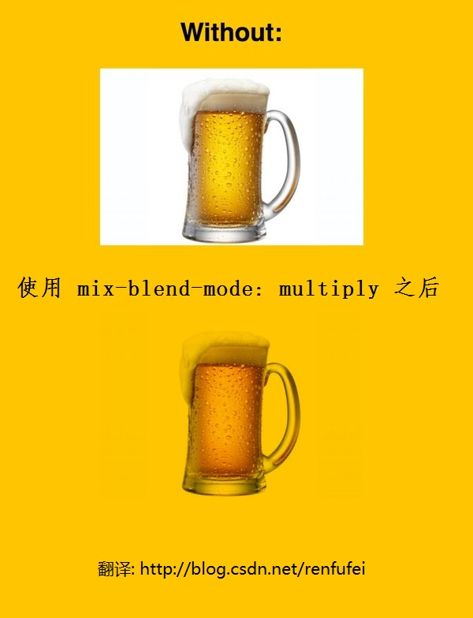

# mix-blend-mode: multiply

> 注: mix 有混合的意思   blend 也有混合的意思.  
> multiply 是乘，乘法的意思, 也有正片叠底的意思(将底色与前台色相乘),

One of my favorite interview questions is "how do you stay current on emerging front-end techniques and APIs?"  I always get the standard "blogs" and "RSS" answers but rarely do I ever hear "from gurus on Twitter."  I find that strange because I learn loads from Twitter, especially when it comes to CSS, because a tiny snippet can do something really neat.

我最喜欢的一个面试问题是“你如何保持当前新兴的前端技术和api ?“我总是得到标准的“博客”和“RSS”答案但我很少听到“从Twitter上的大师。“我觉得奇怪,因为我学习从Twitter负载,尤其是当它涉及到CSS,因为一个小小的片段可以做一些很整洁。

I had heard CSS mix-blend-mode was something awesome but this blew my mind:

我听说CSS mix-blend-mode是可怕的但这出乎我的意料:

该大神的推特地址为: [https://twitter.com/wesbos](https://twitter.com/wesbos)

Essentially, using mix-blend-mode: multiply; on an image with white background would turn that white into a level of opacity as though the image were a .png with opacity.  Whoa!  I created a demo here:

从本质上讲,使用mix-blend-mode:乘;与白色背景图像会把白色变成不透明的图像是一个水平。与不透明png。哇!我创建了一个演示:

https://davidwalsh.name/demo/mix-blend-mode.php

What an awesome bit of CSS!  Thanks to Wes Bos for the heads up on this nifty CSS feature!

什么一个了不起的一些CSS !由于韦斯Bos的这个漂亮的CSS特性!

原文链接:  [https://davidwalsh.name/mix-blend-mode](https://davidwalsh.name/mix-blend-mode)

