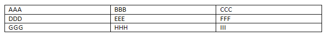

# Wordprocessing Tables

## Structure

A table consists of rows and cells and is structured much like an HTML table. It is defined with the `<w:tbl>` element.

	<w:tbl>
		<w:tblPr>
			<w:tblStyle w:val="TableGrid"/>
			<w:tblW w:w="5000" w:type="pct"/>
		</w:tblPr>
		<w:tblGrid>
			<w:gridCol w:w="2880"/>
			<w:gridCol w:w="2880"/>
			<w:gridCol w:w="2880"/>
		</w:tblGrid>
		<w:tr>
			<w:tc>
				<w:tcPr>
					<w:tcW w:w="2880" w:type="dxa"/>
				</w:tcPr>
				<w:p>
					<w:r>
						<w:t>AAA</w:t>
					</w:r>
				</w:p>
			</w:tc>
			<w:tc>
				<w:tcPr>
					<w:tcW w:w="2880" w:type="dxa"/>
				</w:tcPr>
				<w:p>
					<w:r>
						<w:t>BBB</w:t>
					</w:r>
				</w:p>
			</w:tc>
			<w:tc>
				<w:tcPr>
					<w:tcW w:w="2880" w:type="dxa"/>
				</w:tcPr>
				<w:p>
					<w:r>
						<w:t>CCC</w:t>
					</w:r>
				</w:p>
			</w:tc>
		</w:tr>
		. . .
	</w:tbl>

> **Note**:  When two adjacent tables having the same style are present together without any intervening `<w:p>` elements, the tables are treated as a single table.

Reference:  ECMA-376, 3rd Edition (June, 2011), Fundamentals and Markup Language Reference § 17.4.38.

## Word 2007 Example:

### Elements:

The `<w:tbl>` element can contain a whole host of elements, mostly related to tracking revisions and adding custom XML. The core elements are shown below.

<table  width="100%">
  <thead>
    <tr>
      <th>Element</th>
      <th>Description</th>
    </tr>
  </thead>
  <tbody>
    <tr>
      <td>
        tblGrid
      </td>
      <td>
        Specifies the columns for the table.  See Table
        <a href="WPtableGrid.php">Table Columns</a>.
        

          Reference:  ECMA-376, 3rd Edition (June, 2011), Fundamentals and Markup Language Reference § 17.4.49.
        

      </td>
    </tr>
    <tr>
      <td>
        tblPr
      </td>
      <td>
        Specifies the table-wide properties for the table.  These properties can be overridden by individual table level exception, row, and cell-level properties.  See Table
        <a href="WPtableProperties.php">Table properties</a>.
        

          Reference:  ECMA-376, 3rd Edition (June, 2011), Fundamentals and Markup Language Reference § 17.4.60.
        

      </td>
    </tr>
    <tr>
      <td>
        tr
      </td>
      <td>
        Specifies a table row.  See Table
        <a href="WPtableRow.php">Table Row</a>.
        

          Reference:  ECMA-376, 3rd Edition (June, 2011), Fundamentals and Markup Language Reference § 17.4.79.
        

        

      </td>
    </tr>
  </tbody>
</table>

 

> ### Related Open Document Format (ODF) Property:

A table in the ODF format is specified with `<table:table>` element. A table consists of rows and columns. Rows are divided into cells, and columns are implied by taking all cells with the same position within the rows. A table can appear within a `<office:text>`, within a section, within a table cell, a header, or a footer, among others.

Reference: Open Document Format for Office Applications Version 1.2 (May, 2011) § 9.1.2.

	<table:table table:name="Table1" table:style-name="Table1">
	  <table:table-column table:style-name="Table1.A" table:number-columns-repeated="3"/>
	  <table:row>
	    <table:table-cell table:style-name="Table1.A1" office:value="string">
	      <text:p text:style-name="Table_20_Contents">AAA</text:p>
	    </table:table-cell>
	    <table:table-cell table:style-name="Table1.A1" office:value="string">
	      <text:p text:style-name="Table_20_Contents">BBB</text:p>
	    </table:table-cell>
	    <table:table-cell table:style-name="Table1.C1" office:value="string">
	      <text:p text:style-name="Table_20_Contents">CCC</text:p>
	    </table:table-cell>
	  <table:row>
	</table:table>

### Attributes:

The most commonly used attributes are below.

<table class="odfAttributes" width="100%">
  <thead>
    <tr>
      <th>Attributes</th>
      <th>Description</th>
    </tr>
  </thead>
  <tbody>
    <tr>
      <td>
        table:name
      </td>
      <td>
        
Specifies a unique name.

      </td>
    </tr>
    <tr>
      <td>
        table:style-name
      </td>
      <td>
        
Specifies a table style for the table.

      </td>
    </tr>
    <tr>
      <td>
        xml:id
      </td>
      <td>
        
Specifies a unique ID and is standardized by the W3C (xml-id).

      </td>
    </tr>
    <tr>
      <td>
        table:protected
      </td>
      <td>
        

          Specifies whether the table is protected so the user cannot edit it. Values are
          true and
          false.
        

      </td>
    </tr>
  </tbody>
</table>

### Elements:

The most commonly used elements are below.

<table class="odfElements" width="100%">
  <thead>
    <tr>
      <th>Element</th>
      <th>Description</th>
    </tr>
  </thead>
  <tbody>

    <tr>
      <td style="width:30%">
        &lt;table:table-column&gt;
      </td>
      <td>Specifies properties for one or more adjacent columns.</td>
    </tr>
    <tr>
      <td style="width:30%">
        &lt;table:table-column-group&gt;
      </td>
      <td>Groups adjacent columns</td>
    </tr>
    <tr>
      <td style="width:30%">
        &lt;table:table-columns&gt;
      </td>
      <td>
        Contains groups of
        &lt;table:table-column&gt; elements that don't repeat when a table spans pages.
      </td>
    </tr>
    <tr>
      <td style="width:30%">
        &lt;table:table-header-columns&gt;
      </td>
      <td>Represents column headers.</td>
    </tr>
    <tr>
      <td style="width:30%">
        &lt;table:table-header-rows&gt;
      </td>
      <td>Represents row headers.</td>
    </tr>
    <tr>
      <td style="width:30%">
        &lt;table:table-row&gt;
      </td>
      <td>Represents a row.</td>
    </tr>
    <tr>
      <td style="width:30%">
        &lt;table:table-row-group&gt;
      </td>
      <td>Groups adjacent rows that do not appear as table headers.</td>
    </tr>
    <tr>
      <td style="width:30%">
        &lt;table:table-rows&gt;
      </td>
      <td>
        Contains groups of
        &lt;table:table-row&gt; elements that don't repeat when a table spans pages.
      </td>
    </tr>
    <tr>
      <td style="width:30%">
        &lt;table:title&gt;
      </td>
      <td>Specifies a title for the table.</td>
    </tr>
  </tbody>
</table>

## Related HTML/CSS Property:

	<table style="width:100%;">
		<tr>
			<td>AAA</td>
			<td>BBB</td>
			<td>CCC</td>
		</tr>
		. . .
	</table>

### HTML/CSS Example:

<table style="width:100%">
  <tbody>
    <tr>
      <td>AAA</td>
      <td>BBB</td>
      <td>CCC</td>
    </tr>
    <tr>
      <td>DDD</td>
      <td>EEE</td>
      <td>FFF</td>
    </tr>
    <tr>
      <td>GGG</td>
      <td>HHH</td>
      <td>III</td>
    </tr>
  </tbody>
</table>

原文链接: [http://officeopenxml.com/WPtable.php](http://officeopenxml.com/WPtable.php)

原文日期:  约 2012-05-01
