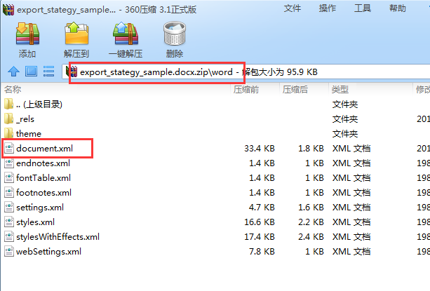
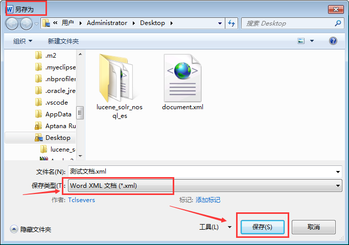

# 用FreeMarker生成Word文档

顾名思义, Word文档, document 有文档的意思, archive 也有文档的意思。

`.doc`, `.docx`, `.xls`,  `.xlsx` 等文件全部都是ZIP格式的，将文件重命名为 `xxx.zip` 之后，就可以看到压缩文件的结构了。

MS-Office 97-2003 格式的文档称为二进制文档,存储结构较大。如果使用POI解析, 则使用 `HWPFDocument` 等 **H** 起头的类来解析。

而 MS-Office 2007,2010,2013,2016 支持的 `.docx` 等以 `x`结尾的文件, 用POI 则对应于 `XWPFDocument` 等以 **X** 起头的类来解析。

当然, POI 主要用来生成Office文档, 或者从文档中提取数据。 对于 Excel 等的支持较为友好。 而对于Word文档的支持，则显得太简陋了。

> POI 原来的意思是 简陋的模糊实现([Poor Obfuscation Implementation](https://en.wikipedia.org/wiki/Apache_POI))

当然，也不是绝对, 对于 .doc 格式的文档,POI直接提供了支持。 请参考: [使用POI读写word doc文件](http://haohaoxuexi.iteye.com/blog/2031335), 以及 [使用POI读写word docx文件](http://haohaoxuexi.iteye.com/blog/2049110) 这一系列的文章。

所以本文不讨论 .doc 文档,这种二进制文档,使用 FreeMarker 处理起来, 应该也讨不了好。请参考上面提到的[haohaoxuexi 的博客](http://haohaoxuexi.iteye.com/category/156541).

盐归正传, 2007以后的Word,支持多种格式。最常见的是 `.docx`, 我熟悉的还有一种, `.xml` 格式。 

## XML 格式的Word替换

先创建一个模板Word文档, 里面输入需要的内容. 

Microsoft Word 程序直接提供两种格式的转换. 方法为: `文件菜单 -> 另存为 -> Word XML文档(.xml) -> 保存` 即可。

在安装了 Office 2007 及以上的系统中, 双击这个新保存的XML，会自动用Word打开。

看到这里，相信你也大致知道怎么处理了. 

默认生成的XML文档是不换行的, 但也可以手工换行. 对于 `.xml` 格式的word文档, 找出需要替换的内容, 使用 FreeMarker 标签来处理即可。

类似这样:

	<w:t>${xxxName}</w:t>

对于表格需要关注的标签主要是:

	表格: <w:tbl>
	列集合: <w:tblGrid>
	列: <w:gridCol>
	行: <w:tr>
	单元格: <w:tc>
	文本: <w:t>

## docx 格式的Word替换

既然 docx 文件就是 zip 格式的,那么我们就可以将其中重要的 document.xml 给替换，就可以生成一个新的 docx 文档了。

### 处理步骤:

1. 创建模板 Word 文件,保存为 `.docx` 文件

2. 复制并重命名`.docx`文件为 `.zip` 文件(修改后缀名不会影响文件内容)

3. 打开 ZIP 文件,将 `word/document.xml` 文件提取出来. 只有这个文件保存了文档内容, 其他的文件应该是样式等额外的信息。

4. 将 `word/document.xml` 文件 制作成模板.

5. 动态替换 `.zip` 文件中的`word/document.xml`为 FreeMarker 文件生成的内容, 保存到另外的地方即可。

### 部分实现代码:

#### 1、freemarker 依赖:

> pom.xml

        <dependency>
            <groupId>org.freemarker</groupId>
            <artifactId>freemarker</artifactId>
            <version>2.3.23</version>
        </dependency>

#### 2、自定义的ZIP工具

> ZipUtils.java

	import java.io.*;
	import java.util.zip.*;

	public class ZipUtils {
	    /**
	     * 替换某个 item,不关闭任何输入输出流
	     * @param zipInputStream zip文件的zip输入流
	     * @param zipOutputStream 输出的zip输出流
	     * @param itemName 要替换的 item 名称
	     * @param itemInputStream 要替换的 item 的内容输入流
	     */
	    public static void replaceItem(ZipInputStream zipInputStream,
					   ZipOutputStream zipOutputStream,
					   String itemName,
					   InputStream itemInputStream
					   ){
		//
		if(null == zipInputStream){return;}
		if(null == zipOutputStream){return;}
		if(null == itemName){return;}
		if(null == itemInputStream){return;}
		//
		ZipEntry entryIn;
		try {
		    while((entryIn = zipInputStream.getNextEntry())!=null)
		    {
			String entryName =  entryIn.getName();
			ZipEntry entryOut = new ZipEntry(entryName);
			// 只使用 name
			zipOutputStream.putNextEntry(entryOut);
			// 缓冲区
			byte [] buf = new byte[8*1024];
			int len;

			if(entryName.equals(itemName)){
			    // 使用替换流
			    while((len = (itemInputStream.read(buf))) > 0) {
				zipOutputStream.write(buf, 0, len);
			    }
			} else {
			    // 输出普通Zip流
			    while((len = (zipInputStream.read(buf))) > 0) {
				zipOutputStream.write(buf, 0, len);
			    }
			}
			// 关闭此 entry
			zipOutputStream.closeEntry();
		    }
		} catch (IOException e) {
		    e.printStackTrace();
		}
	    }

	    /**
	     * 包装输入流
	     */
	    public static ZipInputStream wrapZipInputStream(InputStream inputStream){
		ZipInputStream zipInputStream = new ZipInputStream(inputStream);
		return zipInputStream;
	    }

	    /**
	     * 包装输出流
	     */
	    public static ZipOutputStream wrapZipOutputStream(OutputStream outputStream){
		ZipOutputStream zipOutputStream = new ZipOutputStream(outputStream);
		return zipOutputStream;
	    }
	}

#### 3、对Bean进行操作的相关工具方法

> BeanUtils.java

	import org.apache.commons.beanutils.BeanMap;
	import java.util.*;

	public class BeanUtils {
	    /**
	     * 将Bean对象转换成Map对象
	     */
	    public static Map<String, Object> toMap(Object obj) {
		Map<String, Object> map = new HashMap<String, Object>();
		if (obj == null) {
		    return map;
		}

		if( obj instanceof Map) {
		    map.putAll((Map)obj);
		    return map;
		}
		BeanMap beanMap = new BeanMap(obj);
		Iterator<String> it = beanMap.keyIterator();
		while (it.hasNext()) {
		    String name = it.next();
		    Object value = beanMap.get(name);
		    // 转换时会将类名也转换成属性，此处去掉
		    if (value != null && !name.equals("class")) {
			map.put(name, value);
		    }
		}
		return map;
	    }
	}

#### 4、FreeMarker 辅助工具类

> FreeMarkerHelper.java

	import freemarker.template.*;

	import java.io.*;
	import java.util.*;
	import java.util.concurrent.ConcurrentHashMap;
	import java.util.zip.*;

	public class FreeMarkerHelper {

	    public static final String UTF_8 = "UTF-8";
	    public static volatile String TEMPLATE_DEFAULT_DOCX = "asset/export_sample.docx";
	    public static volatile String TEMPLATE_DEFAULT_XML = "asset/document.xml";
	    public static String ENTRY_NAME = "word/document.xml";
	    // 缓存的Template
	    private static ConcurrentHashMap<String, Template> cachedTemplateMap = new ConcurrentHashMap<>();
	    /**
	     * FreeMarker 的全局配置量,只应该存在1份
	     * 不需要重复创建 Configuration 实例； 
	     * 它的代价很高，尤其是会丢失缓存(配置信息修改对多线程存在延迟)。
	     * Configuration 实例就是应用级别的单例。
	     */
	    public static final Configuration cfg = new Configuration(Configuration.VERSION_2_3_23);
	    private static final boolean hasInit = initConfiguration();

	    private static boolean initConfiguration() {
		//
		cfg.setDefaultEncoding(UTF_8);
		cfg.setTemplateExceptionHandler(TemplateExceptionHandler.RETHROW_HANDLER);
		//
		return true;
	    }

	    public static synchronized void parse2DocxAndClose(ExportVO bean, OutputStream outputStream){
		Map<String, Object> modelMap = new HashMap<>();
		if(null != bean){
		    modelMap = BeanUtils.toMap(bean);
		}
		String templateURI = TEMPLATE_DEFAULT_XML;
		String docxTemplateURI = TEMPLATE_DEFAULT_DOCX;
		// 输出到 ByteArray(初始大小)
		ByteArrayOutputStream byteArrayOutputStream = new ByteArrayOutputStream(16 * 1024);
		// 处理
		parse2OutputStream(modelMap, byteArrayOutputStream, templateURI);
		//
		byte[] byteArray = byteArrayOutputStream.toByteArray();
		// 特定项目的输入流
		ByteArrayInputStream itemInputStream = new ByteArrayInputStream(byteArray);
		//
		InputStream docxInputStream = FreeMarkerHelper.class.getClassLoader().getResourceAsStream(docxTemplateURI);
		//
		ZipInputStream zipInputStream = ZipUtils.wrapZipInputStream(docxInputStream);
		ZipOutputStream zipOutputStream = ZipUtils.wrapZipOutputStream(outputStream);
		//
		String itemname = ENTRY_NAME;
		//
		try{
		    ZipUtils.replaceItem(zipInputStream, zipOutputStream, itemname, itemInputStream);
		} finally {
		    close(itemInputStream);
		    close(zipInputStream);
		    close(zipOutputStream);
		}

	    }

	    private static void parse2OutputStream(Map<String, Object> modelMap, OutputStream outputStream, String templateURI){
		//
		if(null == modelMap){
		    close(outputStream);
		    return;
		}
		try {
		    if(null != modelMap){
			//
			Writer out = new BufferedWriter(new OutputStreamWriter(outputStream));
			//
			Template temp = getTemplateByURI(templateURI);
			//
			temp.process(modelMap, out);
		    }
		} catch (Exception e) {
		    e.printStackTrace();
		} finally {
		    close(outputStream);
		}
	    }

	    // 获取缓存
	    private static Template getCachedTemplateByURI(String templateURI){
		//
		Template temp = cachedTemplateMap.get(templateURI);
		if(null == temp){
		    temp = getTemplateByURI(templateURI);
		}
		//
		return temp;
	    }
	    // 获取缓存, 同步方法
	    private static synchronized Template getTemplateByURI(String templateURI){
		//
		Template temp = cachedTemplateMap.get(templateURI);
		if(null != temp){
		    return temp;
		}
		//
		String name = templateURI;//.substring(templateURI.lastIndexOf("/"));
		String sourceName = name;
		try {
		    // reader 会自动被关闭
		    InputStream inputStream = FreeMarkerHelper.class.getClassLoader().getResourceAsStream(templateURI);
		    Reader reader = new InputStreamReader(inputStream, UTF_8);
		    temp = new Template(name, sourceName, reader, cfg);
		} catch (Exception e) {
		    e.printStackTrace();
		}
		//
		if(null != temp){
		    cachedTemplateMap.put(templateURI, temp);
		}
		//
		return temp;
	    }

	    private static void close(InputStream inputStream){
		if (null != inputStream){
		    try {
			inputStream.close();
		    } catch (IOException e) {
			e.printStackTrace();
		    }
		}
	    }
	    private static void close(OutputStream outputStream){
		if (null != outputStream){
		    try {
			outputStream.flush();
			outputStream.close();
		    } catch (IOException e) {
			e.printStackTrace();
		    }
		}
	    }
	}

#### 5. 导出模型

记得需要 getter 和 setter 方法

> ExportVO.java

	import java.util.*;

	//导出VO
	public class ExportVO {

	    private String name;
	    private Double xxxScore;
	    private WordTableHeaderVO header;
	    private List<WordTableRowVO> rows;

	    public static ExportVO newInstance(){
		ExportVO exportVO = new ExportVO();
		return  exportVO;
	    }
	}

> WordTableRowVO.java

	import java.util.*;

	//表格行信息,一个行就是一个 tr
	public class WordTableRowVO {
	    // 索引
	    private int index = 0;
	    // 单元格
	    private List<WordTableCellVO> cells;
	}

> WordTableCellVO.java

	//表格的单元格信息,一个单元格就是一个 td
	public class WordTableCellVO {
	    // 文本
	    private String text;
	}

> WordTableHeaderVO.java

	//表头信息,一个表头就是一个列 th
	public class WordTableHeaderVO {
	    // 列信息
	    private List<WordTableColumnVO> columns;
	}

> WordTableColumnVO.java

	//表头信息,一个表头就是一个列 th
	public class WordTableColumnVO {
	    // 宽度
	    private int width;
	    // 名称
	    private String title;
	}

#### 6. 测试类

> TestExport.java

	import org.apache.commons.logging.Log;
	import org.apache.commons.logging.LogFactory;
	import org.junit.*;
	import org.springframework.util.Assert;

	import java.io.FileOutputStream;
	import java.util.List;

	public class TestExport {

	private Log logger = LogFactory.getLog(this.getClass());
	
	@Test
	public  void testExportDocx(){
		String toPath = "/export_"+ System.currentTimeMillis() +".docx";
		ExportVO exportVO = getTestExportVO(); // ...
		//
		Assert.notNull(exportVO, "exportVO 不能为 null");
		//
		try {
			FileOutputStream fileOutputStream = new FileOutputStream(toPath);
			FreeMarkerHelper.parse2DocxAndClose(exportVO, fileOutputStream);
			logger.info("输出到" + toPath);
		} catch (Exception e) {
			logger.error(e);
		}
	}
	}

#### 7、 其他资源

这些文件请自己制作

类路径下:

从 .docx 文件中提取出来的 word/document.xml 文件

> asset/document.xml

	<?xml version="1.0" encoding="UTF-8" standalone="yes"?>
	<w:document ...>
	<w:body><w:p ...>

	...

	<w:t>名称：</w:t></w:r><w:r ...>
	<w:t>${name}</w:t></w:r><w:r ...>
	<w:t>分类：</w:t></w:r><w:r ...>
	<w:t>${categoryName}</w:t></w:r><w:r ...>
	<w:t>类型</w:t></w:r><w:r ...>
	<w:t>${typeName}</w:t></w:r><w:r ...></w:p>
	<w:tbl><w:tblPr> ... </w:tblPr>
	<w:tblGrid>
	<#list header.columns as column>
	<w:gridCol w:w="#{column.width}"/>
	</#list>
	</w:tblGrid>

	<w:tr ...>
	<#list header.columns as column>
	<w:tc><w:tcPr><w:tcW w:w="0" w:type="auto"/>...<w:p><w:r>
	<w:t>${(column.title)!""}</w:t></w:r></w:p>
	</w:tc>
	</#list>
	</w:tr>

	<#list rows as row>
	<w:tr w:rsidR="005B02B4" ...>
	<#list row.cells as cell>
	<w:tc><w:tcPr><w:tcW w:w="0" w:type="auto"/>...<w:p><w:r>
	<w:t>${(cell.text)!""}</w:t></w:r></w:p></w:tc>
	</#list>
	</w:tr>
	</#list>

	</w:tbl>
	<w:p w:rsidR="00347318" ...><w:r ...>
	<w:t>XXX题：</w:t></w:r>...
	<w:t>${(xxxScore)!"1"}</w:t></w:r><w:r ...>
	<w:t>YYY题：</w:t></w:r><w:r ...>
	<w:t>${(yyyScore)!"1"}</w:t></w:r><w:r ...>
	<w:t>备注：</w:t></w:r><w:r ...>
	<w:t>${(xxxComment)!""}</w:t></w:r></w:p>

	...

	</w:body></w:document>

保存的 .docx 文件,当然,后缀名不重要,改为 xxx.zip 也行.

> asset/export_sample.docx

此文件不需要处理,只是作为一个壳。。。
	...
	内容忽略
	...

测试通过...
