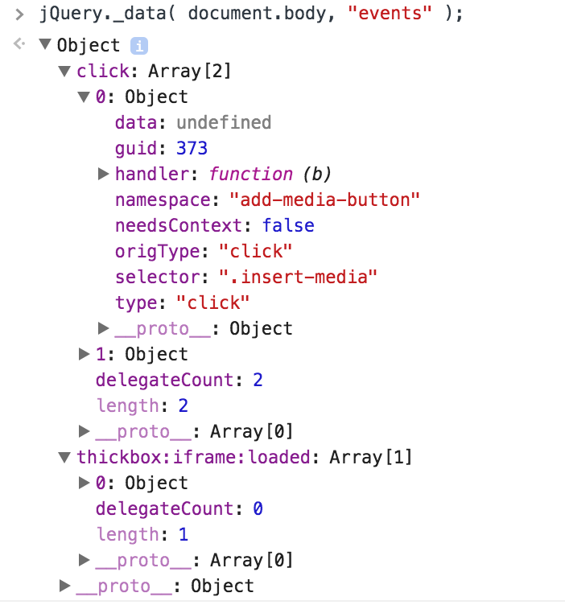
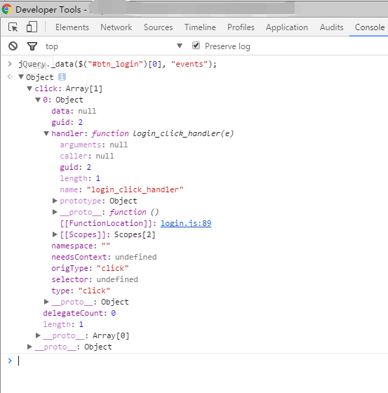

# Inspect jQuery Element Events

Building on top of other tools can be incredibly difficult, especially when you didn't create the other tool and you can't replace that tool.  And when those other tools create loads of event listeners, you sometimes see odd behavior within the page and have no idea what the hell is going on.  Unfortunately a large part of client side coding and library usage comes down to fighting your own tools.

Luckily jQuery allows you inspect events that have been registered to a given element!  
Here's the magic:

	// First argument is the element you want to inspect
	jQuery._data(document.body, "events");

截图如下:

或者是这样的代码:

	// 第一个参数是DOM对象
	// DOM 对象就是 HTML 标签在 JS 执行环境中的包装。
	jQuery._data($("#btn_login")[0], "events");

DOM 元素绑定的事件截图如下:

What's returned is an object whose keys represent the event names and the values are arrays of event handles that have been registered to the element and in the order they were registered.  You can even inspect the function URL location and its contents, then allowing you to see what code is messing with your page.  And then, after you've cursed out the other tool, you can [monkey patch](https://davidwalsh.name/monkey-patching) the problematic function.

Event listeners can really cause debugging misdirection within JavaScript, especially when you aren't an expert with a given framework.  Take the time to learn to leverage as many helper methods as you can -- they will save you hours of frustration.

原文链接: [https://davidwalsh.name/inspect-jquery-events](https://davidwalsh.name/inspect-jquery-events)

