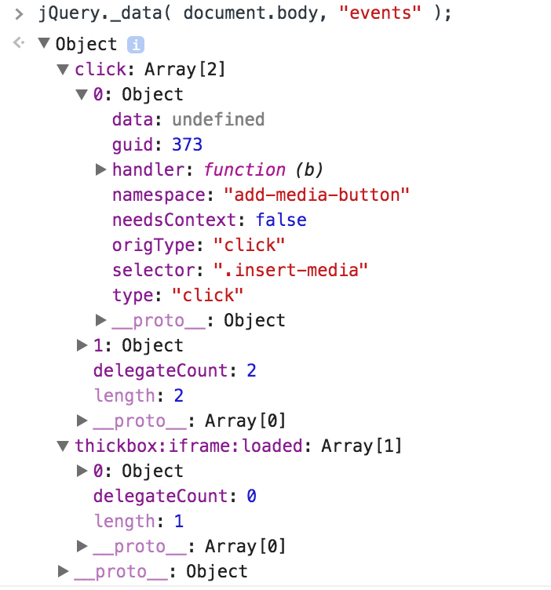
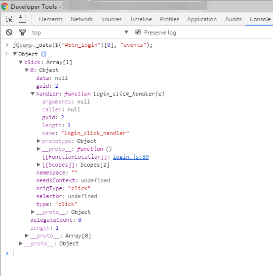

# Inspect jQuery Element Events

# 检查 jQuery 元素事件

Building on top of other tools can be incredibly difficult, especially when you didn't create the other tool and you can't replace that tool.  And when those other tools create loads of event listeners, you sometimes see odd behavior within the page and have no idea what the hell is going on.  Unfortunately a large part of client side coding and library usage comes down to fighting your own tools.

在别人的工具之上做开发可能极其困难，尤其是当这个工具不是你亲手写的、你又无法替换它的时候。而当这些工具创建了大量的事件监听器时，你有时会在页面中看到奇怪的行为，却完全不知道到底发生了什么。遗憾的是，客户端编码和库的使用中，有很大一部分就是在与自己的工具作斗争。

Luckily jQuery allows you inspect events that have been registered to a given element!  
Here's the magic:

幸运的是，jQuery 允许你检查注册到某个元素上的事件！
神奇之处如下：

	// First argument is the element you want to inspect
	jQuery._data(document.body, "events");

截图如下:

或者是这样的代码:

	// 第一个参数是DOM对象
	// DOM 对象就是 HTML 标签在 JS 执行环境中的包装。
	jQuery._data($("#btn_login")[0], "events");

DOM 元素绑定的事件截图如下:

What's returned is an object whose keys represent the event names and the values are arrays of event handles that have been registered to the element and in the order they were registered.  You can even inspect the function URL location and its contents, then allowing you to see what code is messing with your page.  And then, after you've cursed out the other tool, you can [monkey patch](https://davidwalsh.name/monkey-patching) the problematic function.

返回的是一个对象，其键(key)表示事件名，值是注册到该元素上的事件处理函数数组，顺序与注册顺序一致。你甚至可以查看函数的 URL 位置及其内容，从而看到是哪段代码在干扰你的页面。然后，在你痛骂完那个工具之后，就可以对出问题的函数打上 [monkey patch(猴子补丁)](https://davidwalsh.name/monkey-patching)。

Event listeners can really cause debugging misdirection within JavaScript, especially when you aren't an expert with a given framework.  Take the time to learn to leverage as many helper methods as you can -- they will save you hours of frustration.

事件监听器确实会在 JavaScript 中给调试带来误导，尤其是当你对某个框架还不精通的时候。花点时间去学习并使用尽可能多的辅助方法吧——它们能帮你省下数小时的抓狂。

原文链接: [https://davidwalsh.name/inspect-jquery-events](https://davidwalsh.name/inspect-jquery-events)

