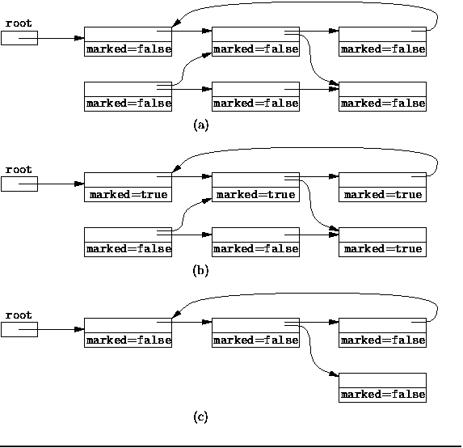

# How garbage collection works in Dalvik VM in android ?

# Dalvik 虚拟机的垃圾收集简介

First of all Garbage Collection on the Dalvik Virtual Machine can be a little more relaxed than other Java implementations because **it does no compacting.** This means that the address of objects on the heap never change after their creation, making the rest of the VM implementation quite a bit simpler.

首先, Dalvik虚拟机比其他Java虚拟机中的垃圾收集要简单一些, 因为**没有进行内存整理(no compacting)**.  也就是说堆内存中的对象在创建之后其地址永远都不会发生改变,  使得虚拟机其余部分的实现变得相对简单。 

So garbage collection **can be triggered when an allocation fails**, when an

而GC会在 **分配失败时触发**,  包括以下情况:

1.  OutOfMemoryError is about to be triggered,
2.  when the size of the heap hits some soft limit, and
3.  when a GC was explicitly requested.

4.  触发 `OutOfMemoryError` 时,
5.  堆内存的大小到达某些软限制时,
6.  显式地请求GC时。

Each of these causes has its own specification indicating whether the GC is a **partial GC**(only free from active heap), **a concurrent GC** (do most of the object marking while other threads running), and whether it is a **preserving GC** (keep soft references).

每种情况都有相应的标准来标识是否是 **partial GC**(部分GC, 只回收 active heap), 是否是 **concurrent GC** (并发GC,  在应用线程运行时执行大部分的对象标记任务),  以及是否是 **preserving GC** (保留GC, 保留软引用)。

Your typical GC is triggered by a soft allocation limit, only freeing on the active heap, concurrent, and preserving. On the other extreme the GC triggered before an OutOfMemoryException is full, synchronous, and non-preserving.

典型的GC是由于内存限制所引起的, 只清理活跃堆,并发型和保留型的GC. 另一种触发GC的原因是 `OutOfMemoryException`, 是同步的,非保留式的(non-preserving)。

The actual GC is done using a **Mark-Sweep algorithm.**

当前(Android 4.x) 使用的是 **Mark-Sweep algorithm**(标记清除)算法。

**Mark-Sweep Algorithm: How it works ?**

**Mark-Sweep Algorithm**(标记-清除算法)的处理过程

The mark-and-sweep algorithm was the first garbage collection algorithm to be developed that is**able to reclaim cyclic data structures.**

标记和清除算法是编程界第一种能够回收 **循环数据结构** 的算法。

When using mark-and-sweep, unreferenced objects are not reclaimed immediately. Instead, garbage is allowed to accumulate until all available memory has been exhausted. When that happens, the execution of the program is suspended temporarily while the mark-and-sweep algorithm collects all the garbage. Once all unreferenced objects have been reclaimed, the normal execution of the program can resume.

使用标记-清除算法时, 未引用的对象不会立刻回收。相反,垃圾可以堆积, 直到耗尽所有可用内存。当内存不足时, 程序被暂停执行, 然后标记-清除算法清理所有的垃圾. 当所有未引用的对象被回收后, 再恢复程序的正常运行。

The mark-and-sweep algorithm is **called a _tracing_ garbage collector** because is _traces out_ the entire collection of objects that are directly or indirectly accessible by the program. The objects that a program can access directly are those objects which are referenced by local variables on the processor stack as well as by any static variables that refer to objects. In the context of garbage collection, these variables are called the _roots_ . An object is indirectly accessible if it is referenced by a field in some other (directly or indirectly) accessible object. An accessible object is said to be _live_ . Conversely, an object which is not _live_ is garbage.

标记-清除算法被称为 ** tracing 垃圾收集器**,  因为其追朔( traces out)** 所有直接或间接被程序访问的对象。 程序可以直接访问的对象包括： 处理器栈上的局部变量引用的对象, 以及静态变量所引用的对象。 在GC的上下文中, 这些变量被称为 GC根(root)。 间接可访问是指由(直接/间接)对象所引用的对象。可访问对象也被称为 存活对象. 相反, 不再存活的对象就是垃圾。

The mark-and-sweep algorithm **consists of two phases**: In the first phase, it finds and marks all accessible objects. The first phase is called the _mark_ phase. In the second phase, the garbage collection algorithm scans through the heap and reclaims all the unmarked objects. The second phase is called the _sweep_ phase.

标记-清除算法分为 **两个阶段**: 

第一阶段,找到所有的可访问对象并标记, 称为 *mark* 阶段。 

第二阶段, 垃圾收集算法扫描整个堆, 并回收所有未标记的对象, 称为_sweep_阶段。

(a) shows the conditions before garbage collection begins. In this example, there is a single root variable

(a) 显示了垃圾收集之前的情况。在此示例中,只有单个 root 变量。

(b) shows the effect of the _mark_ phase of the algorithm. At this point, all live objects have been marked

(b) 显示了 _mark_ 阶段结束时的结果。此时, 所有的存活对象都被标记了。

(c) shows the objects left after the _sweep_ phase has been completed. Only live objects remain in memory and the marked fields have all been set to false again.

(c) 显示了 _sweep_ 阶段完成后留下的对象。只有存活对象留在内存中, 所有对象的 marked 字段再次被设置为false。

当然,到 Android5.0 以后, ART GC 的优化改进了Dalvik 虚拟机的很多性能瓶颈; 详情请参考: [Android 5.0 ART GC 对比 Android 4.x Dalvik GC](http://blog.csdn.net/hello2mao/article/details/42361755)

原文链接: [https://medium.com/@nitinkumargove/how-garbage-collection-works-in-dalvik-vm-in-android-bf781ab48531](https://medium.com/@nitinkumargove/how-garbage-collection-works-in-dalvik-vm-in-android-bf781ab48531)

