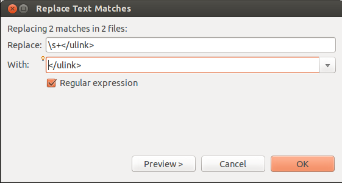
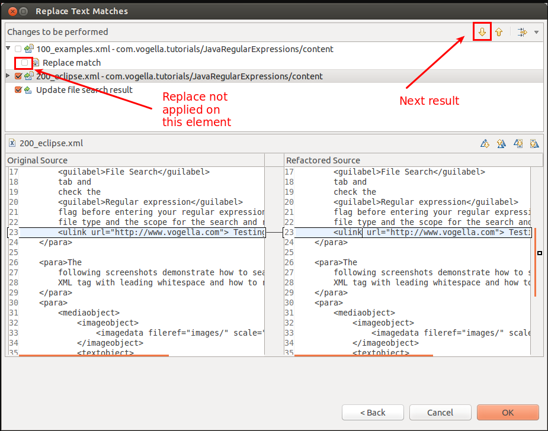

# Java Regex - Tutorial

# Java正则系列: (1)入门教程

> This tutorial introduces the usage of regular expressions and describes their implementation in Java. It also provides several Java regular expression examples.

> 本文简要介绍Java的正则表达式及其实现方式，并通过实例讲解正则表达式的具体用法。

## 1. Regular Expressions

## 1. 正则表达式

### 1.1. What are regular expressions?

### 1.1. 简介

A *regular expression* defines a search pattern for strings. The abbreviation for regular expression is *regex*. The search pattern can be anything from a simple character, a fixed string or a complex expression containing special characters describing the pattern. The pattern defined by the regex may match one or several times or not at all for a given string.

*正则表达式(Regular Expression)*, 简称 *正则*, 也翻译为 *正规式*, 用来表示文本搜索模式。英文缩写是 *regex*(`reg-ex`). 

搜索模式(search pattern)可能多种多样, 如, 单个字符(character), 特定字符串(fixed string), 包含特殊含义的复杂表达式等等. 对于给定的字符串, 正则表达式可能匹配一到多次, 也可能一次都不匹配。

Regular expressions can be used to search, edit and manipulate text.

正则表达式一般用来查找、编辑和替换文本(text), 本质上, text(文本) 和 string(字符串) 是一回事。

The process of analyzing or modifying a text with a regex is called: *The regular expression is applied to the text/string*. The pattern defined by the regex is applied on the text from left to right. Once a source character has been used in a match, it cannot be reused. For example, the regex `aba` will match *ababababa* only two times (aba_aba__).

用正则表达式来分析/修改文本的过程, 称为: *应用于文本/字符串的正则表达式* 。正则表达式扫描字符串的顺序是从左到右. 每个字符都只能被匹配成功一次, 下次匹配扫描就会从后面开始。例如, 正则表达式 `aba`, 匹配字符串 *ababababa* 时, 只会扫描到两个匹配(`aba_aba__`)。

### 1.2. Regex examples

### 1.2. 示例

A simple example for a regular expression is a (literal) string. For example, the *Hello World* regex matches the "Hello World" string. `.` (dot) is another example for a regular expression. A dot matches any single character; it would match, for example, "a" or "1".

最简单的例子是字母串。例如, 正则表达式 `Hello World` 能匹配的就是字符串 "Hello World"。 正则表达式中,  点号 `.`(dot,英文句号)属于通配符, 点号匹配任意一个字符(character); 例如, "a" 或者 "1"; 当然, 默认情况下点号不能匹配换行 `\n`, 需要特殊标识指定才行。

The following tables lists several regular expressions and describes which pattern they would match.

下表列举了一些简单的正则表达式,和对应的匹配模式。


| 正则表达式              | Matches                                  |
| ------------------ | ---------------------------------------- |
| `this is text`     | 完全匹配 "this is text"                      |
| `this\s+is\s+text` | 匹配的内容为: "this", 加上1到多个空白符(whitespace character, 如空格,tab,换行等), 加上 "is", 加上1到多个空白符, 再加上 "text". |
| `^\d+(\.\d+)?`     | 正则表达式以转义字符 `^`(小尖号)打头, 表示这行必须以小尖号后面的字符模式开始, 才会达成匹配. `\d+` 匹配1到多个数字. 英文问号 `?` 表示可以出现 0~1次. `\.` 匹配的是字符 ".", 小括号(parentheses) 表示一个分组. 所以这个正则表达式可以匹配正整数或者小数,如: "5", "66.6" 或者 "5.21" 等等. |

> 说明,中文的全角空格(`　`)字符不属于空白字符(whitespace characters), 可以认为其属于一个特殊的汉字。

### 1.3. Support for regular expressions in programming languages

### 1.3. 编程语言对正则表达式的支持

Regular expressions are supported by most programming languages, e.g., Java, Perl, Groovy, etc. Unfortunately each language supports regular expressions slightly different.

大多数编程语言都支持正则表达式, 如 Java、Perl, Groovy 等等。但各种语言的正则表达式写法略有一些不同。

## 2. Prerequisites

## 2. 预备知识

The following tutorial assumes that you have basic knowledge of the Java programming language.

本教程要求读者具备Java语言相关的基础知识。

Some of the following examples use JUnit to validate the result. You should be able to adjust them in case if you do not want to use JUnit. To learn about JUnit please see [JUnit Tutorial](http://www.vogella.com/tutorials/JUnit/article.html).

下面的一些示例通过 JUnit 来验证执行结果。如果不想使用JUnit, 也可以改写相关代码。关于JUnit的知识请参考 [JUnit教程: http://www.vogella.com/tutorials/JUnit/article.html](http://www.vogella.com/tutorials/JUnit/article.html)。

## 3. Rules of writing regular expressions

## 3. 语法规则

The following description is an overview of available meta characters which can be used in regular expressions. This chapter is supposed to be a references for the different regex elements.

本章介绍各种正则元素的范本, 我们会先介绍什么是元字符(meta character)。

### 3.1. Common matching symbols

### 3.1. 通用表达式简介


| 正则表达式       | 说明                                       |
| ----------- | ---------------------------------------- |
| `.`         | 点号(`.`), 匹配任意一个字符                        |
| `^regex`    | 小尖号(`^`), 起始标识, 前面不能出现其他字符.              |
| `regex$`    | 美元符号(`$`,dollar,美刀), 结束标识,后面不能再出现其他字符.   |
| `[abc]`     | 字符集合(set), 匹配 a 或 b 或 c.                 |
| `[abc][vz]` | 字符集合(set), 匹配 a 或 b 或 c,紧接着是 v 或 z.      |
| `[^abc]`    | 如果小尖号(`^`, caret, 此处读作 `非`) 出现在中括号里面的第一位, 则表示否定(negate). 这里匹配: 除 `a`, `b`, `c` 之外的其他任意字符. |
| `[a-d1-7]`  | 范围表示法: 匹配 `a` 到 `d` 之间的单个字符, 或者 `1` 到 `7`之间的单个字符, 整体只匹配单个字符, 而不是 `d1` 这种组合. |
| X\|Z        | 匹配 `X` 或者 `Z`.                           |
| `XZ`        | 匹配`XZ`, X和Z必须按顺序全部出现.                    |
| `$`         | 判断一行是否结束.                                |

### 3.2. Meta characters

### 3.2. 元字符

The following meta characters have a pre-defined meaning and make certain common patterns easier to use, e.g., `\d` instead of `[0..9]`.

下面这些是预定义的元字符(Meta characters), 可用于提取通用模式, 如 `\d` 可以代替 `[0-9]`, 或者`[0123456789]`。


| 正则表达式 | 说明                                       |
| ----- | ---------------------------------------- |
| `\d`  | 单个数字, 等价于 `[0-9]` 但更简洁                   |
| `\D`  | 非数字, 等价于  `[^0-9]` 但更简洁                  |
| `\s`  | 空白字符(whitespace), 等价于 `[ \t\n\x0b\r\f]`  |
| `\S`  | 非空白字符, 等价于 `[^\s]`                       |
| `\w`  | 反斜线加上小写w, 表示单个标识符,即字母数字下划线, 等价于 `[a-zA-Z_0-9]` |
| `\W`  | 非单词字符, 等价于 `[^\w]`                       |
| `\S+` | 匹配1到多个非空白字符                              |
| `\b`  | 匹配单词外边界(word boundary), 单词字符指的是 `[a-zA-Z0-9_]` |


> These meta characters have the same first letter as their representation, e.g., digit, space, word, and boundary. Uppercase symbols define the opposite. 

> 这些元字符主要取自于对应单词的英文首字母, 例如: digit(数字), space(空白), word (单词), 以及 boundary(边界)。对应的大写字符则用来表示取反。

### 3.3. Quantifier

### 3.3. 量词

A quantifier defines how often an element can occur. The symbols ?, *, + and {} define the quantity of the regular expressions

量词(Quantifier)用来指定某个元素可以出现的次数。`?`, `*`, `+` 和 `{}` 等符号定义了正则表达式的数量。


| 正则表达式    | 说明                                       | 示例                                 |
| -------- | ---------------------------------------- | ---------------------------------- |
| `*`      | 0到多次, 等价于 `{0,}`                         | `X*` 匹配0到多个连续的X,  `.*` 则匹配任意字符串    |
| `+`      | 1到多次, 等价于 `{1,}`                         | `X+` 匹配1到多个连续的X                    |
| `?`      | 0到1次, 等价于 `{0,1}`                        | `X?` 匹配0个,后者1个X                    |
| `{n}`    | 精确匹配 n 次 `{}` 前面序列出现的次数                  | `\d{3}` 匹配3位数字, `.{10}` 匹配任意10个字符. |
| `{m, n}` | 出现 m 到 n 次,                              | `\d{1,4}` 匹配至少1位数字,至多4位数字.         |
| `*?`     | 在量词后面加上 `?`, 表示懒惰模式(*reluctant quantifier*). 从左到右慢慢扫描, 找到第一个满足正则表达式的地方就暂停搜索, 用来尝试匹配最少的字符串. |                                    |


### 3.4. Grouping and back reference

### 3.4. 分组和引用

You can group parts of your regular expression. In your pattern you group elements with round brackets, e.g., `()`. This allows you to assign a repetition operator to a complete group.

可以对正则表达式进行分组(Grouping), 用圆括号 `()` 括起来。这样就可以对括号内的整体使用量词。

In addition these groups also create a back reference to the part of the regular expression. This captures the group. A back reference stores the part of the `String` which matched the group. This allows you to use this part in the replacement.

当然, 在进行替换的时候, 还可以对分组进行引用。也就是捕获组(captures the group)。向后引用(back reference) 指向匹配中该分组所对应的字符串。进行替换时可以通过 $ 来引用。

Via the `$` you can refer to a group. `$1` is the first group, `$2` the second, etc.

使用 `$` 来引用一个捕获组。例如 `$1` 表示第一组, `$2` 表示第二组, 以此类推, `$0`则表示整个正则所匹配的部分。

Let’s, for example, assume you want to replace all whitespace between a letter followed by a point or a comma. This would involve that the point or the comma is part of the pattern. Still it should be included in the result.

例如, 想要去掉单词后面, 句号/逗号(point or comma)前面的空格。可以把句号/逗号写入正则中, 然后原样输出到结果中即可。

```
// 去除单词与 `.|,` 之间的空格
String pattern = "(\\w)(\\s+)([\\.,])";
System.out.println(EXAMPLE_TEST.replaceAll(pattern, "$1$3"));
```


This example extracts the text between a title tag.

提取 <title> 标签的内容:

```
// 提取 <title> 标签的内容
pattern = "(?i)(<title.*?>)(.+?)()";
String updated = EXAMPLE_TEST.replaceAll(pattern, "$2");
```


### 3.5. Negative look ahead

### 3.5. 环视否定

Negative look ahead provides the possibility to exclude a pattern. With this you can say that a string should not be followed by another string.

环视否定(Negative look ahead), 又叫零宽度断言, 用于在匹配的同时, 排除掉某些情形。也就是说前面/后面不能是符合某种特征的字符串。

Negative look ahead are defined via `(?!pattern)`. For example, the following will match "a" if "a" is not followed by "b".

环视否定(Negative look ahead) 使用 `(?!pattern)` 这种格式定义。例如, 下面的正则, 只匹配后面不是 b 字母的 "a" 字母。

```
a(?!b)
```

类似的, 只匹配a字母, 但要求后面只能是 b 字母, 否则这个 a 就不符合需要:

```
a(?=b)
```

> 注意，**环视** 是一种向前/后查找的语法(也叫顺序环视): `(?=exp)`, 会查找前/后【位置】的 exp; 所环视的内容却不包含在正则表达式匹配中。
>
> 环视(look ahead)是一种高级技巧, 环视的部分不会匹配到结果之中, 但却要求匹配的字符串前面/后面具备环视部分的特征。
>
> 如果将等号换成感叹号, 就是环视否定 `(?!exp)`, 变成否定语义，也就是说查找的位置的前面/后面不能是exp。
>
> 参考: 利用正则表达式排除特定字符串 <http://www.cnblogs.com/wangqiguo/archive/2012/05/08/2486548.html>


### 3.6. Specifying modes inside the regular expression

### 3.6. 正则表达式的模式

You can add the mode modifiers to the start of the regex. To specify multiple modes, simply put them together as in (?ismx).

在正则表达式开头可以指定模式修饰符(mode modifier)。还可以组合多种模式, 如 `(?is)pattern`。

- (?i) makes the regex case insensitive.

- (?s) for "single line mode" makes the dot match all characters, including line breaks.

- (?m) for "multi-line mode" makes the caret and dollar match at the start and end of each line in the subject string.

  ​

- `(?i)` 正则表达式匹配时不区分大小写。

- `(?s)` 单行模式(single line mode), 使点号(`.`) 匹配所有字符, 包括换行(`\n`)。

- `(?m)` 多行模式(multi-line mode),  使 小尖号(`^`,caret) 和 美元符号(`$`, dollar) 匹配目标字符串中每一行的开始和结束。


### 3.7. Backslashes in Java

### 3.7. Java中的反斜杠

The backslash `\` is an escape character in Java Strings. That means backslash has a predefined meaning in Java. You have to use double backslash `\\` to define a single backslash. If you want to define `\w`, then you must be using `\\w` in your regex. If you want to use backslash as a literal, you have to type `\\\\` as `\` is also an escape character in regular expressions.

在Java字符串中, 反斜杠(`\`, backslash) 是转义字符, 有内置的含义。在源代码级别, 需要使用两个反斜杠`\\`来表示一个反斜杠字符。如果想定义的正则表达式是 `\w`, 在 `.java` 文件源码中就需要写成 `\\w`。 如果想要匹配文本中的1个反斜杠, 则源码中需要写4个反斜杠 `\\\\`。


## 4. Using regular expressions with String methods

## 4. String类正则相关的方法

### 4.1. Redefined methods on String for processing regular expressions

### 4.1. String 类重新定义了正则相关的方法

`Strings` in Java have built-in support for regular expressions. `Strings` have four built-in methods for regular expressions, i.e., the `matches()`, `split())`, `replaceFirst()` and`replaceAll()` methods. The `replace()` method does NOT support regular expressions.

Java中 `String` 类内置了4个支持正则的方法, 即: `matches()`, `split()`, `replaceFirst()` 和`replaceAll()` 方法。 需要注意, `replace()` 是纯字符串替换, 不支持正则表达式。

These methods are not optimized for performance. We will later use classes which are optimized for performance.

这些方法并没有对性能进行优化。稍后我们将讨论优化过的类。


| 方法                                       | 说明                                       |
| ---------------------------------------- | ---------------------------------------- |
| `s.matches("regex")`                     | 判断字符串 s 是否能匹配正则  `"regex"`.  只有整个字符串匹配正则才返回 `true` . |
| `s.split("regex")`                       | 用正则表达式 `"regex"` 作为分隔符来拆分字符串, 返回结果是 String[] 数组. 注意 `"regex"` 对应的分隔符并不包含在返回结果中. |
| `s.replaceFirst("regex", "replacement"`) | 替换第一个匹配 `"regex"` 的内容为 `"replacement`.   |
| `s.replaceAll("regex", "replacement")`   | 将所有匹配  `"regex"` 的内容替换为 `"replacement`.  |

Create for the following example the Java project `de.vogella.regex.test`.

下面是对应的示例。


```
package de.vogella.regex.test;

public class RegexTestStrings {
        public static final String EXAMPLE_TEST = "This is my small example "
                        + "string which I'm going to " + "use for pattern matching.";

        public static void main(String[] args) {
                System.out.println(EXAMPLE_TEST.matches("\\w.*"));
                String[] splitString = (EXAMPLE_TEST.split("\\s+"));
                System.out.println(splitString.length);// should be 14
                for (String string : splitString) {
                        System.out.println(string);
                }
                // 将所有空白符(whitespace) 替换为 tab
                System.out.println(EXAMPLE_TEST.replaceAll("\\s+", "\t"));
        }
}
```

### 4.2. Examples

### 4.2. 示例


> The following class gives several examples for the usage of
> regular expressions with strings. See the comment for the purpose.

> 下面给出一些正则表达式的使用示例。请参照注释信息。

If you want to test these examples, create for the Java project `de.vogella.regex.string`.

如果想测试这些示例, 请将java文件放到一个Java包下, 如 `de.vogella.regex.string`。


```
package de.vogella.regex.string;

public class StringMatcher {
        // 如果字符串完全匹配  "`true`", 则返回 true
        public boolean isTrue(String s){
                return s.matches("true");
        }
        // 如果字符串完全匹配  "`true`" 或 "`True`", 则返回 true
        public boolean isTrueVersion2(String s){
                return s.matches("[tT]rue");
        }

        // 如果字符串完全匹配  "`true`" 或 "`True`"
        // 或 "`yes`" 或 "`Yes`", 则返回 true
        public boolean isTrueOrYes(String s){
                return s.matches("[tT]rue|[yY]es");
        }

        // 如果包含字符串 "`true`", 则返回 true
        public boolean containsTrue(String s){
                return s.matches(".*true.*");
        }

        // 如果包含3个字母, 则返回 true
        public boolean isThreeLetters(String s){
                return s.matches("[a-zA-Z]{3}");
                // 当然也等价于下面这种比较土的方式
		// return s.matches("[a-Z][a-Z][a-Z]");
        }

        // 如果不以数字开头, 则返回 true
        public boolean isNoNumberAtBeginning(String s){
		// 可能 "^\\D.*" 更好一点
                return s.matches("^[^\\d].*");
        }
        // 如果包含了 `b` 之外的字符, 则返回 true
        public boolean isIntersection(String s){
                return s.matches("([\\w&&[^b]])*");
        }
        // 如果包含的某串数字小于300, 则返回 true
        public boolean isLessThenThreeHundred(String s){
                return s.matches("[^0-9]*[12]?[0-9]{1,2}[^0-9]*");
        }

}
```

And a small JUnit Test to validates the examples.

我们通过 JUnit 测试来验证。


```
package de.vogella.regex.string;

import org.junit.Before;
import org.junit.Test;

import static org.junit.Assert.assertFalse;
import static org.junit.Assert.assertTrue;

public class StringMatcherTest {
        private StringMatcher m;

        @Before
        public void setup(){
                m = new StringMatcher();
        }

        @Test
        public void testIsTrue() {
                assertTrue(m.isTrue("true"));
                assertFalse(m.isTrue("true2"));
                assertFalse(m.isTrue("True"));
        }

        @Test
        public void testIsTrueVersion2() {
                assertTrue(m.isTrueVersion2("true"));
                assertFalse(m.isTrueVersion2("true2"));
                assertTrue(m.isTrueVersion2("True"));;
        }

        @Test
        public void testIsTrueOrYes() {
                assertTrue(m.isTrueOrYes("true"));
                assertTrue(m.isTrueOrYes("yes"));
                assertTrue(m.isTrueOrYes("Yes"));
                assertFalse(m.isTrueOrYes("no"));
        }

        @Test
        public void testContainsTrue() {
                assertTrue(m.containsTrue("thetruewithin"));
        }

        @Test
        public void testIsThreeLetters() {
                assertTrue(m.isThreeLetters("abc"));
                assertFalse(m.isThreeLetters("abcd"));
        }

        @Test
        public void testisNoNumberAtBeginning() {
                assertTrue(m.isNoNumberAtBeginning("abc"));
                assertFalse(m.isNoNumberAtBeginning("1abcd"));
                assertTrue(m.isNoNumberAtBeginning("a1bcd"));
                assertTrue(m.isNoNumberAtBeginning("asdfdsf"));
        }

        @Test
        public void testisIntersection() {
                assertTrue(m.isIntersection("1"));
                assertFalse(m.isIntersection("abcksdfkdskfsdfdsf"));
                assertTrue(m.isIntersection("skdskfjsmcnxmvjwque484242"));
        }

        @Test
        public void testLessThenThreeHundred() {
                assertTrue(m.isLessThenThreeHundred("288"));
                assertFalse(m.isLessThenThreeHundred("3288"));
                assertFalse(m.isLessThenThreeHundred("328 8"));
                assertTrue(m.isLessThenThreeHundred("1"));
                assertTrue(m.isLessThenThreeHundred("99"));
                assertFalse(m.isLessThenThreeHundred("300"));
        }

}
```

## 5. Pattern and Matcher

## 5. Pattern与Matcher简介

For advanced regular expressions the `java.util.regex.Pattern` and `java.util.regex.Matcher` classes are used.

要支持正则表达式的高级特性, 需要借助 `java.util.regex.Pattern` 和 `java.util.regex.Matcher` 类。

You first create a `Pattern` object which defines the regular expression. This `Pattern` object allows you to create a `Matcher` object for a given string. This `Matcher` object then allows you to do regex operations on a `String`.

首先创建/编译 `Pattern` 对象, 用来定义正则表达式。对 `Pattern` 对象, 给定一个字符串, 则产生一个对应的 `Matcher` 对象。通过 `Matcher` 对象就可以对 `String` 进行各种正则相关的操作。


```
package de.vogella.regex.test;

import java.util.regex.Matcher;
import java.util.regex.Pattern;

public class RegexTestPatternMatcher {
        public static final String EXAMPLE_TEST = "This is my small example string which I'm going to use for pattern matching.";

        public static void main(String[] args) {
                Pattern pattern = Pattern.compile("\\w+");
                // 如需忽略大小写, 可以使用:
                // Pattern pattern = Pattern.compile("\\w+", Pattern.CASE_INSENSITIVE);
                Matcher matcher = pattern.matcher(EXAMPLE_TEST);
                // 查找所有匹配的结果
                while (matcher.find()) {
                        System.out.print("Start index: " + matcher.start());
                        System.out.print(" End index: " + matcher.end() + " ");
                        System.out.println(matcher.group());
                }
                // 将空格替换为 tabs
                Pattern replace = Pattern.compile("\\s+");
                Matcher matcher2 = replace.matcher(EXAMPLE_TEST);
                System.out.println(matcher2.replaceAll("\t"));
        }
}
```

## 6. Java Regex Examples

## 6. 正则表达式示例

The following lists typical examples for the usage of regular expressions. I hope you find similarities to your real-world problems.

下面列出了常用的正则表达式使用情景。希望读者根据实际情况进行适当的调整。

### 6.1. Or

### 6.1 或运算(Or)

Task: Write a regular expression which matches a text line if this text line contains either the word "Joe" or the word "Jim" or both.

任务: 编写正则表达式, 用来匹配包含单词 "Joe" 或者 "Jim" , 或者两者都包含的行。

Create a project `de.vogella.regex.eitheror` and the following class.

创建 `de.vogella.regex.eitheror` 包和下面的类。


```
package de.vogella.regex.eitheror;

import org.junit.Test;

import static org.junit.Assert.assertFalse;
import static org.junit.Assert.assertTrue;

public class EitherOrCheck {
        @Test
        public void testSimpleTrue() {
                String s = "humbapumpa jim";
                assertTrue(s.matches(".*(jim|joe).*"));
                s = "humbapumpa jom";
                assertFalse(s.matches(".*(jim|joe).*"));
                s = "humbaPumpa joe";
                assertTrue(s.matches(".*(jim|joe).*"));
                s = "humbapumpa joe jim";
                assertTrue(s.matches(".*(jim|joe).*"));
        }
}
```

### 6.2. Phone number

### 6.2. 匹配电话号码

Task: Write a regular expression which matches any phone number.

任务: 编写正则表达式, 匹配各种电话号码。

A phone number in this example consists either out of 7 numbers in a row or out of 3 number, a (white)space or a dash and then 4 numbers.

假设电话号码(Phone number)的格式为 "7位连续的数字"; 或者是 "3位数字加空格/横线, 再加上4位数字"。


```
package de.vogella.regex.phonenumber;

import org.junit.Test;

import static org.junit.Assert.assertFalse;
import static org.junit.Assert.assertTrue;


public class CheckPhone {

        @Test
        public void testSimpleTrue() {
                String pattern = "\\d\\d\\d([,\\s])?\\d\\d\\d\\d";
                String s= "1233323322";
                assertFalse(s.matches(pattern));
                s = "1233323";
                assertTrue(s.matches(pattern));
                s = "123 3323";
                assertTrue(s.matches(pattern));
        }
}
```

### 6.3. Check for a certain number range

### 6.3. 判断特定数字范围

The following example will check if a text contains a number with 3 digits.

以下示例用来判断文本中是否具有连续的3位数字。

Create the Java project `de.vogella.regex.numbermatch` and the following class.

创建 `de.vogella.regex.numbermatch` 包和下面的类。


```
package de.vogella.regex.numbermatch;
import java.util.regex.Matcher;
import java.util.regex.Pattern;

import org.junit.Test;

import static org.junit.Assert.assertFalse;
import static org.junit.Assert.assertTrue;

public class CheckNumber {


        @Test
        public void testSimpleTrue() {
                String s= "1233";
                assertTrue(test(s));
                s= "0";
                assertFalse(test(s));
                s = "29 Kasdkf 2300 Kdsdf";
                assertTrue(test(s));
                s = "99900234";
                assertTrue(test(s));
        }

        public static boolean test (String s){
                Pattern pattern = Pattern.compile("\\d{3}");
                Matcher matcher = pattern.matcher(s);
                if (matcher.find()){
                        return true;
                }
                return false;
        }

}
```

### 6.4. Building a link checker

### 6.4. 校验超链接

The following example allows you to extract all valid links from a webpage. It does not consider links which start with "javascript:" or "mailto:".

假设需要从网页中找出所有的有效链接。当然,需要排除 "javascript:" 和 "mailto:" 开头的情况。

Create a Java project called *de.vogella.regex.weblinks* and the following class:

创建 *de.vogella.regex.weblinks* 包, 以及下面的类:


```
package de.vogella.regex.weblinks;

import java.io.BufferedReader;
import java.io.IOException;
import java.io.InputStreamReader;
import java.net.MalformedURLException;
import java.net.URL;
import java.util.ArrayList;
import java.util.List;
import java.util.regex.Matcher;
import java.util.regex.Pattern;

public class LinkGetter {
        private Pattern htmltag;
        private Pattern link;

        public LinkGetter() {
                htmltag = Pattern.compile("<a\\b[^>]*href=\"[^>]*>(.*?)</a>");
                link = Pattern.compile("href=\"[^>]*\">");
        }

        public List<String> getLinks(String url) {
                List<String> links = new ArrayList<String>();
                try {
                        BufferedReader bufferedReader = new BufferedReader(
                                        new InputStreamReader(new URL(url).openStream()));
                        String s;
                        StringBuilder builder = new StringBuilder();
                        while ((s = bufferedReader.readLine()) != null) {
                                builder.append(s);
                        }

                        Matcher tagmatch = htmltag.matcher(builder.toString());
                        while (tagmatch.find()) {
                                Matcher matcher = link.matcher(tagmatch.group());
                                matcher.find();
                                String link = matcher.group().replaceFirst("href=\"", "")
                                                .replaceFirst("\">", "")
                                                .replaceFirst("\"[\\s]?target=\"[a-zA-Z_0-9]*", "");
                                if (valid(link)) {
                                        links.add(makeAbsolute(url, link));
                                }
                        }
                } catch (MalformedURLException e) {
                        e.printStackTrace();
                } catch (IOException e) {
                        e.printStackTrace();
                }
                return links;
        }

        private boolean valid(String s) {
                if (s.matches("javascript:.*|mailto:.*")) {
                        return false;
                }
                return true;
        }

        private String makeAbsolute(String url, String link) {
                if (link.matches("http://.*")) {
                        return link;
                }
                if (link.matches("/.*") && url.matches(".*$[^/]")) {
                        return url + "/" + link;
                }
                if (link.matches("[^/].*") && url.matches(".*[^/]")) {
                        return url + "/" + link;
                }
                if (link.matches("/.*") && url.matches(".*[/]")) {
                        return url + link;
                }
                if (link.matches("/.*") && url.matches(".*[^/]")) {
                        return url + link;
                }
                throw new RuntimeException("Cannot make the link absolute. Url: " + url
                  + " Link " + link);
        }
}
```

### 6.5. Finding duplicated words

### 6.5. 查找重复的单词

The following regular expression matches duplicated words.

下面的正则表达式用来匹配重复的单词。

```
\b(\w+)\s+\1\b
```


`\b` is a word boundary and `\1` references to the captured match of the first group, i.e., the first word.

`\b` 是单词边界, `\1` 则引用第一个分组, 此处的第一个分组为前一个单词 `(\w+)`。

The `(?!-in)\b(\w+) \1\b` finds duplicate words if they do not start with "-in".

`(?!-in)\b(\w+) \1\b` 通过环视否定, 来匹配前面不是 "`-in`" 开始的重复单词。

TIP:Add `(?s)` to search across multiple lines.

提示: 可以在最前面加上 `(?s)` 标志来执行跨行搜索。

### 6.6. Finding elements which start in a new line

### 6.6. 查找每行起始位置的元素

The following regular expression allows you to find the "title" word, in case it starts in a new line, potentially with leading spaces.

下面的正则, 用来查找一行开头的单词 "title", 前面允许有空格。

```
(\n\s*)title
```


### 6.7. Finding (Non-Javadoc) statements

### 6.7. 找到非Javadoc风格的语句

Sometimes (Non-Javadoc) are used in Java source code to indicate that the method overrides a super method. As of Java 1.6 this can be done via the `@Override` annotation and it is possible to remove these statements from your code. The following regular expression can be used to identify these statements.

有时候, 在Java代码中会出现非Javadoc风格(Non-Javadoc)的语句; 如 Java 1.6 中的 `@Override`  注解, 用于告诉IDE该方法覆写了超类方法。这种是可以从源码中清除的。下面的正则用来找出这类注解。

```
(?s) /\* \(non-Javadoc\).*?\*/
```


#### 6.7.1. Replacing the DocBook table statement with Asciidoc

#### 6.7.1. 用 Asciidoc 替换 DocBook 声明

You can replace statements like the following:

例如有下面这样的XML:

```
<programlisting language="java">
        <xi:include xmlns:xi="http://www.w3.org/2001/XInclude" parse="text" href="./examples/statements/MyClass.java" />
</programlisting>
```


Corresponding regex:

可以用下面的正则来匹配:

```
`\s+<programlisting language="java">\R.\s+<xi:include xmlns:xi="http://www\.w3\.org/2001/XInclude" parse="text" href="\./examples/(.*).\s+/>\R.\s+</programlisting>`
```


Target could be your example:

替换目标可以是下面这样的regex:


```
`\R[source,java]\R----\R include::res/$1[]\R----
```

## 7. Processing regular expressions in Eclipse

## 7. 在Eclipse中使用正则表达式

The Eclipse IDE allows to perform search and replace across a set of files using regular expressions. In Eclipse use the Ctrl+H shortcut to open the *Search* dialog.

在Eclipse或者其他编辑器中, 可以使用正则来执行查找和替换。一般使用快捷键 `Ctrl+H` 打开 **搜索/Search** 对话框。

Select the *File Search* tab and check the *Regular expression* flag before entering your regular expression. You can also specify the file type and the scope for the search and replace operation.

选择 *File Search* 选项卡, 并勾选 *Regular expression* 标识, 则可以进行正则查找/替换。当然, 还可以指定文件类型, 以及查找/替换的目录范围。

The following screenshots demonstrate how to search for the <![CDATA[]]]> XML tag with leading whitespace and how to remove the whitespace.

下图展示了如何查找XML标签 `<![CDATA[]]]>` 和前面的空格, 以及如何去除这些空格。





The resulting dialog allows you to review the changes and remove elements which should not be replaced. If you press the `OK` button, the changes are applied.

在结果对话框中可以查看有哪些地方会被替换, 可以去掉不想替换的元素。没问题的话, 点击 `OK` 按钮, 就会进行替换。




## 8. Links and Literature

## 8. 相关链接

- 示例代码下载: <http://www.vogella.com/code/index.html>
- [Regular-Expressions.info on Using Regular Expressions in Java](http://www.regular-expressions.info/java.html)
- [Regulare xpressions examples](http://www.regular-expressions.info/examples.html)
- [The Java Tutorials: Lesson: Regular Expressions](http://docs.oracle.com/javase/tutorial/essential/regex/)


原文链接: <http://www.vogella.com/tutorials/JavaRegularExpressions/article.html>

原文日期: 2016.06.24

翻译日期: 2017-12-28

翻译人员: [铁锚 http://blog.csdn.net/renfufei/](http://blog.csdn.net/renfufei/)


