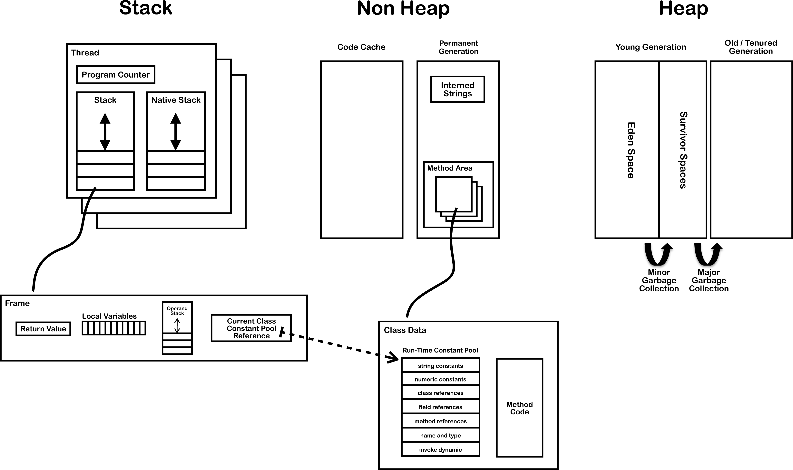
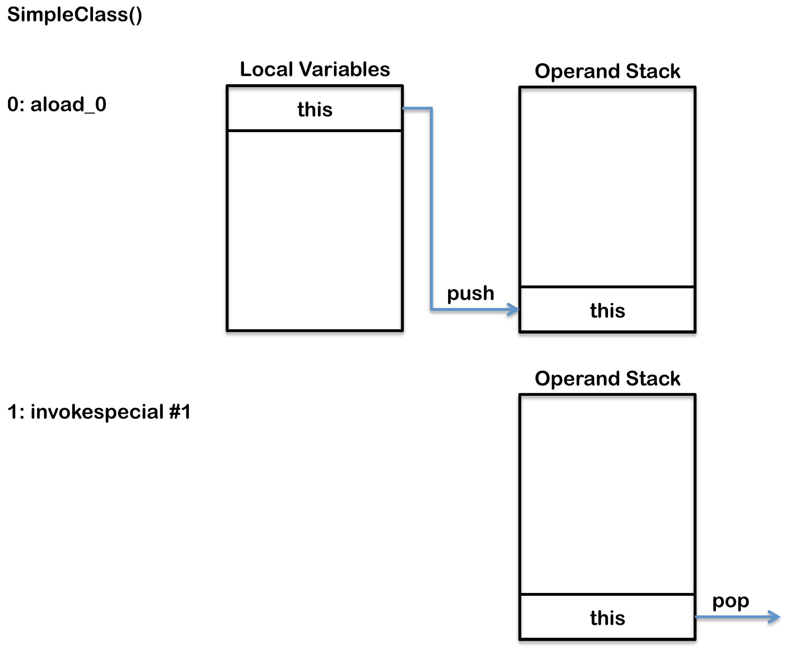
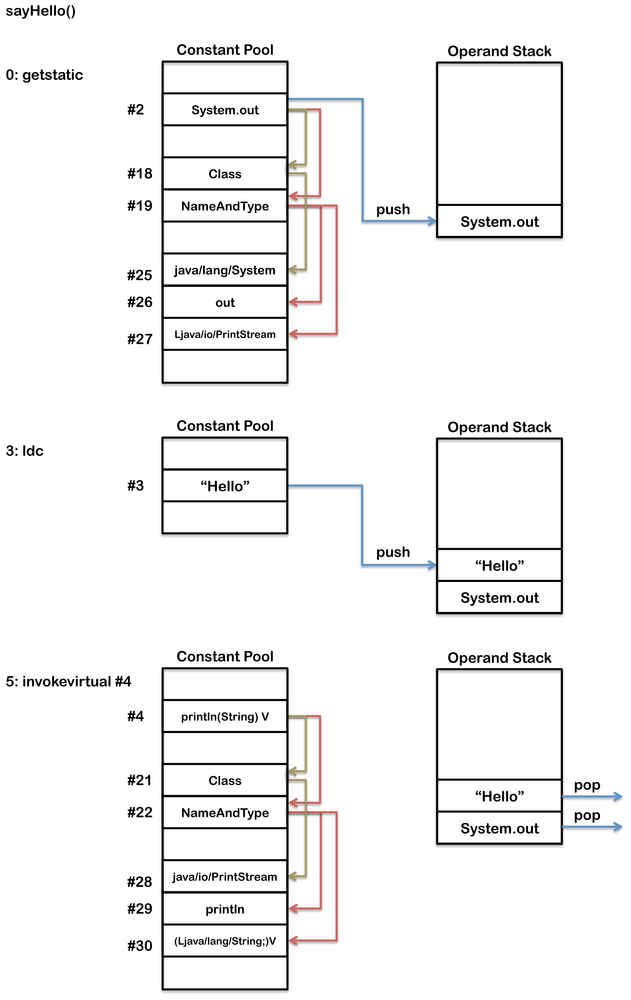
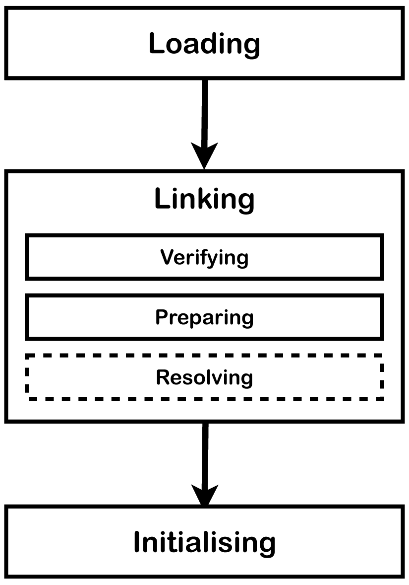
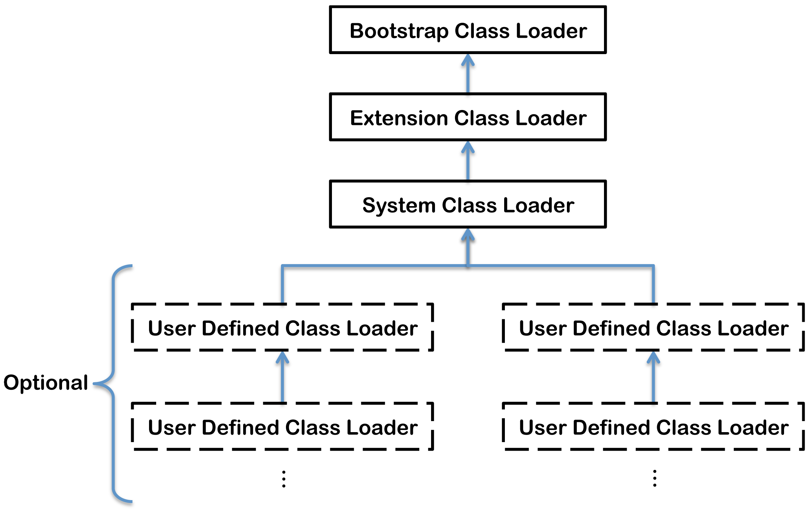

# JVM Internals

# JVM内部结构详解


This article explains the internal architecture of the Java Virtual Machine (JVM).  The following diagram show the key internal components of a typical JVM that conforms to [The Java Virtual Machine Specification Java SE 7 Edition](http://www.amazon.co.uk/Virtual-Machine-Specification-Edition-Series/dp/0133260445).

本文详细介绍Java虚拟机(JVM)的内部结构. 下图展示了符合 [Java虚拟机规范第7版](http://www.amazon.co.uk/Virtual-Machine-Specification-Edition-Series/dp/0133260445) 的JVM核心组件。




The components shown on this diagram are each explained below in two sections.  [First section](#threads) covers the components that are created for each thread and the [second section](#shared_between_threads) covers the components that are created independently of threads.

这些组件分为两节进行介绍. 第一个部分是为每个线程创建的组件, 第二部分是所有线程共同使用的组件, 这些组件独立于线程。

* [Threads,线程](#threads)
  *   [JVM System Threads,JVM系统线程](#jvm_system_threads)
  *   [Per Thread,单个线程的结构](#per_thread)
  *   [program Counter (PC,程序计数器)](#program_counter)
  *   [Stack,栈](#stack)
  *   [Native Stack,本地线程栈](#native_stack)
  *   [Stack Restrictions,栈限制](#stack_restrictions)
  *   [Frame,栈帧](#frame)
  *   [Local Variables Array,局部变量数组](#local_variables_array)
  *   [Operand Stack,操作数栈](#operand_stack)
  *   [Dynamic Linking,动态链接](#dynamic_linking)
* [Shared Between Threads,所有线程共用](#shared_between_threads)
  * [Heap,堆内存](#heap)
  * [Memory Management,内存管理](#memory_management)
  * [Non-Heap Memory,堆外内存](#non_heap_memory)
  * [Just In Time Compilation (JIT编译) ](#jit_compilation)
  * [Method Area,方法区](#method_area)
  * [Class File Structure,类文件结构](#class_file_structure)
  * [Classloader,类加载器](#classloader)
  * [Faster Class Loading, 快速类加载](#faster_class_loading)
  * [Where Is The Method Area,方法区的位置](#where_is_the_method_area)
  * [Classloader Reference,类加载器引用](#classloader_reference)
  * [Run Time Constant Pool,运行时常量池](#constant_pool)
  * [Exception Table,异常表](#exception_table)
  * [Symbol Table符号表](#symbol_table)
  * [Interned Strings,内联字符串 (String Table,字符串表)](#string_table)


## Thread

## 线程

A thread is a thread of execution in a program. The JVM allows an application to have multiple threads of execution running concurrently.  In the Hotspot JVM there is a direct mapping between a Java Thread and a native operating system Thread.  After preparing all of the state for a Java thread such as thread-local storage, allocation buffers, synchronization objects, stacks and the program counter, the native thread is created.  The native thread is reclaimed once the Java thread terminates.  The operating system is therefore responsible for scheduling all threads and dispatching them to any available CPU.  Once the native thread has initialized it invokes the run() method in the Java thread.  When the run() method returns, uncaught exceptions are handled, then the native thread confirms if the JVM needs to be terminated as a result of the thread terminating (i.e. is it the last non-deamon thread).  When the thread terminates all resources for both the native and Java thread are released.

一个线程是一个线程的执行计划。JVM允许应用程序同时运行多个线程的执行.Hotspot JVM之间有一个直接映射的Java线程和一个本地操作系统线程.在准备所有的Java线程比如线程本地存储、分配缓冲区,同步对象,栈和程序计数器,本机线程被创建.本机线程回收一次Java线程终止。操作系统是负责所有线程调度和分派他们任何可用的CPU.一旦本机线程初始化它调用run()方法的Java线程.run()方法返回时,未捕获的异常处理,那么本地线程证实如果JVM需要终止的线程终止(即.这是最后一个non-deamon线程)。在线程终止时所有资源为本地和Java线程被释放。

### JVM System Threads

### JVM系统线程

If you use jconsole or any debugger it is possible to see there are numerous threads running in the background.  These background threads run in addition to the main thread, which is created as part of invoking `public static void main(String[])`, and any threads created by the main thread.  The main background system threads in the Hotspot JVM are:

如果你使用jconsole或任何调试器可以看到有许多线程在后台运行.这些后台线程运行在主线程之外,这是创建调用的一部分`public static void main(String[])`,任何线程由主线程。主要的背景系统Hotspot JVM中的线程:

* VM thread
  This thread waits for operations to appear that require the JVM to reach a safe-point.  The reason these operations have to happen on a separate thread is because they all require the JVM to be at a safe point where modifications to the heap can not occur.  The type of operations performed by this thread are "stop-the-world" garbage collections, thread stack dumps, thread suspension and biased locking revocation.
* Periodic task thread
  This thread is responsible for timer events (i.e. interrupts) that are used to schedule execution of periodic operations
* GC threads
  These threads support the different types of garbage collection activities that occur in the JVM
* Compiler threads
  These threads compile byte code to native code at runtime
* Signal dispatcher thread
  This thread receives signals sent to the JVM process and handle them inside the JVM by calling the appropriate JVM methods.

* VM线程
这个线程等待操作出现要求JVM到达安全点.原因这些操作发生在一个单独的线程,因为他们都需要在一个安全的地方JVM堆修改不能发生.这个线程执行的操作的类型是“停止一切”的垃圾收集,线程堆栈转储,线程暂停,偏向锁撤销。
*定期任务线程
这个线程负责计时器事件(即中断)用于计划的执行周期操作
* GC线程
这些线程支持不同类型的发生在JVM的垃圾收集活动
*编译器线程
这些线程在运行时字节码编译成本地代码
*信号调度程序线程
这个线程接收信号发送到JVM进程并处理它们在JVM JVM通过调用适当的方法。


## Per Thread

## 每个线程

Each thread of execution has the following components:

每个线程的执行有以下组件:

### Program Counter (PC)

### 程序计数器(PC)

Address of the current instruction (or opcode) unless it is native.  If the current method is native then the PC is undefined.  All CPUs have a PC, typically the PC is incremented after each instruction and therefore holds the address of the next instruction to be executed.  The JVM uses the PC to keep track of where it is executing instructions, the PC will in fact be pointing at a memory address in the Method Area.

当前指令的地址(或操作码),除非它是原生。如果当前方法是本地PC是未定义的.通常所有的cpu都有电脑,电脑是每条指令后增加,因此拥有执行下一个指令的地址.JVM使用电脑来跟踪它在哪里执行指令,PC事实上会指着一个内存地址的方法。

### Stack

### 堆栈

Each thread has its own stack that holds a frame for each method executing on that thread.  The stack is a Last In First Out (LIFO) data structure, so the currently executing method is at the top of the stack. A new frame is created and added (pushed) to the top of stack for every method invocation.  The frame is removed (popped) when the method returns normally or if an uncaught exception is thrown during the method invocation. The stack is not directly manipulated, except to push and pop frame objects, and therefore the frame objects may be allocated in the Heap and the memory does not need to be contiguous.

每个线程都有自己的堆栈,一个框架为每个方法的线程上执行.堆栈是一个后进先出(LIFO)的数据结构,因此当前执行的方法是在堆栈的顶部.创建和添加一个新的帧(推)为每个方法调用堆栈的顶部.帧删除(突然)方法返回正常或者方法调用期间未捕获的异常.栈是不能直接操作,除了推动和流行框架对象,因此帧对象可能是在堆中分配内存不需要连续的。

### Native Stack

### 本地堆栈

Not all JVMs support native methods, however, those that do typically create a per thread native method stack.  If a JVM has been implemented using a C-linkage model for Java Native Invocation (JNI) then the native stack will be a C stack.  In this case the order of arguments and return value will be identical in the native stack to typical C program. A native method can typically (depending on the JVM implementation) call back into the JVM and invoke a Java method.  Such a native to Java invocation will occur on the stack (normal Java stack); the thread will leave the native stack and create a new frame on the stack (normal Java stack).

并不是所有jvm支持本地方法,然而,那些通常每个线程创建一个本地方法栈.如果JVM已经使用并且模型实现Java本机调用本地堆栈(JNI),那么将是一个C堆栈.在这种情况下,参数和返回值的顺序是相同的本地堆栈中典型的C程序.本机方法通常根据JVM实现电话回JVM和调用Java方法.这样的本地Java调用将出现在堆栈(普通Java堆栈);线程将离开本地堆栈和创建一个新的框架在堆栈上(普通Java堆栈)。

### Stack Restrictions

### 堆栈限制

A stack can be a dynamic or fixed size.  If a thread requires a larger stack than allowed a StackOverflowError is thrown.  If a thread requires a new frame and there isn’t enough memory to allocate it then an OutOfMemoryError is thrown.

堆栈是一个动态的或固定的大小。如果一个线程需要一个更大的比允许StackOverflowError堆栈.如果一个线程需要一个新的框架和没有足够的内存分配然后抛出一个OutOfMemoryError。

### Frame

### 框架

A new frame is created and added (pushed) to the top of stack for every method invocation.  The frame is removed (popped) when the method returns normally or if an uncaught exception is thrown during the method invocation.  For more detail on exception handling [see the section on Exception Tables below](#exception_table).

创建和添加一个新的帧(推)为每个方法调用堆栈的顶部.帧删除(突然)方法返回正常或者方法调用期间未捕获的异常.关于异常处理的更多细节(参见下面的部分异常表)(# exception_table)。

Each frame contains:

每一帧包含:

*   Local variable array
*   Return value
*   Operand stack
*   Reference to runtime constant pool for class of the current method

*局部变量数组
*返回值
*操作数栈
*参考运行时常量池类的方法

### Local Variables Array

### 局部变量数组

The array of local variables contains all the variables used during the execution of the method, including a reference to this, all method parameters and other locally defined variables.  For class methods (i.e. static methods) the method parameters start from zero, however, for instance method the zero slot is reserved for this.

局部变量的数组包含所有执行期间使用的变量的方法,包括一个参考,所有其他方法参数和局部定义的变量.类方法(即静态方法)的方法参数从0开始,然而,例如方法零槽为其预留。

A local variable can be:

一个局部变量可以是:

*   boolean
*   byte
*   char
*   long
*   short
*   int
*   float
*   double
*   reference
*   returnAddress

*布尔
*字节
*字符
*长
*短
* int
*浮动
*双
*参考
* returnAddress

All types take a single slot in the local variable array except long and double which both take two consecutive slots because these types are double width (64-bit instead of 32-bit).

所有类型的局部变量数组中的单个槽除了长和双连续取两个插槽,因为这些都是双宽32位(64位)。

### Operand Stack

### 操作数栈

The operand stack is used during the execution of byte code instructions in a similar way that general-purpose registers are used in a native CPU.  Most JVM byte code spends its time manipulating the operand stack by pushing, popping, duplicating, swapping, or executing operations that produce or consume values.  Therefore, instructions that move values between the array of local variables and the operand stack are very frequent in byte code. For example, a simple variable initialization results in two byte codes that interact with the operand stack.

操作数栈执行期间使用字节码指令以类似的方式,通用寄存器是用于本地CPU.JVM字节码花大部分时间操作的操作数堆栈推动,弹出,复制、交换,或执行操作,生成或使用值.因此,指令之间移动值的局部变量和数组操作数堆栈在字节码非常频繁.例如,一个简单的变量初始化结果在两个字节码,与操作数栈交互。

```
    int i;
```


Gets compiled to the following byte code:

被编译为字节代码如下:

```
    0:    iconst_0    // Push 0 to top of the operand stack
    1:    istore_1    // Pop value from top of operand stack and store as local variable 1
```    

     

For more detail explaining interactions between the local variables array, operand stack and run time constant pool [see the section on Class File Structure below](#class_file_structure).

更详细地解释局部变量数组之间的相互作用,操作数堆栈和运行时常量池(参见下面的类文件结构部分)(# class_file_structure)。

### Dynamic Linking

### 动态链接

Each frame contains a reference to the runtime constant pool.  The reference points to the constant pool for the class of the method being executed for that frame.  This reference helps to support dynamic linking.

每一帧包含一个引用到运行时常量池。参考点的常量池类的方法被执行框架.这个参考帮助支持动态链接。

C/C++ code is typically compiled to an object file then multiple object files are linked together to product a usable artifact such as an executable or dll.  During the linking phase symbolic references in each object file are replaced with an actual memory address relative to the final executable.  In Java this linking phase is done dynamically at runtime.

C / c++代码通常是编译为一个对象文件然后多个目标文件连接在一起的产品可用的工件如可执行文件或dll.在每个对象在链接阶段符号引用文件替换为一个实际的内存地址相对于最终的可执行文件.在Java连接阶段是在运行时动态地完成的。

When a Java class is compiled, all references to variables and methods are stored in the class's constant pool as a symbolic reference. A symbolic reference is a logical reference not a reference that actually points to a physical memory location.  The JVM implementation can choose when to resolve symbolic references, this can happen when the class file is verified, after being loaded, called eager or static resolution, instead this can happen when the symbolic reference is used for the first time called lazy or late resolution. However the JVM has to behave as if the resolution occurred when each reference is first used and throw any resolution errors at this point.  Binding is the process of the field, method or class identified by the symbolic reference being replaced by a direct reference, this only happens once because the symbolic reference is completely replaced.  If the symbolic reference refers to a class that has not yet been resolved then this class will be loaded.  Each direct reference is stored as an offset against the storage structure associated with the runtime location of the variable or method.

编译Java类时,所有的变量和方法的引用存储在类的常量池是一种象征性参考.符号引用实际上是一个逻辑引用不是一个引用,指向一个物理内存的位置.JVM实现可以选择解决符号的引用时,会发生这种验证类文件时,被加载后,称为急切的或静态的决议,相反,这可能发生在第一次使用的符号引用称为懒惰或决议.但是JVM必须表现得好像解决发生在每个引用是第一次使用,把任何解析错误.绑定的过程,方法或类确定的符号引用被取而代之的是直接引用,这只发生一次,因为符号引用是完全取代。如果符号引用是指尚未解决的一个类然后将加载这个类.每个直接引用存储为一个偏移量对存储结构与运行时的位置相关联的变量或方法。

      

## Shared Between Threads

## 线程间共享

### Heap

### 堆

The Heap is used to allocate class instances and arrays at runtime. Arrays and objects can never be stored on the stack because a frame is not designed to change in size after it has been created.  The frame only stores references that point to objects or arrays on the heap.  Unlike primitive variables and references in the local variable array (in each frame) objects are always stored on the heap so they are not removed when a method ends.  Instead objects are only removed by the garbage collector.

使用堆分配类实例在运行时和数组。数组和对象不能存储在堆栈上因为一个框架不是为了改变大小后创建的.帧存储指向对象的引用或数组在堆上.与原始变量和局部变量引用数组(在每一帧)对象总是存储在堆方法结束的时候他们不删除.相反,对象只是被垃圾收集器。

To support garbage collection the heap is divided into three sections:

支持垃圾回收堆分为三个部分:

*   **Young Generation**

  *   Often split between Eden and Survivor


*经常伊甸园和幸存者

*   **Old Generation** (also called Tenured Generation)
*   **Permanent Generation**

* * *老一辈* *(也称为终身代)
永久一代* * * * *

       

### Memory Management

### 内存管理

Objects and Arrays are never explicitly de-allocated instead the garbage collector automatically reclaims them.

对象和数组不显式地释放而不是垃圾收集器会自动回收。

Typically this works as follows:

这是典型的工作如下:

1.  New objects and arrays are created into the young generation
2.  Minor garbage collection will operate in the young generation.  Objects, that are still alive, will be moved from the eden space to the survivor space.
3.  Major garbage collection, which typically causes the application threads to pause, will move objects between generations.  Objects, that are still alive, will be moved from the young generation to the old (tenured) generation.
4.  The permanent generation is collected every time the old generation is collected.  They are both collected when either becomes full.

1. 创建新的对象和数组到年轻一代
2. 小垃圾收集操作的年轻一代。对象,仍然活着,将从伊甸园幸存者空间的空间。
3. 主要的垃圾收集,这通常会导致应用程序线程暂停,将对象之间的几代人.对象,仍然活着,将从年轻一代老(终身)的一代。
4. 永久一代收集每次收集旧的一代。他们都是收集时变得完整。

       

### Non-Heap Memory

### 非堆内存

Objects that are logically considered as part of the JVM mechanics are not created on the Heap.

逻辑的对象视为JVM力学的一部分并不是在堆上创建的。

The non-heap memory includes:

非堆内存包括:

* **Permanent Generation** that contains
  * the method area
  * interned strings

* * *永久代* *,其中包含
*方法区
*实际字符串

* **Code Cache** used for compilation and storage of methods that have been compiled to native code by the JIT compiler

* * * * *代码缓存用于编译和存储的方法已经被JIT编译器编译为本机代码

### Just In Time (JIT) Compilation

### 及时(JIT)编译

Java byte code is interpreted however this is not as fast as directly executing native code on the JVM’s host CPU.  To improve performance the Oracle Hotspot VM looks for “hot” areas of byte code that are executed regularly and compiles these to native code.  The native code is then stored in the code cache in non-heap memory.  In this way the Hotspot VM tries to choose the most appropriate way to trade-off the extra time it takes to compile code verses the extra time it take to execute interpreted code.

然而Java字节码解释这不是尽快直接执行本机代码在JVM上的主机CPU.以提高性能Oracle Hotspot VM寻找“热”定期执行字节码和编译原生代码.然后存储在本机代码中的代码缓存非堆内存.以这种方式Hotspot VM试图权衡选择最适当的方法所花费的额外时间编译代码节要花额外的时间来执行解释代码。

### Method Area

### 方法区

The method area stores per-class information such as:

方法区存储每个类信息,如:

* **Classloader Reference**
* **Run Time Constant Pool**
  * Numeric constants
  * Field references
  * Method References
  * Attributes
* **Field data**
  * Per field
    * Name
    * Type
    * Modifiers
    * Attributes
* **Method data**
  * Per method
    * Name
    * Return Type
    * Parameter Types (in order)
    * Modifiers
    * Attributes
* **Method code**
  * Per method
    * Bytecodes
    * Operand stack size
    * Local variable size
    * Local variable table
    * Exception table
      * Per exception handler
        * Start point
        * End point
        * PC offset for handler code
        * Constant pool index for exception class being caught

* * * * *类加载器参考
运行时常量池* * * * *
*数字常量
*字段引用
*方法引用
*属性
* * * * *领域数据
*每个字段
*名字
*类型
*修饰符
*属性
* * * * *方法数据
*每个方法
*名字
*返回类型
*参数类型(按顺序)
*修饰符
*属性
* * * * *方法代码
*每个方法
*字节码
*操作数堆栈大小
*局部变量大小
*局部变量表
*例外表
* /异常处理程序
*起点
*终点
* PC抵消处理程序代码
*常量池指数异常类被抓住


All threads share the same method area, so access to the method area data and the process of dynamic linking must be thread safe.  If two threads attempt to access a field or method on a class that has not yet been loaded it must only be loaded once and both threads must not continue execution until it has been loaded.

所有线程共享相同的方法,所以访问方法区域数据和动态链接的过程必须是线程安全的.如果两个线程试图访问一个类的字段或方法尚未加载它只能加载一次,两个线程不能继续执行,直到它被加载。

### Class File Structure

### 类文件结构

A compiled class file consists of the following structure:

编译后的类文件由以下结构:

```
ClassFile {
    u4            magic;
    u2            minor_version;
    u2            major_version;
    u2            constant_pool_count;
    cp_info        contant_pool[constant_pool_count – 1];
    u2            access_flags;
    u2            this_class;
    u2            super_class;
    u2            interfaces_count;
    u2            interfaces[interfaces_count];
    u2            fields_count;
    field_info        fields[fields_count];
    u2            methods_count;
    method_info        methods[methods_count];
    u2            attributes_count;
    attribute_info    attributes[attributes_count];
}
```


* magic, minor_version, major_version
  specifies information about the version of the class and the version of the JDK this class was compiled for.
* constant_pool
  similar to a symbol table although it contains more data [this is described in more detail below.](#constant_pool)
* access_flags
  provides the list of modifiers for this class.
* this_class
  index into the constant_pool providing the fully qualified name of this class i.e. org/jamesdbloom/foo/Bar
* super_class
  index into the constant_pool providing a symbolic reference to the super class i.e. java/lang/Object
* interfaces
  array of indexes into the constant_pool providing a symbolic references to all interfaces that have been implemented.
* fields
  array of indexes into the constant_pool giving a complete description of each field.
* methods
  array of indexes into the constant_pool giving a complete description of each method signature, if the method is not abstract or native then the bytecode is also present.
* attributes
  array of different value that provide additional information about the class including any annotations with RetentionPolicy.`CLASS` or RetentionPolicy.`RUNTIME`

*魔法,minor_version major_version
指定的版本信息类和这个版本的JDK类被编译。
* constant_pool
类似于符号表虽然它包含更多的数据(这是后面将更详细地描述。)(# constant_pool)
* access_flags
提供了这个类修饰符的列表。
* this_class
索引constant_pool提供这类的完全限定名称即org/jamesdbloom/foo/Bar
* super_class
索引到constant_pool提供一个超类即符号引用java / lang /对象
*接口
数组的索引constant_pool提供一个象征性的引用已经实现的所有接口。
*字段
数组的索引constant_pool给每个字段的完整描述。
*方法
数组的索引constant_pool给每一个方法签名的完整描述,如果方法没有抽象的或本地字节码也存在。
*属性
提供额外的信息的一系列不同的值与RetentionPolicy类包括任何注释。`CLASS`或RetentionPolicy。`RUNTIME`

It is possible to view the byte code in a compiled Java class by using the javap command.

可以查看编译Java类的字节码使用javap命令。

If you compile the following simple class:

如果你编译以下简单的类:

```
package org.jvminternals;

public class SimpleClass {
    public void sayHello() {
        System.out.println("Hello");
    }
}
```


Then you get the following output if you run:

然后你得到以下输出运行:

```
javap -v -p -s -sysinfo -constants classes/org/jvminternals/SimpleClass.class
```


```
public class org.jvminternals.SimpleClass
  SourceFile: "SimpleClass.java"
  minor version: 0
  major version: 51
  flags: ACC_PUBLIC, ACC_SUPER
Constant pool:
   #1 = Methodref          #6.#17         //  java/lang/Object."<init>":()V
   #2 = Fieldref           #18.#19        //  java/lang/System.out:Ljava/io/PrintStream;
   #3 = String             #20            //  "Hello"
   #4 = Methodref          #21.#22        //  java/io/PrintStream.println:(Ljava/lang/String;)V
   #5 = Class              #23            //  org/jvminternals/SimpleClass
   #6 = Class              #24            //  java/lang/Object
   #7 = Utf8               <init>
   #8 = Utf8               ()V
   #9 = Utf8               Code
  #10 = Utf8               LineNumberTable
  #11 = Utf8               LocalVariableTable
  #12 = Utf8               this
  #13 = Utf8               Lorg/jvminternals/SimpleClass;
  #14 = Utf8               sayHello
  #15 = Utf8               SourceFile
  #16 = Utf8               SimpleClass.java
  #17 = NameAndType        #7:#8          //  "<init>":()V
  #18 = Class              #25            //  java/lang/System
  #19 = NameAndType        #26:#27        //  out:Ljava/io/PrintStream;
  #20 = Utf8               Hello
  #21 = Class              #28            //  java/io/PrintStream
  #22 = NameAndType        #29:#30        //  println:(Ljava/lang/String;)V
  #23 = Utf8               org/jvminternals/SimpleClass
  #24 = Utf8               java/lang/Object
  #25 = Utf8               java/lang/System
  #26 = Utf8               out
  #27 = Utf8               Ljava/io/PrintStream;
  #28 = Utf8               java/io/PrintStream
  #29 = Utf8               println
  #30 = Utf8               (Ljava/lang/String;)V
{
  public org.jvminternals.SimpleClass();
    Signature: ()V
    flags: ACC_PUBLIC
    Code:
      stack=1, locals=1, args_size=1
        0: aload_0
        1: invokespecial #1    // Method java/lang/Object."<init>":()V
        4: return
      LineNumberTable:
        line 3: 0
      LocalVariableTable:
        Start  Length  Slot  Name   Signature
          0      5      0    this   Lorg/jvminternals/SimpleClass;

  public void sayHello();
    Signature: ()V
    flags: ACC_PUBLIC
    Code:
      stack=2, locals=1, args_size=1
        0: getstatic      #2    // Field java/lang/System.out:Ljava/io/PrintStream;
        3: ldc            #3    // String "Hello"
        5: invokevirtual  #4    // Method java/io/PrintStream.println:(Ljava/lang/String;)V
        8: return
      LineNumberTable:
        line 6: 0
        line 7: 8
      LocalVariableTable:
        Start  Length  Slot  Name   Signature
          0      9      0    this   Lorg/jvminternals/SimpleClass;
}
```


This class file shows three main sections the constant pool, the constructor and the sayHello method.

这类文件显示了三个主要部分常量池,构造函数和sayHello方法。

* Constant Pool – this provides the same information that a symbol table typically provides and is described in more detail below.
* Methods – each containing four areas:
  * signature and access flags
  * byte code
  * LineNumberTable – this provides information to a debugger to indicate which line corresponds to which byte code instruction, for example line 6 in the Java code corresponds to byte code 0 in the sayHello method and line 7 corresponds to byte code 8.
  * LocalVariableTable – this lists all local variables provided in the frame, in both examples the only local variable is this.

*常量池,这提供了相同的信息,一个符号表通常提供,后面将更详细地描述。
*方法——每个都包含四个方面:
*签名和访问的旗帜
*字节代码
* LineNumberTable——此信息提供了一个调试器指示线对应的字节码指令,例如第6行Java代码对应的字节代码0 sayHello方法和第7行对应于8字节码。
* LocalVariableTable——这列出所有局部变量提供的框架,在这两个例子只有局部变量是这样的。

The following byte code operands are used in this class file

下面的字节码操作数中使用这类文件

* aload_0
  This opcode is one of a group of opcodes with the format aload_&lt;n&gt;.  They all load an object reference into the operand stack.  The &lt;n&gt; refers to the location in the local variable array that is being accessed but can only be 0, 1, 2 or 3.  There are other similar opcodes for loading values that are not an object reference iload_&lt;n&gt;, lload_&lt;n&gt;, float_&lt;n&gt; and dload_&lt;n&gt; where i is for int, l is for long, f is for float and d is for double.  Local variables with an index higher than 3 can be loaded using iload, lload, float, dload and aload.  These opcodes all take a single operand that specifies the index of local variable to load.
* ldc
    This opcode is used to push a constant from the run time constant pool into the operand stack.
* getstatic
    This opcode is used to push a static value from a static field listed in the run time constant pool into the operand stack.
* invokespecial, invokevirtual
    These opcodes are in a group of opcodes that invoke methods these are invokedynamic,   invokeinterface, invokespecial, invokestatic, invokevirtual.  In this class file invokespecial and invokevirutal are both used the difference between these is that invokevirutal invokes a method based on the class of the object. The invokespecial instruction is used to invoke instance initialization methods as well as private methods and methods of a superclass of the current class.
* return
    This opcode is in a group of opcodes ireturn, lreturn, freturn, dreturn, areturn and return.  Each of these opcodes are a typed return statement that returns a different type where i is for int, l is for long, f is for float, d is for double and a is for an object reference.  The opcode with no leading type letter return only returns void.

* aload_0
这个操作码是一组操作码格式aload_&lt;n&gt;。他们都一个对象引用加载到操作数堆栈.& lt;n&gt;指的是位置访问局部变量数组,但只能是0,1,2或3.还有其他类似的操作码加载值而不是一个对象引用iload_&lt;n&gt;lload_&lt;n&gt;,float_&lt;n&gt;和dload_&lt;n&gt;我是int,l是长时间,f是浮动和d是翻倍。局部变量的指数高于3可以使用iload加载,lload,浮动,dload aload.这些操作码都需要一个操作数指定本地变量的指数。
* ldc
这个操作码用于推动从运行时常量池常数到操作数堆栈。
* getstatic
这操作码是用来把一个静态值从一个静态字段中列出运行时常量池到操作数堆栈。
* invokespecial invokevirtual
这些操作码的一组操作码调用这些方法invokedynamic,invokeinterface,invokespecial,invokestatic invokevirtual.在这类文件invokespecial和invokevirutal都使用这些之间的区别是,invokevirutal调用一个方法基于类的对象.invokespecial指令用于调用实例初始化方法以及私有方法和当前类的超类的方法。
*返回
这个操作码是一组操作码ireturn,lreturn,freturn,dreturn,areturn并返回.每一个操作码是一种类型的返回语句,返回一个不同的类型,我是int,l是长期以来,f是浮动,d是双和对象引用.没有主要的操作码信只返回void返回类型。

As in any typical byte code the majority of the operands interact with the local variables, operand stack and run time constant pool as follows.

与任何典型的字节代码的大部分操作数与局部变量,交互操作数堆栈和运行时常量池如下。

The constructor has two instructions first this is pushed onto the operand stack, next the constructor for the super class is invoked which consumes the value off this and therefore pops it off the operand stack.

构造函数有两个指令第一这是推到操作数堆栈,下一个调用超类的构造函数使用这个值,因此出现了操作数堆栈。




The sayHello() method is more complex as it has to resolve symbolic references to actual references using the run time constant pool, [as explained in more detail above](#dynamic_linking).  The first operand getstatic is used to push a reference to the static field out of the System class on to the operand stack.  The next operand ldc pushes the string "Hello" onto the operand stack.  The final operand invokevirtual invokes the println method of System.out which pops "Hello" off the operand stack as an argument and creates a new frame for the current thread.

sayHello()方法则更为复杂,因为它必须解决符号引用实际引用使用运行时常量池,(如上面详细解释)(# dynamic_linking).第一个操作数getstatic用于推动静态字段的引用的系统类操作数堆栈。下一个操作数ldc将字符串“Hello”到操作数堆栈.最后一个操作数invokevirtual调用println方法系统。哪些流行“Hello”的操作数堆栈作为参数并为当前线程创建了一个新的框架。




### Classloader

### 类加载器

The JVM starts up by loading an initial class using the bootstrap classloader.  The class is then linked and initialized before `public static void main(String[])` is invoked.  The execution of this method will in turn drive the loading, linking and initialization of additional classes and interfaces as required.

JVM启动时使用引导类加载器加载一个初始类。然后联系并初始化类`public static void main(String[])`被调用。这个方法的执行将驱动加载、链接和初始化所需的额外的类和接口。

**Loading** is the process of finding the class file that represents the class or interface type with a particular name and reading it into a byte array.  Next the bytes are parsed to confirm they represent a Class object and have the correct major and minor versions.  Any class or interface named as a direct superclass is also loaded.  Once this is completed a class or interface object is created from the binary representation.

* *装* *就是发现的过程代表类或接口的类文件类型与特定名称和阅读到一个字节数组.parsed to the Next are they confirm字节到Class程度和宗旨和主要有照搬*版本。named class or Any接口作为直接superclass is还loaded.一旦完成创建一个类或接口对象的二进制表示。

**Linking** is the process of taking a class or interface verifying and preparing the type and its direct superclass and superinterfaces.  Linking consists of three steps verifying, preparing and optionally resolving.

* *与* *就是一个类或接口验证的过程和准备的类型及其直接超类和它的超接口.验证链接包括三个步骤,准备和可选地解决。

  **_Verifying_** is the process of confirming the class or interface representation is structurally correct and obeys the semantic requirements of the Java programming language and JVM, for example the following checks are performed:


* * _Verifying_ * *确认类或接口的过程表示结构正确,遵循Java编程语言的语义需求和JVM,例如进行以下检查:

1. consistent and correctly formatted symbol table
2. final methods / classes not overridden
3. methods respect access control keywords
4. methods have correct number and type of parameters
5. bytecode doesn't manipulate stack incorrectly
6. variables are initialized before being read
7. variables are a value of the correct type

1. 一致和正确格式化的符号表
2. 最后的方法/类不覆盖
3. 方法对访问控制关键字
4. 方法正确的数目和类型的参数
5. 字节码不操作堆栈错误
6. 变量初始化之前阅读
7. 变量的值是正确的类型

Performing these checks during the verifying stages means these checks do not need to be performed at runtime.  Verification during linking slows down class loading however it avoids the need to perform these checks multiple when executing the bytecode.

执行这些检查在验证阶段意味着这些检查不需要在运行时执行.验证链接时减慢类加载但是它避免了需要执行这些检查多个执行字节码时。

  **_Preparing_** involves allocation of memory for static storage and any data structures used by the JVM such as method tables.  Static fields are created and initialized to their default values, however, no initializers or code is executed at this stage as that happens as part of initialization.


* * _Preparing_ * *涉及为静态存储分配内存和JVM使用的任何数据结构表等方法.创建和初始化静态字段默认值,但是,没有执行初始化程序或代码会发生在这个阶段,初始化的一部分。

  **_Resolving_** is an optional stage which involves checking symbolic references by loading the referenced classes or interfaces and checking the references are correct.  If this does not take place at this point the resolution of symbolic references can be deferred until just prior to their use by a byte code instruction.

* * _Resolving_ * *是一个可选的阶段包括检查符号通过加载引用的类或接口的引用和引用检查是正确的.如果这没有发生在这一点上符号引用的决议可以推迟到他们之前使用的字节码指令。

**Initialization** of a class or interface consists of executing the class or interface initialization method <clinit>

* *初始化* *的一个类或接口由执行类或接口初始化方法< clinit >




In the JVM there are multiple classloaders with different roles.  Each classloader delegates to its parent classloader (that loaded it) except the **bootstrap classloader** which is the top classloader.

在JVM中有多个类加载器不同的角色.每个类加载器代表它的父类加载器(加载),除了* *引导类加载器* *的类加载器。

**_Bootstrap Classloader_** is usually implemented as native code because it is instantiated very early as the JVM is loaded.  The bootstrap classloader is responsible for loading the basic Java APIs, including for example rt.jar.  It only loads classes found on the boot classpath which have a higher level of trust; as a result it skips much of the validation that gets done for normal classes.

* * * * _Bootstrap Classloader_通常实现为本机代码,因为它是实例化早期JVM加载.引导类加载器负责加载基本的Java api,包括例如rt.jar.它只加载类的引导类路径上发现一个更高层次的信任;因此它跳过所做的验证为正常类。

**_Extension Classloader_** loads classes from standard Java extension APIs such as security extension functions.

* * * * _Extension Classloader_加载类等标准的Java扩展api的安全扩展函数。

**_System Classloader_** is the default application classloader, which loads application classes from the classpath.

* * _System Classloader_ * *是默认的应用程序类加载器加载的应用程序类路径。

**_User Defined Classloaders_** can alternatively be used to load application classes.  A user defined classloader is used for a number of special reasons including run time reloading of classes or separation between different groups of loaded classes typically required by web servers such as Tomcat.

* * _User Classloaders_ * *或者可以用来定义加载应用程序类.一个用户定义的类装入器是用于一些特殊原因包括运行时重新加载的类或分离不同组的加载的类通常所需的web服务器 比如Tomcat。




### Faster Class Loading

### 更快的类加载

A feature called Class Data Sharing (CDS) was introduce in HotSpot JMV from version 5.0.  During the installation process of the JVM the installer loads a set of key JVM classes, such as rt.jar, into a memory-mapped shared archive.  CDS reduces the time it takes to load these classes improving JVM start-up speed and allows these classes to be shared between different instances of the JVM reducing the memory footprint.

一个功能叫做类数据共享(CDS)在热点JMV介绍从版本5.0。JVM的在安装过程中安装程序加载一组关键JVM类,如rt.jar,到一个内存映射共享档案.cd减少所花费的时间加载这些类改进JVM启动速度和允许将这些类的不同实例之间共享JVM减少了内存占用。

### Where Is The Method Area

### 方法区在哪里

[The Java Virtual Machine Specification Java SE 7 Edition](http://www.amazon.co.uk/Virtual-Machine-Specification-Edition-Series/dp/0133260445) clearly states:  “Although the method area is logically part of the heap, simple implementations may choose not to either garbage collect or compact it.”  In contradiction to this jconsole for the Oracle JVM shows the method area (and code cache) as being non-heap.  The [OpenJDK](http://openjdk.java.net/) code shows that the CodeCache is a separate field of the VM to the ObjectHeap.

[Java虚拟机规范Java SE 7版)(http://www.amazon.co).显然英国/ Virtual-Machine-Specification-Edition-Series / dp / 0133260445):“虽然方法是逻辑上堆的一部分,简单的实现可以选择不垃圾收集或紧凑.“在矛盾这jconsole Oracle JVM显示区域(和代码缓存)方法是短命的。(OpenJDK)(http://openjdk.java).net/)代码表明,CodeCache ObjectHeap VM的一个单独的字段。

### Classloader Reference

### 类加载器参考

All classes that are loaded contain a reference to the classloader that loaded them.  In turn the classloader also contains a reference to all classes that it has loaded.

所有的类都包含一个引用类加载器加载,加载它们。反过来所有类的类加载器还包含一个引用,它加载。

### Run Time Constant Pool

### 运行时常量池

The JVM maintains a per-type constant pool, a run time data structure that is similar to a symbol table although it contains more data.  Byte codes in Java require data, often this data is too large to store directly in the byte codes, instead it is stored in the constant pool and the byte code contains a reference to the constant pool. The run time constant pool is used in dynamic linking [as described above](#dynamic_linking)

JVM保持每种类型常量池,运行时数据结构,类似于一个符号表虽然它包含更多的数据.用Java字节码需要数据,通常这数据太大直接存储字节码,相反,它存储在常量池和字节代码包含一个引用常量池。运行时常量池中使用动态链接(如上所述)(# dynamic_linking)

Several types of data is stored in the constant pool including

几种类型的数据存储在常量池中包括

* numeric literals
* string literals
* class references
* field references
* method references

*数字字面值
*字符串
*类引用
*字段引用
*方法引用

For example the following code:

例如下面的代码:

```
Object foo = new Object();
```


Would be written in byte code as follows:

会写的字节代码如下:

```
0:     new #2             // Class java/lang/Object
1:    dup
2:    invokespecial #3    // Method java/ lang/Object "<init>"( ) V
```


The new opcode (operand code) is followed by the #2 operand.  This operand is an index into the constant pool and therefore is referencing the second entry in the constant pool.  The second entry is a class reference, this entry in turn references another entry in the constant pool containing the name of the class as a constant UTF8 string with the value // Class java/lang/Object.  This symbolic link can then be used to lookup the class for java.lang.Object.  The new opcode creates a class instance and initializes its variables.  A reference to the new class instance is then added to the operand stack.  The dup opcode then creates an extra copy of the top reference on the operand stack and adds this to the top of the operand stack.  Finally an instance initialization method is called on line 2 by invokespecial.  This operand also contains a reference to the constant pool.  The initialization method consumes (pops) the top reference off the operand pool as an argument to the method.  At the end there is one reference to the new object that has been both created and initialized.

新操作码(操作数代码)其次是# 2操作数。这个操作是索引到常量池中,因此是引用常量池中的第二个条目.第二项是一个类引用,这个条目反过来引用常量池中的另一个条目包含类的名称作为一个常数UTF8字符串值/ java / lang /对象/类.这个符号链接可以用来查找类java . lang . object。新操作码创建一个类实例和初始化变量.然后新的类实例的引用添加到操作数堆栈.民联操作码然后创建一个额外的复制操作数堆栈上的参考和添加操作数堆栈的顶部.最后一个实例初始化方法叫做invokespecial第2行。这个操作还包含一个引用常量池.初始化方法消耗(pop)上面引用的操作数池作为参数的方法.最后有一个参考的新对象创建和初始化。

If you compile the following simple class:

如果你编译以下简单的类:

```
package org.jvminternals;

public class SimpleClass {

    public void sayHello() {
        System.out.println("Hello");
    }

}
```


The constant pool in the generated class file would look like:

生成的类文件中的常量池的样子:

```
    Constant pool:
       #1 = Methodref          #6.#17         //  java/lang/Object."<init>":()V
       #2 = Fieldref           #18.#19        //  java/lang/System.out:Ljava/io/PrintStream;
       #3 = String             #20            //"Hello"
       #4 = Methodref          #21.#22        //  java/io/PrintStream.println:(Ljava/lang/String;)V
       #5 = Class              #23            //  org/jvminternals/SimpleClass
       #6 = Class              #24            //  java/lang/Object
       #7 = Utf8               <init>
       #8 = Utf8               ()V
       #9 = Utf8               Code
      #10 = Utf8               LineNumberTable
      #11 = Utf8               LocalVariableTable
      #12 = Utf8               this
      #13 = Utf8               Lorg/jvminternals/SimpleClass;
      #14 = Utf8               sayHello
      #15 = Utf8               SourceFile
      #16 = Utf8               SimpleClass.java
      #17 = NameAndType        #7:#8          //  "<init>":()V
      #18 = Class              #25            //  java/lang/System
      #19 = NameAndType        #26:#27        //  out:Ljava/io/PrintStream;
      #20 = Utf8               Hello
      #21 = Class              #28            //  java/io/PrintStream
      #22 = NameAndType        #29:#30        //  println:(Ljava/lang/String;)V
      #23 = Utf8               org/jvminternals/SimpleClass
      #24 = Utf8               java/lang/Object
      #25 = Utf8               java/lang/System
      #26 = Utf8               out
      #27 = Utf8               Ljava/io/PrintStream;
      #28 = Utf8               java/io/PrintStream
      #29 = Utf8               println
      #30 = Utf8               (Ljava/lang/String;)V
```


The constant pool contains the following types:

常量池包含以下类型:

- `Integer` A 4 byte int constant
- `Long` An 8 byte long constant
- `Float` A 4 byte float constant
- `Double` - A 8 byte double constant
- `String` - A String constant that points at another Utf8 entry in the constant pool which contains the actual bytes
- `Utf8` A stream of bytes representing a Utf8 encoded sequence of characters
- `Class`  A Class constant that points at another Utf8 entry in the constant pool which contains the fully qualified class name in the internal JVM format (this is used by the [dynamic linking process](#dynamic_linking))
- `NameAndType` A colon separated pair of values each pointing at other entries in the constant pool.  The first value (before the colon) points at a Utf8 string entry that is the method or field name.  The second value points at a Utf8 entry that represents the type, in the case of a field this is the fully qualified class name, in the case of a method this is a list of fully qualified class names one per parameter.
- `Fieldref`,`Methodref`,`InterfaceMethodref` A dot separated pair of values each pointing at other entries in the constant pool.  The first value (before the dot) points at a Class entry.  The second value points at a NameAndType entry.

- `Integer`一个4字节整数常数
- `Long`一个8字节长常数
- `Float`一个4字节浮点数常量
- `Double`——一个8字节双常数
- `String`——一个字符串常量,常量池中的指向另一个Utf8条目包含实际的字节
- `Utf8`一串字节代表Utf8编码的字符序列
- `Class`类常量,常量池中的指向另一个Utf8条目包含内部JVM格式的完全限定类名(这是使用的动态链接 过程)(# dynamic_linking))
- `NameAndType`冒号分隔的值常量池中的每个指向其他条目。第一个值(冒号之前)指向一个字符串条目use Utf8方法或字段名.第二个价值点Utf8条目表示类型,字段的完全限定类名,在一个方法的情况下这是一个全限定类名的列表/参数。
- `Fieldref`,`Methodref`,`InterfaceMethodref`一双点分隔的值常量池中的每个指向其他条目。第一个值(点之前)指向一个类条目。第二个价值点NameAndType条目。

### Exception Table

### 异常表

The exception table stores per-exception handler information such as:

除了表存储一个异常处理程序信息,如:

* Start point
* End point
* PC offset for handler code
* Constant pool index for exception class being caught

*起点
*终点
* PC抵消处理程序代码
*常量池指数异常类被抓住

If a method has defined a try-catch or a try-finally exception handler then an Exception Table will be created.  This contains information for each exception handler or finally block including the range over which the handler applies, what type of exception is being handled and where the handler code is.

如果一个方法定义了一个try - catch或终于尝试异常处理程序然后异常表将被创建.这包含为每个异常处理程序或finally块包括信息处理程序的适用范围,是什么类型的异常处理和处理程序代码在哪里。

When an exception is thrown the JVM looks for a matching handler in the current method, if none is found the method ends abruptly popping the current stack frame and the exception is re-thrown in the calling method (the new current frame).  If no exception handler is found before all frames have been popped then the thread is terminated.   This can also cause the JVM itself to terminate if the exception is thrown in the last non-daemon thread, for example if the thread is the main thread.

当一个异常JVM查找匹配的处理程序在当前的方法,如果没有发现该方法结束时突然弹出当前堆栈帧和异常re-thrown在调用方法(新当前帧).如果没有找到异常处理程序之前所有帧都出现线程终止.这也会导致JVM终止如果异常在过去非守护线程,例如如果是主线程的线程。

Finally exception handlers match all types of exceptions and so always execute whenever an exception is thrown.  In the case when no exception is thrown a finally block is still executed at the end of a method, this is achieved by jumping to the finally handler code immediately before the return statement is executed.

最后异常处理程序匹配所有类型的异常,所以总是执行时就会抛出一个异常.在无异常的情况下finally块仍执行的方法,这是通过跳最后处理程序代码立即返回语句之前执行。

### Symbol Table

### 符号表

In addition to per-type run-time constant pools the Hotspot JVM has a symbol table held in the permanent generation.  The symbol table is a Hashtable mapping symbol pointers to symbols (i.e. Hashtable&lt;Symbol*, Symbol&gt;) and includes a pointer to all symbols including those held in run time constant pools in each class.

除了每种类型运行时常量池Hotspot JVM的符号表的永久的一代。符号表是一个散列表映射指向符号(即象征.Hashtable&lt;符号*,Symbol&gt;)和包含一个指针指向所有符号包括那些在每个类的运行时常量池。

Reference counting is used to control when a symbol is removed from the symbol table.  For example when a class is unloaded the reference count of all symbols held in its run time constant pool are decremented.  When the reference count of a symbol in the the symbol table goes to zero then the symbol table knows that symbol is not being referenced anymore and the symbol is unloaded from the symbol table. For both the symbol table and the string table (see below) all entries are held in a canonicalized form to improve efficiency and ensure each entry only appears once.

引用计数符号时用于控制从符号表中删除.例如当一个类是卸载所有符号的引用计数在其运行时常量池是递减的.当引用计数的一个象征符号表趋于零的符号表知道符号是不再被引用和符号表的符号是卸载.符号表和字符串表(见下文)所有条目在规范化的形式来提高效率并确保每个条目只出现一次。

### Interned Strings (String Table)

### 实际字符串(字符串表)

The Java Language Specification requires that identical string literals, that contain the same sequence of Unicode code points, must refer to the same instance of String.  In addition if String.intern() is called on an instance of String a reference must be returned that would be identical to the reference return if the string was a literal. The following therefore holds true:

Java语言规范要求相同的字符串,包含相同序列的Unicode代码点,必须引用同一个字符串的实例。此外,如果字符串.实习生()在字符串的实例的引用必须返回相同的引用返回的字符串是一个文字。因此适用如下:

```
("j" + "v" + "m").intern() == "jvm"
```


In the Hotspot JVM interned string are held in the string table, which is a Hashtable mapping object pointers to symbols (i.e. Hashtable&lt;oop, Symbol&gt;), and is held in the permanent generation.  For both the symbol table (see above) and the string table all entries are held in a canonicalized form to improve efficiency and ensure each entry only appears once.

在Hotspot JVM实习字符串在字符串表,这是一个散列表映射对象指针符号(例如Hashtable&lt;oop,Symbol&gt;),并在永久的一代.符号表(见上图)和字符串表所有条目都保存在一个规范化的形式来提高效率并确保每个条目只出现一次。

String literals are automatically interned by the compiler and added into the symbol table when the class is loaded.  In addition instances of the String class can be explicitly interned by calling String.intern().  When String.intern() is called, if the symbol table already contains the string then a reference to this is returned, if not the string is added to the string table and its reference is returned.

字符串是由编译器自动实习并添加到符号表在类加载时.此外字符串类的实例可以通过调用显式地拘留String.intern()。当字符串.实习生(),如果符号表已经包含字符串返回一个引用,如果不是字符串添加到字符串返回表及其参考。


原文链接: <http://blog.jamesdbloom.com/JVMInternals.html>


