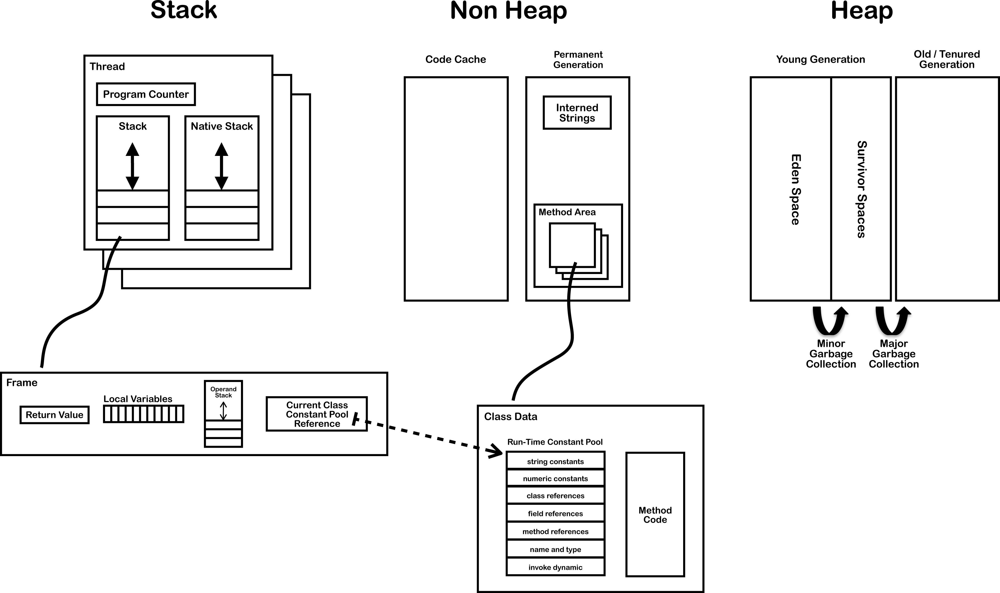
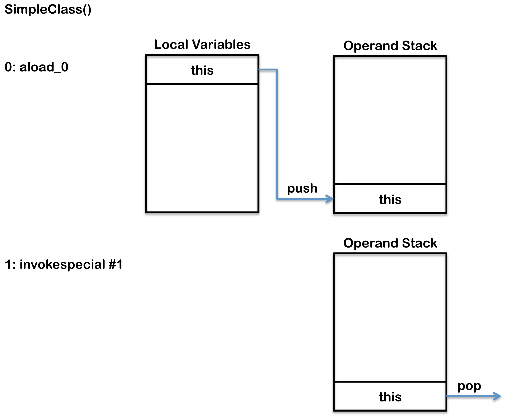
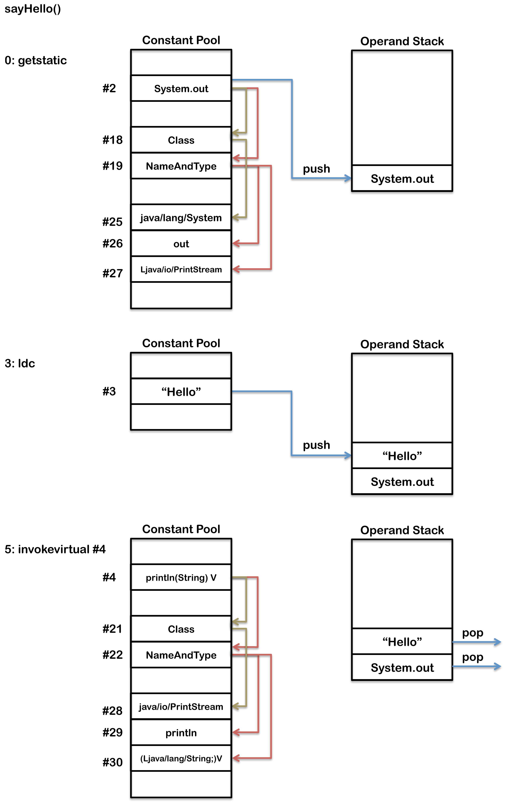
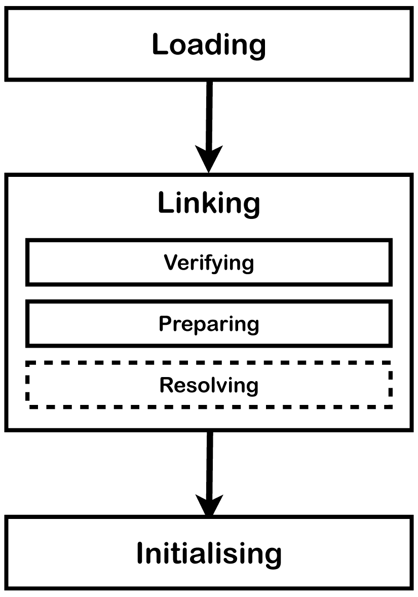
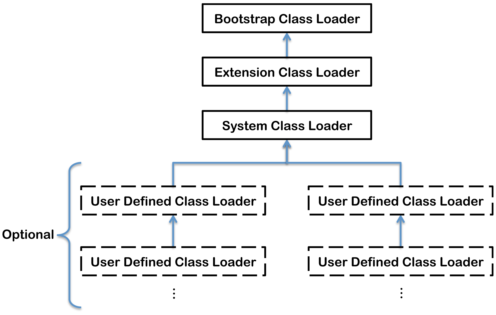

# JVM Internals

# 深入解析JVM内部结构


This article explains the internal architecture of the Java Virtual Machine (JVM).  The following diagram show the key internal components of a typical JVM that conforms to [The Java Virtual Machine Specification Java SE 7 Edition](http://www.amazon.co.uk/Virtual-Machine-Specification-Edition-Series/dp/0133260445).

本文详细介绍 Java 虚拟机(JVM)的内部结构。下图展示了符合 [Java 虚拟机规范第 7 版](http://www.amazon.co.uk/Virtual-Machine-Specification-Edition-Series/dp/0133260445) 的 JVM 核心组件。




The components shown on this diagram are each explained below in two sections.  [First section](#threads) covers the components that are created for each thread and the [second section](#shared_between_threads) covers the components that are created independently of threads.

我们将这些组件分成两个部分来介绍。

第一部分是每个线程自己的组件:

* [线程(Thread)](#threads)
  *   [JVM System Threads,JVM系统线程](#jvm_system_threads)
  *   [Per Thread,单个线程的结构](#per_thread)
  *   [program Counter (PC,程序计数器)](#program_counter)
  *   [Stack,栈](#stack)
  *   [Native Stack,本地线程栈](#native_stack)
  *   [Stack Restrictions,栈限制](#stack_restrictions)
  *   [Frame,栈帧](#frame)
  *   [Local Variables Array,局部变量数组](#local_variables_array)
  *   [Operand Stack,操作数栈](#operand_stack)
  *   [Dynamic Linking,动态链接](#dynamic_linking)

第二部分是所有线程共用的组件, 这些组件独立于线程存在:

* [Shared Between Threads,所有线程共用](#shared_between_threads)
  * [Heap,堆内存](#heap)
  * [Memory Management,内存管理](#memory_management)
  * [Non-Heap Memory,堆外内存](#non_heap_memory)
  * [Just In Time Compilation (JIT编译) ](#jit_compilation)
  * [Method Area,方法区](#method_area)
  * [Class File Structure,类文件结构](#class_file_structure)
  * [Classloader,类加载器](#classloader)
  * [Faster Class Loading, 快速类加载](#faster_class_loading)
  * [Where Is The Method Area,方法区的位置](#where_is_the_method_area)
  * [Classloader Reference,类加载器引用](#classloader_reference)
  * [Run Time Constant Pool,运行时常量池](#constant_pool)
  * [Exception Table,异常表](#exception_table)
  * [Symbol Table符号表](#symbol_table)
  * [Interned Strings,内部化字符串 (String Table,字符串表)](#string_table)


<a name="threads"></a>

## Thread

## 线程(Thread)

A thread is a thread of execution in a program. The JVM allows an application to have multiple threads of execution running concurrently.  In the Hotspot JVM there is a direct mapping between a Java Thread and a native operating system Thread.  After preparing all of the state for a Java thread such as thread-local storage, allocation buffers, synchronization objects, stacks and the program counter, the native thread is created.  The native thread is reclaimed once the Java thread terminates.  The operating system is therefore responsible for scheduling all threads and dispatching them to any available CPU.  Once the native thread has initialized it invokes the run() method in the Java thread.  When the run() method returns, uncaught exceptions are handled, then the native thread confirms if the JVM needs to be terminated as a result of the thread terminating (i.e. is it the last non-deamon thread).  When the thread terminates all resources for both the native and Java thread are released.

线程就是程序执行时的一条线。 JVM 允许程序同时启动多个线程. Hotspot JVM 直接将 Java 线程一对一的映射为底层操作系统线程。

JVM 需要为 Java 线程准备好各种相关数据之后才能启动底层的操作系统线程。
包括 `线程本地存储`(thread-local storage)、 `分配缓冲区`(allocation buffers)、 `同步对象`(synchronization objects)、 stacks(栈)和 program counter(程序计数器). 在 Java 线程终止时本地线程也将被回收。 操作系统负责所有的线程调度, 以及给线程分派可用的 CPU. 本地线程完成初始化以后, 就会调用 Java 线程的 `run()` 方法. 当 `run()` 方法执行完成返回, 或者抛出未捕获的异常时, 本地线程就会检查是否需要终止 JVM( 例如, 判断该线程是否是最后存活的 non-deamon 线程)。线程终止时, 本地线程的资源和 Java 线程的所有资源都会被释放。

### JVM System Threads

### JVM系统线程

If you use jconsole or any debugger it is possible to see there are numerous threads running in the background.  These background threads run in addition to the main thread, which is created as part of invoking `public static void main(String[])`, and any threads created by the main thread.  The main background system threads in the Hotspot JVM are:

如果使用 `jconsole` 或者其他调试器(debugger), 就可以看到 JVM 中有许多线程在后台运行. 这些后台线程运行在主线程之外, 主线程(main thread)就是执行 `public static void main(String[])` 的那个线程, 当然主线程也可能会创建一些自定义线程。Hotspot JVM 中主要的系统线程包括:

* VM thread
  This thread waits for operations to appear that require the JVM to reach a safe-point.  The reason these operations have to happen on a separate thread is because they all require the JVM to be at a safe point where modifications to the heap can not occur.  The type of operations performed by this thread are "stop-the-world" garbage collections, thread stack dumps, thread suspension and biased locking revocation.
* Periodic task thread
  This thread is responsible for timer events (i.e. interrupts) that are used to schedule execution of periodic operations
* GC threads
  These threads support the different types of garbage collection activities that occur in the JVM
* Compiler threads
  These threads compile byte code to native code at runtime
* Signal dispatcher thread
  This thread receives signals sent to the JVM process and handle them inside the JVM by calling the appropriate JVM methods.

----

* VM thread(虚拟机线程)
  这个线程等待需要 JVM 到达安全点的那些操作. 为什么要将这些操作抽出来单独用一个线程来执行呢? 是因为需要 JVM 中的线程都到达安全点, 这样堆内存才不会发生变化. 这个线程执行的操作就是 "stop-the-world" 垃圾收集, 线程栈转储, 线程暂停, 以及偏向锁撤销。
* Periodic task thread(定期任务线程)
  这个线程负责用于执行周期任务计划的 timer 事件(即中断,interrupts)
* GC线程
  这些线程支持 JVM 中各种类型的垃圾收集活动
* Compiler threads(编译线程)
  这些线程在运行时将字节码编译为本地机器代码
* Signal dispatcher thread(信号调度线程)
  这个线程接收发送给 JVM 进程的各种信号, 并调用相关的处理方法。


## Per Thread

## 单个线程的结构

Each thread of execution has the following components:

每个线程的执行有以下组件:

### Program Counter (PC)

### 程序计数器(PC, Program Counter)

Address of the current instruction (or opcode) unless it is native.  If the current method is native then the PC is undefined.  All CPUs have a PC, typically the PC is incremented after each instruction and therefore holds the address of the next instruction to be executed.  The JVM uses the PC to keep track of where it is executing instructions, the PC will in fact be pointing at a memory address in the Method Area.

PC 中记录的是当前指令(或操作码)的地址, 如果当前方法是 native 方法, 则 PC 的值为 undefined. 所有的 CPU/内核都有自己的 PC , 通常是每条指令执行完成后递增, 因此持有的是下一条指令的地址. JVM 通过 PC 来跟踪当前执行指令的地址, 事实上 PC 指向方法区中的某个内存地址。

### Stack

### 栈(Stack)

Each thread has its own stack that holds a frame for each method executing on that thread.  The stack is a Last In First Out (LIFO) data structure, so the currently executing method is at the top of the stack. A new frame is created and added (pushed) to the top of stack for every method invocation.  The frame is removed (popped) when the method returns normally or if an uncaught exception is thrown during the method invocation. The stack is not directly manipulated, except to push and pop frame objects, and therefore the frame objects may be allocated in the Heap and the memory does not need to be contiguous.

每个线程都有自己的线程栈(stack), 其中包含执行链上, 分配给每个方法的栈帧(frame, 方法帧). 栈是一种后进先出(LIFO, Last In First Out)的数据结构, 因此当前执行方法的栈帧(frame)在栈的最顶部. 每调用一个方法, 都会创建一个新的栈帧并压入(pushed/added)到栈的顶部. 在方法正常返回, 或者异常退出时, 栈帧就会从栈顶弹出(popped/removed). 栈除了压入(push)和弹出(pop)栈帧之外,不支持其他操作, 所以栈帧对象可能在堆中分配, 而且分配的物理内存不一定是连续的。

### Native Stack

### 本地方法栈(Native Stack)

Not all JVMs support native methods, however, those that do typically create a per thread native method stack.  If a JVM has been implemented using a C-linkage model for Java Native Invocation (JNI) then the native stack will be a C stack.  In this case the order of arguments and return value will be identical in the native stack to typical C program. A native method can typically (depending on the JVM implementation) call back into the JVM and invoke a Java method.  Such a native to Java invocation will occur on the stack (normal Java stack); the thread will leave the native stack and create a new frame on the stack (normal Java stack).

并不是所有 jvm 都支持本地方法, 通常每个线程都会创建一个本地方法栈. 如果 JVM 实现使用 C-linkage 模型来处理 Java 本地调用(JNI), 那么本地方法栈就是一个 C stack. 在这种情况下,参数和返回值的顺序与普通 C 程序是相同的. 本地方法可以和 Java 方法互相调用. 如果 Native 调用 Java 方法,则会使用普通 Java 栈; 线程将离开 native 栈并在 Java 栈上创建一个新的栈帧。

### Stack Restrictions

### 栈限制

A stack can be a dynamic or fixed size.  If a thread requires a larger stack than allowed a StackOverflowError is thrown.  If a thread requires a new frame and there isn’t enough memory to allocate it then an OutOfMemoryError is thrown.

栈的大小可能是动态的或固定的。如果线程需要的 stack 大小超过限制，则会抛出 `StackOverflowError`. 如果线程需要一个新的栈帧，但没有足够的内存可分配, 则会抛出 `OutOfMemoryError`。

### Frame

### 栈帧(Frame)

A new frame is created and added (pushed) to the top of stack for every method invocation.  The frame is removed (popped) when the method returns normally or if an uncaught exception is thrown during the method invocation.  For more detail on exception handling [see the section on Exception Tables below](#exception_table).

每个方法调用时,都会创建并添加/pushed 一个新的栈帧到线程栈的顶部. 方法正常返回或者异常退出则会删除/popped 栈帧. 关于异常处理的更多细节请参见下面的[异常表](#exception_table)。

Each frame contains:

每一帧包含:

*   Local variable array
*   Return value
*   Operand stack
*   Reference to runtime constant pool for class of the current method

* 局部变量数组
* 返回值
* 操作数栈
* 指向运行时常量池的当前方法所属类的引用

### Local Variables Array

### 局部变量数组

The array of local variables contains all the variables used during the execution of the method, including a reference to this, all method parameters and other locally defined variables.  For class methods (i.e. static methods) the method parameters start from zero, however, for instance method the zero slot is reserved for this.

局部变量数组包含方法执行期间使用的所有变量, 包括对 this 的引用、所有方法参数, 以及其它局部定义的变量。对于类方法(即静态方法), 方法参数从 0 号槽位开始; 而对于实例方法, 0 号槽位预留给 this。

A local variable can be:

一个局部变量可以是:

*   boolean
*   byte
*   char
*   long
*   short
*   int
*   float
*   double
*   reference
*   returnAddress

*   boolean(布尔)
*   byte(字节)
*   char(字符)
*   long(长整型)
*   short(短整型)
*   int(整型)
*   float(单精度浮点)
*   double(双精度浮点)
*   reference(引用)
*   returnAddress(返回地址)

All types take a single slot in the local variable array except long and double which both take two consecutive slots because these types are double width (64-bit instead of 32-bit).

除 long 和 double 之外, 所有类型在局部变量数组中只占一个槽位; long 和 double 因为宽度翻倍(64 位而非 32 位), 所以要占用两个连续的槽位。

### Operand Stack

### 操作数栈

The operand stack is used during the execution of byte code instructions in a similar way that general-purpose registers are used in a native CPU.  Most JVM byte code spends its time manipulating the operand stack by pushing, popping, duplicating, swapping, or executing operations that produce or consume values.  Therefore, instructions that move values between the array of local variables and the operand stack are very frequent in byte code. For example, a simple variable initialization results in two byte codes that interact with the operand stack.

操作数栈用于字节码指令的执行期间, 其作用类似于本地 CPU 中的通用寄存器。大多数 JVM 字节码都在操作操作数栈: 压入、弹出、复制、交换, 或执行产生/消耗值的操作。因此, 在局部变量数组与操作数栈之间移动值的指令在字节码中非常频繁。例如, 一个简单的变量初始化就会产生两条与操作数栈交互的字节码。

```
    int i;
```


Gets compiled to the following byte code:

被编译为字节代码如下:

```
    0:    iconst_0    // Push 0 to top of the operand stack
    1:    istore_1    // Pop value from top of operand stack and store as local variable 1
```    


For more detail explaining interactions between the local variables array, operand stack and run time constant pool [see the section on Class File Structure below](#class_file_structure).

关于局部变量数组、操作数栈与运行时常量池之间的交互, 更详细的解释请参见下面的[类文件结构](#class_file_structure)一节。

### Dynamic Linking

### 动态链接

Each frame contains a reference to the runtime constant pool.  The reference points to the constant pool for the class of the method being executed for that frame.  This reference helps to support dynamic linking.

每个栈帧都包含一个指向运行时常量池的引用。该引用指向当前栈帧所执行方法所属类的常量池。这个引用用于支持动态链接。

C/C++ code is typically compiled to an object file then multiple object files are linked together to product a usable artifact such as an executable or dll.  During the linking phase symbolic references in each object file are replaced with an actual memory address relative to the final executable.  In Java this linking phase is done dynamically at runtime.

C/C++ 代码通常先编译为目标文件(object file), 然后多个目标文件链接在一起, 生成可用的产物, 例如可执行文件或 dll。在链接阶段, 每个目标文件中的符号引用会被替换为相对于最终可执行文件的实际内存地址。在 Java 中, 这个链接阶段是在运行时动态完成的。

When a Java class is compiled, all references to variables and methods are stored in the class's constant pool as a symbolic reference. A symbolic reference is a logical reference not a reference that actually points to a physical memory location.  The JVM implementation can choose when to resolve symbolic references, this can happen when the class file is verified, after being loaded, called eager or static resolution, instead this can happen when the symbolic reference is used for the first time called lazy or late resolution. However the JVM has to behave as if the resolution occurred when each reference is first used and throw any resolution errors at this point.  Binding is the process of the field, method or class identified by the symbolic reference being replaced by a direct reference, this only happens once because the symbolic reference is completely replaced.  If the symbolic reference refers to a class that has not yet been resolved then this class will be loaded.  Each direct reference is stored as an offset against the storage structure associated with the runtime location of the variable or method.

Java 类被编译时, 所有对变量和方法的引用都以符号引用(symbolic reference)的形式存储在类的常量池中。符号引用是逻辑引用, 并不是真正指向物理内存地址的引用。JVM 实现可以选择何时解析符号引用: 可以在类文件校验时、加载之后解析, 称为急切解析(eager)或静态解析; 也可以在符号引用第一次被使用时才解析, 称为惰性解析(lazy)或延迟解析。不过 JVM 的行为必须表现得像是在每个引用第一次使用时就完成了解析, 并在此时抛出任何解析错误。绑定(binding)是指符号引用所标识的字段、方法或类被直接引用替换的过程; 这只会发生一次, 因为符号引用被完全替换。如果符号引用指向的类尚未解析, 那么这个类会被加载。每个直接引用都存储为相对于变量或方法运行时位置所关联存储结构的偏移量。


## Shared Between Threads

## 线程间共享

### Heap

### 堆

The Heap is used to allocate class instances and arrays at runtime. Arrays and objects can never be stored on the stack because a frame is not designed to change in size after it has been created.  The frame only stores references that point to objects or arrays on the heap.  Unlike primitive variables and references in the local variable array (in each frame) objects are always stored on the heap so they are not removed when a method ends.  Instead objects are only removed by the garbage collector.

堆用于在运行时分配类实例和数组。数组和对象永远不能存储在栈上, 因为栈帧创建之后其大小不允许改变。栈帧只存储指向堆上对象或数组的引用。与局部变量数组中的基本类型变量和引用(位于每个栈帧中)不同, 对象总是存储在堆上, 因此方法结束时它们不会被移除, 只能由垃圾收集器回收。

To support garbage collection the heap is divided into three sections:

为支持垃圾回收, 堆被划分为三个部分:

*   **Young Generation**

  *   Often split between Eden and Survivor


*   **Old Generation** (also called Tenured Generation)
*   **Permanent Generation**

*   **年轻代(Young Generation)**

  *   通常分为 Eden 区和 Survivor 区

*   **老年代(Old Generation)** (也称为 Tenured Generation/终身代)
*   **永久代(Permanent Generation)**


### Memory Management

### 内存管理

Objects and Arrays are never explicitly de-allocated instead the garbage collector automatically reclaims them.

对象和数组永远不会被显式释放, 而是由垃圾收集器自动回收。

Typically this works as follows:

其典型工作方式如下:

1.  New objects and arrays are created into the young generation
2.  Minor garbage collection will operate in the young generation.  Objects, that are still alive, will be moved from the eden space to the survivor space.
3.  Major garbage collection, which typically causes the application threads to pause, will move objects between generations.  Objects, that are still alive, will be moved from the young generation to the old (tenured) generation.
4.  The permanent generation is collected every time the old generation is collected.  They are both collected when either becomes full.

1. 新的对象和数组被分配到年轻代
2. Minor GC(小垃圾收集)作用于年轻代。仍然存活的对象会从 Eden 区移动到 Survivor 区。
3. Major GC(主垃圾收集)通常会导致应用线程暂停, 它会在各代之间移动对象。仍然存活的对象会从年轻代移动到老年代(tenured)。
4. 每次回收老年代时也会回收永久代。当其中任意一个满了, 两者都会被回收。


### Non-Heap Memory

### 非堆内存

Objects that are logically considered as part of the JVM mechanics are not created on the Heap.

从逻辑上被视为 JVM 机制一部分的对象, 并不在堆上创建。

The non-heap memory includes:

非堆内存包括:

* **Permanent Generation** that contains
  * the method area
  * interned strings

* **永久代(Permanent Generation)**, 其中包含
  * 方法区
  * 内部化字符串(interned strings)

* **Code Cache** used for compilation and storage of methods that have been compiled to native code by the JIT compiler

* **代码缓存(Code Cache)**, 用于存放由 JIT 编译器编译为本地代码的方法

### Just In Time (JIT) Compilation

### 及时(JIT)编译

Java byte code is interpreted however this is not as fast as directly executing native code on the JVM’s host CPU.  To improve performance the Oracle Hotspot VM looks for “hot” areas of byte code that are executed regularly and compiles these to native code.  The native code is then stored in the code cache in non-heap memory.  In this way the Hotspot VM tries to choose the most appropriate way to trade-off the extra time it takes to compile code verses the extra time it take to execute interpreted code.

Java 字节码是解释执行的, 但速度不如直接在 JVM 宿主 CPU 上执行本地代码快。为提高性能, Oracle Hotspot VM 会寻找那些经常执行的"热点"字节码, 并将它们编译为本地代码。编译后的本地代码存放在非堆内存的代码缓存中。Hotspot VM 正是通过这种方式, 在编译代码所需的额外时间与执行解释代码所需的额外时间之间进行权衡, 选择最合适的方式。

### Method Area

### 方法区

The method area stores per-class information such as:

方法区存储每个类的信息, 例如:

* **Classloader Reference**
* **Run Time Constant Pool**
  * Numeric constants
  * Field references
  * Method References
  * Attributes
* **Field data**
  * Per field
    * Name
    * Type
    * Modifiers
    * Attributes
* **Method data**
  * Per method
    * Name
    * Return Type
    * Parameter Types (in order)
    * Modifiers
    * Attributes
* **Method code**
  * Per method
    * Bytecodes
    * Operand stack size
    * Local variable size
    * Local variable table
    * Exception table
      * Per exception handler
        * Start point
        * End point
        * PC offset for handler code
        * Constant pool index for exception class being caught

*   **类加载器引用(Classloader Reference)**
*   **运行时常量池(Run Time Constant Pool)**
  *   数字常量
  *   字段引用
  *   方法引用
  *   属性
*   **字段数据(Field data)**
  *   每个字段
    *   名称
    *   类型
    *   修饰符
    *   属性
*   **方法数据(Method data)**
  *   每个方法
    *   名称
    *   返回类型
    *   参数类型(按顺序)
    *   修饰符
    *   属性
*   **方法代码(Method code)**
  *   每个方法
    *   字节码
    *   操作数栈大小
    *   局部变量大小
    *   局部变量表
    *   异常表
      *   每个异常处理器
        *   起始点
        *   结束点
        *   处理器代码的 PC 偏移量
        *   被捕获异常类对应的常量池索引


All threads share the same method area, so access to the method area data and the process of dynamic linking must be thread safe.  If two threads attempt to access a field or method on a class that has not yet been loaded it must only be loaded once and both threads must not continue execution until it has been loaded.

所有线程共享同一个方法区, 因此对方法区数据的访问以及动态链接的过程必须是线程安全的。如果两个线程试图访问一个尚未加载类的字段或方法, 该类只能被加载一次, 并且在加载完成之前两个线程都不能继续执行。

### Class File Structure

### 类文件结构

A compiled class file consists of the following structure:

编译后的类文件由以下结构组成:

```
ClassFile {
    u4            magic;
    u2            minor_version;
    u2            major_version;
    u2            constant_pool_count;
    cp_info        contant_pool[constant_pool_count – 1];
    u2            access_flags;
    u2            this_class;
    u2            super_class;
    u2            interfaces_count;
    u2            interfaces[interfaces_count];
    u2            fields_count;
    field_info        fields[fields_count];
    u2            methods_count;
    method_info        methods[methods_count];
    u2            attributes_count;
    attribute_info    attributes[attributes_count];
}
```


* magic, minor_version, major_version
  specifies information about the version of the class and the version of the JDK this class was compiled for.
* constant_pool
  similar to a symbol table although it contains more data [this is described in more detail below.](#constant_pool)
* access_flags
  provides the list of modifiers for this class.
* this_class
  index into the constant_pool providing the fully qualified name of this class i.e. org/jamesdbloom/foo/Bar
* super_class
  index into the constant_pool providing a symbolic reference to the super class i.e. java/lang/Object
* interfaces
  array of indexes into the constant_pool providing a symbolic references to all interfaces that have been implemented.
* fields
  array of indexes into the constant_pool giving a complete description of each field.
* methods
  array of indexes into the constant_pool giving a complete description of each method signature, if the method is not abstract or native then the bytecode is also present.
* attributes
  array of different value that provide additional information about the class including any annotations with RetentionPolicy.`CLASS` or RetentionPolicy.`RUNTIME`

* magic, minor_version, major_version
  指定该类文件的版本信息, 以及该类所面向的 JDK 版本。
* constant_pool
  类似于符号表, 不过它包含更多的数据([后面会详细描述](#constant_pool))。
* access_flags
  提供该类的修饰符列表。
* this_class
  指向 constant_pool 的索引, 给出该类的完全限定名, 例如 org/jamesdbloom/foo/Bar
* super_class
  指向 constant_pool 的索引, 给出父类的符号引用, 例如 java/lang/Object
* interfaces
  由指向 constant_pool 的索引组成的数组, 给出所有已实现接口的符号引用。
* fields
  由指向 constant_pool 的索引组成的数组, 给出每个字段的完整描述。
* methods
  由指向 constant_pool 的索引组成的数组, 给出每个方法签名的完整描述; 如果方法不是 abstract 或 native, 则还会包含字节码。
* attributes
  由多个不同值组成的数组, 提供该类的附加信息, 包括所有 RetentionPolicy.`CLASS` 或 RetentionPolicy.`RUNTIME` 注解。

It is possible to view the byte code in a compiled Java class by using the javap command.

可以使用 javap 命令查看编译后的 Java 类文件的字节码。

If you compile the following simple class:

如果你编译以下简单的类:

```
package org.jvminternals;

public class SimpleClass {
    public void sayHello() {
        System.out.println("Hello");
    }
}
```


Then you get the following output if you run:

运行以下命令会得到如下输出:

```
javap -v -p -s -sysinfo -constants classes/org/jvminternals/SimpleClass.class
```


```
public class org.jvminternals.SimpleClass
  SourceFile: "SimpleClass.java"
  minor version: 0
  major version: 51
  flags: ACC_PUBLIC, ACC_SUPER
Constant pool:
   #1 = Methodref          #6.#17         //  java/lang/Object."<init>":()V
   #2 = Fieldref           #18.#19        //  java/lang/System.out:Ljava/io/PrintStream;
   #3 = String             #20            //  "Hello"
   #4 = Methodref          #21.#22        //  java/io/PrintStream.println:(Ljava/lang/String;)V
   #5 = Class              #23            //  org/jvminternals/SimpleClass
   #6 = Class              #24            //  java/lang/Object
   #7 = Utf8               <init>
   #8 = Utf8               ()V
   #9 = Utf8               Code
  #10 = Utf8               LineNumberTable
  #11 = Utf8               LocalVariableTable
  #12 = Utf8               this
  #13 = Utf8               Lorg/jvminternals/SimpleClass;
  #14 = Utf8               sayHello
  #15 = Utf8               SourceFile
  #16 = Utf8               SimpleClass.java
  #17 = NameAndType        #7:#8          //  "<init>":()V
  #18 = Class              #25            //  java/lang/System
  #19 = NameAndType        #26:#27        //  out:Ljava/io/PrintStream;
  #20 = Utf8               Hello
  #21 = Class              #28            //  java/io/PrintStream
  #22 = NameAndType        #29:#30        //  println:(Ljava/lang/String;)V
  #23 = Utf8               org/jvminternals/SimpleClass
  #24 = Utf8               java/lang/Object
  #25 = Utf8               java/lang/System
  #26 = Utf8               out
  #27 = Utf8               Ljava/io/PrintStream;
  #28 = Utf8               java/io/PrintStream
  #29 = Utf8               println
  #30 = Utf8               (Ljava/lang/String;)V
{
  public org.jvminternals.SimpleClass();
    Signature: ()V
    flags: ACC_PUBLIC
    Code:
      stack=1, locals=1, args_size=1
        0: aload_0
        1: invokespecial #1    // Method java/lang/Object."<init>":()V
        4: return
      LineNumberTable:
        line 3: 0
      LocalVariableTable:
        Start  Length  Slot  Name   Signature
          0      5      0    this   Lorg/jvminternals/SimpleClass;

  public void sayHello();
    Signature: ()V
    flags: ACC_PUBLIC
    Code:
      stack=2, locals=1, args_size=1
        0: getstatic      #2    // Field java/lang/System.out:Ljava/io/PrintStream;
        3: ldc            #3    // String "Hello"
        5: invokevirtual  #4    // Method java/io/PrintStream.println:(Ljava/lang/String;)V
        8: return
      LineNumberTable:
        line 6: 0
        line 7: 8
      LocalVariableTable:
        Start  Length  Slot  Name   Signature
          0      9      0    this   Lorg/jvminternals/SimpleClass;
}
```


This class file shows three main sections the constant pool, the constructor and the sayHello method.

这个类文件显示了三个主要部分: 常量池、构造函数以及 sayHello 方法。

* Constant Pool – this provides the same information that a symbol table typically provides and is described in more detail below.
* Methods – each containing four areas:
  * signature and access flags
  * byte code
  * LineNumberTable – this provides information to a debugger to indicate which line corresponds to which byte code instruction, for example line 6 in the Java code corresponds to byte code 0 in the sayHello method and line 7 corresponds to byte code 8.
  * LocalVariableTable – this lists all local variables provided in the frame, in both examples the only local variable is this.

* 常量池(Constant Pool) —— 它提供的信息与符号表通常提供的信息相同, 后面会详细描述。
* 方法(Methods) —— 每个方法包含四个方面:
  * 签名和访问标志
  * 字节码
  * LineNumberTable —— 向调试器提供信息, 用于指示哪一行代码对应哪条字节码指令, 例如 Java 代码中的第 6 行对应 sayHello 方法中的字节码 0, 第 7 行对应字节码 8。
  * LocalVariableTable —— 列出栈帧中提供的所有局部变量, 在上面的两个例子中, 唯一的局部变量是 this。

The following byte code operands are used in this class file

这个类文件中用到了以下字节码操作数:

* aload_0
  This opcode is one of a group of opcodes with the format aload_&lt;n&gt;.  They all load an object reference into the operand stack.  The &lt;n&gt; refers to the location in the local variable array that is being accessed but can only be 0, 1, 2 or 3.  There are other similar opcodes for loading values that are not an object reference iload_&lt;n&gt;, lload_&lt;n&gt;, float_&lt;n&gt; and dload_&lt;n&gt; where i is for int, l is for long, f is for float and d is for double.  Local variables with an index higher than 3 can be loaded using iload, lload, float, dload and aload.  These opcodes all take a single operand that specifies the index of local variable to load.
* ldc
    This opcode is used to push a constant from the run time constant pool into the operand stack.
* getstatic
    This opcode is used to push a static value from a static field listed in the run time constant pool into the operand stack.
* invokespecial, invokevirtual
    These opcodes are in a group of opcodes that invoke methods these are invokedynamic,   invokeinterface, invokespecial, invokestatic, invokevirtual.  In this class file invokespecial and invokevirutal are both used the difference between these is that invokevirutal invokes a method based on the class of the object. The invokespecial instruction is used to invoke instance initialization methods as well as private methods and methods of a superclass of the current class.
* return
    This opcode is in a group of opcodes ireturn, lreturn, freturn, dreturn, areturn and return.  Each of these opcodes are a typed return statement that returns a different type where i is for int, l is for long, f is for float, d is for double and a is for an object reference.  The opcode with no leading type letter return only returns void.

* aload_0
  这个操作码属于格式为 `aload_<n>` 的一组操作码。它们都把对象引用加载到操作数栈中。`<n>` 指的是所访问的局部变量数组中的位置, 但只能是 0、1、2 或 3。还有其他类似的操作码用于加载非对象引用的值: `iload_<n>`、`lload_<n>`、`fload_<n>` 和 `dload_<n>`, 其中 i 表示 int, l 表示 long, f 表示 float, d 表示 double。索引大于 3 的局部变量可以使用 iload、lload、fload、dload 和 aload 来加载。这些操作码都接受一个操作数, 用于指定要加载的局部变量的索引。
* ldc
  这个操作码用于从运行时常量池中把常量压入操作数栈。
* getstatic
  这个操作码用于把运行时常量池中列出的静态字段的静态值压入操作数栈。
* invokespecial, invokevirtual
  这些操作码属于一组调用方法的操作码, 分别是 invokedynamic、invokeinterface、invokespecial、invokestatic、invokevirtual。在这个类文件中同时用到了 invokespecial 和 invokevirtual, 二者的区别在于 invokevirtual 根据对象的实际类来调用方法。invokespecial 指令用于调用实例初始化方法, 以及 private 方法和当前类的父类方法。
* return
  这个操作码属于一组操作码: ireturn、lreturn、freturn、dreturn、areturn 和 return。每个操作码都是一种带类型的返回语句, 返回不同的类型, 其中 i 表示 int, l 表示 long, f 表示 float, d 表示 double, a 表示对象引用。不带类型字母前缀的 return 操作码只返回 void。

As in any typical byte code the majority of the operands interact with the local variables, operand stack and run time constant pool as follows.

和任何典型的字节码一样, 大部分操作数都会与局部变量、操作数栈和运行时常量池交互, 如下所示。

The constructor has two instructions first this is pushed onto the operand stack, next the constructor for the super class is invoked which consumes the value off this and therefore pops it off the operand stack.

构造函数包含两条指令: 首先把 this 压入操作数栈, 接着调用父类的构造函数, 它会消耗掉 this 的值, 因此把 this 从操作数栈中弹出。




The sayHello() method is more complex as it has to resolve symbolic references to actual references using the run time constant pool, [as explained in more detail above](#dynamic_linking).  The first operand getstatic is used to push a reference to the static field out of the System class on to the operand stack.  The next operand ldc pushes the string "Hello" onto the operand stack.  The final operand invokevirtual invokes the println method of System.out which pops "Hello" off the operand stack as an argument and creates a new frame for the current thread.

sayHello() 方法则更为复杂, 因为它必须借助运行时常量池, 把符号引用解析为实际引用, [如上面所详述](#dynamic_linking)。第一个操作数 getstatic 用于把 System 类中静态字段 out 的引用压入操作数栈。下一个操作数 ldc 把字符串 "Hello" 压入操作数栈。最后一个操作数 invokevirtual 调用 System.out 的 println 方法, 它把 "Hello" 作为参数从操作数栈弹出, 并为当前线程创建一个新的栈帧。




### Classloader

### 类加载器

The JVM starts up by loading an initial class using the bootstrap classloader.  The class is then linked and initialized before `public static void main(String[])` is invoked.  The execution of this method will in turn drive the loading, linking and initialization of additional classes and interfaces as required.

JVM 启动时, 先用引导类加载器(bootstrap classloader)加载一个初始类。该类在执行 `public static void main(String[])` 之前会先完成链接和初始化。这个方法的执行又会按需驱动其他类和接口的加载、链接和初始化。

**Loading** is the process of finding the class file that represents the class or interface type with a particular name and reading it into a byte array.  Next the bytes are parsed to confirm they represent a Class object and have the correct major and minor versions.  Any class or interface named as a direct superclass is also loaded.  Once this is completed a class or interface object is created from the binary representation.

**加载(Loading)** 是这样一个过程: 找到代表具有特定名称的类或接口类型的类文件, 并将其读入一个字节数组。接着解析这些字节, 确认它们表示一个 Class 对象, 且主次版本号正确。任何被命名为直接父类的类或接口也会被加载。完成之后, 就根据这个二进制表示创建一个类或接口对象。

**Linking** is the process of taking a class or interface verifying and preparing the type and its direct superclass and superinterfaces.  Linking consists of three steps verifying, preparing and optionally resolving.

**链接(Linking)** 是这样一个过程: 对一个类或接口进行校验和准备, 并处理该类型及其直接父类和父接口。链接包含三个步骤: 校验(verifying)、准备(preparing)以及可选的解析(resolving)。

  **_Verifying_** is the process of confirming the class or interface representation is structurally correct and obeys the semantic requirements of the Java programming language and JVM, for example the following checks are performed:


  **_校验(Verifying)_** 是确认类或接口表示在结构上正确, 并且遵守 Java 编程语言和 JVM 的语义要求的过程。例如会执行以下检查:

1. consistent and correctly formatted symbol table
2. final methods / classes not overridden
3. methods respect access control keywords
4. methods have correct number and type of parameters
5. bytecode doesn't manipulate stack incorrectly
6. variables are initialized before being read
7. variables are a value of the correct type

1. 符号表一致且格式正确
2. final 方法和 final 类没有被重写/继承
3. 方法遵守访问控制关键字
4. 方法的参数数量和类型正确
5. 字节码没有以错误方式操作栈
6. 变量在被读取之前已经初始化
7. 变量具有正确类型的值

Performing these checks during the verifying stages means these checks do not need to be performed at runtime.  Verification during linking slows down class loading however it avoids the need to perform these checks multiple when executing the bytecode.

在校验阶段执行这些检查, 意味着运行时不再需要执行它们。在链接期进行校验会拖慢类加载, 但它避免了在执行字节码时多次重复这些检查。

  **_Preparing_** involves allocation of memory for static storage and any data structures used by the JVM such as method tables.  Static fields are created and initialized to their default values, however, no initializers or code is executed at this stage as that happens as part of initialization.


  **_准备(Preparing)_** 涉及为静态存储以及 JVM 使用的数据结构(例如方法表)分配内存。此时会创建静态字段并将其初始化为默认值, 但在这个阶段不会执行任何初始化器或代码, 那属于初始化的一部分。

  **_Resolving_** is an optional stage which involves checking symbolic references by loading the referenced classes or interfaces and checking the references are correct.  If this does not take place at this point the resolution of symbolic references can be deferred until just prior to their use by a byte code instruction.

  **_解析(Resolving)_** 是一个可选阶段, 它通过加载被引用的类或接口并检查引用是否正确来检查符号引用。如果此时不进行解析, 符号引用的解析可以推迟到字节码指令即将使用它之前才进行。

**Initialization** of a class or interface consists of executing the class or interface initialization method <clinit>

**初始化(Initialization)** 一个类或接口, 就是执行该类或接口的初始化方法 <clinit>




In the JVM there are multiple classloaders with different roles.  Each classloader delegates to its parent classloader (that loaded it) except the **bootstrap classloader** which is the top classloader.

JVM 中有多个承担不同角色的类加载器。除了位于顶层的**引导类加载器(bootstrap classloader)**之外, 每个类加载器都会委派给它的父类加载器(即加载它的那个加载器)。

**_Bootstrap Classloader_** is usually implemented as native code because it is instantiated very early as the JVM is loaded.  The bootstrap classloader is responsible for loading the basic Java APIs, including for example rt.jar.  It only loads classes found on the boot classpath which have a higher level of trust; as a result it skips much of the validation that gets done for normal classes.

**引导类加载器(Bootstrap Classloader)** 通常用本地代码实现, 因为它在 JVM 加载的早期就被实例化了。引导类加载器负责加载基础的 Java API, 例如 rt.jar。它只加载引导类路径(boot classpath)上找到的类, 这些类具有更高的信任级别, 因此它会跳过许多针对普通类所做的校验。

**_Extension Classloader_** loads classes from standard Java extension APIs such as security extension functions.

**扩展类加载器(Extension Classloader)** 从标准的 Java 扩展 API(例如安全扩展功能)中加载类。

**_System Classloader_** is the default application classloader, which loads application classes from the classpath.

**系统类加载器(System Classloader)** 是默认的应用程序类加载器, 它从类路径(classpath)加载应用程序类。

**_User Defined Classloaders_** can alternatively be used to load application classes.  A user defined classloader is used for a number of special reasons including run time reloading of classes or separation between different groups of loaded classes typically required by web servers such as Tomcat.

**用户自定义类加载器(User Defined Classloaders)** 也可以用来加载应用程序类。用户定义的类加载器用于一些特殊场景, 包括在运行时重新加载类, 或者将不同组已加载的类隔离开来 —— 这通常是 Web 服务器(例如 Tomcat)所需要的。




### Faster Class Loading

### 更快的类加载

A feature called Class Data Sharing (CDS) was introduce in HotSpot JMV from version 5.0.  During the installation process of the JVM the installer loads a set of key JVM classes, such as rt.jar, into a memory-mapped shared archive.  CDS reduces the time it takes to load these classes improving JVM start-up speed and allows these classes to be shared between different instances of the JVM reducing the memory footprint.

从 5.0 版本开始, HotSpot JVM 引入了一项称为类数据共享(Class Data Sharing, CDS)的特性。在 JVM 的安装过程中, 安装程序会把一组关键的 JVM 类(例如 rt.jar)加载到一个内存映射的共享归档文件中。CDS 可减少加载这些类所需的时间, 从而提高 JVM 的启动速度, 并让这些类可以在不同的 JVM 实例之间共享, 从而减少内存占用。

### Where Is The Method Area

### 方法区在哪里

[The Java Virtual Machine Specification Java SE 7 Edition](http://www.amazon.co.uk/Virtual-Machine-Specification-Edition-Series/dp/0133260445) clearly states:  “Although the method area is logically part of the heap, simple implementations may choose not to either garbage collect or compact it.”  In contradiction to this jconsole for the Oracle JVM shows the method area (and code cache) as being non-heap.  The [OpenJDK](http://openjdk.java.net/) code shows that the CodeCache is a separate field of the VM to the ObjectHeap.

[Java 虚拟机规范第 7 版](http://www.amazon.co.uk/Virtual-Machine-Specification-Edition-Series/dp/0133260445)明确指出: “尽管方法区在逻辑上是堆的一部分, 但简单的实现可以选择不对其进行垃圾收集或压缩。” 与此矛盾的是, Oracle JVM 的 jconsole 却把方法区(以及代码缓存)显示为非堆内存。[OpenJDK](http://openjdk.java.net/) 的代码表明, CodeCache 是 VM 中独立于 ObjectHeap 的一个字段。

### Classloader Reference

### 类加载器参考

All classes that are loaded contain a reference to the classloader that loaded them.  In turn the classloader also contains a reference to all classes that it has loaded.

所有被加载的类都包含一个指向加载它的类加载器的引用。反过来, 类加载器也包含一个指向它已加载的所有类的引用。

### Run Time Constant Pool

### 运行时常量池

The JVM maintains a per-type constant pool, a run time data structure that is similar to a symbol table although it contains more data.  Byte codes in Java require data, often this data is too large to store directly in the byte codes, instead it is stored in the constant pool and the byte code contains a reference to the constant pool. The run time constant pool is used in dynamic linking [as described above](#dynamic_linking)

JVM 为每种类型维护一个常量池, 它是一个运行时数据结构, 类似于符号表, 只不过包含的数据更多。Java 中的字节码需要数据, 而这些数据往往太大, 无法直接存储在字节码中, 因此它被存放在常量池里, 字节码则包含一个指向常量池的引用。运行时常量池用于动态链接, [如前所述](#dynamic_linking)。

Several types of data is stored in the constant pool including

常量池中存储的数据类型包括:

* numeric literals
* string literals
* class references
* field references
* method references

* 数字字面量
* 字符串字面量
* 类引用
* 字段引用
* 方法引用

For example the following code:

例如下面的代码:

```
Object foo = new Object();
```


Would be written in byte code as follows:

会被写成如下字节码:

```
0:     new #2             // Class java/lang/Object
1:    dup
2:    invokespecial #3    // Method java/ lang/Object "<init>"( ) V
```


The new opcode (operand code) is followed by the #2 operand.  This operand is an index into the constant pool and therefore is referencing the second entry in the constant pool.  The second entry is a class reference, this entry in turn references another entry in the constant pool containing the name of the class as a constant UTF8 string with the value // Class java/lang/Object.  This symbolic link can then be used to lookup the class for java.lang.Object.  The new opcode creates a class instance and initializes its variables.  A reference to the new class instance is then added to the operand stack.  The dup opcode then creates an extra copy of the top reference on the operand stack and adds this to the top of the operand stack.  Finally an instance initialization method is called on line 2 by invokespecial.  This operand also contains a reference to the constant pool.  The initialization method consumes (pops) the top reference off the operand pool as an argument to the method.  At the end there is one reference to the new object that has been both created and initialized.

new 操作码(操作数代码)后面跟着 #2 操作数。这个操作数是常量池的索引, 因此它引用常量池中的第二个条目。第二个条目是一个类引用, 该条目又引用常量池中的另一个条目, 其中包含以 UTF8 字符串常量形式表示的类名, 值为 // Class java/lang/Object。这个符号链接随后可用于查找 java.lang.Object 这个类。new 操作码创建一个类实例并初始化其变量。然后, 指向这个新类实例的引用被添加到操作数栈。接着 dup 操作码在操作数栈顶复制一份该引用, 并将副本添加到栈顶。最后, 在第 2 行通过 invokespecial 调用一个实例初始化方法。这个操作数同样包含一个指向常量池的引用。初始化方法消耗(弹出)栈顶引用, 将其作为方法的参数。最终, 栈上只剩下一个指向这个新对象的引用, 该对象既已被创建也已被初始化。

If you compile the following simple class:

如果你编译以下简单的类:

```
package org.jvminternals;

public class SimpleClass {

    public void sayHello() {
        System.out.println("Hello");
    }

}
```


The constant pool in the generated class file would look like:

生成的类文件中的常量池大致如下:

```
    Constant pool:
       #1 = Methodref          #6.#17         //  java/lang/Object."<init>":()V
       #2 = Fieldref           #18.#19        //  java/lang/System.out:Ljava/io/PrintStream;
       #3 = String             #20            //"Hello"
       #4 = Methodref          #21.#22        //  java/io/PrintStream.println:(Ljava/lang/String;)V
       #5 = Class              #23            //  org/jvminternals/SimpleClass
       #6 = Class              #24            //  java/lang/Object
       #7 = Utf8               <init>
       #8 = Utf8               ()V
       #9 = Utf8               Code
      #10 = Utf8               LineNumberTable
      #11 = Utf8               LocalVariableTable
      #12 = Utf8               this
      #13 = Utf8               Lorg/jvminternals/SimpleClass;
      #14 = Utf8               sayHello
      #15 = Utf8               SourceFile
      #16 = Utf8               SimpleClass.java
      #17 = NameAndType        #7:#8          //  "<init>":()V
      #18 = Class              #25            //  java/lang/System
      #19 = NameAndType        #26:#27        //  out:Ljava/io/PrintStream;
      #20 = Utf8               Hello
      #21 = Class              #28            //  java/io/PrintStream
      #22 = NameAndType        #29:#30        //  println:(Ljava/lang/String;)V
      #23 = Utf8               org/jvminternals/SimpleClass
      #24 = Utf8               java/lang/Object
      #25 = Utf8               java/lang/System
      #26 = Utf8               out
      #27 = Utf8               Ljava/io/PrintStream;
      #28 = Utf8               java/io/PrintStream
      #29 = Utf8               println
      #30 = Utf8               (Ljava/lang/String;)V
```


The constant pool contains the following types:

常量池包含以下类型:

- `Integer` A 4 byte int constant
- `Long` An 8 byte long constant
- `Float` A 4 byte float constant
- `Double` - A 8 byte double constant
- `String` - A String constant that points at another Utf8 entry in the constant pool which contains the actual bytes
- `Utf8` A stream of bytes representing a Utf8 encoded sequence of characters
- `Class`  A Class constant that points at another Utf8 entry in the constant pool which contains the fully qualified class name in the internal JVM format (this is used by the [dynamic linking process](#dynamic_linking))
- `NameAndType` A colon separated pair of values each pointing at other entries in the constant pool.  The first value (before the colon) points at a Utf8 string entry that is the method or field name.  The second value points at a Utf8 entry that represents the type, in the case of a field this is the fully qualified class name, in the case of a method this is a list of fully qualified class names one per parameter.
- `Fieldref`,`Methodref`,`InterfaceMethodref` A dot separated pair of values each pointing at other entries in the constant pool.  The first value (before the dot) points at a Class entry.  The second value points at a NameAndType entry.

- `Integer` 一个 4 字节的 int 常量
- `Long` 一个 8 字节的 long 常量
- `Float` 一个 4 字节的 float 常量
- `Double` 一个 8 字节的 double 常量
- `String` 一个 String 常量, 指向常量池中另一个 Utf8 条目, 其中包含实际的字节
- `Utf8` 一段字节流, 表示以 UTF-8 编码的字符序列
- `Class` 一个 Class 常量, 指向常量池中另一个 Utf8 条目, 其中包含采用 JVM 内部格式的完全限定类名(用于[动态链接过程](#dynamic_linking))
- `NameAndType` 由冒号分隔的一对值, 各自指向常量池中的其他条目。冒号前的第一个值指向一个 Utf8 字符串条目, 即方法名或字段名。第二个值指向一个 Utf8 条目, 表示类型: 对于字段, 它是完全限定类名; 对于方法, 它是由每个参数的完全限定类名组成的列表。
- `Fieldref`,`Methodref`,`InterfaceMethodref` 由点号分隔的一对值, 各自指向常量池中的其他条目。点号前的第一个值指向一个 Class 条目。第二个值指向一个 NameAndType 条目。

### Exception Table

### 异常表

The exception table stores per-exception handler information such as:

异常表存储每个异常处理器的信息, 例如:

* Start point
* End point
* PC offset for handler code
* Constant pool index for exception class being caught

* 起始点
* 结束点
* 处理器代码的 PC 偏移量
* 被捕获异常类对应的常量池索引

If a method has defined a try-catch or a try-finally exception handler then an Exception Table will be created.  This contains information for each exception handler or finally block including the range over which the handler applies, what type of exception is being handled and where the handler code is.

如果一个方法定义了 try-catch 或 try-finally 异常处理器, 那么就会创建一个异常表(Exception Table)。它包含每个异常处理器或 finally 块的信息, 包括处理器的生效范围、所处理的异常类型以及处理器代码所在的位置。

When an exception is thrown the JVM looks for a matching handler in the current method, if none is found the method ends abruptly popping the current stack frame and the exception is re-thrown in the calling method (the new current frame).  If no exception handler is found before all frames have been popped then the thread is terminated.   This can also cause the JVM itself to terminate if the exception is thrown in the last non-daemon thread, for example if the thread is the main thread.

当抛出异常时, JVM 会在当前方法中查找匹配的处理器; 如果没有找到, 方法会突然结束, 弹出当前栈帧, 并在调用方方法(新的当前帧)中重新抛出该异常。如果在所有栈帧都被弹出之前仍没有找到异常处理器, 那么线程会被终止。如果异常是在最后一个非守护线程(例如主线程)中抛出的, 这也可能导致 JVM 本身终止。

Finally exception handlers match all types of exceptions and so always execute whenever an exception is thrown.  In the case when no exception is thrown a finally block is still executed at the end of a method, this is achieved by jumping to the finally handler code immediately before the return statement is executed.

finally 异常处理器会匹配所有类型的异常, 因此只要有异常抛出就总会执行。在未抛出异常的情况下, finally 块仍会在方法结束时执行, 这是通过在执行 return 语句之前跳转到 finally 处理器代码来实现的。

### Symbol Table

### 符号表

In addition to per-type run-time constant pools the Hotspot JVM has a symbol table held in the permanent generation.  The symbol table is a Hashtable mapping symbol pointers to symbols (i.e. Hashtable&lt;Symbol*, Symbol&gt;) and includes a pointer to all symbols including those held in run time constant pools in each class.

除了每种类型的运行时常量池之外, HotSpot JVM 还在永久代中持有一个符号表(symbol table)。符号表是一个把符号指针映射到符号的 Hashtable(即 Hashtable&lt;Symbol*, Symbol&gt;), 它包含一个指向所有符号的指针, 包括每个类的运行时常量池中持有的符号。

Reference counting is used to control when a symbol is removed from the symbol table.  For example when a class is unloaded the reference count of all symbols held in its run time constant pool are decremented.  When the reference count of a symbol in the the symbol table goes to zero then the symbol table knows that symbol is not being referenced anymore and the symbol is unloaded from the symbol table. For both the symbol table and the string table (see below) all entries are held in a canonicalized form to improve efficiency and ensure each entry only appears once.

引用计数用于控制何时从符号表中移除某个符号。例如, 当一个类被卸载时, 其运行时常量池中持有的所有符号的引用计数都会递减。当符号表中某个符号的引用计数降为零时, 符号表就知道该符号不再被引用, 于是将其从符号表中卸载。对于符号表和字符串表(见下文)来说, 所有条目都以规范化(canonicalized)的形式保存, 以提高效率并确保每个条目只出现一次。

### Interned Strings (String Table)

### 内部化字符串(字符串表)

The Java Language Specification requires that identical string literals, that contain the same sequence of Unicode code points, must refer to the same instance of String.  In addition if String.intern() is called on an instance of String a reference must be returned that would be identical to the reference return if the string was a literal. The following therefore holds true:

Java 语言规范要求: 包含相同 Unicode 码点序列的相同字符串字面量, 必须引用同一个 String 实例。此外, 如果对某个 String 实例调用 String.intern(), 那么返回的引用必须与把该字符串作为字面量时返回的引用相同。因此以下等式成立:

```
("j" + "v" + "m").intern() == "jvm"
```


In the Hotspot JVM interned string are held in the string table, which is a Hashtable mapping object pointers to symbols (i.e. Hashtable&lt;oop, Symbol&gt;), and is held in the permanent generation.  For both the symbol table (see above) and the string table all entries are held in a canonicalized form to improve efficiency and ensure each entry only appears once.

在 HotSpot JVM 中, 内部化字符串(interned string)保存在字符串表(string table)中, 它是一个把对象指针映射到符号的 Hashtable(即 Hashtable&lt;oop, Symbol&gt;), 并且位于永久代中。对于符号表(见上文)和字符串表来说, 所有条目都以规范化的形式保存, 以提高效率并确保每个条目只出现一次。

String literals are automatically interned by the compiler and added into the symbol table when the class is loaded.  In addition instances of the String class can be explicitly interned by calling String.intern().  When String.intern() is called, if the symbol table already contains the string then a reference to this is returned, if not the string is added to the string table and its reference is returned.

字符串字面量由编译器自动内部化(intern), 并在类加载时添加到符号表中。此外, String 类的实例可以通过调用 String.intern() 显式地内部化。当调用 String.intern() 时, 如果符号表已经包含该字符串, 就返回对它的引用; 否则把该字符串添加到字符串表并返回其引用。


原文链接: <http://blog.jamesdbloom.com/JVMInternals.html>
