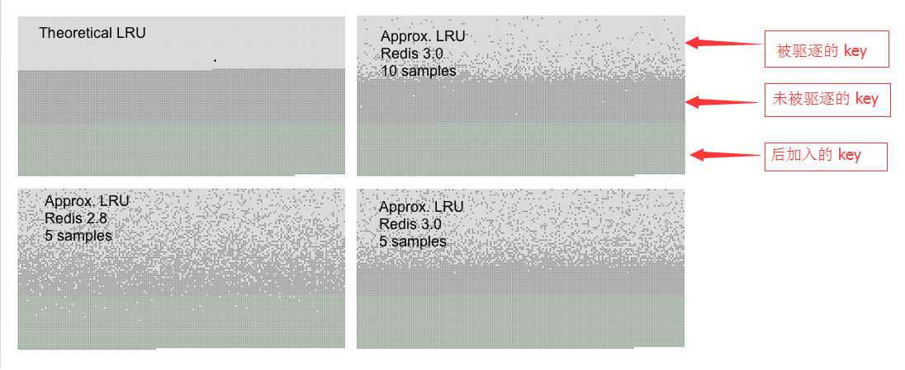

# Using Redis as an LRU cache

# 配置Redis作为LRU缓存


When Redis is used as a cache, sometimes it is handy to let it automatically evict old data as you add new one. This behavior is very well known in the community of developers, since it is the default behavior of the popular*memcached* system.

将 Redis 用作缓存时, 如果存储空间用满, 会自动将旧数据驱逐。 开发者都很熟悉 *memcached* 默认就是这种形式。


LRU is actually only one of the supported eviction methods. This page covers the more general topic of the Redis `maxmemory` directive that is used in order to limit the memory usage to a fixed amount, and it also covers in depth the LRU algorithm used by Redis, that is actually an approximation of the exact LRU.

实际上Redis只支持 LRU 这一种回收算法. 本文详细介绍限制最大内存使用量的 `maxmemory`  指令, 同时深入讲解 Redis 使用的LRU算法, 本质上算是一个近似的 LRU 算法。


## Maxmemory configuration directive

## maxmemory 指令


The `maxmemory` configuration directive is used in order to configure Redis to use a specified amount of memory for the data set. It is possible to set the configuration directive using the `redis.conf` file, or later using the [CONFIG SET](https://redis.io/commands/config-set) command at runtime.

`maxmemory` 指令用于指定 Redis 的最大内存使用量。既可以在 `redis.conf` 文件中设置, 也可以在运行过程中通过 [CONFIG SET](https://redis.io/commands/config-set) 命令修改。


For example in order to configure a memory limit of 100 megabytes, the following directive can be used inside the `redis.conf` file.

例如, 设置 100MB 的内存限制, 可以在 `redis.conf` 文件中这样配置：


```
maxmemory 100mb
```


Setting `maxmemory` to zero results into no memory limits. This is the default behavior for 64 bit systems, while 32 bit systems use an implicit memory limit of 3GB.

将 `maxmemory`  设置为 0 则表示没有内存限制。对于64位系统来说默认是没有限制, 而32位系统则有一个隐性限制: 最多 3GB 内存。


When the specified amount of memory is reached, it is possible to select among different behaviors, called **policies**. Redis can just return errors for commands that could result in more memory being used, or it can evict some old data in order to return back to the specified limit every time new data is added.

可以配置不同的策略, 称为 **policies**。 在达到最大内存使用量时, 如果需要更多的内存来存储新数据, 根据策略, Redis可以直接返回错误信息, 或者驱逐部分旧数据。


## Eviction policies

## 驱逐策略


The exact behavior Redis follows when the `maxmemory` limit is reached is configured using the `maxmemory-policy`configuration directive.

当达到最大内存限制时(`maxmemory`), Redis 根据 `maxmemory-policy` 配置决定具体的行为。


The following policies are available:

当前版本,Redis 3.0 支持的策略包括:


- **noeviction**: return errors when the memory limit was reached and the client is trying to execute commands that could result in more memory to be used (most write commands, but [DEL](https://redis.io/commands/del) and a few more exceptions).
- **allkeys-lru**: evict keys trying to remove the less recently used (LRU) keys first, in order to make space for the new data added.
- **volatile-lru**: evict keys trying to remove the less recently used (LRU) keys first, but only among keys that have an **expire set**, in order to make space for the new data added.
- **allkeys-random**: evict random keys in order to make space for the new data added.
- **volatile-random**: evict random keys in order to make space for the new data added, but only evict keys with an **expire set**.
- **volatile-ttl**: In order to make space for the new data, evict only keys with an **expire set**, and try to evict keys with a shorter time to live (TTL) first.

<br/>

- **noeviction**: 不驱逐策略, 在达到内存限制时, 如果需要更多内存, 直接返回错误响应信息。 大多数写命令会导致需要更多的内存(但极少数会例外, 如  [DEL](https://redis.io/commands/del) 等)。
- **allkeys-lru**: 优先删除最近最少使用(less recently used ,LRU) 的 key, 为新数据腾出空间。
- **volatile-lru**: 优先删除最近最少使用(less recently used ,LRU) 的 key, 但只限于设置了 **expire** 的部分, 为新数据腾出空间。
- **allkeys-random**: 随机驱逐一部分 key 。
- **volatile-random**: 随机驱逐一部分 key, 但只限于设置了 **expire** 的部分。
- **volatile-ttl**: 只限于设置了 **expire** 的部分, 优先驱逐剩余时间(time to live,TTL) 短的key。


The policies **volatile-lru**, **volatile-random** and **volatile-ttl** behave like **noeviction** if there are no keys to evict matching the prerequisites.

如果先决条件(prerequisites)没有 key 匹配, 那么 **volatile-lru**, **volatile-random** 和 **volatile-ttl** 策略和 **noeviction** 的行为基本上是一样的。


To pick the right eviction policy is important depending on the access pattern of your application, however you can reconfigure the policy at runtime while the application is running, and monitor the number of cache misses and hits using the Redis [INFO](https://redis.io/commands/info) output in order to tune your setup.

重要的是根据应用的访问模式, 选择适当的驱逐策略。 当然, 在运行过程中也可以动态设置驱逐策略, 并使用Redis命令 [INFO](https://redis.io/commands/info) 来监控缓存 miss 和命中率, 以进行调优。


In general as a rule of thumb:

一般来说:


- Use the **allkeys-lru** policy when you expect a power-law distribution in the popularity of your requests, that is, you expect that a subset of elements will be accessed far more often than the rest. **This is a good pick if you are unsure**.
- Use the **allkeys-random** if you have a cyclic access where all the keys are scanned continuously, or when you expect the distribution to be uniform (all elements likely accessed with the same probability).
- Use the **volatile-ttl** if you want to be able to provide hints to Redis about what are good candidate for expiration by using different TTL values when you create your cache objects.

<br/>

- 如果请求的的数据分为热点与非热点,使用 **allkeys-lru** 策略, 也就是说, 有一部分key会经常被读写. 如果不确定具体的业务情景,那么这是一个很好的选择。
- 如果不断地循环访问所有的key, 或者各个key的访问频率分布比较均匀, 那么使用 **allkeys-random**, (即所有元素被访问的概率相同)。
- 如果想提示Redis, 通过 TTL 来判断什么key合适删除, 使用 **volatile-ttl**。


The **volatile-lru** and **volatile-random** policies are mainly useful when you want to use a single instance for both caching and to have a set of persistent keys. However it is usually a better idea to run two Redis instances to solve such a problem.

**volatile-lru** 和 **volatile-random** 策略主要用在既有缓存,又有持久key的实例中. 但一般来说, 像这种情景,使用两个单独的 Redis 实例比较好。


It is also worth to note that setting an expire to a key costs memory, so using a policy like **allkeys-lru** is more memory efficient since there is no need to set an expire for the key to be evicted under memory pressure.

值得一提的是, 设置 key 的 expire 时间会消耗额外的内存, 所以使用 **allkeys-lru** 策略, 可以更有效地使用内存, 因为这样在有内存压力时就不需要再去设置过期时间了。


## How the eviction process works

## 驱逐的运作过程


It is important to understand that the eviction process works like this:

驱逐过程可以这样理解:


- A client runs a new command, resulting in more data added.
- Redis checks the memory usage, and if it is greater than the `maxmemory` limit , it evicts keys according to the policy.
- A new command is executed, and so forth.

<br/>

- 客户端执行一个命令, 导致 Redis 中的数据增加,占用更多内存。
- Redis 检查内存使用量, 如果超过 `maxmemory` 限制, 就会根据策略清除一些 key。
- 执行下一个命令, 以此类推。


So we continuously cross the boundaries of the memory limit, by going over it, and then by evicting keys to return back under the limits.

所以这个过程中, 内存使用量会不断达到最大值, 然后超过这个值, 然后通过驱逐部分 key, 使用量又降到最大值以下。


If a command results in a lot of memory being used (like a big set intersection stored into a new key) for some time the memory limit can be surpassed by a noticeable amount.

如果一个命令导致大量内存占用(比如使用 key 存储一个超大的 set), 在某段时间内可能会明显远远超过 maxmemory 的限制。


## Approximated LRU algorithm

## 近似LRU算法


Redis LRU algorithm is not an exact implementation. This means that Redis is not able to pick the *best candidate* for eviction, that is, the access that was accessed the most in the past. Instead it will try to run an approximation of the LRU algorithm, by sampling a small number of keys, and evicting the one that is the best (with the oldest access time) among the sampled keys.

Redis 实现的并不是纯粹的 LRU算法。也就是在驱逐 key 时,并不能选择最应该抛弃的那个, 即访问的访问大多数在过去. Redis使用的是一种近似的LRU算法, 通过抽样少量的 key, 然后驱逐其中最符合条件的那个key(with the oldest access time)。


However since Redis 3.0 the algorithm was improved to also take a pool of good candidates for eviction. This improved the performance of the algorithm, making it able to approximate more closely the behavior of a real LRU algorithm.

从 Redis 3.0 开始, 驱逐算法得到了很大的改进, 使用了一个 pool 来作为驱逐候选. 这提高了算法的效率, 使其能够更接近于真实的LRU算法。


What is important about the Redis LRU algorithm is that you **are able to tune** the precision of the algorithm by changing the number of samples to check for every eviction. This parameter is controlled by the following configuration directive:

Redis 的 LRU 算法中, 可以通过设置样本(sample)的数量来优化算法的精度。 这个参数通过以下指令配置:


```
maxmemory-samples 5
```


The reason why Redis does not use a true LRU implementation is because it costs more memory. However the approximation is virtually equivalent for the application using Redis. The following is a graphical comparison of how the LRU approximation used by Redis compares with true LRU.

Redis 不使用真正的LRU实现的原因是为了节省内存。但 Redis 的行为和LRU基本上是等价的. 下面是一个 Redis LRU 与真正的 LRU 行为的对比图。





The test to generate the above graphs filled a Redis server with a given number of keys. The keys were accessed from the first to the last, so that the first keys are the best candidates for eviction using an LRU algorithm. Later more 50% of keys are added, in order to force half of the old keys to be evicted.

测试过程中, 依次从第一个 key 开始访问, 所以第一个 key 才是LRU算法的最佳驱逐对象。


You can see three kind of dots in the graphs, forming three distinct bands.

图中可以看到三种类型的点, 形成三个不同的条带。


- The light gray band are objects that were evicted.
- The gray band are objects that were not evicted.
- The green band are objects that were added.

<br/>

- 浅灰色的部分表示被驱逐的对象。
- 灰色的部分表示未被驱逐对象。
- 绿色的部分表示后添加的对象。


In a theoretical LRU implementation we expect that, among the old keys, the first half will be expired. The Redis LRU algorithm will instead only *probabilistically* expire the older keys.

在理论LRU的实现中, 如同我们期待的一样, 在旧的key中, 前半部分被释放了。而 Redis 的 LRU 算法只是较大概率地(*probabilistically*)将时间较长的 key 给释放了。


As you can see Redis 3.0 does a better job with 5 samples compared to Redis 2.8, however most objects that are among the latest accessed are still retained by Redis 2.8. Using a sample size of 10 in Redis 3.0 the approximation is very close to the theoretical performance of Redis 3.0.

正如你所看到的, Redis 3.0 中 5 样本的效果比起 Redis 2.8 要好, 当然 Redis 2.8 中最后访问的key基本上都还留在内存中. Redis 3.0 中使用10个样本时,已经非常接近与真正的 LRU 算法。

Note that LRU is just a model to predict how likely a given key will be accessed in the future. Moreover, if your data access pattern closely resembles the power law, most of the accesses will be in the set of keys that the LRU approximated algorithm will be able to handle well.

注意,LRU只是一个用来预测将来可能会访问某个给定key的概率模型. 此外,如果数据访问的情况符合幂次模式, 那么LRU对于大部分的访问都会表现良好。


In simulations we found that using a power law access pattern, the difference between true LRU and Redis approximation were minimal or non-existent.

在模拟中, 我们发现, 如果使用幂律访问模式, 真正的LRU 和Redis的结果差别很小, 甚至看不出来。


However you can raise the sample size to 10 at the cost of some additional CPU usage in order to closely approximate true LRU, and check if this makes a difference in your cache misses rate.

当然你也可以提高样本数量为10, 以额外消耗一些CPU为代价, 使得结果更接近于真实的LRU, 并通过 cache miss 统计来判断差异。


To experiment in production with different values for the sample size by using the `CONFIG SET maxmemory-samples <count>` command, is very simple.

设置样本大小很容易, 使用命令 `CONFIG SET maxmemory-samples <count>` 即可。


原文链接: <https://redis.io/topics/lru-cache>

