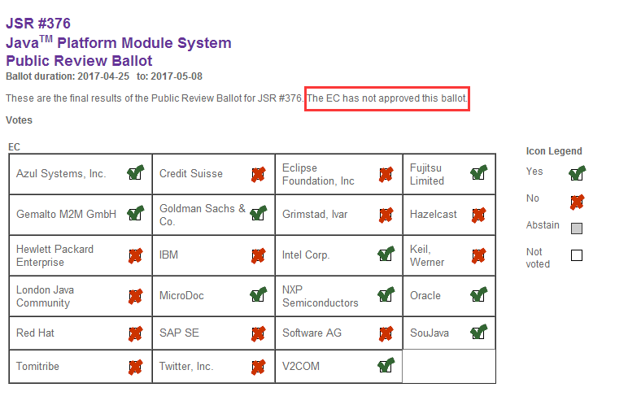

# Java模块化系统在JCP投票中未获通过

自从2009年Oracle收购SUN以来,外界对Oracle的评价一直不太高。匆忙推出的Java8版本更是一个半成品, 但从未像此次一样, JCP专家组的意见和分歧如此巨大。 Java 9.0 一直在跳票, 迫于压力, Oracle想要强推Jigsaw, 却遭到了友军主力的剧烈反对。 JCP 是否会因此名存实亡, Java社区是否会分裂, 是否会出现 Java++? 未来将何去何从, 作为外人,我们还需等待。

2017年5月8日,星期一, Java模块化系统(Jigsaw项目, JSR-376)的公开预览版投票结果确定, 其中10票赞成,13票反对, 该请求未获通过。 

此次投票的结果如下图所示:

可能你已经从其他渠道看到这张图片了, 如果你感兴趣,可以查看该结果的详细页面: <https://jcp.org/en/jsr/results?id=5959>

当然, 如果对JSR-376的详细信息感兴趣,请点击: <https://jcp.org/en/jsr/detail?id=376>

下面是几个缩略词的简单说明:

- Jigsaw: 直译为 "拼图", 是Java模块化系统的项目代号, 可以从这个代号中看出一些目标。

- JSR: Java Specification Requests, 直译为 Java规范请求,如 JVM规范,Java语言规范等等。每个规范,都类似于流程审批,由 JCP 专家委员会负责审核。

- JCP: Java Community Process, JCP组织, 直译为 Java 社区进程/流程。

- EG: Expert Group, 专家组

- EC: Executive Committee, 执行委员会

接下来我们看看详细的投票记录, 挺有意思的。

###  投票记录

投票开始的第一天, 2017-04-25日, Oracle 投了赞成票(Yes).
------------------------------------------------------------------------------
第四天, 星期五, 2017-04-28日, IBM 投了反对票(No), 反对的理由是:
IBM's vote reflects our position that the JSR is not ready at this time to move beyond the Public Review stage and proceed to Proposed Final Draft.  The JSR 376 Expert Group and the public have raised a number of reasonable issues and concerns with the current public review draft of the specification that warrant further discussion and resolution.  We advocate work continuing amongst all members of the Expert Group to address the issues documented on the mailing lists.  IBM would like to see closer consensus amongst the entire Expert Group before this specification proceeds to the next step.

IBM认为, 此 JSR 目前还存在一些问题, 不能通过公共审查阶段(Public Review), 当然也还不适合进入最终草案(Proposed Final Draft)。 JSR 376专家组和公众们对目前公布的规范草案密切关注,并提出了一些合理的问题, 需要进一步讨论和解决。 我们主张: 专家组的所有成员继续开展工作，以解决邮件列表中提到的问题。 在本规范进行到下一步之前, IBM希望整个专家组中达成更紧密的共识。
------------------------------------------------------------------------------
第二天, 星期三, 2017-04-26日, Intel 投了赞成票(Yes).
------------------------------------------------------------------------------
第二天, 星期三, 2017-04-26日, NXP Semiconductors 投了赞成票(Yes).
------------------------------------------------------------------------------
最后一天, 星期一, 2017-05-08日, Keil, Werner 投了反对票(No), 反对的理由是:
I understand IBM's and others reason for their "No" vote and heard many similar concerns by e.g. the OSGi community or contributors behind major build systems like Maven, Gradle or Ant. Most of their concerns are still unanswered by the EG or Spec Leads, which at this point I does not make this JSR seem ready yet.

我理解IBM和其他人反对的理由, 并听到许多类似的说法。 OSGi社区, 以及主要构建工具（如Maven，Gradle 和 Ant）的贡献者们, 大部分都还没有得到 EG 或 Spec Leads 的回答，基于这一点，我认为这个 JSR 还未准备充分。
------------------------------------------------------------------------------
2017-05-03日, 星期三, Hazelcast 投了反对票(No), 反对的理由是:
From our point of view the lack of consensus inside the EG is a dangerous sign, that either not all issues are clarified the way they have to or that certain issues were marked solved from a single point of view. Overall, we acknowledge, that the state made big progress over the last months and a lot of issues were addressed with the community but it seems that the state for a public review ballot is not yet right. 
In addition, problems with popular build tools don't seem like a good starter. Our understanding of the EC is, that part of the work is to prevent the Java ecosystem from harm and in the current state the JSR376 cannot be seen as ready for that matter.

以我们的观点来看，EG内部缺乏共识是一个危险的迹象，既不是所有的问题都被澄清, 或者从单一的角度来看，某些问题也尚未得到明确的解决。 总的来说，我们承认，过去几个月来，还是取得了很大的进步，社区中也解决了很多问题，但现在进行公开审查投票似乎还太早了一点。
此外，主流的构建工具中存在的问题看起来也不太完美。 我们专家组的意见是，决不能破坏 Java的整个生态，目前来看，JSR376 的状态不能算是准备就绪。
------------------------------------------------------------------------------
2017-05-03日, 星期三, Red Hat 投了反对票(No), 反对的理由是:
Red Hat is voting NO on this JSR. The Red Hat middleware team, other members of the EC and Java community members, have mentioned publicly and in more detail our concerns (here
https://developer.jboss.org/blogs/scott.stark/2017/04/14/critical-deficiencies-in-jigsawjsr-376-java-platform-module-system-ec-member-concerns and here
https://developer.jboss.org/servlet/JiveServlet/download/38-155022/JSR376.pdf). 

We have also discussed with our own OpenJDK team, which made good counter arguments to several of the concerns, but in the end we believe a NO vote is the correct course of action. In previous votes and comments on the EG list we have articulated the view that from a middleware/SE developer perspective we believe that Jigsaw does not fulfil its original goals of being a module system which can be used by the likes of Java EE. We understand that after inception the original goals of the EG were initially changed to try to focus it on a module system to be used solely to modularise the JVM and that caused some architecture and implementation approaches which made it difficult for it to be a module system to be used by SE and EE developers. Unfortunately during the lifetime of the EG the goal appeared to switch back to trying to make it a module system for Java developers but previous implementation decisions appear not to have been revisited or could not be changed and as a result the expectations around Jigsaw have not been met by the implementation. Therefore, we are worried about the impact of the current implementation on the wider Java community, particularly existing projects and products including, but also beyond, Java EE. We have raised several issues within the EG list to try to rectify a few of these things in what we believe would have been a minimally invasive manner but they have been rejected. Furthermore, we believe that there has been insufficient consensus in the EG for a series of changes so dramatic to the JVM and which could have an equally dramatic impact on the Java communities, as well as a lack of openness on receiving and discussing community input. We believe that a more considered evaluation of all input and consensus gathering should not take too much time and would result in something which would be better received by the entire Java ecosystem.

Red Hat middleware team 的EC成员, 以及Java社区都期待更多的细节, 请参考 [here](https://developer.jboss.org/blogs/scott.stark/2017/04/14/critical-deficiencies-in-jigsawjsr-376-java-platform-module-system-ec-member-concerns) and [here](https://developer.jboss.org/servlet/JiveServlet/download/38-155022/JSR376.pdf)。 我们和自己的OpenJDK团队进行过讨论，对这些关注点展开了很多交流，最后我们认为投反对票(NO vote)才是正确的选择。在之前专家组邮件列表的投票和评论中, 我们阐明了, 从中间件/JavaSE开发人员的角度看，我们认为 Jigsaw 还未能达成其作为模块化系统的最初目标, Java EE 似乎也是这样。我们了解到, EG的最初目标被项目组改变了, 试图做出一个仅适用于JVM模块化的模块系统之中, 这就导致一些架构和实现方法，难以成为由SE和EE开发者使用的模块系统。杯具的是，EG的目标是试图使其成为普通Java开发者也能使用的模块系统, 但之前的实现决策似乎没有重新修订, 或者是不能被更改, 结果是现在的实现还没有达到对Jigsaw的预期。所以我们担心当前的这种实现会对Java社区造成绝大的冲击，特别是现有的项目和产品，包括但不限于Java EE。我们在EG列表中提出了一些 issues，试图纠正这些事情，我们认为只需要一些很微小的手术，但却被拒绝了。此外，我们认为，专家组对JVM中一系列剧烈的改变缺乏共识，对Java社区也可能产生同样剧烈的影响，以及缺乏开放性,不接受社区的投入和探讨。我们认为，收集各种探讨和投入并进行评估, 应该花不了太多时间，而结果会是整个Java生态都能够更好地接受。

------------------------------------------------------------------------------
2017-05-05日, 星期五, Goldman Sachs & Co. 投了赞成票(Yes).
------------------------------------------------------------------------------
2017-05-07日, 星期天, Software AG 投了反对票(No), 反对的理由是:

Software AG is concerned about the lack of a healthy consensus among the members of the Expert Group. Although we understand that a perfect consensus and zero outstanding issues may be unachievable, we believe that a healthier consensus is possible.We also believe that such a consensus would result in a healthier Java ecosystem and a smoother industry transition to a modular Java world.
Assuming the ‘No’ vote carries, we hope the specification lead would take advantage of the 30 days afforded under the JCP process to attempt to form a healthier consensus within the EG.  We would appreciate specific attention being paid to the migration path for existing software in a modular world and on the co-existence of the specification with existing established Java practices and build systems (#ModuleNameInManifest, #CyclicDependences, #AutomaticModuleNames, #AvoidConcealedPackageConflicts, #MultiModuleJARs)

We look forward to being able to vote ‘Yes’ on a draft that has stronger backing from its EG in a future ballot.

Software AG担心专家组成员之间缺乏必要的共识。虽然我们也理解, 要达到完美的共识,和一点问题都没有是不可能的，但更健康的共识是可能的。我们也相信，这样的共识会让Java生态更加健康,让整个行业向模块化转型更加顺畅。

如果明天此提案没有通过，我们希望规范的lead可以利用 JCP流程提供的30天缓冲时间，在专家组内形成更和谐的共识。我们特别关注现有软件到模块化的迁移途径，以及规范同现有模式和构建系统的共存（#ModuleNameInManifest，#CyclicDependences，#AutomaticModuleNames，#AvoidConcealedPackageConflicts，#MultiModuleJARs ）

我们期待能够对未来的草案投赞成票(‘Yes’)。
------------------------------------------------------------------------------
2017-05-07日, 星期天, Azul Systems, 公司 投了赞成票(Yes).
------------------------------------------------------------------------------
最后一天, 星期一, 2017-05-08, MicroDoc 投了赞成票(Yes).
------------------------------------------------------------------------------
最后一天, 星期一, 2017-05-08, Gemalto M2M GmbH 投了赞成票(Yes).
------------------------------------------------------------------------------
最后一天, 星期一, 2017-05-08, Credit Suisse 投了反对票(No), 反对的理由是:
Credit Suisse represents customers of the Java technology in the EC. With JSR 376, two main concerns exists (i.e., automatic modules, reflection) that potentially conflict with an easy adoption of this JSR. Our understanding is that solutions have been proposed in the EG and it seems to be beneficial to give the EG some more time to get consensus on these important topics.

Credit Suisse 代表了执行委员会中的Java技术客户。 现在的JSR 376，存在两个主要问题（即 automatic modules, 以及 reflection），这可能与易用性有冲突。 我们的理解是，专家组中已经提出了解决方案，很有必要给专家组更多的时间来达成共识。
------------------------------------------------------------------------------
最后一天, 星期一, 2017-05-08, SAP SE 投了反对票(No), 反对的理由是:

We absolutely recognize the tremendous achievements and the great work that has been carried out until now - by the expert group members as well as (and especially) by the spec lead himself. While the JPMS is in pretty good shape for the modularisation of the Java platform itself, we think that there are still some rough edges for libraries and frameworks outside the Java platform which should be addressed and agreed upon before the final approval of the specification.

We acknowledge the open development of the JPMS in the context of the "Project Jigsaw" within the OpenJDK. But we are at the same time concerned about the growing tension between the OpenJDK JEP and the JCP JSR processes. During the development and up to now it has not always been clear what in the development of the JPMS/Jigsaw is considered an implementation detail and what will be part of the standard specification. Features like the binary format of modules and runtime images, the jlink tool and new class attributes like hashes and versions are examples for non-standardised implementation details.

What we are especially concerned about however, is the lack of direct communication within the expert group. Assuming this JSR won't be approved with the required two-thirds majority, we would expect the expert group and spec lead to use the additional 30 days for regular meetings in order to sort out the remaining issues and come up with a new, more sustainable and forward looking proposal. While we're aware that it won't be possible to remedy all concerns, we think that the last days have clearly demonstrated that good compromises are still possible (e.g. the "automatic modules issue") and we're confident that the additional time could be used to submit a better specification for the reconsideration vote.

Finally, we adjure all members and the spec lead to come back to the table and communicate directly to each other instead of blaming each other through blogs and open letters!

我们绝对认可，截至目前由专家组成员以及（特别是）规范领导本人所付出的巨大努力,以及取得的伟大成就。虽然JPMS对于Java平台本身的模块化来说非常好，但我们认为Java平台之外的库和框架仍然存在很大的界限，在最终的规范表决之前应该加以解决和商定。

我们承认JPMS的开放发展在OpenJDK中"Jigsaw 项目"的背景下。但我们同时也关注OpenJDK JEP和JCP JSR流程之间日益紧张的关系。在开发过程中，到目前为止，尚未明确将JPMS/拼图的开发视为实施细节，以及哪些哪些内容将会称为标准规范的一部分。诸如模块和运行时映像的二进制格式，jlink 工具和, 以及 新的 class 属性, 诸如 hashes 和 versions 等都是非标准化实现的示例。

然而，我们特别关心的是专家组内缺乏直接沟通。假设这个 JSR 不能达到所需的三分之二的大多数同意，我们期望专家组和规范lead在额外的30天时间内进行正规的沟通会议，以便整理出剩下的问题，并提出一些新的，更多的可持续和具有前瞻性的建议。虽然我们意识到无法补救所有的问题，但我们认为最近几天已经清楚地表明，仍然可以做出一些妥协（例如 "automatic modules issue"），我们坚信额外的时间可以用来提交更好的表决规范更新。

最后，我们呼吁所有的专家组成员和规范leader，一起坐下来好好谈谈，互相沟通一下，而不是通过博客和公开信相互进行指责！

------------------------------------------------------------------------------
最后一天, 星期一, 2017-05-08, London Java Community 投了反对票(No), 反对的理由是:

We echo SAP's comments in that we absolutely recognize the tremendous achievements and the great work that has been carried out until now by the EG members as well as (and especially) by the Spec Lead himself.

The LJC is voting "No" on the spec *as it was submitted* at the start of the voting period.  During the 14 day voting period, great progress was made by the Spec Lead and the EG to reach consensus on some very difficult issues such as #AutomaticModuleNames.  However, there are still on going conversations on some of those issues and there simply has not been enough time spent by the ecosystem to discuss some of the new designs in enough depth or enough time spent implementing and testing prototypes based on the latest spec, e.g. The Eclipse ejc compiler or the latest Automatic Module Naming design in Maven.

If required, we very much look forward to being able to vote ‘YES’ in <= 30 days on a version that has had that little bit of extra time for the EG (and the ecosystem) to discuss / implement / test some of these difficult spec items. Certainly the last 14 days have shown that consensus can be reached even when viewpoints have started in opposing corners, and we think another short time period to really bed in the last sticking points is needed.

我们回应SAP的意见，因为我们绝对认可EG成员迄今为止以及（特别是）由Lead Lead自己所做的巨大成就和伟大的工作。

在投票一开始，LJC就投了反对票(No)。在14天的投票周期中，规格领导和技术委员会在一些非常困难的问题上达成了共识，如 `#AutomaticModuleNames`。然而，仍然有一些这些问题的谈话，还缺乏足够的时间来讨论一些新的设计，足够深度或足够的时间基于最新的规范，例如 Eclipse ejc compiler或 Maven中最新的Automatic Module Naming 设计。

如果需要，我们非常期待能够在  <= 30 天之内的一个版本上投赞成票 ‘YES’, 该版本应该为EG（和生态系统）提供了一些额外的时间来 discuss / implement / test 这些困难的规范项。过去的14天已经表明, 即使在反对的立场, 依然可以达成一些共识，我们认为在最后一个关键点上还需要一段时间才能真正解决问题。

------------------------------------------------------------------------------
最后一天, 星期一, 2017-05-08, V2COM 投了赞成票(Yes), 并说明了原因:

V2COM shares other EC members' concerns, but we believe that all major concerns can be addressed between this ballot and the next ballot. 

V2COM与其他EC成员的关切共享，但我们认为，在这次投票和下一次投票期间,可以解决所有主要的问题。

------------------------------------------------------------------------------
最后一天, 星期一, 2017-05-08, Grimstad, Ivar 投了反对票(No), 反对的理由是:

I am voting "No" on the specification as it was submitted at the start of the voting period.  The discussion during the 14 day voting period has been very good, and I applaud the progress being made by the Spec Lead and EG in this period. Especially the latest Automatic Module Naming proposal.

With continued discussion and these changes incorporated in spec, I look forward to vote "Yes" in a potential reconsideration ballot.

在表决开始时提交的规格表决中，我投了“不”。 14天投票期间的讨论情况非常好，我赞扬规格和EG在此期间取得的进展。 特别是最新的自动模块命名方案。

在继续讨论并将这些变更纳入规范中，我期待着在可能的重新考虑投票中投票“是”。

------------------------------------------------------------------------------
最后一天, 星期一, 2017-05-08, Twitter 公司投了反对票(No), 反对的理由是:

We see the introduction of the Java Platform Module System (JPMS) in Java 9 as a desirable and worthwhile addition to the Java platform. We also appreciate the enormous and difficult task it has been to retrofit a mature and widely-used language like Java with a module system 20 years later. And we are thankful to the JSR lead, the Expert Group (EG), and everyone involved for their dedication and all the hard work it has taken to make it a reality.

Our main concern is that it is likely that this JSR will prove disruptive to Java developers, while ultimately not providing the benefits that would be expected of such a system. We are worried that this will delay wide-scale adoption of this important technology. We hope that if the JPMS accomplishes some of its original goals more comprehensively (in particular, collisions in non-exported package names are arguably incompatible with the "non-interference" and "strong encapsulation" goals) it can address real pain points that Java developers have today (e.g., dealing with multiple copies of the same package by hiding them as non-exported packages). This would encourage more developers to rapidly adopt modular development.

Finally, we think broader consensus among the JSR lead and the EG members is necessary for such an important JSR.

我们看到Java 9中Java平台模块系统（JPMS）的引入是对Java平台的理想和有价值的补充。我们还感谢在20年后，将成熟和广泛使用的语言（如Java）与模块系统相结合的巨大而艰巨的任务。我们感谢JSR的领导，专家组（EG）和所有参与者的奉献精神以及为实现这一目标所做的一切努力。

我们的主要关切是，这个JSR很可能会对Java开发人员造成破坏，而最终不能提供这样一个系统所期待的好处。我们担心这将延迟这一重大技术的大规模采用。我们希望如果JPMS更全面地完成了一些原来的目标（特别是非导出包名称中的冲突可以说是与“不干涉”和“强封装”）的目标不相容），它可以解决真正的痛点，即Java开发人员今天（例如，通过将它们隐藏为未导出的包来处理同一个包的多个副本）。这将鼓励更多开发商快速采用模块化开发。

最后，我们认为JSR领导和EG成员之间更广泛的共识对于这样一个重要的JSR是必要的。

------------------------------------------------------------------------------
最后一天, 星期一, 2017-05-08, SouJava 投了赞成票(Yes), 并说明了原因:
SouJava votes YES for the Java Platform Module System specification. 

As others have said, we agree there has been a tremendous achievement in this effort by the team, in something many believed would never succeed. But the uneasiness of a specification that was not agreed by the EG it was ready for public review led the discussions inside SouJava towards a NO vote. 

The movement of the Spec Lead in the last few weeks changed the general sentiment, and we are thankful for the effort of solving the issues. 

We agree with the London Java Community and others that the specification AS WAS SUBMITTED for public review is lacking. We understand that the Spec Lead should focus on an initial release that will be improved later, and we were even willing to accept some compromising on the tooling issues. 

But if the specification does not support independent implementations, it's a bigger problem. Independent implementations are the primary objective of the JCP, and we do not intend to keep the yes vote if the situation persists. 

SouJava对Java平台模块系统规范投票为YES。

正如其他人所说，我们认为，这个团队在这个努力中取得了巨大的成就，许多人相信永远都不会成功。但是，已经准备好进行公开审查的EG未经同意的规范的不安情绪导致SouJava内的讨论不经表决。

在过去几个星期，规格牵头的运动改变了大众的情绪，我们感谢解决问题的努力。

我们同意伦敦Java社区和其他人的意见，提交公开审查的规范是缺乏的。我们明白规格要点应该着重于稍后会有所改进的初始版本，我们甚至愿意接受一些妥协的工具问题。

但是如果规范不支持独立的实现，那就是一个更大的问题。独立实施是JCP的主要目标，如果情况仍然存在，我们不打算保留是的投票。

------------------------------------------------------------------------------
最后一天, 星期一, 2017-05-08, Fujitsu Limited 投了赞成票(Yes), 并说明了原因:
There are a lot of concerns, but we hope EG members will resolve them by the next ballot.

虽然还有很多问题，但我们希望专家组成员们可以在下一轮的投票中解决。

------------------------------------------------------------------------------
最后一天, 星期一, 2017-05-08, Eclipse Foundation, Inc 投了反对票(No), 反对的理由是:
Like LJC, the Eclipse Foundation is voting "No" on the spec *as it was submitted* at the start of the voting period. The Eclipse Foundations looks forward to a revised specification which will enable independent implementations. The recent conversations have been very positive, and we feel that the expert group is moving into the right direction. However, the draft spec that are have been asked to vote on do contain a number of serious deficiencies, as documented by the recent conversations on the various mailing lists. We feel that the spec will be significantly improved by an opportunity to complete those conversations and include them in a revised draft.

像LJC一样，Eclipse基金会在投票开始时就提交了*表示“否”。 Eclipse Foundations希望能够实现独立实现的修订规范。 最近的对话非常积极，我们觉得专家组正在朝着正确的方向前进。 然而，已经被要求投票的规范草案包含了一些严重的缺陷，最近几个邮件列表上的谈话记录在案。 我们认为，通过完成这些对话并将其纳入修订草案的机会，规格将大大改善。

------------------------------------------------------------------------------
最后一天, 星期一, 2017-05-08, Hewlett Packard Enterprise 投了反对票(No), 反对的理由是:
While recognizing progress made by expert group and lead, Hewlett Packard enterprise prefers to allow expert group to address inputs, resolve open issues and come up with updated draft.  

惠普公司在认识到专家组和负责人取得的进展的同时，倾向于允许专家组解决投入问题，解决公开问题，并提出更新草案。

------------------------------------------------------------------------------
最后一天, 星期一, 2017-05-08, Tomitribe 投了反对票(No), 反对的理由是:

Tomitribe’s no vote is tempered with a concern the specification does in fact make it through the JCP process successfully.  The risk of passing this JSR through to the next stage is that should it fail the Final Approval Ballot, the spec lead and EG have only 30 days to resolve all issues or the specification fails permanently per JCP rules.

We echo sentiments of other voters in applauding the progress in the last 14 days.  While the 30 days window afforded by a No vote will not gain a perfect consensus, we do believe it will help significantly.  It allows time for the dust to settle; with all the changes in the last 2 weeks, what exactly will be presented for a final vote is in some ways less clear.  

We see positives in opting for a 30 fixed window for feedback to and from the EC as it keeps pressure which is critical for momentum.  JSR-299 (CDI 1.0) went 9 months between its Public Review Ballot and Final Approval Ballot, delaying Java EE 5 significantly.  We would not want to see the same happen here.  The 30 day window applies both to the spec lead and essentially to the EG who knows we'll be voting immediately after.

Though a No vote feels like rejection we ultimately believe it is the most supportive vote for gaining a greater level of consensus we believe is necessary from a JSR, while still keeping time pressure.

Tomitribe 投反对票的原因是希望此规范最终能够通过JCP进程。如果让此JSR直接通过并进入到下一阶段的风险在于, 如果最终投票不能通过，则规范lead和EG就只有30天来解决所有的问题，根据JCP规则,此规范会永久性终止。

我们回应其他投票者的看法，赞扬过去14天的进展情况。虽然在投票不通过时,所提供的30天窗口期内并不一定能获得完美的共识，但我们相信这会有很大的帮助。它可以让灰尘沉淀下去。在过去2周的所有变化中，最终投票将会在某些方面更清楚。

我们看到积极的选择30个固定的窗口反馈到EC，因为保持压力也是至关重要的动力。 JSR-299（CDI 1.0）的 Public Review 投票和 Final Approval 投票之间间隔了9个月的时间，大大延误了Java EE 5。我们不想再次看到同样的事情。 30天的窗口既适用于 spec lead，也适用于之后进行投票的EG。

虽然投反对票感觉像是拒绝, 我们相信最后这是获得更大程度的共识的最有支持的投票，我们认为这是一个JSR所必需的，同时仍然保持时间压力。

------------------------------------------------------------------------------

投票结束之后,

5月9日, IBM 在其[官方博客上解释](https://developer.ibm.com/javasdk/2017/05/09/ibms-no-vote-jsr-376-java-platform-module-system/)道:

In the comment accompanying our vote on JSR 376 we expressed a desire to see ongoing discussion, and that the Expert Group should reach closer consensus that the specification is ready to proceed to Proposed Final Draft status. The result of the Executive Committee ballot supports that position.
Java is stronger by having a rich variety of implementations backed by a robust specification and compatibility test suite. It remains important to the broader Java ecosystem that the Proposed Final Draft meets the needs of those implementers and users. The JCP is an important part of that process.
IBM values the JCP standards process. As a key member of the JCP, expert group member, and implementer of many JCP specifications, it is important to IBM that we ensure new specifications protect the Java ecosystem and ensure compatibility while evolving the technology, to ensure that Java remains the best platform for enterprise applications.
The Java Platform Module System is a significant new feature for Java SE 9. The work that has been accomplished should not be underestimated. A pragmatic, collaborative approach to the remaining few issues will allow applications to demonstrate the value that this JSR brings to the platform, and will provide invaluable experience that will help Java advance.
We remain optimistic that that the Expert Group and Specification Lead will continue to work together closely and productively on refining the draft specification. We are confident that the JSR 376 specification can be amended to improve the position on a few remaining technical issues and be presented for Proposed Final Draft without significant disruption to the Java 9 project schedule.

在我们对JSR 376的投票中的评论中，我们表示希望看到正在进行的讨论，专家组应该达成更接近的一致意见，即说明书准备好进行拟议的最终草案状态。执行委员会的投票结果支持这一立场。
通过拥有强大的规范和兼容性测试套件支持的丰富多样的实现，Java更加强大。对于更广泛的Java生态系统来说，拟议的最终草案满足实施者和用户的需求仍然很重要。 JCP是该过程的重要组成部分。
IBM重视JCP标准流程。作为JCP的关键成员，专家组成员以及许多JCP规范的实现者，对于IBM来说，重要的是我们确保新的规范保护Java生态系统，确保兼容性，同时不断发展技术，确保Java仍然是企业应用。
Java平台模块系统是Java SE 9的一个重要的新功能。已经完成的工作不应该被低估。对其余几个问题的务实，协作的方法将允许应用程序演示该JSR为平台带来的价值，并将提供有助于Java推进的宝贵经验。
我们仍然乐观地认为，专家组和规范主管将继续密切和有效地共同完善规范草案。我们相信，JSR 376规范可以修改，以改善其他技术问题的立场，并提交给拟议的最终草案，而不会对Java 9项目进度造成重大影响。

Java9强行推出,那么可能就是一个过渡版。

Java9延期推出,那么日子同样过,社区并不会因为跳票而产生多少影响。

最后说一句, 其实不用过于担心, Oracle股价未受明显影响, 所以这只是一件小事情。

相关链接:

向JCP执行委员会发出的公开信:

http://datamarket.atman360.com/133091

JCP的Twitter地址: [https://twitter.com/jcp_org](https://twitter.com/jcp_org)

