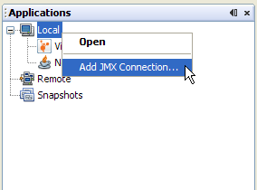
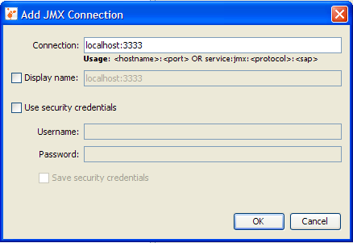
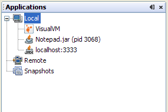
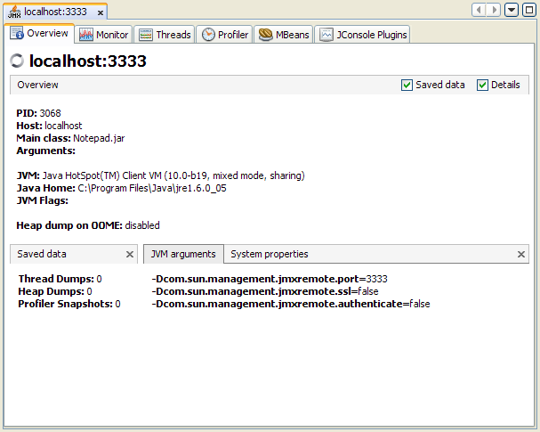
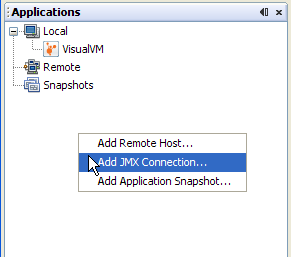
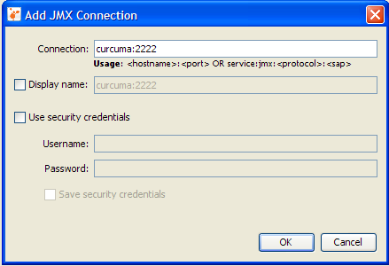
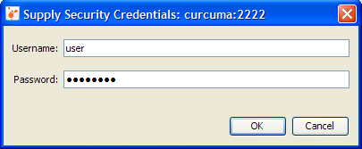
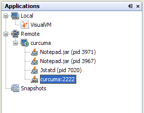
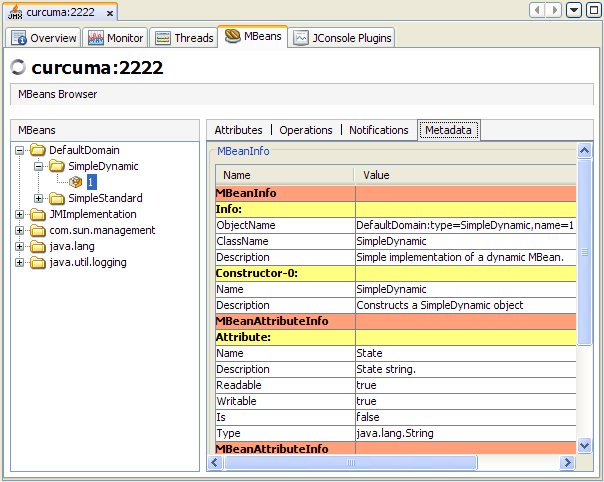

# Java VisualVM - 配置 JMX 连接


Java Management Extensions (JMX) technology can be used to monitor and manage any Java technology-based applications (Java applications) that are running in either a local or a remote Java Virtual Machine (JVM). Java applications are automatically exposed for monitoring and management by JMX agents if they are run on the Java platform, Standard Edition (Java SE platform) version 6. If the Java applications are running on the Java 2 platform, Standard Edition (J2SE platform) 5.0, you can expose them manually for monitoring and management by setting the com.sun.management.jmxremote.* system properties when the applications are launched. Setting these system properties, or running your applications on version 6 of the Java SE platform, enables the platform's *out-of-the-box* monitoring and management capability, automatically enabling the platform MBean server in the JVM software, and registering MBeans in it that expose the application for management by any appropriately configured JMX client application. VisualVM is one such JMX client application.

JMX技术(Java Management Extensions, Java管理扩展),主要用于监控和管理JVM以及其中运行的各种Java程序, 这些程序可能位于本地 JVM 中, 也可能运行在远端机器的JVM中。为了方便监控管理, 从JavaSE 6.0开始, JMX agent 会自动检测该机运行的Java程序.  如果是 J2SE 5.0 平台, 也可以在JVM启动时, 手动设置 `com.sun.management.jmxremote.*` 这一类系统属性值.  配置jmx之后, JMX启动时会自动开启监控管理功能, 启用内置的MBean服务器, 并注册MBean, 各种标准JMX客户端都可以连接到 JMX Agent.  其中一种客户端是 VisualVM 。


**NOTE**: For a very brief introduction to JMX technology, MBeans, the platform MBean server, and how to monitor and manage MBeans using Java VisualVM, see the [Java VisualVM MBeans Tab](http://visualvm.java.net/mbeans_tab.html) page. For an introduction to the Java SE platform's out-of-the-box monitoring and management capability, see [*Monitoring and Management Using JMX Technology*](http://docs.oracle.com/javase/8/docs/technotes/guides/management/agent.html) in the [Java SE Platform Monitoring and Management Guide](http://docs.oracle.com/javase/8/docs/technotes/guides/management/toc.html).

> **注意**: 关于 JMX 技术, MBeans, platform MBean server 的信息简介, 以及如何使用Java VisualVM 来监控管理 MBean, 请参考 [Java VisualVM MBeans Tab](http://visualvm.java.net/mbeans_tab.html) 页面. 
>
> 关于Java SE 开箱即用的监控管理功能, 请参考 [*Monitoring and Management Using JMX Technology*](http://docs.oracle.com/javase/8/docs/technotes/guides/management/agent.html); 
>
> 完整的用户指南请访问 [Java SE Platform Monitoring and Management Guide](http://docs.oracle.com/javase/8/docs/technotes/guides/management/toc.html) 


## When Are Explicit JMX Connections Necessary?

## 什么时候需要使用JMX连接?


As stated above, Java VisualVM will automatically detect and connect to Java applications that are running on version 6 of the Java SE platform or that have been started with the correct system properties on version 5.0. However, because there are cases in which Java VisualVM cannot automatically discover and connect to JMX agents that are running in a target Java application, a means of creating explicit JMX connections has also been added to Java VisualVM.

上文说到, Java VisualVM 启动后, 会自动检测并连接到Java程序。但有时候, 某些JMX Agent并不能被 Java VisualVM 自动探测到, 这种情况下就需要手动配置JMX连接。


The circumstances in which Java VisualVM will not automatically discover JMX agents, and thus the Java applications they expose, are the following:

不能被自动探测到的JMX Agent 包括这些情况:


- The target application is running on the J2SE 5.0 platform and the  -Dcom.sun.management.jmxremote* properties have not  been specified.
- The target application is running on the same host as Java VisualVM but was started by a different user than the one who started Java VisualVM. Java VisualVM discovers running applications using the `jps` tool ([Solaris, Linux, or Mac OS X](http://docs.oracle.com/javase/8/docs/technotes/tools/unix/jps.html) or [Windows](http://docs.oracle.com/javase/8/docs/technotes/tools/windows/jps.html)), which can only discover Java applications started by  the same user as the one who starts the Java VisualVM tool.
- The target application is running on a remote host where `jstatd` ([Solaris, Linux, or Mac OS X](http://docs.oracle.com/javase/8/docs/technotes/tools/unix/jstatd.html) or [Windows](http://docs.oracle.com/javase/8/docs/technotes/tools/windows/jstatd.html)) is not running or is running but was started by a different user. The `jstatd` daemon provides an interface that allows remote monitoring applications to connect to Java applications on the host where it is running.

- 目标程序运行在 J2SE 5.0平台, 并且启动时没有指定 `-Dcom.sun.management.jmxremote*` 相关的属性。
- 目标程序和 Java VisualVM 虽然运行在同一台主机, 但启动两者所使用的 user 不同。 Java VisualVM 是通过 `jps`工具来查找本机应用程序的。而 `jps` 只能找到当前用户所启动的JVM。
  jps相关文档请参考: [Solaris, Linux, or Mac OS X](http://docs.oracle.com/javase/8/docs/technotes/tools/unix/jps.html) or [Windows](http://docs.oracle.com/javase/8/docs/technotes/tools/windows/jps.html).
- 目标程序在远程主机上运行, 并且没有启动 `jstatd` 守护程序。或者目标程序和 jstatd 不是同一用户启动时。`jstatd` 守护进程相当于提供了一座桥梁, 允许远程监控程序连接服务器上正在运行的JVM。
  jstatd相关文档: [Solaris, Linux, or Mac OS X](http://docs.oracle.com/javase/8/docs/technotes/tools/unix/jstatd.html) or [Windows](http://docs.oracle.com/javase/8/docs/technotes/tools/windows/jstatd.html); 


## Making an Explicit JMX Connection

## 手动连接JMX


Before you can make an explicit JMX connection from Java VisualVM to a running application, this application must be started with the correct system properties. The system properties in question are the following:

之前你可以显式的JMX连接从Java VisualVM运行的应用程序,这个应用程序必须启动正确的系统属性. 包括:


- `com.sun.management.jmxremote.port`, to specify the port number through which the application will be exposed
- `com.sun.management.jmxremote.ssl`, to specify whether secure sockets layer (SSL) encryption will be activated to secure the connection to the application
- `com.sun.management.jmxremote.authenticate`, to specify whether the connection will be password protected

- `com.sun.management.jmxremote.port`指定 jmx 端口号
- `com.sun.management.jmxremote.ssl`,指定是否使用 SSL 加密
- `com.sun.management.jmxremote.authenticate` 指定是否使用密码保护


### Local JMX Connections

### JMX连接本地JVM


This section shows an example of how to connect Java VisualVM to a local application via an explicit JMX connection.

本节演示 VisualVM 通过显式的 JMX 连接到本地的应用程序。


1. Start a Java application on the J2SE platform version 5.0, setting the system properties to enable the Java SE platform's out-of-the-box monitoring and management capability, using the command shown below:

2. 启动Java应用程序时, 设置以下系统属性:

   ```
   java -Dcom.sun.management.jmxremote.port=3333 \
        -Dcom.sun.management.jmxremote.ssl=false \
        -Dcom.sun.management.jmxremote.authenticate=false \
        YourJavaApp

   ```

   In the command above, *YourJavaApp* is launched with the Java SE platform's out-of-the-box monitoring and management capability configured as follows:


   其中指定了这些内容:


- The application is exposed for monitoring and management via port 3333.
   - SSL encryption is deactivated.
   - Password authentication is deactivated.


- 程序暴露的JMX监控管理端口是 3333。
   - 不启用SSL加密。
   - 不启用密码验证。


2. Start Java VisualVM on the same machine.

3. 在同一台机器上启动 VisualVM.

4. In Java VisualVM's Applications window, right click on the Local machine and select 'Add JMX Connection'.

5. 在 VisualVM 窗口中, 右键单击本地(Local),并选择 “添加 JMX 连接”(Add JMX Connection)。


   

4. The Add JMX Connection dialog box opens.

5. 接着会打开 JMX Connection 对话框.

   

   The host name localhost is already filled in. You only need to add the port number on which the application is exposed for monitoring and management.

   host name, 主机名自动填写为 localhost, 只需要输入端口号即可。

6. Click OK. The JMX connection will appear in the application tree, with a special JMX connection icon.

7. 点击 确定(OK). 左侧的应用程序列表中, 出现带 “JMX” 水印标识的连接.

   

8. Right click on the JMX connection, and select Open. The JVM software exposed via the JMX connection can now be monitored and managed via Java VisualVM.

9. 右键点击JMX连接，并选择“打开”(Open)。则可以通过Java VisualVM对目标JVM进行监控和管理。


   

### Remote JMX Connections

### JMX连接远程JVM

You can also make explicit JMX connections to applications running on remote hosts, as explained below:

也可以通过显式的JMX连接来监控远程的JVM。

1. Right click anywhere in the blank area under the application tree and select Add JMX Connection.

2. 在左侧窗口中, 右键单击空白的地方, 选择 “添加JMX连接”(Add JMX Connection)。

   

3. Provide the machine name and port number for a running JMX agent, that has been started with the appropriate system properties to allow remote management. Here the JMX agent has been exposed on port 2222 of the machine curcuma.

4. 输入远程机器的 hostname 或者IP,以及JMX端口号. 下图连接的是机器 `curcuma`, 端口号为 `2222`.

   

   If you know that the JMX agent has been protected with a username and password, enter them in the Add JMX Connection dialog and specify whether you want the credentials to be saved so that when Java VisualVM restarts it will silently reconnect to the JMX agent without prompting the user for the security credentials again.

   如果 JMX agent 启用了密码保护, 那么在添加JMX连接的对话框中输入用户名和密码, 当然,也可以勾选保存密码, 下次启动 VisualVM 时会自动连接, 以免每次都要输入.

5. If the JMX connection is secured and you did not provide a username and password in the Add JMX Connection dialog, you will be prompted to provide a username and password.

6. 如果 JMX 有密码保护, 而在上一步中没有输入 username and password, 则会弹出密码输入框:

   

7. If you know the correct username and password, the JMX connection will be established, and the JMX connection will appear in the application tree, with a special JMX connection icon.

8. 输入正确的 username and password, 就建立了 JMX connection, 左侧的应用程序列表中, 出现带 “JMX” 水印标识的连接.

   

9. Right click on the remote JMX connection and select Open. You can now monitor and manage remote applications via the JMX connection, and manipulate any MBeans that are registered in the MBean server exposed by this connection (note that the Java VisualVM-MBeans plugin must be installed if you want to access to the MBeans tab.)

10. 右键点击JMX连接，并选择“打开”(Open)。则可以监视目标JVM。以及管理该程序注册的各种 MBeans(当然,你需要安装 Java VisualVM-MBeans 插件, 才会出现 MBeans 标签页.)

   ​

   


## Further Reading About JMX Technology

## 更多信息


For more information about JMX technology and monitoring and management of the Java SE platform, see the following documents.

更多关于JMX技术的信息,请参考以下文档。


- [JMX技术教程](http://docs.oracle.com/javase/tutorial/jmx/index.html)
- [JMX产品信息](http://docs.oracle.com/javase/8/docs/technotes/guides/jmx/index.html)
- [Java平台监控管理技术文档](http://docs.oracle.com/javase/8/docs/technotes/guides/management/)


原文链接: <http://docs.oracle.com/javase/8/docs/technotes/guides/visualvm/jmx_connections.html>


