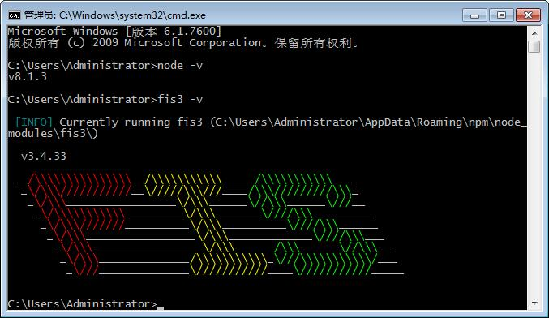

# 前端构建工具-fis3使用入门

> FIS3 是面向前端的工程构建工具。解决前端工程中性能优化、资源加载（异步、同步、按需、预加载、依赖管理、合并、内嵌）、模块化开发、自动化工具、开发规范、代码部署等问题。

官网地址是: <https://fex-team.github.io/fis3/index.html>

我们要做前后端分离，将静态资源部署到CDN。调研了几个前端构建工具之后，选择了 fis3, 原因是能满足我们的需求、并且轻量级、配置简单、使用方便、安装也不容易报错。

## 下载安装

1. 安装NodeJS
  下载地址: <http://nodejs.cn/download/>
  推荐下载最新版本的NodeJS,如 v8.1.3+ 等。
  安装到默认目录,完成后查看版本号: `node -v`
2. npm安装fis3
  在 cmd/shell 中执行: `npm install -g fis3`
  安装fis3后,在 cmd/shell 中执行 `fis3 -v` 判断是否安装成功

相关的 shell 命令如下:

```
node -v
npm install -g fis3
fis3 -v
```

如下图所示:




## 简单使用

> **说明:** fis3等前端构建工具,依赖的是相对路径, 如`./xxx/xxx.js`, `images/logo.png` 等; 识别: ``、`<link href="">`、 `<script src="">`  `url('')` 等资源配置。
>
> 如果你的项目不符合此要求, 需要进行一定的修改。


首先,在前端代码的根目录中,创建文件 `fis-conf.js`。 fis3 会查找此文件作为配置。

修改`fis-conf.js`文件的内容:


```
// 配置不同环境的CDN资源前缀
fis.media('prod').match('*.{js,css,png}', {
  domain: 'http://cdn.cncounter.com/cncounter-web'
});

fis.media('beta').match('*.{js,css,png}', {
  domain: 'http://beta.cdn.cncounter.com/cncounter-web'
});

fis.media('dev').match('*.{js,css,png}', {
  domain: 'http://dev.cdn.cncounter.com/cncounter-web'
});


// 所有js, css 加 hash
fis.match('*.{js,css,png}', {
  useHash: true
});

// 生产环境进行JS压缩
fis.media('prod').match('*.js', {
  optimizer: fis.plugin('uglify-js')
});

// dev 环境不加hash, 不进行压缩和优化
fis.media('dev').match('*.{js,css,png}', {
  useHash: false,
  optimizer: null
});
```

简单解释一下, `fis.media('prod')` 意思是生产环境的配置。

使用fis3时,可以指定打包版本, 例如:

```
fis3 release prod -d cdn_release
```

如果不指定, 则默认为 `dev` 环境(fis3中称为media)

指定输出目录是 `-d` 选项,可以指定绝对路径,相对路径；


另外, `fis.match` 是很简单的配置,后面会覆盖前面。

其中, `useHash` 指定是否根据内容生成 hash, 例如 `common-utils.js` 在生成目录下会变成: `common-utils_331734d.js`; 

`optimizer` 指定优化配置,例如文件压缩、合并,内联等; 

其他插件可能需要安装额外的 npm 组件/插件;


## 示例

Windows 使用示例(cmd 环境):

```
E:
cd E:\cncounter-web\src\main\webapp
dir fis-conf.js
fis3 release prod -d cdn_release
```

Linux 或者 Mac 大同小异, 请根据需要自己配置,或者参考官网。


然后,进入 cdn_release 目录, 看看对应的 html,css,js 等文件的变化吧。

如果项目未拆分, 与 MAVEN 一起组合使用时, 先执行 fis3 的构建(可以指定 html 等文件的输出目录), 然后通过 copy-resources 等插件进行组装。 


如果需要更复杂的功能,请参考官方的配置文档: <https://fex-team.github.io/fis3/docs/beginning/release.html>


## 灰度与CDN的问题

一般的上线流程是:

- 先推送CDN资源/可选
- 再发布回源资源/可选
- 最后发布页面;

我们的前端界面，一般分为 HTML 页面，以及css，js等资源。

现在的前端构建和打包工具, 已经能自动将计算得到的hash值嵌入生成的文件名中。

所以常规的上线没什么问题。 

如果有推送CDN资源的步骤, 也不会造成问题。

但是如果没有推送CDN, 并且按流量比例进行灰度发布，那么就要小心了, 有可能造成这种情况:

- 1. 将 10% 比例的流量切换到灰度环境。 没有会话粘滞。
- 2. CDN回源时，请求到灰度版本的HTML页面, 并返回给客户端。
- 3. 客户端收到灰度版本的HTML, 请求对应的CSS和JS等静态资源。
- 4. CDN收到JS请求, 回源请求, 可能会打到稳定版本的资源, 发现没有这个资源。
- 5. 如果稳定版找不到资源, 返回的http状态码是 404, 看CDN的策略是否进行缓存, 如果缓存, 那么一段时间不可用, 此时, 需要回滚或者清理CDN。
- 6. 如果稳定版找不到资源, 返回的http状态码是 200, 内容是HTML或者其他信息, 这时候CDN当做正常状态进行缓存, 那么问题就坑了, 
- 7. 可能需要紧急回滚, 然后再清理CDN.
- 8. 后续的版本升级, 如果能清理CDN则挺好, 否则需要修改代码, 让相关的资源 hash 全部变化。


修改请求Header的插件: ModHeader


原文作者: [铁锚 http://blog.csdn.net/renfufei](http://blog.csdn.net/renfufei)

原文日期: 2017年7月10日

