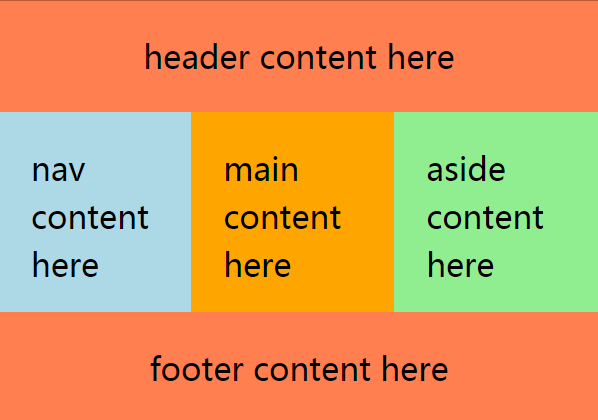
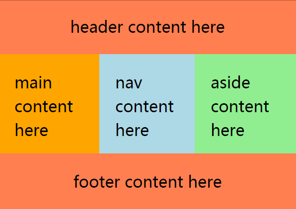
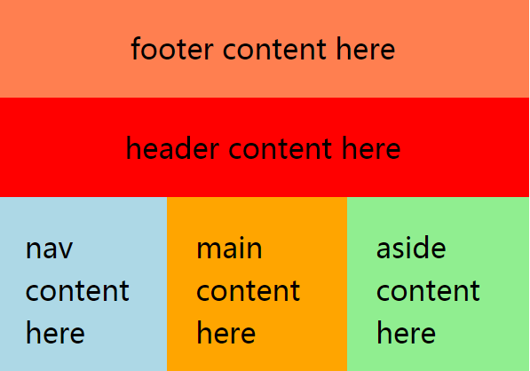
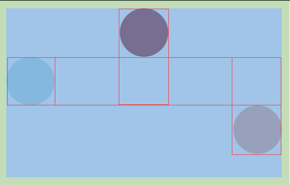
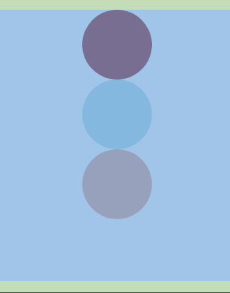
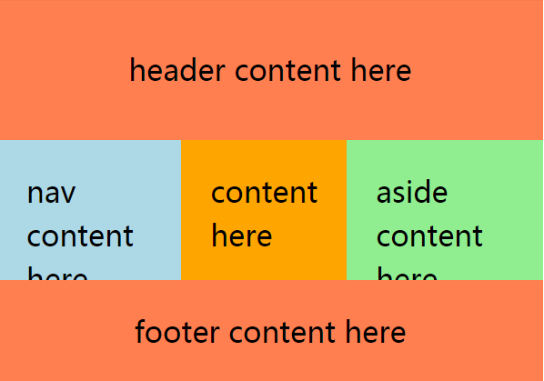
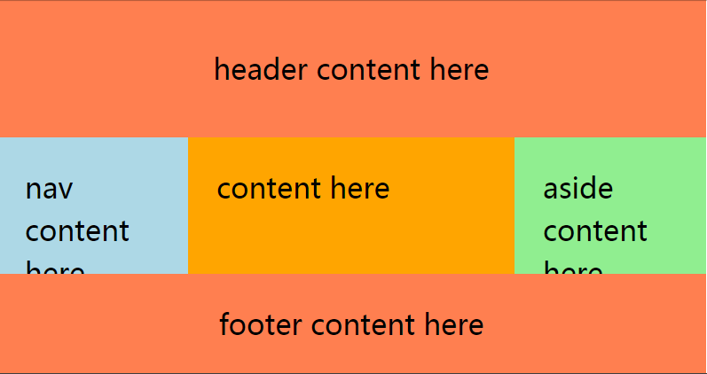

# A Friendly Introduction to Flexbox for Beginners

*This is the updated version of an article published on 4th February 2013. Updates include:rewriting paragraphs and sections to fit new developments in browser support for flexbox and in CSS with the advent of Grid Layout, creating live demos on CodePen, modifying code snippets, title change, adding a featured image, and a few grammatical changes.*

Do you remember when tables were the only layout method for a website? At least until people realized that it’s a semantic nightmare to misuse something that’s actually reserved to display tabular data for the structure of an internet site. So a new “tool” needed to be found and soon floats and absolute positioning were discovered as a “proper” replacement.

Just like tables, of course, the true purpose of these two methods wasn’t to give websites a shape.

Only recently, major browsers have provided support for [CSS Grid Layout](https://www.w3.org/TR/css-grid-1/), a robust layout engine built into CSS. You could use Grid in production websites right now, provided you cater for non supporting browsers with appropriate fallbacks.

A great fallback strategy is to serve flexbox-based (or “[Flexible Box Layout Module](http://dev.w3.org/csswg/css3-flexbox/)” as the W3C likes to call it) layouts to all browsers without support for Grid Layout. This works great in most cases, since today flexbox has excellent [browser support](http://caniuse.com/#search=flexbox)across the board.


## Advantages of Using Flexbox

Some of the advantages of flexbox are:

- Page content can be laid out in any direction (to the left, to the right, downwards or even upwards)
- Bits of content can have their visual order reversed or rearranged
- Items can “flex” their sizes to respond to the available space and can be aligned with respect to their container or each other
- Achieving equal-column layouts (irrespective of the amount of content inside each column) is a breeze.

To illustrate the various properties and possibilities let’s assume the following simple layout for some of the demos in this article:

```
<div class="example">
  <header>
    header content here
  </header>
  <main class="main">
    <nav>
      nav content here
    </nav>
    <div class="content">
      main content here
    </div>
    <aside>
      aside content here
    </aside>
  </main>
  <footer>
    footer content here
  </footer>
</div>
```

The first step is to place the elements within `.main`, i.e., `<nav>` and `<aside>`, side by side. Without flexbox we’d probably float all the three elements, but making it work as desired wouldn’t be very straightforward. Moreover, the traditional way of doing things would present a well-known problem: every column is just as high as its content. As a consequence, you would need to set an equal height for all three columns to have the same length, or use some sort of [hack](http://callmenick.com/post/css-equal-height-columns-three-different-ways).

Enter flexbox to the rescue.

## Let’s Flex

The core element of flexbox is the new `flex` value of the `display` property, which needs to be set for the container element. Doing so turns its children into “flex items”. These items acquire some handy properties by default. For example, they get placed side by side, and elements without a specified width automatically take up the remaining space.

So, if you set `display: flex` for `.main`, its `.content` child element is automatically squeezed in between `<nav>` and `<aside>`. No more calculations, how handy is that? As a special bonus, all of these three elements magically have the same height.

```
.main {
  display: flex;
}
```

Check out the demo below for all the details:




在线调试请访问: <https://codepen.io/SitePoint/pen/bRjmNN>


## The Order of Things: Flexbox `order` Property

Another property of flexbox is the ability to easily change the order of elements. Let’s assume you’ve built the above layout for a client and she now wants `.content` to come before `<nav>`.

Normally, you’d dive into the HTML source code and change the order there. With flexbox you can accomplish the task entirely with CSS. Just set the `order` property of `.content` to `-1` and the content column will come first.

```
.main {
  display: flex;
}

.content {
  order: -1;
}
```

In this case you don’t need to state the order for the other columns:



在线调试请访问: <https://codepen.io/SitePoint/pen/wexYza>

If you prefer to specify the value of the `order` property explicitly for each column instead, you can go ahead and set `order` to `1`for `.content`, to `2` for `<nav>` and to `3` for `<aside>`.

### HTML Source Code Independent from CSS Styles with Flexbox

But your client isn’t satisfied yet. She’d like the `<footer>` to be the first element on the page, even before the `<header>`. Well, once again, flexbox is your friend (although in cases like this one, perhaps it would be better to educate your client rather than follow suit). Since you need to rearrange not only the inner elements but also the outer one, the `display: flex` rule will have to be set for `<div class="example">`. **Notice how you can nest flex containers in your web page to achieve the result you’re after.**

Because `<header>`, `<main.main>` and `<footer>` are stacked on top of each other, you need to set a vertical context first, which you can quickly do with `flex-direction: column`. Additionally, the `<footer>` gets the `order` value of `-1` so that it will appear first on the page. It’s as easy as that.

```
.example {
  display: flex;
  flex-direction: column;
}

footer {
  order: -1;
}
```

So, if you ever want to change a row of elements into a column or vice versa, you can use the `flex-direction` property and set it to `column` or `row` accordingly (`row` is the default value):



在线调试请访问: <https://codepen.io/SitePoint/pen/JJBmNa>

However, with great power comes great responsibility: keep in mind that a number of visitors will be using the keyboard to navigate your flexbox-based websites, therefore if the order of elements in the HTML source is at odds with what appears on the screen, accessibility could become a serious concern. To learn more on this, don’t miss [HTML Source Order vs CSS Display Order](http://adrianroselli.com/2015/10/html-source-order-vs-css-display-order.html), an in-depth treatment of exactly this problem by accessibility and usability expert Adrian Roselli.

### How to Align Items with Flexbox

Flexbox also makes it quite straightforward to align its child elements both horizontally and vertically.

You can apply the same alignment to all the elements within a flex container with `align-items`. If you’d like different alignments for individual items, use `align-self`. The alignment of the elements is dependent on the value of the `flex-direction`property. If its value is `row` (that is, the elements run in a horizontal line), the alignment applies to the vertical axis. If `flex-direction` is set to `column` (that is, the elements run in a vertical line), it applies to the horizontal axis.

For instance, you have a number of shapes you’d like to align differently inside a container element. You need to: .

- Set each shape’s `align-self` property to the appropriate value. Possible values are: `center`, `stretch` (the element is positioned to fit its container), `flex-start`, `flex-end`, and `baseline` (the element is positioned at the baseline of its container)
- Set the container element to `display:flex`
- Finally, pay attention to the `flex-direction` property on the parent container, because its value affects the childeren’s alignment.

```
.example {
  display: flex;
  flex-direction: column;
}

.red {
  align-self: center;
}

.blue {
  align-self: flex-start;
}

.pink {
  align-self: flex-end;
}
```

Try toggling the parent container’s `flex-direction` property in the demo below from `row` to `column` and vice versa to see this behavior in action:



在线调试请访问: <https://codepen.io/SitePoint/pen/owMaom>

If all of the elements within a parent container need to be aligned the same way, you can use the property `align-items` in the parent container. Possible values are `center`, `flex-start`, `flex-end`, `stretch` (default value: items are stretched to fit their container), and `baseline` (items are positioned at the baseline of their containers).

```
.example {
  display: flex;  
  align-items: center;
}
```

As usual, try toggling the value of the `flex-direction` property on the parent element between `row` and `column` to see how the effect of the values you apply to `align-items` changes:



在线调试请访问:  <https://codepen.io/SitePoint/pen/bRjmKB>

如果你对英文版 FlexBox 课程感兴趣, 请访问: <https://www.sitepoint.com/premium/courses/flexbox-2950>


## Justifying Content with Flexbox

Another property for alignment is `justify-content`, which is pretty handy when you want to distribute the available space evenly among multiple elements.

Accepted values are: `center`, `flex-start`, `flex-end`, `space-between` (items are positioned with spaces between the lines), and `space-around` (items are positioned with space before, between, and after the lines).

For instance, inside the `<main>` element in the simple HTML template you’ve been using all along, you can find three elements: `<nav>`, `.content`, and `<aside>`. At the moment, they’re all pushed to the left of the page. If you’d like to display these three elements in such a way as to create some space in between them, but not to the leftmost and rightmost sides of the first and last element respectively, set `justify-content` inside `.main` (their parent container) to `space-between`:

```
.main {
  display: flex;
  justify-content: space-between;
}
```

Try also experimenting with `space-around` and notice the different results:



在线调试请访问:  <https://codepen.io/SitePoint/pen/OgwBqR>

In the demo above, I’ve also centered the text inside the `<header>` element both horizontally and vertically by using `justify-content` (horizontal centering) and `align-items` (vertical centering) and setting them both to `center`:

```
header {
  height: 100vh;
  display: flex;
  justify-content: center;
  align-items: center;
}
```

### Flexing Items Dimensions with Flexbox

With the `flex` property you can control the length of your element with respect to other elements inside a flex container.

This property is a shorthand for the following individual properties:

- `flex-grow` — A number specifying how much the element will grow relative to other flexible elements
- `flex-shrink` — A number specifying how much the element will shrink relative other flexible elements
- `flex-basis` — The length of the element. Accepted values are: `auto`, `inherit`, or a number followed by “%”, *px*, *em* or any other length unit.

For example, to get three equal columns just set `flex: 1` for each column and you’re done:

```
nav, aside, .content {
  flex: 1;
}
```

If you need the content area to be twice the width of `<nav>` and `<aside>`, set `flex: 2` for the `.content` and leave the other two at `1`:



在线调试请访问:  <https://codepen.io/SitePoint/pen/OgwBKb>

That’s just the simplest application of the `flex` property, it’s also possible to set `flex-grow`, `flex-shrink` and `flex-basis`values, but that’s beyond the scope of this article.

## Further Resources

If you’re ready to move on and learn more about mastering flexbox, checkout these resources:

- [Flexbox](https://www.sitepoint.com/premium/courses/flexbox-2950), a paid course on SitePoint Premium by Guy Routledge
- [Building Mega Menus with Flexbox](https://www.sitepoint.com/building-mega-menus-flexbox/)
- [How 3 Modern Tools are Using Flexbox Grids](https://www.sitepoint.com/3-modern-tools-using-flexbox-grids/)
- [Make Forms Fun with Flexbox](https://www.sitepoint.com/make-forms-fun-with-flexbox/).

## Conclusion

As you can see, flexbox can make our lives so much easier if we need to control the position of elements on a website. It’s rock solid and makes any hacks, collapsing containers or other weird stuff we have had to deal with every day, obsolete.


原文链接: <https://www.sitepoint.com/flexbox-css-flexible-box-layout/>

原文日期: 2017年07月06日

原文作者: [Christian Krammer](https://www.sitepoint.com/author/ckrammer/) 

标签:  CSS, css3, flexbox, tutorial

