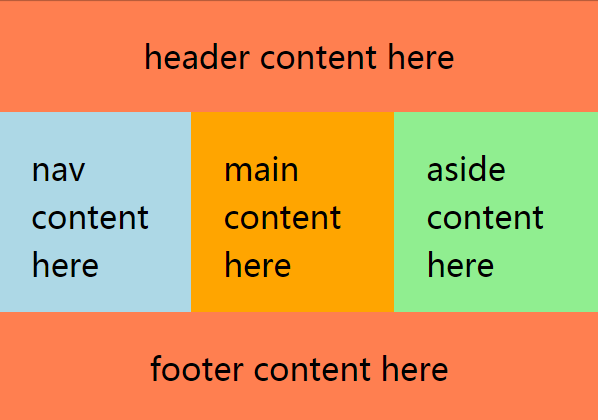
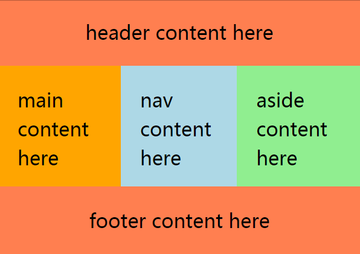
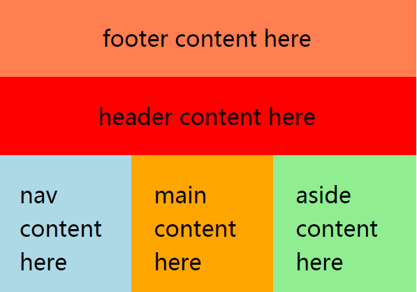
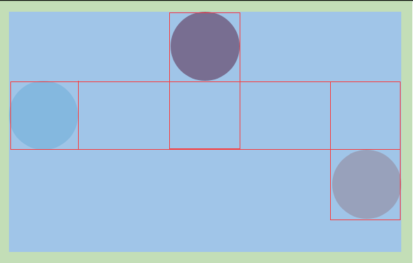
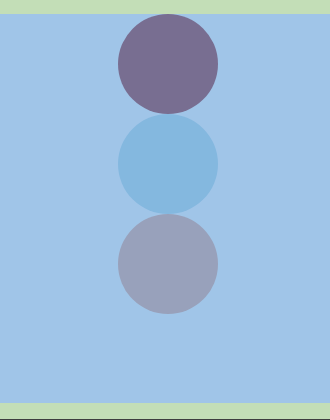
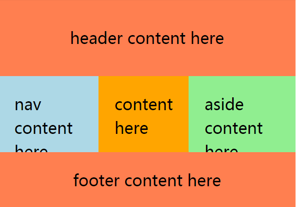
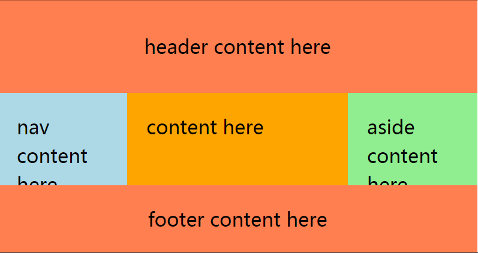

# A Friendly Introduction to Flexbox for Beginners

# 写给初学者的 Flexbox 友好入门

*本文是 2013 年 2 月 4 日发布的一篇文章的更新版。更新内容包括：随着浏览器对 flexbox 支持的进步以及 CSS Grid Layout 的出现，重写了部分段落和章节；在 CodePen 上创建了在线演示；修改了代码片段；更换了标题；添加了特色图片；以及修正了一些语法问题。*

你还记得网页布局只能用表格(table)的年代吗？至少在人们意识到，把一个本来专门用于展示表格数据的元素挪去搭建网站结构，在语义上简直是一场灾难之前，确实如此。于是需要找到一种新的"工具"，很快浮动(float)和绝对定位(absolute positioning)就被发现，并当作"正规"的替代方案。

当然，和表格一样，这两种方法的真正用途也并不是为了给网站塑造布局。

直到最近，各大浏览器才开始支持 [CSS Grid Layout](https://www.w3.org/TR/css-grid-1/)——这是一款内置于 CSS 中的强大布局引擎。只要为非支持浏览器准备好合适的降级方案，你现在就可以在生产环境中使用 Grid。

一个很好的降级策略是：对不支持 Grid Layout 的浏览器，改用基于 flexbox 的布局(或者按 W3C 的说法叫 "[Flexible Box Layout Module](http://dev.w3.org/csswg/css3-flexbox/)")。在大多数情况下这套方案都很好用，因为如今 flexbox 在各浏览器上都获得了出色的 [browser support](http://caniuse.com/#search=flexbox)。


## 使用 Flexbox 的优势

flexbox 的一些优势如下：

- 页面内容可以朝任意方向排列(向左、向右、向下，甚至向上)
- 各部分内容的视觉顺序可以反转或重新排列
- 条目(Item)可以"弹性"伸缩尺寸以响应可用空间，并且可以相对其容器或彼此对齐
- 实现等宽列布局(无论每列内部内容多少)变得轻而易举。

为了演示各种属性和可能性，本文部分示例将采用下面这个简单的布局：

```
<div class="example">
  <header>
    header content here
  </header>
  <main class="main">
    <nav>
      nav content here
    </nav>
    <div class="content">
      main content here
    </div>
    <aside>
      aside content here
    </aside>
  </main>
  <footer>
    footer content here
  </footer>
</div>
```

第一步是把 `.main` 内的元素，也就是 `<nav>` 和 `<aside>`，并排放置。如果没有 flexbox，我们大概会让这三个元素都浮动(float)，但要达到预期效果并不那么容易。而且，传统的做法会带来一个众所周知的问题：每一列的高度都只和它自己的内容一样高。因此，为了让三列等高，你需要为它们设置一个相同的高度，或者使用某种 [hack](http://callmenick.com/post/css-equal-height-columns-three-different-ways) 技巧。

这时 flexbox 就派上用场了。

## 让我们 Flex 起来

flexbox 的核心是 `display` 属性新增的 `flex` 取值，它需要设置在容器元素上。这样做会把它的子元素变成"flex items"。这些条目默认就会获得一些便利属性。例如，它们会并排排列，而未指定宽度的元素会自动占据剩余空间。

所以，如果你为 `.main` 设置 `display: flex`，它的子元素 `.content` 就会自动挤在 `<nav>` 和 `<aside>` 之间。再也不用做各种计算，是不是很方便？额外的好处是，这三个元素会神奇地拥有相同的高度。

```
.main {
  display: flex;
}
```

查看下面的演示了解所有细节：




在线调试请访问: <https://codepen.io/SitePoint/pen/bRjmNN>


## 元素顺序：Flexbox 的 `order` 属性

flexbox 的另一个能力是可以轻松改变元素的顺序。假设你为客户做好了上面的布局，现在她希望 `.content` 排在 `<nav>` 前面。

通常情况下，你会去改 HTML 源码里的顺序。而使用 flexbox，你完全可以只用 CSS 完成这件事。只要把 `.content` 的 `order` 属性设为 `-1`，内容列就会排到最前面。

```
.main {
  display: flex;
}

.content {
  order: -1;
}
```

这种情况下，你不需要为其他几列指定顺序：



在线调试请访问: <https://codepen.io/SitePoint/pen/wexYza>

如果你更愿意为每一列显式指定 `order` 的值，也可以把 `.content` 的 `order` 设为 `1`，把 `<nav>` 设为 `2`，把 `<aside>` 设为 `3`。

### 使用 Flexbox 让 HTML 源码与 CSS 样式解耦

但你的客户还是不满意。她希望 `<footer>` 成为页面上的第一个元素，甚至排在 `<header>` 前面。好吧，flexbox 又一次帮上了忙(不过像这种情况，或许更好的做法是说服你的客户，而不是一味照做)。由于要重新排列的不只是内部元素，还有外层元素，因此必须为 `<div class="example">` 设置 `display: flex`。**注意，你可以在网页中嵌套 flex 容器，以此达到想要的效果。**

由于 `<header>`、`<main.main>` 和 `<footer>` 是纵向堆叠的，你需要先设置一个纵向的上下文，用 `flex-direction: column` 就能快速完成。此外，给 `<footer>` 设置 `order: -1`，它就会出现在页面最前面。就这么简单。

```
.example {
  display: flex;
  flex-direction: column;
}

footer {
  order: -1;
}
```

所以，如果你想把一行元素变成一列，或者反过来，可以使用 `flex-direction` 属性，相应地设为 `column` 或 `row`(`row` 是默认值)：



在线调试请访问: <https://codepen.io/SitePoint/pen/JJBmNa>

不过，能力越大责任越大：要记住，有不少访客会使用键盘来浏览你的 flexbox 网站，因此如果 HTML 源码中元素的顺序与屏幕上显示的顺序不一致，可访问性(accessibility)就可能成为一个严重问题。想进一步了解，请不要错过可访问性与可用性专家 Adrian Roselli 的 [HTML Source Order vs CSS Display Order](http://adrianroselli.com/2015/10/html-source-order-vs-css-display-order.html)，它深入探讨了这个问题。

### 如何用 Flexbox 对齐条目

flexbox 也让你能相当简单地对其子元素进行水平和垂直对齐。

你可以用 `align-items` 对 flex 容器内的所有元素统一应用同一种对齐方式。如果想让各个条目采用不同的对齐方式，就使用 `align-self`。元素的对齐方式取决于 `flex-direction` 属性的值。如果它取值为 `row`(即元素沿水平方向排列)，对齐作用于垂直轴；如果 `flex-direction` 设为 `column`(即元素沿垂直方向排列)，对齐则作用于水平轴。

例如，你有若干形状(shape)，想在某个容器元素内让它们采用不同的对齐方式。你需要：。

- 为每个形状的 `align-self` 属性设置合适的值。可选值有：`center`、`stretch`(元素拉伸以填满其容器)、`flex-start`、`flex-end` 和 `baseline`(元素定位到其容器的基线处)
- 把容器元素设置为 `display:flex`
- 最后，注意父容器上的 `flex-direction` 属性，因为它的值会影响子元素的对齐方式。

```
.example {
  display: flex;
  flex-direction: column;
}

.red {
  align-self: center;
}

.blue {
  align-self: flex-start;
}

.pink {
  align-self: flex-end;
}
```

试着在下面的演示中把父容器的 `flex-direction` 属性在 `row` 和 `column` 之间来回切换，看看这种效果是如何表现的：



在线调试请访问: <https://codepen.io/SitePoint/pen/owMaom>

如果父容器内所有元素都需要以相同方式对齐，可以在父容器上使用 `align-items` 属性。可选值为 `center`、`flex-start`、`flex-end`、`stretch`(默认值：条目拉伸以填满其容器)和 `baseline`(条目定位到其容器的基线处)。

```
.example {
  display: flex;  
  align-items: center;
}
```

和前面一样，试着在父元素上把 `flex-direction` 在 `row` 和 `column` 之间切换，看看应用到 `align-items` 上的各个值的效果会如何变化：



在线调试请访问:  <https://codepen.io/SitePoint/pen/bRjmKB>

如果你对英文版 FlexBox 课程感兴趣, 请访问: <https://www.sitepoint.com/premium/courses/flexbox-2950>


## 使用 Flexbox 主轴对齐内容

另一个用于对齐的属性是 `justify-content`，当你想要在多个元素之间均匀分配可用空间时，它非常好用。

可接受的值为：`center`、`flex-start`、`flex-end`、`space-between`(各条目之间留出间隔)和 `space-around`(各条目的前、中、后都留出间隔)。

例如，在前面一直使用的那个简单 HTML 模板中，`<main>` 元素内有三个元素：`<nav>`、`.content` 和 `<aside>`。目前它们都靠页面左侧。如果你希望这三个元素之间留出一些间隔，但第一个元素最左侧和最后一个元素最右侧不留间隔，就把它们的父容器 `.main` 中的 `justify-content` 设为 `space-between`：

```
.main {
  display: flex;
  justify-content: space-between;
}
```

也可以试试 `space-around`，注意观察结果有何不同：



在线调试请访问:  <https://codepen.io/SitePoint/pen/OgwBqR>

在上面的演示中，我还通过 `justify-content`(水平居中)和 `align-items`(垂直居中)，并把它们都设为 `center`，让 `<header>` 元素内的文字实现了水平加垂直居中：

```
header {
  height: 100vh;
  display: flex;
  justify-content: center;
  align-items: center;
}
```

### 用 Flexbox 弹性调整条目尺寸

借助 `flex` 属性，你可以控制元素相对于 flex 容器内其他元素的长度。

该属性是下面几个独立属性的简写：

- `flex-grow` — 一个数字，指定该元素相对于其他弹性元素增长多少
- `flex-shrink` — 一个数字，指定该元素相对于其他弹性元素收缩多少
- `flex-basis` — 元素的长度。可接受的值为：`auto`、`inherit`，或一个数字加上 "%"、*px*、*em* 或其他任意长度单位。

例如，要得到三个等宽的列，只需为每一列设置 `flex: 1` 即可：

```
nav, aside, .content {
  flex: 1;
}
```

如果你需要让内容区的宽度是 `<nav>` 和 `<aside>` 的两倍，就把 `.content` 设为 `flex: 2`，另外两个保持为 `1`：



在线调试请访问:  <https://codepen.io/SitePoint/pen/OgwBKb>

这只是 `flex` 属性最简单的用法，也可以分别设置 `flex-grow`、`flex-shrink` 和 `flex-basis` 的值，但那超出了本文的范围。

## 延伸资源

如果你想继续深入学习并精通 flexbox，请查看以下资源：

- [Flexbox](https://www.sitepoint.com/premium/courses/flexbox-2950), a paid course on SitePoint Premium by Guy Routledge
- [Building Mega Menus with Flexbox](https://www.sitepoint.com/building-mega-menus-flexbox/)
- [How 3 Modern Tools are Using Flexbox Grids](https://www.sitepoint.com/3-modern-tools-using-flexbox-grids/)
- [Make Forms Fun with Flexbox](https://www.sitepoint.com/make-forms-fun-with-flexbox/).

## 结语

如你所见，当我们需要控制网站上元素的位置时，flexbox 能让生活轻松很多。它非常可靠，让各种 hack、容器塌陷以及其他我们过去每天都要打交道的怪问题都变得不再必要。


原文链接: <https://www.sitepoint.com/flexbox-css-flexible-box-layout/>

原文日期: 2017年07月06日

原文作者: [Christian Krammer](https://www.sitepoint.com/author/ckrammer/) 

标签:  CSS, css3, flexbox, tutorial

