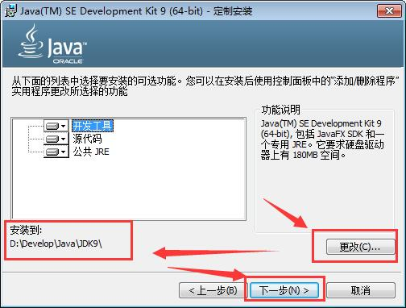
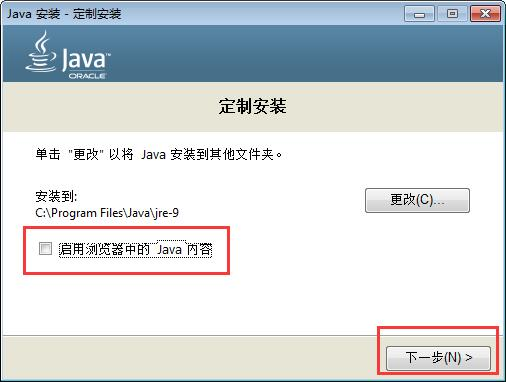
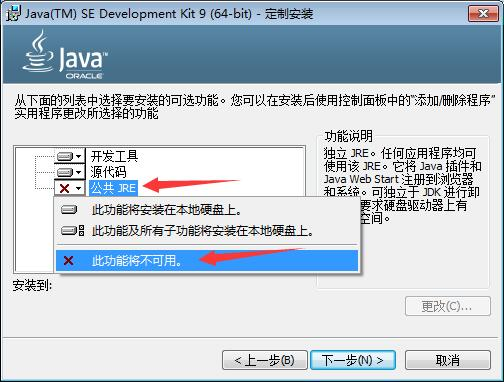

JDK9新特性: JShell简介与示例

> 本文简要介绍JShell, 并通过示例讲解如何使用, 你会发现对开发者非常友好和方便了。


JShell 是 JDK9 提供的一个工具, 项目代号是 Kulla([JEP 222](http://openjdk.java.net/jeps/222))。

在其中可以执行Java代码/脚本, 调用API, 计算变量值, 声明类和变量等。

当然, 也有对应的API,可以在Java程序中直接调用, 就像调用 Groovy 或者 JavaScript 类似。

本质上是一种 REPL 环境, REPL 的全称是 READ-EVALUATE-PRINT-LOOP, 本质是一种交互式的脚本执行环境,

在很多语言中都存在REPL , 如最著名的 Lisp。 虽然 Java中也有一些第三方工具, 如Java REPL 和 BeanShell 等等, 但一直存在诸多问题。 

JShell 和 Linux shell, Windows的CMD命令提示符很相似: 读取指令,执行运算,然后输出结果, 接着执行下一行脚本; 

有几个核心概念需要了解:  snippets(代码片段), state(状态), wrapping(包装), instruction modification(指令修改), forward references(前向引用), 以及 snippet dependencies(代码依赖).


## 安装和使用

因为 JShell 是JDK9内置的，所以只需要安装 JDK9 即可.  JDK9 下载页面为: <http://jdk.java.net/9/>


以Windows为例, 在下载页面中, 接受许可协议(Accept License Agreement), 然后下载 x64 平台的JDK安装文件即可。


下载完成之后, 运行安装文件, 选择安装路径, 例如: "`D:\Develop\Java\JDK9`"。





对于开发人员来说,没有必要安装 JRE;




安装完成之后, 应该查询一下版本号, 以进行验证:


执行 `java --version` 查询Java版本号:

```
java 9
Java(TM) SE Runtime Environment (build 9+180)
Java HotSpot(TM) 64-Bit Server VM (build 9+180, mixed mode)
```

执行 `javac -version` 查询javac版本号:

```
javac 1.8.0_65
```

执行 `path` 可以发现, Oracle 画蛇添足、自动在最前方设置了 PATH 路径:

```
C:\Users\Administrator>path

PATH=C:\ProgramData\Oracle\Java\javapath;D:\Develop\Java\jdk1.8.0_65\bin;C:\Windows\system32;C:\Windows;
```

也就是 `C:\ProgramData\Oracle\Java\javapath` 这个路径。 打开此目录，可以看到只有3个 exe 文件在其中。

Windows下的 JDK8 和 JDK7, 如果不小心连带安装了JRE, 那更悲剧, 会直接将 java 命令拷贝一份到 `C:\Windows\system32` 目录下, 导致 java 和 javac 命令/不在同一处，或(安装多个JDK时)两者版本不一致, 开发时可能碰到一堆莫名其妙的问题.

解决方法有2种:

1. 将 JDK 的 bin 目录加到 PATH 的最前面。 
    > 如 `D:\Develop\Java\JDK9\bin`
1. 卸载JRE, 然后重新安装JDK, 不选择安装 JRE。
    > 如下图所示:
    


然后, 执行 `java --version` 或者 `java -version` 查询Java版本号:


```
D:\Develop\Java\JDK9\bin>java -version
java version "9"
Java(TM) SE Runtime Environment (build 9+180)
Java HotSpot(TM) 64-Bit Server VM (build 9+180, mixed mode)

D:\Develop\Java\JDK9\bin>java --version
java 9
Java(TM) SE Runtime Environment (build 9+180)
Java HotSpot(TM) 64-Bit Server VM (build 9+180, mixed mode)
```

如果细心点你就会发现, java 和 javac 居然支持 `--version` 和 `-version` , 虽然有些结果稍微不同。 JDK8以前是只支持 `-version` 查询版本号的。

执行 `javac -version` 或者 `javac --version` 可以查询javac版本号:

```
D:\Develop\Java\JDK9\bin>javac --version
javac 9

D:\Develop\Java\JDK9\bin>javac -version
javac 9
```


```
"renfufei@qq.com".matches("\\w+@\\w+(\\.\\w+)+")
```


参考: {Java Magazine 2017年07_08月刊:Java9](http://www.javamagazine.mozaicreader.com/MayJune2017)

