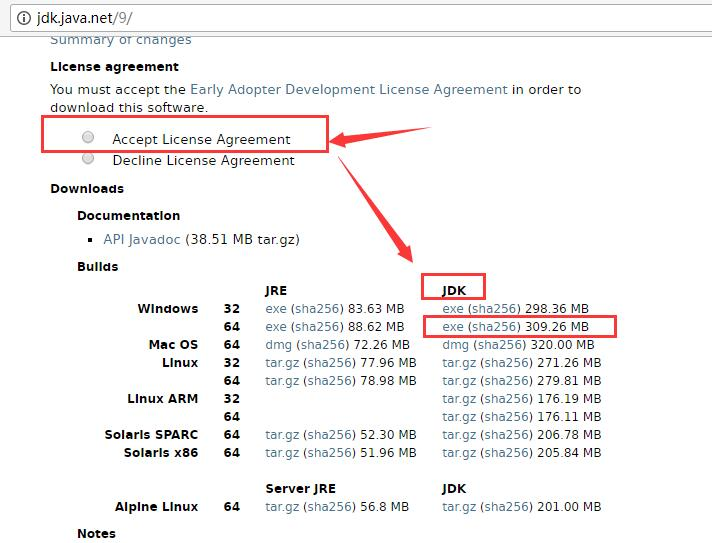

JDK9新特性: JShell简介与示例


JShell 是Java官方提供的REPL环境, 从JDK9开始。项目代号是 Kulla([JEP 222](http://openjdk.java.net/jeps/222))。

这是一种交互式工具, 在其中可以执行Java代码, 调用API, 计算变量值, 声明类和变量等。

REPL 的全称是 READ-EVALUATE-PRINT-LOOP, 本质是一种交互式的脚本执行环境,

REPL 在很多语言中一直存在, 最著名的是 Lisp。 虽然 Java中也有过一些第三方工具, 如Java REPL 和 BeanShell 等, 但一直存在诸多问题。 

JShell 和 Linux shell, Windows的CMD命令提示符交互过程很相似: 读取指令,执行运算,然后输出结果, 接着执行下一个命令; 

读者需要掌握几个核心概念:  snippets(代码片段), state(状态), wrapping(包装), instruction modification(指令修改), forward references(前向引用), 以及 snippet dependencies(代码依赖).


本文简要介绍JShell, 并通过示例讲解如何使用, 你会发现这对开发者来说真是太方便了。


## 安装和使用

因为 JShell 是JDK9内置的，所以只需要安装 JDK9 即可.  JDK9 下载页面为: <http://jdk.java.net/9/>


以Windows为例, 在下载页面中, 接受许可协议(Accept License Agreement), 然后下载 x64 平台的JDK安装文件即可。




下载完成之后, 运行安装文件, 选择安装路径, 例如: "`D:\Develop\Java\JDK9`"。

对于开发人员来说,没有必要安装


```
"renfufei@qq.com".matches("\\w+@\\w+(\\.\\w+)+")
```


参考: {Java Magazine 2017年07_08月刊:Java9](http://www.javamagazine.mozaicreader.com/MayJune2017)

