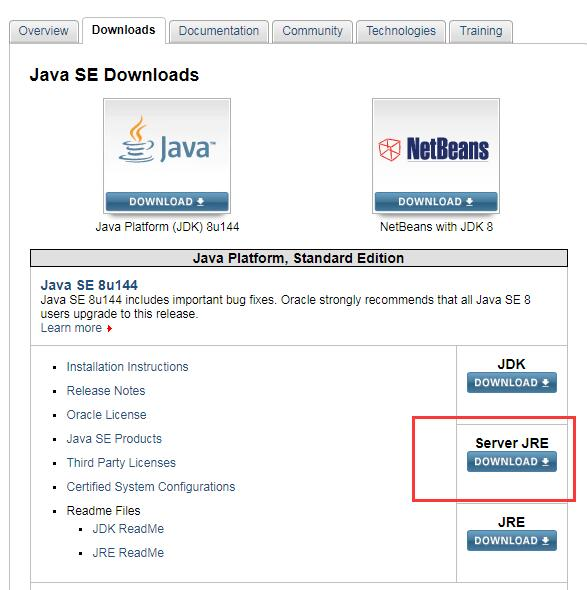

# Server JRE简介

> Server JRE, 服务器版JRE

JRE安装包, JDK安装包, 以及 Server JRE 压缩包, 可以在 Java SE Download 页面下载: <http://www.oracle.com/technetwork/java/javase/downloads/index.html>;

Java 相关的术语请参考: <http://www.oracle.com/technetwork/java/glossary-135216.html>.

The JRE is used to run a broad variety of Java programs including Java applications on desktops.  The JDK is for Java developers. It contains a complete JRE as described above and tools required to create Java programs, sign code, generate documentation, etc. The JDK also ships several tools meant to monitor and debug programs.

JRE 可以运行各种Java程序, 包括桌面端Java程序。

而JDK是给开发人员使用的, 其中包含了一个完整的JRE, 以及必要的开发工具, 例如 创建Java程序, 代码签名, 生成文档,等等。JDK还提供了一些监视和调试工具。

So where does the Server JRE fit in?  From the perspective of common server-side applications, the JRE is missing monitoring tools and, in the case of applications that compile Java source code at run-time, javac. On the other hand, the JDK includes additional functionality that system administrators may not need on their production systems like the Java Plugin for web browsers, auto update agents, and development tools like javadoc.

Server JRE 适用于哪些情况呢? 从服务器端程序的角度看, JRE缺少了所需的监控工具,以及 javac 编译器. 而 JDK 呢, 功能又太多了, 特别是生产环境并不需要的功能, 比如浏览器插件,自动更新, javadoc 工具等等。

Enter the Server JRE: The Server JRE was designed for server-side applications by including just the commonly required features from the JRE and JDK. The Server JRE does not have a dedicated installer: It is simply a compressed directory for easier use.

Server JRE 是专为服务器端程序设计的, 只包含JRE/JDK中最常用的那部分功能. 为了做到简单, Server JRE 没有安装包, 是一个绿色版的压缩文件。

**Will the Server JRE work for all server applications?**

No. If an application requires functionality outside of what is provided in the Server JRE, such as additional development tools or JavaFX, then the Server JRE would not be an adequate choice for that application.

#### Server JRE 兼容所有的服务端程序吗? 

No. 如果应用程序需要用到 Server JRE 不支持的功能,如额外的开发工具或JavaFX, 那就不应该选择 Server JRE 了, 比如 JavaFX 之类的程序。

**If the JDK is a super-set of the Server JRE, why not simply use that?**

Removing unused components decreases the potential attack surface, and the smaller size makes storage and deployment faster and easier.  On a Linux x64 system, the Server JRE 8 is around 40% of the size of the full JDK 8.

#### 如果JDK是Server JRE的一个超集,那为何不直接使用JDK呢?

删除用不到的组件, 可以减少潜在的漏洞; 当然, 精简之后体积变小, 部署也就更快. 在 Linux x64 系统上, Server JRE 8 的大小只有 full JDK 8 的 40%左右。

**My software vendor claims their applications needs the JDK, but can I use the Server JRE instead?**

Please contact your software vendor and ask them if you may use the Server JRE instead of the full JDK.  If you have the ability to experiment – you should try it.  The Server JRE is always recommended where possible over the JDK for running applications.

#### 开发商说, 他们的系统需要JDK来运行, 那么我们可以使用 Server JRE 替代吗?

最好是与软件开发商沟通和咨询。如果你们有能力,可以先在测试环境试一试. 总体来说, 更推荐使用 Server JRE。

**Can I suggest changes for what is included in the Server JRE?**

Yes. The goal of the Server JRE is to provide the tools needed by most, but admittedly not all, server applications. We are constantly re-evaluating which components are included.

#### 我可以对 Server JRE 包含哪些组件提出建议吗?

是的。Server JRE 的目标, 是为大部分服务端程序提供必要的工具。我们会不断地重新评估到底需要包含哪些组件。

原文链接: <https://blogs.oracle.com/java-platform-group/understanding-the-server-jre>

