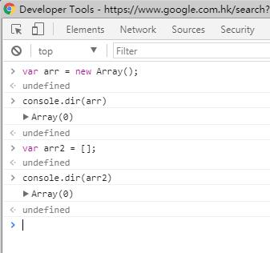
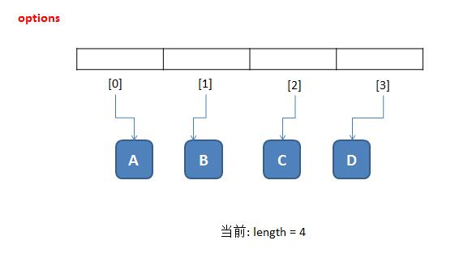
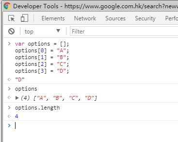

# JavaScript: 创建Array-Like对象

Array-Like,即伪数组。泛指其行为和API与数组相似,但又不完全一致的对象。

分析文章: <https://github.com/hanzichi/underscore-analysis/issues/14>


## 数组


数组的英文名称是 Array, 常见的是一维数组。

### 创建一维数组

JS中创建数组主要有两种方式:

1. 字面量方式(**推荐**):

```
var arr2 = [];
console.dir(arr2);
```

2. 构造函数方式:

```
var arr = new Array();
console.dir(arr);
```


结果如下图所示:




> ####为什么推荐使用字面量方式呢?
> 
> 主要因为字面量方式(`var arr2 = [];`) 代码更简洁,可读性也更好。


### 简单用法与示例

虽然JS是一种动态语言, 数组本质上是指针,数组中的每一项可以指向任意数值/对象。

但程序是有逻辑的，代码也需要具备可读性，所以存放到同一个数组中的值， 一般是同一“类”对象。 例如, 全是数字(如数量1234), 全是字母(如选项ABCD), 全是学生、全是商品。

这也是一般的程序设计原则, 如果数据结构一团糟, 代码没有可读性、那就属于垃圾代码。




代码示例如下:

```
var options = [];
options[0] = "A";
options[1] = "B";
options[2] = "C";
options[3] = "D";
```

在console中执行结果如下图所示:




## 伪数组


