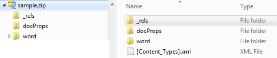
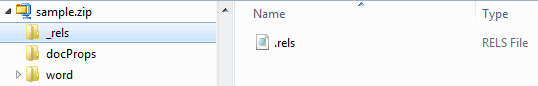
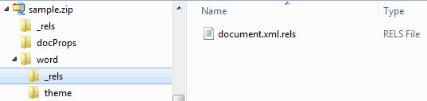

Anatomy of a WordProcessingML File
==

# Package Structure

A WordprocessingML or docx file is a zip file (a package) containing a number of "parts"--typically UTF-8 or UTF-16 encoded XML files, though strictly defined, a part is a stream of bytes. The package may also contain other media files, such as images and video. The structure is organized according to the [Open Packaging Conventions](http://officeopenxml.com/whatIsOOXML.php).

You can look at the file structure and the files by simply renaming any docx file to a zip file and unzipping the file.



# Content Types

Every package must have a [Content_Types].xml, found at the root of the package. This file contains a list of all of the content types of the parts in the package. Every part and its type must be listed in [Content_Types].xml. The following is a content type for the main document part:

```
<Override PartName="/word/document.xml" ContentType="application/vnd.openxmlformats-officedocument.wordprocessingml.document.main+xml"/>
```

It's important to keep this in mind when adding new parts to the package.

# Relationships

Every package contains a relationships part that defines the relationships between the other parts and to resources outside of the package. This separates the relationships from content and makes it easy to change relationships without changing the sources that reference targets.



For an OOXML package, there is always a relationships part (.rels) within the _rels folder that identifies the starting parts of the package, or the package relationships. For example, the following defines the identity of the start part for the content:

```
<Relationship Id="rId1" Type="http://schemas.openxmlformats.org/officeDocument/2006/relationships/officeDocument" Target="word/document.xml"/>.
```

There are also typically relationships within .rels for app.xml and core.xml.

In addition to the relationships part for the package, each part that is the source of one or more relationships will have its own relationships part. Each such relationship part is found within a _rels sub-folder of the part and is named by appending '.rels' to the name of the part. Typically the main content part (document.xml) has its own relationships part. It will contain relationships to the other parts of the content, such as styles.xml, themes,xml, and footer.xml, as well as the URIs for external links.



A relationship can be either explicit or implicit. For an explicit relationship, a resource is referenced using the Id attribute of a <Relationship> element. That is, the Id in the source maps directly to an Id of a relationship item, with an explicit reference to the target.

For example, a document might contain a hyperlink such as this:

```
<w:hyperlink r:id="rId4">
```

The r:id="rId4" references the following relationship within the relationships part for the document (document.xml.rels).

```
<Relationship Id="rId4" Type="http://. . ./hyperlink" Target="http://www.google.com/" TargetMode="External"/>
```

For an implicit relationship, there is no such direct reference to a <Relationship> Id. Instead, the reference is understood. For example, a document might contain a reference to a footnote as shown below.

```
<w:footnoteReference r:id="2">
```

In this case, the reference to the footnote with w:id="2" is understood to be in the Footnotes part that exists when there are footnotes. In the Footnotes part we will see the following.

```
<w:footnote w:id="2">
```


# Parts Specific to WordprocessingML Documents

Below is a list of the possible parts of a WordprocessingML package that are specific to WordprocessingML documents. Keep in mind that a document may only have a few of these parts. For example, if a document has no footnotes, then a footnotes part will not be included in the package.

| Part                  | Description                              |
| --------------------- | ---------------------------------------- |
| Comments              | Contains the comments in the document. There may be a comments part for the main document and one for the glossary, if there is a glossary. |
| Document Settings     | Specifies the settings for the document, including such things as whether to hide spelling and grammatical errors, track revisions, write protection, etc. There may be a document settings part for the main document and one for the glossary, if there is a glossary. |
| Endnotes              | Contains the endnotes for a document. There may be an endnotes part for the main document and one for the glossary, if there is a glossary. |
| Font Table            | Specifies information about the fonts used in the document. The application will use the information in the part to determine which fonts to use to display the document when the specified fonts are not available on the system. There may be a font table for the main document and one for the glossary, if there is a glossary. |
| Footer                | Contains the information for a [footer](http://officeopenxml.com/WPfooters.php). Note that each [section](http://officeopenxml.com/WPsection.php) of a document may contain a footer for the first page, odd pages, and even pages. So there may be multiple footer parts, depending upon how many sections there are in the documnet and the types of footers for the sections. |
| Footnotes             | Contains the footnotes for the document. There may be a footnotes part for the main document and one for the glossary, if there is a glossary. |
| Glossary              | This is a supplementary document storage location which may contain content that is carried with the document but is not visible from the main document contents. It is intended for storage of optional document fragments. Only one is permitted. |
| Header                | Contains the information for a [header](http://officeopenxml.com/WPheaders.php). Note that each [section](http://officeopenxml.com/WPsection.php) of a document may contain a header for the first page, odd pages, and even pages. So there may be multiple header parts, depending upon how many sections there are in the documnet and the types of headers for the sections. |
| Main Document         | Contains the body of the document.       |
| Numbering Definitions | Contains the definition for the [structure of each numbering definition](http://officeopenxml.com/WPnumbering.php) in the document. There may be a numbering definitions part for the main document and one for the glossary, if there is a glossary. |
| Style Definitions     | Contains the definitions for a set of [styles](http://officeopenxml.com/WPstyles.php) used by the document. There may be a styles definitions part for the main document and one for the glossary, if there is a glossary. |
| Web Settings          | Contains the definitions for web-specific settings used by the document. These settings specify two categories: settings related to HTML documents (that is, frameset definitions) that can be used in WordprocessingML documents, and settings which affect how the document is handled when saved as HTML. There may be a web settings part for the main document and one for the glossary, if there is a glossary. |


# Parts Shared by Other OOXML Documents

There are a number of part types that may appear in any OOXML package. Below are some of the more relevant parts for WordprocessingML documents.

| Part                                     | Description                              |
| ---------------------------------------- | ---------------------------------------- |
| Embedded package                         | Contains a complete package, either internal or external to the referencing package. For example, a WordprocessingML document might contain a spreadsheet or presentation document. |
| Extended File Properties (often found at docProps/app.xml) | Contains properties specific to an OOXML document--properties such as the template used, the number of pages and words, and the application name and version. |
| File Properties, Core                    | Core file properties enable the user to discover and set common properties within a package--properties such as creator name, creation date, title. [Dublin Core](http://dublincore.org/) properties (a set of metadate terms used to describe resources) are used whenever possible. |
| Font                                     | Contains a font embedded directly into the document. Fonts can be stored as either bitmapped font in which each glyph is stored as a raster image, or in a format conforming to ISO/IEC 14496-22:2007. |
| Image                                    | Documents often contain images. An image can be stored in a package as a zip item. The item must be identified by an image part relationship and the appropriate content type. |
| Theme                                    | DrawingML is a shared language across the OOXML document types. It includes a theme part that is included in WordprocessingML documents when the document uses a theme. The theme part contains information about a document's theme, that is, such information as the color scheme, font and format schemes. |


原文链接: <http://officeopenxml.com/anatomyofOOXML.php>


