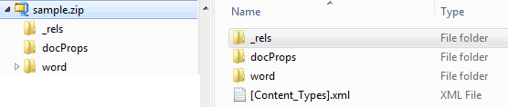
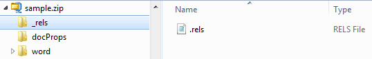
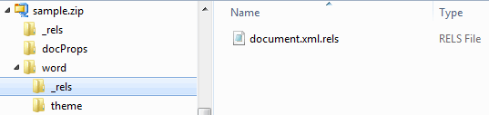

# WordprocessingML 文件剖析

Anatomy of a WordProcessingML File

# 包结构

一个 WordprocessingML 或 docx 文件是一个 zip 文件（一个包/package），其中包含若干"部件(part)"——通常是 UTF-8 或 UTF-16 编码的 XML 文件，不过严格来说，一个部件就是一个字节流。包中还可能包含其他媒体文件，例如图像和视频。其结构按照[开放打包约定(Open Packaging Conventions)](http://officeopenxml.com/whatIsOOXML.php)来组织。

只要把任意 docx 文件重命名为 zip 文件并解压，就能查看它的文件结构和内部文件。



# 内容类型

每个包在根目录下都必须有一个 [Content_Types].xml。该文件列出了包中所有部件的内容类型。每个部件及其类型都必须在 [Content_Types].xml 中登记。下面是一个主文档部件的内容类型：

```
<Override PartName="/word/document.xml" ContentType="application/vnd.openxmlformats-officedocument.wordprocessingml.document.main+xml"/>
```

向包中添加新部件时，务必牢记这一点。

# 关系

每个包都包含一个关系(relationships)部件，用于定义其他部件之间、以及它们与包外资源之间的关系。这样就把关系与内容分离开来，便于在不改动引用目标的源的情况下更改关系。



对于 OOXML 包，_rels 文件夹中始终存在一个关系部件(.rels)，它标识包的起始部件，即包关系。例如，下面定义了内容起始部件的标识：

```
<Relationship Id="rId1" Type="http://schemas.openxmlformats.org/officeDocument/2006/relationships/officeDocument" Target="word/document.xml"/>.
```

.rels 中通常还包含指向 app.xml 和 core.xml 的关系。

除了包的关系部件之外，每个作为一条或多条关系来源的部件也都有各自的关系部件。每个这样的关系部件都位于该部件的 _rels 子文件夹中，命名方式是在部件名后追加 '.rels'。通常主内容部件(document.xml)就有自己的关系部件。其中会包含指向内容中其他部件（如 styles.xml、themes.xml、footer.xml）的关系，以及外部链接的 URI。



关系可以是显式的，也可以是隐式的。对于显式关系，资源通过 <Relationship> 元素的 Id 属性来引用。也就是说，源中的 Id 直接映射到某个关系项的 Id，并显式引用目标。

例如，文档中可能包含如下超链接：

```
<w:hyperlink r:id="rId4">
```

其中 r:id="rId4" 引用了文档关系部件(document.xml.rels)中的如下关系。

```
<Relationship Id="rId4" Type="http://. . ./hyperlink" Target="http://www.google.com/" TargetMode="External"/>
```

对于隐式关系，则没有这种对 <Relationship> Id 的直接引用，而是通过约定来理解该引用。例如，文档中可能包含如下所示的脚注引用。

```
<w:footnoteReference r:id="2">
```

在这种情况下，w:id="2" 的脚注引用被理解为位于 Footnotes 部件中——该部件仅在存在脚注时才存在。在 Footnotes 部件中我们会看到如下内容。

```
<w:footnote w:id="2">
```


# 特定于 WordprocessingML 文档的部件

下面列出了 WordprocessingML 包中那些特定于 WordprocessingML 文档的部件。请记住，一个文档可能只包含其中少数几个部件。例如，如果文档没有脚注，那么包中就不会包含 footnotes 部件。

| 部件                  | 说明                              |
| --------------------- | ---------------------------------------- |
| Comments              | 包含文档中的批注。可能有一个主文档批注部件，以及（如果有词汇表）一个词汇表批注部件。 |
| Document Settings     | 指定文档的设置，包括是否隐藏拼写和语法错误、跟踪修订、写保护等。可能有一个主文档设置部件，以及（如果有词汇表）一个词汇表设置部件。 |
| Endnotes              | 包含文档的尾注。可能有一个主文档尾注部件，以及（如果有词汇表）一个词汇表尾注部件。 |
| Font Table            | 指定文档中所用字体的信息。当指定字体在系统上不可用时，应用程序会用该部件中的信息来决定显示文档时使用哪些字体。可能有一个主文档字体表，以及（如果有词汇表）一个词汇表字体表。 |
| Footer                | 包含[页脚](http://officeopenxml.com/WPfooters.php)的信息。注意，文档的每个[节](http://officeopenxml.com/WPsection.php)都可以有首页、奇数页和偶数页的页脚。因此，根据文档中节的数量以及各节页脚的类型，可能会有多个页脚部件。 |
| Footnotes             | 包含文档的脚注。可能有一个主文档脚注部件，以及（如果有词汇表）一个词汇表脚注部件。 |
| Glossary              | 这是一个补充文档存储位置，其中可能包含随文档一起携带、但在主文档内容中不可见的内容。它用于存储可选的文档片段。只允许有一个。 |
| Header                | 包含[页眉](http://officeopenxml.com/WPheaders.php)的信息。注意，文档的每个[节](http://officeopenxml.com/WPsection.php)都可以有首页、奇数页和偶数页的页眉。因此，根据文档中节的数量以及各节页眉的类型，可能会有多个页眉部件。 |
| Main Document         | 包含文档正文。       |
| Numbering Definitions | 包含文档中[每个编号定义的结构](http://officeopenxml.com/WPnumbering.php)的定义。可能有一个主文档编号定义部件，以及（如果有词汇表）一个词汇表编号定义部件。 |
| Style Definitions     | 包含文档所用一组[样式](http://officeopenxml.com/WPstyles.php)的定义。可能有一个主文档样式定义部件，以及（如果有词汇表）一个词汇表样式定义部件。 |
| Web Settings          | 包含文档所用的 Web 特定设置的定义。这些设置分为两类：与 HTML 文档（即框架集定义）相关、可在 WordprocessingML 文档中使用的设置，以及影响文档另存为 HTML 时处理方式的设置。可能有一个主文档 Web 设置部件，以及（如果有词汇表）一个词汇表 Web 设置部件。 |


# 其他 OOXML 文档共享的部件

有多种部件类型可以出现在任何 OOXML 包中。下面是其中与 WordprocessingML 文档较为相关的一些部件。

| 部件                                     | 说明                              |
| ---------------------------------------- | ---------------------------------------- |
| Embedded package                         | 包含一个完整的包，它可以在引用它的包内部，也可以在其外部。例如，一个 WordprocessingML 文档可能包含一个电子表格或演示文稿文档。 |
| Extended File Properties (often found at docProps/app.xml) | 包含 OOXML 文档特有的属性——例如所使用的模板、页数和字数、应用程序名称和版本等属性。 |
| File Properties, Core                    | 核心文件属性使用户能够发现并设置包中的通用属性——例如创建者姓名、创建日期、标题等属性。尽可能使用 [Dublin Core](http://dublincore.org/) 属性（一组用于描述资源的元数据术语）。 |
| Font                                     | 包含直接嵌入文档中的字体。字体可以存储为位图字体（每个字形都存储为光栅图像），也可以存储为符合 ISO/IEC 14496-22:2007 的格式。 |
| Image                                    | 文档中常常包含图像。图像可以作为 zip 条目存储在包中。该条目必须通过图像部件关系以及相应的内容类型来标识。 |
| Theme                                    | DrawingML 是各种 OOXML 文档类型共享的一种语言。它包含一个主题部件，当文档使用主题时，该部件会被包含进 WordprocessingML 文档中。主题部件包含文档主题的信息，即配色方案、字体和格式方案等信息。 |


原文链接: <http://officeopenxml.com/anatomyofOOXML.php>

