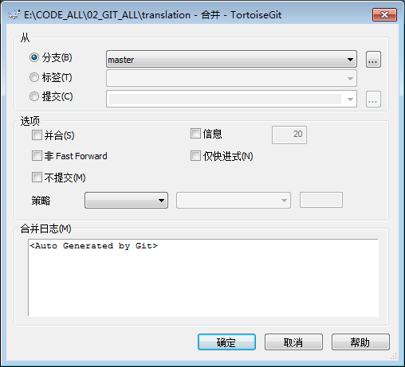

#2.28. TortoiseGit - Merging

2.28 #。TortoiseGit -合并

Where branches are used to maintain separate lines of development, at some stage you will want to merge the changes made on one branch back into the other branch, or vice versa.

地方分支机构是用于维护单独的线的发展,在某个阶段你要合并的更改回另一个分支,一个分支,反之亦然。

It is important to understand how branching and merging works in Git before you start using it, as it can become quite complex. For hints where to find more information about Git and merging see [Section 2, “Reading Guide”](tgit-preface-readingguide.html).

重要的是要理解如何在Git分支和合并工作在你开始使用它,因为它会变得非常复杂.提示在哪里可以找到更多的信息Git和合并看到(第二节,“阅读指南”)(tgit-preface-readingguide.html)。

The next point to note is that merging *always* takes place within a working tree. If you want to merge changes *into* a branch, you have to have a working tree for that branch checked out, and invoke the merge wizard from that working tree using TortoiseGit → Merge....

第二点要注意的是,合并* *总是发生在工作树.如果你想改变*到*一个分支合并,你必须有一个工作签出树的分支,并调用合并向导的工作树使用TortoiseGit→合并....

**Figure 2.43. Merge dialog**

* *见2.43。融入社会dialog * *


!(合并对话框)(41 _01_tortoisegit _Merging_en.png)

```
​对应的中文版本如下所示:
```





In general it is a good idea to perform a merge into an unmodified working tree. If you have made other changes in your working tree, commit those first. If the merge does not go as you expect, you may want to revert the changes, and the Revert command will discard *all* changes including any you made before the merge.

一般来说它是一个好主意来执行一个合并成一个修改的工作树。如果你有了其他的改变你的工作树,先提交这些.如果没有按你希望合并,你可能想要恢复的变化,恢复命令将丢弃* *变化包括任何你在合并之前。

You can choose one commit that you want to merge from.

你可以选择一个你想要合并的提交。

- HEAD

- 头

Current commit checked out.

当前提交签出。

- Branch

- 分支

The latest commit of chosen branch.

最新提交的选择分支。

- Tag

- 标签

The commit of chosen tag.

提交选择的标签。

- Commit

- 提交

Any commit, you click ... to launch log dialog to choose commit. You also can input commit hash, or friendly commit name, such as HEAD~4.

任何承诺,你点击…启动日志对话框选择提交。您还可以输入提交散列,或友好提交名称,如头~ 4。

Squash Just merge change from the other branch. Can't recorder Merge information. The new commit will not record merge branch as one parent commit. Log view will not show merge line between two branch.

南瓜刚从其他分支合并更改。不能记录合并信息。新提交将不记录作为一个家长提交合并分支.日志视图不会显示合并两个分支之间的界线。

No Fast Forward Generate a merge commit even if the merge resolved as a fast-forward.

没有快进生成合并提交即使合并解析为快进。

No Commit Do not automatically create a commit after merge.

没有提交合并后不自动创建一个承诺。

Messages Populate the log message with one-line descriptions from the actual commits that are being merged. Can specify the number of commits to be included in the merge message.

消息日志消息填充一行描述与实际提交被合并。可以指定数量的承诺被包括在合并的消息。

You can see more information at [Section G.3.79, “git-merge(1)”](git-command.html#git-merge(1))

你可以看到更多的信息在[G.3.79节,“git-merge(1)”)(git-command.html # git-merge(1))

Although major merge working is done by git automatically, conflict maybe happen during merge, please see [Section 2.31, “Resolving Conflicts”](tgit-dug-conflicts.html) to how to resolve conflict.

虽然主要的工作是通过git自动合并,合并期间可能发生冲突,请参阅[2.31节,“解决冲突”](tgit-dug-conflicts.html)如何解决冲突。

