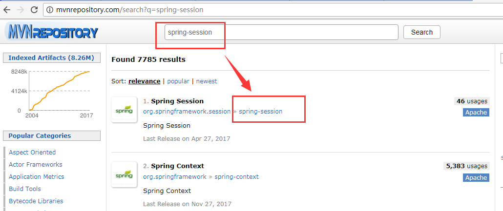
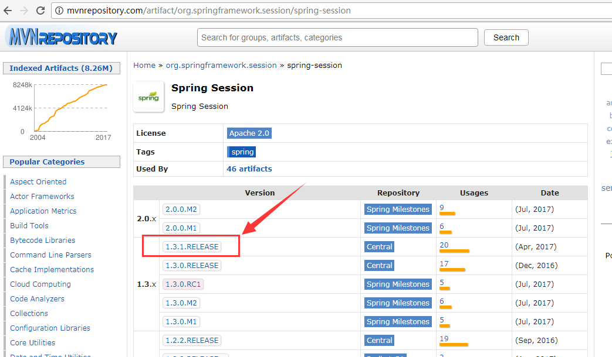
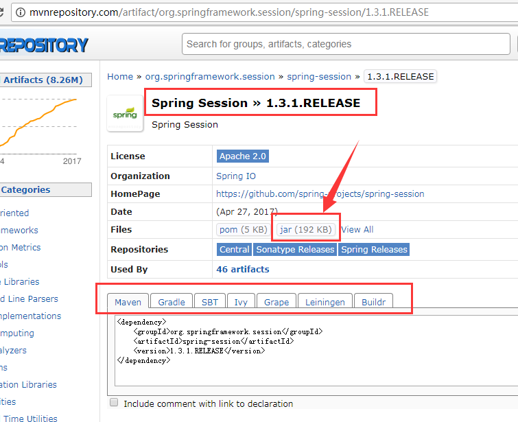

# Spring Session


Session，中文翻译为 "会话"，在计算机领域，用于描述用户端和服务器之间的通讯。当然，基于Http协议的浏览器在请求Web服务器资源时，我们通过会话(Session)来标识不同的客户端/用户。


## Spring-Session简介

Spring Session 是 [Spring.io](https://spring.io/) 组织维护的一个开源项目，基于 Java Web 的 API，将Web服务的会话状态抽离出来，放到共享存储中。这样就可以很容易将单机Web系统平滑扩展为Web集群系统。

项目的官方网站为: <https://projects.spring.io/spring-session/>

顾名思义，Spring Session 可以用来管理JavaWeb系统的用户会话信息。

其主要功能特征包括:

- 用户Session管理相关的API和具体实现

- HttpSession - 以独立的方式，替换如Tomcat之类Web容器所提供的HttpSession，。

- Clustered Sessions - 集群会话管理, 通过Spring Session，可以很轻易地实现Web服务器集群，不需要根据各种Web容器进行一堆繁琐的配置.

- Multiple Browser Sessions - 支持多个会话同时并存，通过 Spring Session，可以在同一个浏览器中支持多个用户会话状态。 (有点类似Google的多账号登录认证).

- RESTful APIs - 可以在 headers 中指定session ids，来兼容 RESTful APIs

- WebSocket - 在WebSocket调用中保证 HttpSession 存活。

下面，我们通过具体的示例来使用Spring-Session。

## 配置示例

jar包下载/依赖配置。

现在很多Java项目使用MAVEN来构建。 

根据官方文档，`pom.xml`文件中配置的maven依赖如下：

```
<dependencies>
    <dependency>
        <groupId>org.springframework.session</groupId>
        <artifactId>spring-session</artifactId>
        <version>1.3.1.RELEASE</version>
    </dependency>
</dependencies>
```

因为 spring-session 的版本和Spring相互独立，所以版本号可以直接写到 dependency 元素中, 当然, 抽取到 properties 配置项中更好。

如果是其他构建工具，那么打开官方网站，在首页面下方即可看到。

假若需要直接依赖 JAR 包, 可以到 <http://mvnrepository.com/> 网站进行搜索, 例如 `spring-session` 关键字。

结果如下图所示:



点击对应的连接，看到各种版本的列表页面：



选择需要的版本，点击版本号，进入该版本对应的页面。



可以看到，其中有 `jar` 相关的链接，点击即可下载。

当然，从中我们也可以看到其他各种MAVEN相关的构建工具的依赖配置，根据需要选择即可。该页面的下方还列出了直接依赖。 建议收藏该网站，以备不时之需。


## Session 的实现原理


