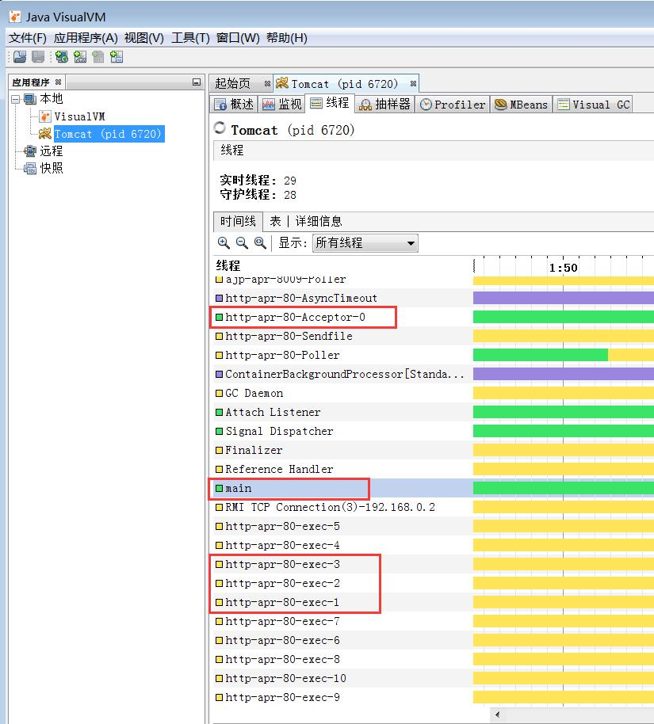

# 闲话多线程 - 话题交流

时间: 2017年12月19日 23:00~

地点: 开源技术交流群(316630025)

> 北京-铁锚

今天分享的话题是 “闲话多线程”

人们常常将 多线程和高并发混在一起谈论， 比如昨天有同学聊到， 京东，淘宝等大型电商的话题。

但实际上两者没什么必然联系。 

多线程有什么好处呢?

我们看他的对立面， 单线程是怎么回事。

最初的程序都是单线程的， 甚至没有线程这个概念。

程序的执行流程， 只有一条主线。 即按顺序执行指令。

但是随着计算机全面介入整个社会的方方面面， 需要解决的问题就各种各样了。

因为需求多样化了。
> 愤怒的葡萄

多线程是为防阻塞或者提高计算速度？

> 北京-铁锚

多线程有很多好处，用得好肯定能提高速度

所有的技术、算法、优化，都是为了提高速度。 

在某些场景下， 使用多线程会恰到好处地满足我们的预期。

首先明确一个概念， 虽然有了多线程，但是单线程依然大行其道。 各有各的市场。

多线程伴随着一个概念， 叫做多任务。

只有任务多了，或者能把任务拆解为多个，使用多线程才有优势。

常见的场景有哪些呢?

比如， 我们最熟悉的Tomcat

Tomcat实现的是JavaEE规范，所以可以说，各种JavaEE技术都在使用多线程。

因为Tomcat面对的是多个用户/终端，所以JavaWeb这种服务器模型默认就是多线程的。

一个Http请求到来时， 可能需要一定量的CPU运算， 可能会有磁盘IO，数据库读写， 以及第三方服务/API的调用，记录日志等等操作。

如果有多个请求同时到来（这就是并发，但不是高并发），只有单个线程进行处理，明显有问题。

就像餐厅，多个顾客来就餐时

只有1个服务员的情况， 那么合理一点的接待方式是时间分片、虽然顾客体验可能不好，但是大家都能招待到，不会出现暴怒等情况。 

但高端餐厅肯定不能这么干

很显然，如果我是老板，生意好，我就会多招几个服务员。

能满足稍微多一点的顾客需求。

当然， 可能还会引入一个大堂经理。 先和顾客打好招呼之后， 找一个空闲的服务员来专门为顾客服务。

这就是 BOSS/worker模型

Tomcat之类的程序一般也是这种模型， connector 就是Boss， 接受请求之后，封装基本信息， 之后把 Request 交给 worker 线程来处理。

Boss也可以叫做主线程。

或者叫交互线程。

都差不多，负责和客户打交道的。或者负责统筹的。

worker就是工人，只负责干活，按规定干完拉倒，然后待命。

当然，也可能干完之后被解雇， 也就是线程结束。

另一个示例， 是暴风影音

播放视频的线程只负责播放，当然可能有一堆线程来负责读取、解码，等等。 这涉及到了消费者和生产者的关系，此处暂时不讲。

从用户的角度看， 播放是一个线程， 处理用户操作的是另一个线程， 比如 暂停，全屏等等。

为什么要这样设计，那就是防止卡顿，防止阻塞。

视频播放不能卡， 用户操作也不能卡， 这就是需求啊。

只有1个CPU核心时为什么也不会卡死呢?

因为有缓存。 比如解码后的缓存，显卡缓存等。

回到多线程的话题

多线程的引入， 一是因为任务的复杂性，执行过程中有很多的等待操作，浪费CPU资源。

二是因为多核心CPU的成熟。

单核心CPU性能提不上去，自然采用横向扩展， 发展多核CPU。

单个线程有什么优势，有什么不足呢?

比如 JavaScript， 因为是单线程模型，所以简单的编程任务实现非常简单。

但复杂的任务编写起来就更复杂，而且不好理解， 比如 队列，事件，异步，回调，延迟等等

比如 Redis， 单机性能非常好，那是因为他的业务类型非常单一，只专心做一件事。 把复杂的事情让给其他系统来完成。

为了更快，更好地完成多个任务，我们可以使用多线程。

既然多线程是为了更好地完成任务， 那么多线程之间的同步问题，根本原因就是为了有序地共享某些资源，以及有序地进行状态交互，合作起来，完成某个大任务。

说到状态，简单提一下，并发与并行的区别。

并发就是多个线程之间，互相有某些状态/数据/资源互相影响。

并行，从某个角度看，就是各个线程之间没有状态共享，不涉及资源竞争。

比如，公司有5个业务员，每个人负责一个省份的业务， 那么我们可以说这5个业务员是并行进行的。

如果换个视角、有公司财务、公司老总的存在，这些人之间存在交互和状态共享，那就是并发。

所以并发和并行区别就在于看问题的视角，和处理任务的维度。

我们看, Tomcat 的线程， 启动之后，随便刷新几次页面，就可以看到有很多的 exec 线程. 这就是 worker, 虽然叫执行线程， 但是和 nginx 的 worker基本上是类似的。

> 北京-Gp`

为什么nginx性能比较好

> 北京-铁锚

那么我们换个角度问， 为什么Apache性能不好?

有对比才有伤害

才能看出谁更厉害。

A-Pache是很早以前就出来了的。

有一大堆的历史包袱，有N多的插件， 所以他的主要任务不是提高性能， 而是要兼容旧有的生态系统。

而 Nginx 要纯粹得多， 推出的晚，各种异步，各种高性能的技术都可以利用得上，而且职责专一。

IO模型很高效，也不需要外挂很多模块。

打个比方， Nginx 就是 C++， 性能很高， Apache就是JVM，多了一层转接， 整体性能差了一些。

为什么nginx这么受欢迎呢?

我觉得原因是 nginx 配置太简单了， 又简单又好用， 还能很方便写自己的脚本。

多线程有哪些场景呢?  比如，爬虫

假设， 需要从多个服务器地址抓取数据，进行合并，然后返回给客户端。

那么从多台服务器抓取数据这个过程，就是可以并行化的，也就是可以通过多个线程同时进行。

使用单线程可不可以? 答案是可以。

如果不进行优化， 只是纯粹的串行处理， 一个接一个地抓取， 无疑响应时间会长很多， N台那就是N倍的时间。

好处是简单， 一个 for 循环就解决了。 

如果响应时间满足，抓取地址不多，那么什么问题都没有。 不需要花时间，浪费生命去做价值不大的事。

如果需求变了， 用户数量增加， 或者是响应时间不可忍受， 那么就需要进行优化。

2个方向： 单线程异步/事件模型。 或者多线程模型。

说实话，很多场景下， 多线程性能并不见得很好。

但是多线程，拆开来看， 其中每个线程所做的事都很简单，也很容易理解。

人力是最重要的资源，所以只要性能差不多，或者可以忍受， 计算模型/算法的简单就很重要了。

因为需求会变化，可维护性，可读性这些也就很重要。

> 北京-Gp`

多线程性能主要浪费在线程的分配和切换上了

如果能在线程调度上面有很好的优化倒也是不错的

> 北京-铁锚

说到线程切换的开销，

那么要看具体的任务， 比如， 网络型或者IO型的任务， 计算时间需要 0.1ms, IO时间需要10毫秒, 那么线程切换的开销可以忍受。

如果是CPU密集型，或者是需要快速响应的任务， 多线程的上下文切换，代价就非常大了。 所占用的实际比例太高，这就不划算。

比如 Nginx， 比如 Redis， 比如 Oracle， 这些系统都不希望有太多的线程， 最好是小于等于 CPU 核心数。

当然 Redis 只有1个主业务线程。

要达到美妙5-10W的QPS，很明显,有操作系统进行上下文切换，是很难做到的。

每秒

顺便说一句， Apache，以及 Tomcat 一般都是多线程的， 所以相对 Nginx， 在高并发下的性能差距非常大。

什么是上下文切换? 就是切换到另一个线程的时候， 需要打断当前CPU核心的执行， 丢弃优化过的指令， 丢弃暂存的等待执行的指令, 将寄存器数据保存到内存、可能还会将L2、L3 Cache导出到内存， 然后再把新的线程相关的数据加载到CPU，然后点火，执行。。。

中途还要执行操作系统的代码，操作系统在内存中执行一堆拷贝，指令。

异步模型，那就是 NodeJS，或者 Go之类的技术所使用的， 因为操作系统已经支持相关技术， 所以利用这些新技术，可以很容易处理高并发。

但是对于计算量很大的业务， 可能就不是很适合了。比如批处理， 统计等等。 而且编程的复杂性和技术成熟度等问题， 现在Java依然是使用最广泛Web段编程技术。

至于哪种技术人员的工资高，那就是高手的工资都很高。被淘汰的技术，该技术的高手就没什么价值了。

今天就分享到这里，各位早点休息！

> 菜鸡

既然大佬们都能看懂   我还是有点不明白    多线程就是分成了时间片执行   io就在读写的过程需要用到cpu吗？

> 北京-铁锚

比如网络请求第三方API， 请求发出去之后，就处于在等待的状态，这时候CPU消耗可以忽略不计。又比如磁盘IO, 主要时间消耗都是在寻道、读取和写入操作， CPU消耗很小。 当然, 大数据量的IO属于特殊情况, 瓶颈也不在CPU这一块。
