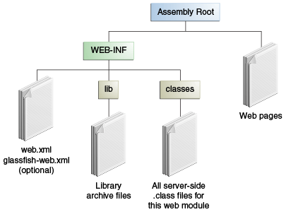

# 5.3 Packaging Web Archives

# 5.3 WAR包目录结构

In the Java EE architecture, a **web module** is the smallest deployable and usable unit of web resources. A web module contains web components and static web content files, such as images, which are called **web resources**. A Java EE web module corresponds to a web application as defined in the Java Servlet specification.

在Java EE架构中, **web模块(web module)** 是最小的web资源部署结构, 也是最小的可用单元. web模块中包含web组件以及静态资源; 如图片之类的静态资源也称为 **web资源**. Java EE web模块对应Java Servlet规范中定义的web应用程序。

In addition to web components and web resources, a web module can contain other files:

除了web组件和web资源, web模块中还可以包含其他文件:

- Server-side utility classes, such as shopping carts

- Client-side classes, such as utility classes

- 服务端运行所需的工具类

- 客户端工具类, 主要是 Applet 即相关的工具类, 基本上已废弃。

A web module has a specific structure. The top-level directory of a web module is the **document root** of the application. The document root is where XHTML pages, client-side classes and archives, and static web resources, such as images, are stored.

web模块都有特定的结构。顶层目录对应的是应用程序的 **document root**. 用于存储 HTML页面, 静态web资源等等。

The document root contains a subdirectory named `WEB-INF`, which can contain the following files and directories:

根目录下有一个 `WEB-INF` 的文件夹, 其中可以含有下列文件和目录:

- `classes`, a directory that contains server-side classes: servlets, enterprise bean class files, utility classes, and JavaBeans components

- `lib`, a directory that contains JAR files that contain enterprise beans, and JAR archives of libraries called by server-side classes

- Deployment descriptors, such as `web.xml` (the web application deployment descriptor) and `ejb-jar.xml` (an EJB deployment descriptor)

- `classes` 目录, 其中存放各种服务端相关的 class: 如servlet、bean, 工具类, 以及运行时资源, 如XML,配置文件等等。

- `lib` 目录, 其中存放各种 JAR 文件

- 部署说明信息(Deployment descriptors), 如 `web.xml`(web应用程序部署信息), 或者 `ejb-jar.xml`(EJB项目部署信息)。

A web module needs a `web.xml` file if it uses JavaServer Faces technology, if it must specify certain kinds of security information, or if you want to override information specified by web component annotations.

如果使用 JavaServer Faces 技术, 则 web module 需要有 `web.xml` 文件, 用来指定特定类型的安全信息, 或者覆盖 web component 上通过注解指定的信息。

You can also create application-specific subdirectories (that is, package directories) in either the document root or the `WEB-INF/classes/` directory.

根据项目需要, 还可以在根目录, 以及 `WEB-INF/classes/` 目录下创建自己的文件夹/package。

A web module can be deployed as an unpacked file structure or can be packaged in a JAR file known as a Web Archive (WAR) file. Because the contents and use of WAR files differ from those of JAR files, WAR file names use a `.war` extension. The web module just described is portable; you can deploy it into any web container that conforms to the Java Servlet specification.

web模块可以解压为文件夹部署, 也可以部署为 Web Archive(WAR包), 其本质是一个JAR文件/ZIP文件. 因为WAR文件中的内容和一般的JAR文件不同, 为了区分, 使用后缀 `.war` 命名。web模块是可移植的(portable); 可以将其部署到任何符合Java Servlet规范的web容器中。

You can provide a runtime deployment descriptor (DD) when you deploy a WAR on GlassFish Server, but it is not required under most circumstances. The runtime DD is an XML file that may contain such information as the **context root** of the web application, the mapping of the portable names of an application's resources to GlassFish Server resources, and the mapping of an application's security roles to users, groups, and principals defined in GlassFish Server. The GlassFish Server web application runtime DD, if used, is named `glassfish-web.xml` and is located in the `WEB-INF` directory. The structure of a web module that can be deployed on GlassFish Server is shown in Figure 5-3.

如果部署到 GlassFish Server 中, 还可以在 `WEB-INF` 目录下指定一个文件 `glassfish-web.xml`, 来使用 GlassFish 中存在的用户, 权限组, 身份验证等信息。

您可以提供一个运行时部署描述符(DD)当你GlassFish服务器上部署一个战争,但这不是必需的在大多数情况下.运行时DD是一个XML文件,该文件可能包含这些信息的* * * * web应用程序的上下文根,可移植的应用程序的名称的映射资源GlassFish服务器资源,和应用程序的安全角色映射到用户,组,和校长在GlassFish服务器中定义的。GlassFish服务器web应用程序运行时,如果使用,命名`glassfish-web.xml`和位于`WEB-INF`目录中。web模块的结构,可以部署在GlassFish服务器,如图5 - 3所示。

Figure 5-3 Web Module Structure

图5 - 3万维网模块结构

Diagram of web module structure. WEB-INF and web pages are under the root. Under WEB-INF are descriptors and the lib and classes directories.

web模块结构图。根目录下面有 `WEB-INF`和web页面/目录。WEB-INF下面有 lib 和 classes 目录。

原文链接: <https://docs.oracle.com/javaee/7/tutorial/packaging003.htm>
