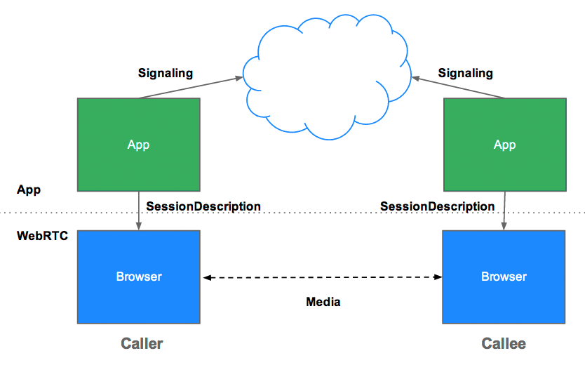
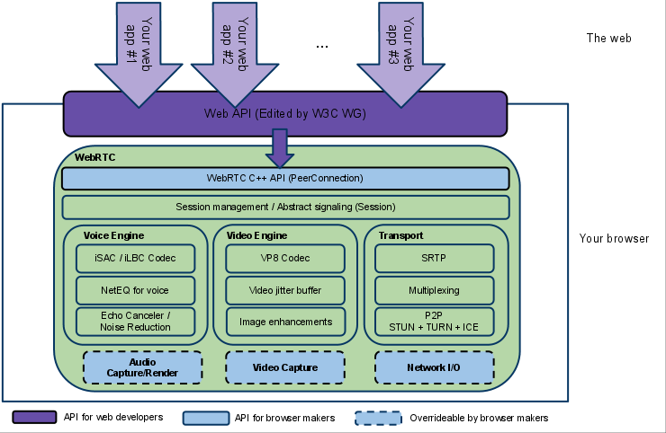
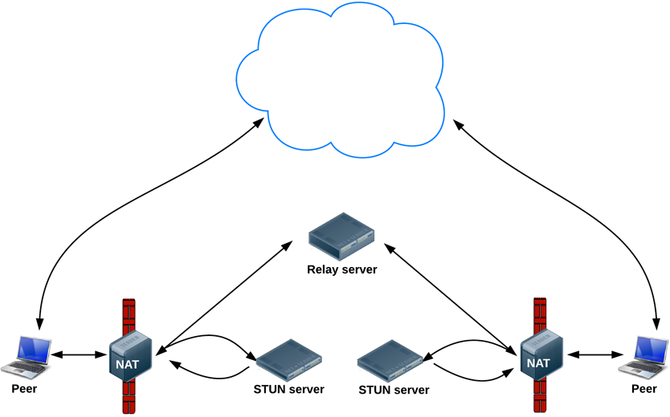
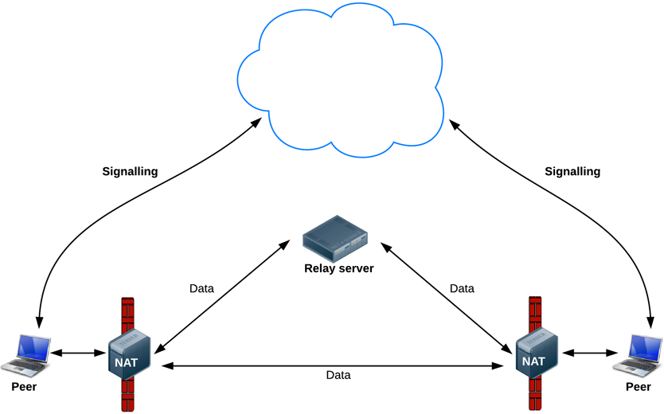
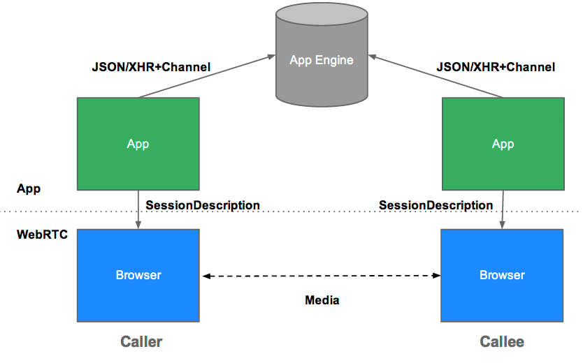
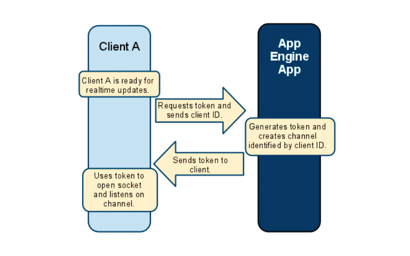
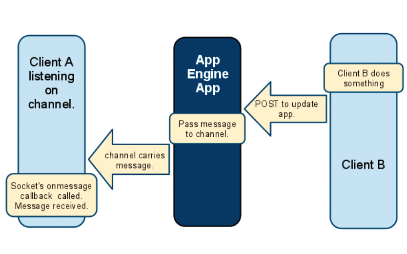
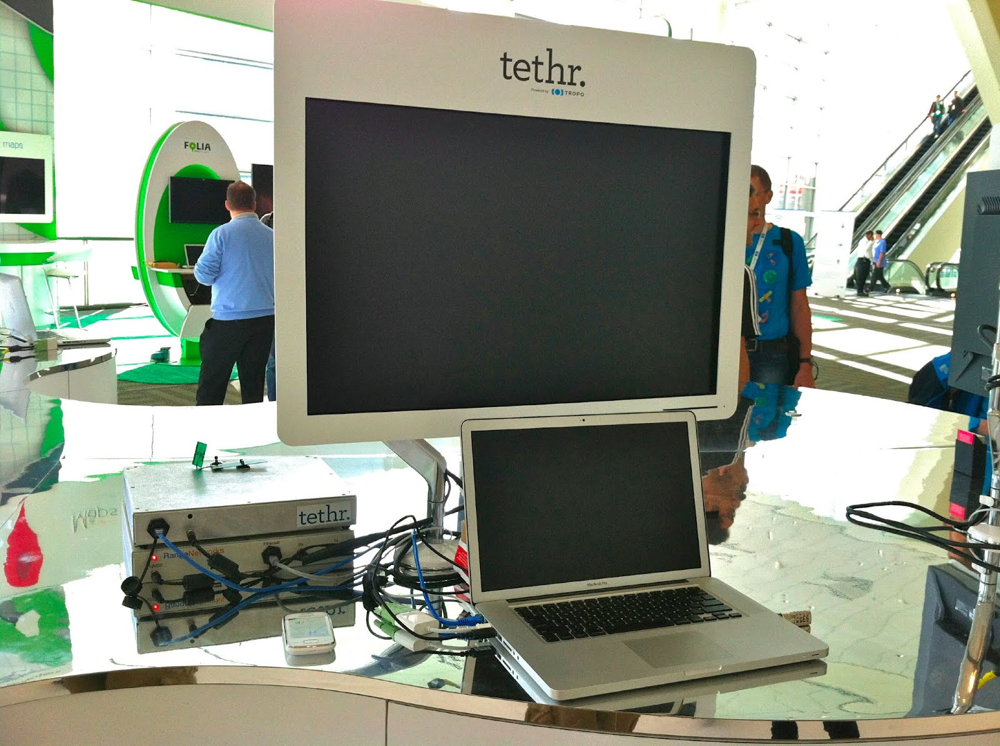
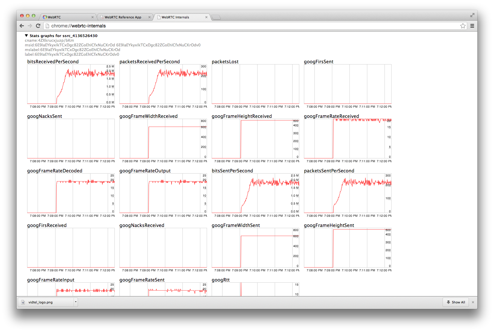

# Getting Started with WebRTC

# WebRTC入门简介

> WebRTC is a new front in the long war for an open and unencumbered web.
>
>  ---- By : [Brendan Eich](http://hacks.mozilla.org/2012/03/video-mobile-and-the-open-web/), inventor of JavaScript

> JavaScript之父 [Brendan Eich](http://hacks.mozilla.org/2012/03/video-mobile-and-the-open-web/) 表态: WebRTC在开放和不受限网络中, 是一个远大的新技术前沿!

## Real-time communication without plugins

## 无需插件, 在浏览器中视频通话

Imagine a world where your phone, TV and computer could all communicate on a common platform. Imagine it was easy to add video chat and peer-to-peer data sharing to your web application. That's the vision of WebRTC.

想象一下, 手机, 电脑, 电视可以通过平台进行实时的聊天和通信。通过Web应用, 即可远程视频通话, 传输文件以及数据。没有监控,不用担心泄密, 蓝天将会变得多么美好! 这就是WebRTC的目标和未来。

Want to try it out? WebRTC is available now in Google Chrome, Opera and Firefox. A good place to start is the simple video chat application at [apprtc.appspot.com](https://apprtc.appspot.com/):

当前最新版本的 Google Chrome, Opera 和 Firefox 浏览器都已经支持 WebRTC, 相关的demo请访问: <https://apprtc.appspot.com/>


1. Open [apprtc.appspot.com](https://apprtc.appspot.com/) in Chrome, Opera or Firefox.
2. Click the Allow button to let the app use your webcam.
3. Open the URL displayed at the bottom of the page in a new tab or, better still, on a different computer.

1. 使用新浏览器访问 <https://apprtc.appspot.com/>
2. 如果有弹框/要求webcam摄像头授权,允许即可
3. 页面底部显示聊天室URL, 在另一台电脑, 或者新标签页中打开, 确定参与(Join)视频通话即可。

There is a walkthrough of this application.

下面对这个程序进行简单的介绍。


## Quick start

## 快速学习

Haven't got time to read this article, or just want code?

没有时间去阅读这篇文章,或者只是想要代码?

1. Get an overview of WebRTC from the Google I/O presentation (the slides are [here](http://io13webrtc.appspot.com/)):

   

2. If you haven't used getUserMedia, take a look at the [HTML5 Rocks article](http://www.html5rocks.com/en/tutorials/getusermedia/intro/) on the subject, and view the source for the simple example at [simpl.info/gum](http://www.simpl.info/getusermedia).

3. Get to grips with the RTCPeerConnection API by reading through the simple example below and the demo at [simpl.info/pc](http://www.simpl.info/pc), which implements WebRTC on a single web page.

4. Learn more about how WebRTC uses servers for signaling, and firewall and NAT traversal, by reading through the code and console logs from [apprtc.appspot.com](https://apprtc.appspot.com/).

5. Can’t wait and just want to try out WebRTC right now? Try out some of the [20+ demos](https://webrtc.github.io/samples) that exercise the WebRTC JavaScript APIs.


6. Having trouble with your machine and WebRTC? Try out our troubleshooting page [test.webrtc.org](https://test.webrtc.org/).

<br/>
​
1. 观看 Google I/O 大会上演示的 [WebRTC-PPT](http://io13webrtc.appspot.com/) 或者视频: <https://www.youtube.com/embed/p2HzZkd2A40>

2. 如果对 getUserMedia 还不熟悉, 可以参考 [使用HTML5捕捉视频和声音](https://www.html5rocks.com/zh/tutorials/getusermedia/intro/), 相关的Demo页面: <http://www.simpl.info/getusermedia>。

3. 掌握RTCPeerConnection 相关的API, 示例页面为: <http://www.simpl.info/pc>, 其在单个网页中实现了WebRTC。

4. 想要深入学习 WebRTC 内部的信令传输，穿墙打洞等技术细节, 请访问 <https://apprtc.appspot.com/>, 并通过F12打开控制台, 查看日志.

5. GitHub上有很多WebRTC相关的示例, 请访问: <https://webrtc.github.io/samples>

6. 如果使用 WebRTC 出错, 可以尝试访问诊断页面 <https://test.webrtc.org/>。

Alternatively, jump straight into our [WebRTC codelab](https://www.bitbucket.org/webrtc/codelab): a step-by-step guide that explains how to build a complete video chat app, including a simple signaling server.

另外, 可以打开我们的实验室页面 <https://www.bitbucket.org/webrtc/codelab>, 跟着教程, 学习如何构建一个完整的视频聊天程序, 其中包括搭建一个简单的信令服务器。


## A very short history of WebRTC

## WebRTC的历史由来

One of the last major challenges for the web is to enable human communication via voice and video: Real Time Communication, RTC for short. RTC should be as natural in a web application as entering text in a text input. Without it, we're limited in our ability to innovate and develop new ways for people to interact.

对WEB应用系统来说, 最大的挑战就是实时通讯, 英文 Real Time Communication,  简称 RTC, 也就是视频/语音聊天. 而且RTC应该尽可能简单, 用起来就和文本输入框一样简便, 那就大功告成了。没有RTC, 互联网用户的交流和沟通就会受到很大的限制。

Historically, RTC has been corporate and complex, requiring expensive audio and video technologies to be licensed or developed in house. Integrating RTC technology with existing content, data and services has been difficult and time consuming, particularly on the web.

从历史上看, RTC一直是企业级的复杂系统, 需要昂贵的音频和视频技术, 且需要专门的地盘和设备. 将RTC与现有的数据、内容、和服务集成并兼容, 将会非常复杂和麻烦, 特别是在web系统上。

Gmail video chat became popular in 2008, and in 2011 Google introduced Hangouts, which use the Google Talk service (as does Gmail). Google bought GIPS, a company which had developed many components required for RTC, such as codecs and echo cancellation techniques. Google open sourced the technologies developed by GIPS and engaged with relevant standards bodies at the IETF and W3C to ensure industry consensus. In May 2011, Ericsson built [the first implementation of WebRTC](https://labs.ericsson.com/developer-community/blog/beyond-html5-peer-peer-conversational-video).

Gmail视频聊天在2008年火了起来, 在2011年谷歌推出了Hangouts, 使用Google Talk服务(Gmail也一样). 谷歌收购了一家叫做GIPS的公司, GIPS公司拥有许多RTC所需的技术和组件, 如编解码器(codecs)和回音消除技术. 谷歌将这些技术开源, 并与相关标准组织, IETF和W3C, 制定行业规范. 2011年5月, 爱立信实现了[第一个 WebRTC 应用](https://labs.ericsson.com/developer-community/blog/beyond-html5-peer-peer-conversational-video)。

WebRTC has now implemented open standards for real-time, plugin-free video, audio and data communication. The need is real:

WebRTC 现在是一个开放的标准, 用于实时的plugin-free视频、音频和基础数据通信, 不需要安装单独的插件。亮点在于:

- Many web services already use RTC, but need downloads, native apps or plugins. These includes Skype, Facebook (which uses Skype) and Google Hangouts (which use the Google Talk plugin).
- Downloading, installing and updating plugins can be complex, error prone and annoying.
- Plugins can be difficult to deploy, debug, troubleshoot, test and maintain—and may require licensing and integration with complex, expensive technology. It's often difficult to persuade people to install plugins in the first place!

- 尽管有很多web服务实现了RTC, 但需要下载插件或者安装本地程序。例如 Skype, Facebook(用的就是Skype), 以及谷歌视频群聊(Google Hangouts, 用的是Google Talk plugin)。
- 下载,安装和更新插件可能比较麻烦, 而且容易出错。
- 一般来说,插件很难部署、调试、以及诊断、测试。要修改还得有许可协议, 维护起来更麻烦, 需要集成一堆笨重的东西. 而且到处都提示用户安装插件, 体验也很不友好!

The guiding principles of the WebRTC project are that its APIs should be open source, free, standardized, built into web browsers and more efficient than existing technologies.

WebRTC项目的指导原则, 是API必须开源,免费, 标准化, 而且内置到浏览器之中, 还有比现有的技术性能更强。


## Where are we now?

## WebRTC 目前的发展状况

WebRTC is used in various apps like WhatsApp, Facebook Messenger, appear.in and platforms such as TokBox. There is even an experimental WebRTC enabled iOS Browser named Bowser. WebRTC has also been integrated with [WebKitGTK+](https://labs.ericsson.com/developer-community/blog/beyond-html5-conversational-voice-and-video-implemented-webkit-gtk)and [Qt](https://www.youtube.com/watch?v=Vm5ebKWKNE8) native apps.

WebRTC已经被各种APP所使用, 如 WhatsApp, Facebook Messenger, appear.in 以及 TokBox 之类的平台。甚至在 iOS 上也有实验性质的WebRTC浏览器, 名为 Bowser(水槽). WebRTC也被[WebKitGTK+](https://labs.ericsson.com/developer-community/blog/beyond-html5-conversational-voice-and-video-implemented-webkit-gtk) 和  [Qt](https://www.youtube.com/watch?v=Vm5ebKWKNE8) native app 集成。

Microsoft added MediaCapture and Stream APIs to [Edge](http://blogs.windows.com/msedgedev/2015/05/13/announcing-media-capture-functionality-in-microsoft-edge/).

Microsoft 在 [Edge](http://blogs.windows.com/msedgedev/2015/05/13/announcing-media-capture-functionality-in-microsoft-edge/) 浏览器中增加了 MediaCapture 和 Stream 等API。


WebRTC implements three APIs:

WebRTC 标准定义了以下3个 API:

- `MediaStream` (也称为 `getUserMedia`)
- `RTCPeerConnection`
- `RTCDataChannel`

`**getUserMedia**` is available in Chrome, Opera, Firefox and Edge. Take a look at the cross-browser demo at [demo](https://webrtc.github.io/samples/src/content/getusermedia/gum/) and Chris Wilson's [amazing examples](http://webaudiodemos.appspot.com/) using `getUserMedia` as input for Web Audio.

`**getUserMedia**` 在新版的Chrome,Opera,Firefox和Edge浏览器上可用。关于跨浏览器的演示请参考: <https://webrtc.github.io/samples/src/content/getusermedia/gum/>, 以及Chris Wilson编写的Web Audio示例: <http://webaudiodemos.appspot.com/>。

**`RTCPeerConnection`** is in Chrome (on desktop and for Android), Opera (on desktop and in the latest Android Beta) and in Firefox. A word of explanation about the name: after several iterations, `RTCPeerConnection` is currently implemented by Chrome and Opera as `webkitRTCPeerConnection` and by Firefox as `mozRTCPeerConnection`. Other names and implementations have been deprecated. When the standards process has stabilized, the prefixes will be removed. There's an ultra-simple demo of Chromium's RTCPeerConnection implementation at [GitHub](https://webrtc.github.io/samples/src/content/peerconnection/pc1/) and a great video chat application at [apprtc.appspot.com](https://apprtc.appspot.com/). This app uses [adapter.js](https://github.com/webrtc/adapter), a JavaScript shim, maintained Google with help from the [WebRTC community](https://github.com/webrtc/adapter/graphs/contributors), that abstracts away browser differences and spec changes.

** `RTCPeerConnection`**  在Firefox,以及PC版和安卓版的Chrome,Opera上可用. `RTCPeerConnection` 有一些其他名字: 在Chrome上是 `webkitRTCPeerConnection`, 在 Firefox 上面是 `mozRTCPeerConnection`. 如果规范正式发布, 则前缀会被去掉. 在GitHub 上有一个非常简单的Chromium Demo: <https://webrtc.github.io/samples/src/content/peerconnection/pc1/>, 视频聊天相关的demo可以参考 <https://apprtc.appspot.com/>。 其中Google 团队维护了一个兼容各种浏览器的JavaScript库: [adapter.js](https://github.com/webrtc/adapter), 贡献者在这里: [WebRTC community](https://github.com/webrtc/adapter/graphs/contributors).

**RTCDataChannel** is supported by Chrome, Opera and Firefox. Check out one of the data channel demos at [GitHub](https://webrtc.github.io/samples/) to see it in action.

**`RTCDataChannel`** 兼容Chrome, Opera 和 Firefox, 可以参考 GitHub 上的示例 <https://webrtc.github.io/samples/>。


### A word of warning

### 一点提醒

Be skeptical of reports that a platform 'supports WebRTC'. Often this actually just means that `getUserMedia` is supported, but not any of the other RTC components.

对"某平台支持WebRTC"之类的说法要保持警惕。很多时候, 这其实只是指支持 `getUserMedia` 而已, 其他 RTC 组件并不支持。

## My first WebRTC

## 我的第一个 WebRTC 程序

WebRTC applications need to do several things:

WebRTC 应用需要完成以下几件事情:

- Get streaming audio, video or other data.
- Get network information such as IP addresses and ports, and exchange this with other WebRTC clients (known as *peers*) to enable connection, even through [NATs](http://en.wikipedia.org/wiki/NAT_traversal) and firewalls.
- Coordinate signaling communication to report errors and initiate or close sessions.
- Exchange information about media and client capability, such as resolution and codecs.
- Communicate streaming audio, video or data.

- 获取流式音频、视频或其他数据。
- 获取 IP 地址和端口等网络信息, 并与其他 WebRTC 客户端(称为*对等端*, peer)交换这些信息以建立连接, 即使双方都在 [NAT](http://en.wikipedia.org/wiki/NAT_traversal) 和防火墙之内也要能连上。
- 协调信令通信, 用来报告错误, 以及建立或关闭会话。
- 交换媒体和客户端能力相关的信息, 比如分辨率和编解码器(codecs)。
- 传输流式音频、视频或数据。

To acquire and communicate streaming data, WebRTC implements the following APIs:

为了获取并传输流数据, WebRTC 实现了以下几个 API:

- [MediaStream](https://dvcs.w3.org/hg/audio/raw-file/tip/streams/StreamProcessing.html): get access to data streams, such as from the user's camera and microphone.
- [RTCPeerConnection](http://dev.w3.org/2011/webrtc/editor/webrtc.html#rtcpeerconnection-interface): audio or video calling, with facilities for encryption and bandwidth management.
- [RTCDataChannel](http://dev.w3.org/2011/webrtc/editor/webrtc.html#rtcdatachannel): peer-to-peer communication of generic data.

- [MediaStream](https://dvcs.w3.org/hg/audio/raw-file/tip/streams/StreamProcessing.html): 获取数据流, 比如来自用户摄像头和麦克风的流。
- [RTCPeerConnection](http://dev.w3.org/2011/webrtc/editor/webrtc.html#rtcpeerconnection-interface): 音频或视频通话, 并提供加密和带宽管理功能。
- [RTCDataChannel](http://dev.w3.org/2011/webrtc/editor/webrtc.html#rtcdatachannel): 通用数据的点对点通信。

(There is detailed discussion of the network and signaling aspects of WebRTC below.)

(关于 WebRTC 网络和信令方面的内容, 下文会详细讨论。)

## MediaStream (aka getUserMedia)

## MediaStream (即 getUserMedia)

The [MediaStream API](http://dev.w3.org/2011/webrtc/editor/getusermedia.html) represents synchronized streams of media. For example, a stream taken from camera and microphone input has synchronized video and audio tracks. (Don't confuse MediaStream tracks with the <track> element, which is something [entirely different](http://www.html5rocks.com/en/tutorials/track/basics/).)

[MediaStream API](http://dev.w3.org/2011/webrtc/editor/getusermedia.html) 表示同步的媒体流。比如, 从摄像头和麦克风获取的流, 就包含同步的视频轨道和音频轨道。(不要把 MediaStream 的 track 和 `<track>` 元素搞混了, 那是[完全不同的东西](http://www.html5rocks.com/en/tutorials/track/basics/)。)

Probably the easiest way to understand MediaStream is to look at it in the wild:

理解 MediaStream 最简单的方式, 可能就是实际看一看:

1. In Chrome or Opera, open the demo at [https://webrtc.github.io/samples/src/content/getusermedia/gum](https://webrtc.github.io/samples/src/content/getusermedia/gum/).
2. Open the console.
3. Inspect the `stream` variable, which is in global scope.

1. 在 Chrome 或 Opera 中打开这个 demo: [https://webrtc.github.io/samples/src/content/getusermedia/gum](https://webrtc.github.io/samples/src/content/getusermedia/gum/)。
2. 打开控制台。
3. 查看全局作用域中的 `stream` 变量。

Each MediaStream has an input, which might be a MediaStream generated by `navigator.getUserMedia()`, and an output, which might be passed to a video element or an RTCPeerConnection.

每个 MediaStream 都有一个输入, 可能是由 `navigator.getUserMedia()` 生成的 MediaStream; 还有一个输出, 可能会传给 video 元素或者 RTCPeerConnection。

The `getUserMedia()` method takes three parameters:

`getUserMedia()` 方法接受三个参数:

- A constraints object.
- A success callback which, if called, is passed a MediaStream.
- A failure callback which, if called, is passed an error object.

- 一个 constraints(约束)对象。
- 成功回调, 如果被调用, 会传入一个 MediaStream。
- 失败回调, 如果被调用, 会传入一个错误对象。

Each MediaStream has a `label`, such as'Xk7EuLhsuHKbnjLWkW4yYGNJJ8ONsgwHBvLQ'. An array of MediaStreamTracks is returned by the `getAudioTracks()` and `getVideoTracks()` methods.

每个 MediaStream 都有一个 `label`, 比如 'Xk7EuLhsuHKbnjLWkW4yYGNJJ8ONsgwHBvLQ'。`getAudioTracks()` 和 `getVideoTracks()` 方法会返回 MediaStreamTrack 数组。

For the [https://webrtc.github.io/samples/src/content/getusermedia/gum](https://webrtc.github.io/samples/src/content/getusermedia/gum/). example, `stream.getAudioTracks()` returns an empty array (because there's no audio) and, assuming a working webcam is connected, `stream.getVideoTracks()`returns an array of one MediaStreamTrack representing the stream from the webcam. Each MediaStreamTrack has a kind ('video' or 'audio'), and a label (something like 'FaceTime HD Camera (Built-in)'), and represents one or more channels of either audio or video. In this case, there is only one video track and no audio, but it is easy to imagine use cases where there are more: for example, a chat application that gets streams from the front camera, rear camera, microphone, and a 'screenshared' application.

以上面的 [https://webrtc.github.io/samples/src/content/getusermedia/gum](https://webrtc.github.io/samples/src/content/getusermedia/gum/) 为例, `stream.getAudioTracks()` 返回一个空数组(因为没有音频), 而在摄像头正常工作的情况下, `stream.getVideoTracks()` 会返回一个只含一个 MediaStreamTrack 的数组, 代表来自摄像头的流。每个 MediaStreamTrack 都有一个 kind('video' 或 'audio')和一个 label(类似 'FaceTime HD Camera (Built-in)'), 代表一路或多路音频或视频。在这个例子中, 只有一个视频轨道, 没有音频; 不过很容易想到轨道更多的使用场景: 比如, 聊天应用同时从前置摄像头、后置摄像头、麦克风以及'屏幕共享'应用获取流。

In Chrome or Opera, the `URL.createObjectURL()` method converts a MediaStream to a [Blob URL](http://www.html5rocks.com/tutorials/workers/basics/#toc-inlineworkers-bloburis) which can be set as the `src` of a video element. (In Firefox and Opera, the `src` of the video can be set from the stream itself.) Since version M25, Chromium-based browsers (Chrome and Opera) allow audio data from `getUserMedia` to be passed to an audio or video element (but note that by default the media element will be muted in this case).

在 Chrome 或 Opera 中, `URL.createObjectURL()` 方法可以把 MediaStream 转换成 [Blob URL](http://www.html5rocks.com/tutorials/workers/basics/#toc-inlineworkers-bloburis), 并设置成 video 元素的 `src`。(在 Firefox 和 Opera 中, 也可以直接把流本身设置成 video 的 `src`。)从 M25 版本开始, 基于 Chromium 的浏览器(Chrome 和 Opera)允许把 `getUserMedia` 获取的音频数据传给 audio 或 video 元素(但注意, 这种情况下媒体元素默认是静音的)。

`getUserMedia` can also be used [as an input node for the Web Audio API](http://updates.html5rocks.com/2012/09/Live-Web-Audio-Input-Enabled):

`getUserMedia` 也可以[作为 Web Audio API 的输入节点](http://updates.html5rocks.com/2012/09/Live-Web-Audio-Input-Enabled):

```
function gotStream(stream) {
    window.AudioContext = window.AudioContext || window.webkitAudioContext;
    var audioContext = new AudioContext();

    // Create an AudioNode from the stream
    var mediaStreamSource = audioContext.createMediaStreamSource(stream);

    // Connect it to destination to hear yourself
    // or any other node for processing!
    mediaStreamSource.connect(audioContext.destination);
}

navigator.getUserMedia({audio:true}, gotStream);
```

Chromium-based apps and extensions can also incorporate `getUserMedia`. Adding `audioCapture` and/or `videoCapture` [permissions](https://developer.chrome.com/extensions/manifest.html#permissions) to the manifest enables permission to be requested and granted only once, on installation. Thereafter the user is not asked for permission for camera or microphone access.

基于 Chromium 的应用和扩展程序也可以集成 `getUserMedia`。在 manifest 中加入 `audioCapture` 和/或 `videoCapture` [权限](https://developer.chrome.com/extensions/manifest.html#permissions), 就可以只在安装时请求并授权一次, 之后用户不会再被要求授权摄像头或麦克风访问。

Likewise on pages using HTTPS: permission only has to be granted once for for `getUserMedia()` (in Chrome at least). First time around, an Always Allow button is displayed in the browser's [infobar](http://dev.chromium.org/user-experience/infobars).

同样, 在使用 HTTPS 的页面上, `getUserMedia()` 的权限也只需要授权一次(至少在 Chrome 上是这样)。第一次授权时, 浏览器的 [infobar](http://dev.chromium.org/user-experience/infobars) 中会显示一个 Always Allow(总是允许)按钮。

Also, Chrome will deprecate HTTP access for getUserMedia() at the end of 2015 due to it being classified as a [Powerful feature](https://sites.google.com/a/chromium.org/dev/Home/chromium-security/deprecating-powerful-features-on-insecure-origins). You can already see a warning when invoked on a HTTP page on Chrome M44.

另外, 由于 getUserMedia() 被归类为 [Powerful feature(强大特性)](https://sites.google.com/a/chromium.org/dev/Home/chromium-security/deprecating-powerful-features-on-insecure-origins), Chrome 将在 2015 年底不再支持通过 HTTP 访问 getUserMedia()。在 Chrome M44 上, 已经可以在 HTTP 页面调用时看到警告了。

The intention is eventually to enable a MediaStream for any streaming data source, not just a camera or microphone. This would enable streaming from disc, or from arbitrary data sources such as sensors or other inputs.

未来的目标是为任意流式数据源启用 MediaStream, 而不仅仅是摄像头或麦克风, 这样就可以从磁盘、传感器或其他任意数据源进行流式传输。

Note that `getUserMedia()` must be used on a server, not the local file system, otherwise a `PERMISSION_DENIED: 1` error will be thrown.

注意, `getUserMedia()` 必须在服务器环境下使用, 不能用本地文件系统, 否则会抛出 `PERMISSION_DENIED: 1` 错误。

`getUserMedia()` really comes to life in combination with other JavaScript APIs and libraries:

`getUserMedia()` 与其他 JavaScript API 和类库结合使用, 才能真正发挥威力:

- [Webcam Toy](http://webcamtoy.com/app/) is a photobooth app that uses WebGL to add weird and wonderful effects to photos which can be shared or saved locally.
- [FaceKat](http://www.shinydemos.com/facekat/) is a 'face tracking' game built with [headtrackr.js](https://www.html5rocks.com/en/tutorials/webrtc/basics/headtrackr%20library%20for%20realtime%20face%20and%20head%20tracking).
- [ASCII Camera](http://idevelop.ro/ascii-camera/) uses the Canvas API to generate ASCII images.

- [Webcam Toy](http://webcamtoy.com/app/) 是一个照相亭应用, 使用 WebGL 给照片加上各种奇妙的效果, 照片可以分享或保存到本地。
- [FaceKat](http://www.shinydemos.com/facekat/) 是一个'人脸追踪'游戏, 使用 [headtrackr.js](https://www.html5rocks.com/en/tutorials/webrtc/basics/headtrackr%20library%20for%20realtime%20face%20and%20head%20tracking) 构建。
- [ASCII Camera](http://idevelop.ro/ascii-camera/) 使用 Canvas API 生成 ASCII 字符图像。


### Constraints

### 约束(Constraints)

[Constraints](http://tools.ietf.org/html/draft-alvestrand-constraints-resolution-00#page-4) have been implemented since Chrome, Firefox and Opera. These can be used to set values for video resolution for `getUserMedia()` and RTCPeerConnection `addStream()` calls. The intention is to implement [support for other constraints](http://dev.w3.org/2011/webrtc/editor/getusermedia.html#the-model-sources-sinks-constraints-and-states) such as aspect ratio, facing mode (front or back camera), frame rate, height and width, along with an [`applyConstraints()` method](http://dev.w3.org/2011/webrtc/editor/getusermedia.html#methods-1).

[Constraints(约束)](http://tools.ietf.org/html/draft-alvestrand-constraints-resolution-00#page-4) 已经在 Chrome、Firefox 和 Opera 中实现。它可以用来给 `getUserMedia()` 和 RTCPeerConnection 的 `addStream()` 调用设置视频分辨率。计划中的[其他约束](http://dev.w3.org/2011/webrtc/editor/getusermedia.html#the-model-sources-sinks-constraints-and-states)还包括宽高比、摄像头朝向(前置还是后置)、帧率、高度和宽度, 以及一个 [`applyConstraints()` 方法](http://dev.w3.org/2011/webrtc/editor/getusermedia.html#methods-1)。

There's an example at [https://webrtc.github.io/samples/src/content/getusermedia/resolution/](https://webrtc.github.io/samples/src/content/getusermedia/resolution/l).

这里有一个示例: [https://webrtc.github.io/samples/src/content/getusermedia/resolution/](https://webrtc.github.io/samples/src/content/getusermedia/resolution/l)。

One gotcha: `getUserMedia` constraints set in one browser tab affect constraints for all tabs opened subsequently. Setting a disallowed value for constraints gives a rather cryptic error message:

一个坑: 在一个浏览器标签页里设置的 getUserMedia 约束, 会影响之后打开的所有标签页的约束。给约束设置一个不允许的值, 会得到一条相当隐晦的错误信息:

```
navigator.getUserMedia error:
NavigatorUserMediaError {code: 1, PERMISSION_DENIED: 1}
```

#### Screen and tab capture

#### 屏幕和标签页捕捉

Chrome apps also make it possible to share a live 'video' of a single browser tab or the entire desktop via [chrome.tabCapture](http://developer.chrome.com/dev/extensions/tabCapture) and [chrome.desktopCapture](https://developer.chrome.com/extensions/desktopCapture) APIs. A desktop capture sample extension can be found in the [WebRTC samples GitHub repository](https://github.com/webrtc/samples/tree/master/src/content/getusermedia/desktopcapture). For screencast, code and more information, see the HTML5 Rocks update: [Screensharing with WebRTC](http://updates.html5rocks.com/2012/12/Screensharing-with-WebRTC).

Chrome 应用还可以通过 [chrome.tabCapture](http://developer.chrome.com/dev/extensions/tabCapture) 和 [chrome.desktopCapture](https://developer.chrome.com/extensions/desktopCapture) API, 分享单个浏览器标签页或整个桌面的实时'视频'。在 [WebRTC samples GitHub 仓库](https://github.com/webrtc/samples/tree/master/src/content/getusermedia/desktopcapture)中可以找到桌面捕捉的扩展示例。关于屏幕录制(screencast)的代码和更多信息, 请看 HTML5 Rocks 的这篇文章: [Screensharing with WebRTC](http://updates.html5rocks.com/2012/12/Screensharing-with-WebRTC)。

It's also possible to use screen capture as a MediaStream source in Chrome using the experimental chromeMediaSource constraint, as in [this demo](https://html5-demos.appspot.com/static/getusermedia/screenshare.html). Note that screen capture requires HTTPS and should only be used for development due to it being enabled via a command line flag as explaind in this discuss-webrtc [post](https://groups.google.com/forum/#!msg/discuss-webrtc/TPQVKZnsF5g/Hlpy8kqaLnEJ).

在 Chrome 中, 还可以使用实验性的 chromeMediaSource 约束, 把屏幕捕捉作为 MediaStream 的源, 见[这个 demo](https://html5-demos.appspot.com/static/getusermedia/screenshare.html)。注意, 屏幕捕捉需要 HTTPS, 而且由于它是通过命令行开关启用的(如这篇 discuss-webrtc [帖子](https://groups.google.com/forum/#!msg/discuss-webrtc/TPQVKZnsF5g/Hlpy8kqaLnEJ)所解释), 所以只应该用于开发环境。

## Signaling: session control, network and media information

## 信令: 会话控制、网络与媒体信息

WebRTC uses RTCPeerConnection to communicate streaming data between browsers (aka peers), but also needs a mechanism to coordinate communication and to send control messages, a process known as signaling. Signaling methods and protocols are *not* specified by WebRTC: signaling is not part of the RTCPeerConnection API.

WebRTC 使用 RTCPeerConnection 在浏览器之间(也就是对等端, peer)传输流数据, 但还需要一种机制来协调通信、发送控制消息, 这个过程叫做信令(signaling)。信令的方法和协议*并不*由 WebRTC 规定: 信令不是 RTCPeerConnection API 的一部分。

Instead, WebRTC app developers can choose whatever messaging protocol they prefer, such as SIP or XMPP, and any appropriate duplex (two-way) communication channel. The [apprtc.appspot.com](https://apprtc.appspot.com/) example uses XHR and the Channel API as the signaling mechanism. The [codelab](http://www.bitbucket.org/webrtc/codelab) we built uses [Socket.io](http://socket.io/)running on a [Node server](http://nodejs.org/).

因此, WebRTC 应用开发者可以随意选择自己偏好的消息协议, 比如 SIP 或 XMPP, 以及任何合适的双向通信通道。[apprtc.appspot.com](https://apprtc.appspot.com/) 示例使用 XHR 和 Channel API 作为信令机制。我们构建的 [codelab](http://www.bitbucket.org/webrtc/codelab) 则使用运行在 [Node 服务器](http://nodejs.org/)上的 [Socket.io](http://socket.io/)。

Signaling is used to exchange three types of information:

信令用来交换三类信息:

- Session control messages: to initialize or close communication and report errors.
- Network configuration: to the outside world, what's my computer's IP address and port?
- Media capabilities: what codecs and resolutions can be handled by my browser and the browser it wants to communicate with?

- 会话控制消息: 用于初始化或关闭通信, 以及报告错误。
- 网络配置: 对外界来说, 我的计算机的 IP 地址和端口是什么?
- 媒体能力: 我的浏览器和对方的浏览器能处理哪些编解码器和分辨率?

The exchange of information via signaling must have completed successfully before peer-to-peer streaming can begin.

必须成功完成信令信息交换之后, 才能开始点对点的流传输。

For example, imagine Alice wants to communicate with Bob. Here's a code sample from the [WebRTC W3C Working Draft](http://www.w3.org/TR/webrtc/#simple-example), which shows the signaling process in action. The code assumes the existence of some signaling mechanism, created in the `createSignalingChannel()` method. Also note that on Chrome and Opera, RTCPeerConnection is currently prefixed.

举个例子, 假设 Alice 想和 Bob 通信。下面是来自 [WebRTC W3C Working Draft](http://www.w3.org/TR/webrtc/#simple-example) 的示例代码, 展示了信令的实际流程。代码假定存在某种信令机制, 通过 `createSignalingChannel()` 方法创建。还要注意, 在 Chrome 和 Opera 上, RTCPeerConnection 目前是带前缀的。

```
var signalingChannel = createSignalingChannel();
var pc;
var configuration = ...;

// run start(true) to initiate a call
function start(isCaller) {
    pc = new RTCPeerConnection(configuration);

    // send any ice candidates to the other peer
    pc.onicecandidate = function (evt) {
        signalingChannel.send(JSON.stringify({ "candidate": evt.candidate }));
    };

    // once remote stream arrives, show it in the remote video element
    pc.onaddstream = function (evt) {
        remoteView.src = URL.createObjectURL(evt.stream);
    };

    // get the local stream, show it in the local video element and send it
    navigator.getUserMedia({ "audio": true, "video": true }, function (stream) {
        selfView.src = URL.createObjectURL(stream);
        pc.addStream(stream);

        if (isCaller)
            pc.createOffer(gotDescription);
        else
            pc.createAnswer(pc.remoteDescription, gotDescription);

        function gotDescription(desc) {
            pc.setLocalDescription(desc);
            signalingChannel.send(JSON.stringify({ "sdp": desc }));
        }
    });
}

signalingChannel.onmessage = function (evt) {
    if (!pc)
        start(false);

    var signal = JSON.parse(evt.data);
    if (signal.sdp)
        pc.setRemoteDescription(new RTCSessionDescription(signal.sdp));
    else
        pc.addIceCandidate(new RTCIceCandidate(signal.candidate));
};
```

First up, Alice and Bob exchange network information. (The expression 'finding candidates' refers to the process of finding network interfaces and ports using the ICE framework.)

首先, Alice 和 Bob 交换网络信息。('寻找候选者', 指的是使用 ICE 框架查找网络接口和端口的过程。)

1. Alice creates an RTCPeerConnection object with an `onicecandidate`handler.
2. The handler is run when network candidates become available.
3. Alice sends serialized candidate data to Bob, via whatever signaling channel they are using: WebSocket or some other mechanism.
4. When Bob gets a candidate message from Alice, he calls `addIceCandidate`, to add the candidate to the remote peer description.

1. Alice 创建一个带 `onicecandidate` 回调的 RTCPeerConnection 对象。
2. 当网络候选者可用时, 这个回调会被执行。
3. Alice 通过他们使用的信令通道(WebSocket 或其他机制), 把序列化后的候选者数据发送给 Bob。
4. Bob 收到 Alice 的候选者消息后, 调用 `addIceCandidate`, 把候选者加入远端对等端描述中。

WebRTC clients (known as **peers**, aka Alice and Bob) also need to ascertain and exchange local and remote audio and video media information, such as resolution and codec capabilities. Signaling to exchange media configuration information proceeds by exchanging an *offer* and an *answer* using the Session Description Protocol (SDP):

WebRTC 客户端(即 **peers**, 也就是 Alice 和 Bob)还需要确定并交换本地和远端的音视频媒体信息, 比如分辨率和编解码能力。交换媒体配置信息的信令过程, 是通过会话描述协议(Session Description Protocol, SDP)交换 *offer*(提议)和 *answer*(应答)来完成的:

1. Alice runs the RTCPeerConnection `createOffer()` method. The callback argument of this is passed an RTCSessionDescription: Alice's local session description.
2. In the callback, Alice sets the local description using `setLocalDescription()` and then sends this session description to Bob via their signaling channel. Note that RTCPeerConnection won't start gathering candidates until `setLocalDescription()` is called: this is codified in [JSEP IETF draft](http://tools.ietf.org/html/draft-ietf-rtcweb-jsep-03#section-4.2.4).
3. Bob sets the description Alice sent him as the remote description using `setRemoteDescription()`.
4. Bob runs the RTCPeerConnection `createAnswer()` method, passing it the remote description he got from Alice, so a local session can be generated that is compatible with hers. The `createAnswer()` callback is passed an RTCSessionDescription: Bob sets that as the local description and sends it to Alice.
5. When Alice gets Bob's session description, she sets that as the remote description with `setRemoteDescription`.
6. Ping!

1. Alice 运行 RTCPeerConnection 的 `createOffer()` 方法。它的回调参数会传入一个 RTCSessionDescription, 即 Alice 的本地会话描述。
2. 在回调中, Alice 用 `setLocalDescription()` 设置本地描述, 然后通过信令通道把这个会话描述发送给 Bob。注意, RTCPeerConnection 在 `setLocalDescription()` 被调用之前不会开始收集候选者: 这一点在 [JSEP IETF draft](http://tools.ietf.org/html/draft-ietf-rtcweb-jsep-03#section-4.2.4) 中有明确规定。
3. Bob 用 `setRemoteDescription()` 把 Alice 发来的描述设置为远端描述。
4. Bob 运行 RTCPeerConnection 的 `createAnswer()` 方法, 传入从 Alice 那里得到的远端描述, 这样就能生成与她的会话兼容的本地会话。`createAnswer()` 的回调会传入一个 RTCSessionDescription: Bob 把它设置为本地描述, 并发送给 Alice。
5. Alice 收到 Bob 的会话描述后, 用 `setRemoteDescription` 把它设置为远端描述。
6. Ping! 通话打通了!

RTCSessionDescription objects are blobs that conform to the [Session Description Protocol](http://en.wikipedia.org/wiki/Session_Description_Protocol), SDP. Serialized, an SDP object looks like this:

RTCSessionDescription 对象是符合[会话描述协议](http://en.wikipedia.org/wiki/Session_Description_Protocol)(SDP)的数据块。序列化之后的 SDP 对象如下所示:

```
v=0
o=- 3883943731 1 IN IP4 127.0.0.1
s=
t=0 0
a=group:BUNDLE audio video
m=audio 1 RTP/SAVPF 103 104 0 8 106 105 13 126

// ...

a=ssrc:2223794119 label:H4fjnMzxy3dPIgQ7HxuCTLb4wLLLeRHnFxh810
```

The acquisition and exchange of network and media information can be done simultaneously, but both processes must have completed before audio and video streaming between peers can begin.

网络信息和媒体信息的获取与交换可以同时进行, 但这两个过程都必须完成, 对等端之间才能开始音视频流传输。

The offer/answer architecture described above is called [JSEP](http://tools.ietf.org/html/draft-ietf-rtcweb-jsep-00), JavaScript Session Establishment Protocol. (There's an excellent animation explaining the process of signaling and streaming in [Ericsson's demo video](http://www.ericsson.com/research-blog/context-aware-communication/beyond-html5-peer-peer-conversational-video/) for its first WebRTC implementation.)

上面描述的 offer/answer 架构叫做 [JSEP](http://tools.ietf.org/html/draft-ietf-rtcweb-jsep-00), 即 JavaScript Session Establishment Protocol。(爱立信为其第一个 WebRTC 实现制作的 [demo 视频](http://www.ericsson.com/research-blog/context-aware-communication/beyond-html5-peer-peer-conversational-video/)中, 有一个很棒的动画, 解释了信令和流传输的整个过程。)



Once the signaling process has completed successfully, data can be streamed directly peer to peer, between the caller and callee—or if that fails, via an intermediary relay server (more about that below). Streaming is the job of RTCPeerConnection.

信令过程成功完成之后, 数据就可以在呼叫方和被呼叫方之间直接点对点传输了; 如果失败, 则通过中间中继服务器转发(下文会详细介绍)。流传输是 RTCPeerConnection 的职责。

## RTCPeerConnection

## RTCPeerConnection 详解

RTCPeerConnection is the WebRTC component that handles stable and efficient communication of streaming data between peers.

RTCPeerConnection 是 WebRTC 中负责在对等端之间稳定、高效地传输流数据的组件。

Below is a WebRTC architecture diagram showing the role of RTCPeerConnection. As you will notice, the green parts are complex!

下图是 WebRTC 的架构图, 展示了 RTCPeerConnection 的角色。你会注意到, 绿色的部分相当复杂!



From a JavaScript perspective, the main thing to understand from this diagram is that RTCPeerConnection shields web developers from the myriad complexities that lurk beneath. The codecs and protocols used by WebRTC do a huge amount of work to make real-time communication possible, even over unreliable networks:

从 JavaScript 的角度看, 这张图要说明的重点是: RTCPeerConnection 为 web 开发者屏蔽了底下的种种复杂性。WebRTC 使用的编解码器和协议做了大量的工作, 使得即使在不可靠的网络上, 实时通信也能实现:

- packet loss concealment
- echo cancellation
- bandwidth adaptivity
- dynamic jitter buffering
- automatic gain control
- noise reduction and suppression
- image 'cleaning'.

- 丢包隐藏(packet loss concealment)
- 回声消除(echo cancellation)
- 带宽自适应(bandwidth adaptivity)
- 动态抖动缓冲(dynamic jitter buffering)
- 自动增益控制(automatic gain control)
- 降噪与抑制(noise reduction and suppression)
- 图像'净化'(image 'cleaning')。

The W3C code above shows a simplified example of WebRTC from a signaling perspective. Below are walkthroughs of two working WebRTC applications: the first is a simple example to demonstrate RTCPeerConnection; the second is a fully operational video chat client.

上面的 W3C 代码从信令的角度展示了一个简化的 WebRTC 示例。下面我们过一遍两个可运行的 WebRTC 应用: 第一个是演示 RTCPeerConnection 的简单示例; 第二个是一个功能完整的视频聊天客户端。

### RTCPeerConnection without servers

### 不使用服务器的 RTCPeerConnection

The code below is taken from the 'single page' WebRTC demo at [https://webrtc.github.io/samples/src/content/peerconnection/pc1](https://webrtc.github.io/samples/src/content/peerconnection/pc1/), which has local *and* remote RTCPeerConnection (and local and remote video) on one web page. This doesn't constitute anything very useful—caller and callee are on the same page—but it does make the workings of the RTCPeerConnection API a little clearer, since the RTCPeerConnection objects on the page can exchange data and messages directly without having to use intermediary signaling mechanisms.

下面的代码来自 'single page' WebRTC demo: [https://webrtc.github.io/samples/src/content/peerconnection/pc1](https://webrtc.github.io/samples/src/content/peerconnection/pc1/), 它在同一个网页上同时有本地*和*远端的 RTCPeerConnection(以及本地和远端视频)。这本身并没有什么实际用处——呼叫方和被呼叫方在同一个页面上——但它让 RTCPeerConnection API 的工作方式更清晰, 因为页面上的 RTCPeerConnection 对象可以直接交换数据和消息, 不必使用中间信令机制。

One gotcha: the optional second 'constraints' parameter of the `RTCPeerConnection()` constructor is different from the constraints type used by `getUserMedia()`: see [w3.org/TR/webrtc/#constraints](http://www.w3.org/TR/webrtc/#constraints) for more information.

一个坑: `RTCPeerConnection()` 构造函数可选的第二个'constraints'参数, 与 `getUserMedia()` 使用的约束类型并不相同, 详见 [w3.org/TR/webrtc/#constraints](http://www.w3.org/TR/webrtc/#constraints)。

In this example, `pc1` represents the local peer (caller) and `pc2` represents the remote peer (callee).

在这个示例中, `pc1` 代表本地对等端(呼叫方), `pc2` 代表远端对等端(被呼叫方)。

### Caller

### 呼叫方

1. Create a new RTCPeerConnection and add the stream from `getUserMedia()`:

1. 创建一个新的 RTCPeerConnection, 并加上从 `getUserMedia()` 获取的流:

   ```
   // servers is an optional config file (see TURN and STUN discussion below)
   pc1 = new webkitRTCPeerConnection(servers);
   // ...
   pc1.addStream(localStream); 
   ```

2. Create an offer and set it as the local description for `pc1` and as the remote description for `pc2`. This can be done directly in the code without using signaling, because both caller and callee are on the same page:

2. 创建 offer, 把它设置为 `pc1` 的本地描述和 `pc2` 的远端描述。因为呼叫方和被呼叫方在同一个页面上, 所以代码中可以直接完成, 不需要信令:

   ```
   pc1.createOffer(gotDescription1);
   //...
   function gotDescription1(desc){
     pc1.setLocalDescription(desc);
     trace("Offer from pc1 \n" + desc.sdp);
     pc2.setRemoteDescription(desc);
     pc2.createAnswer(gotDescription2);
   }
   ```

### Callee

### 被呼叫方

1. Create `pc2` and, when the stream from `pc1` is added, display it in a video element:

1. 创建 `pc2`, 当来自 `pc1` 的流被添加时, 在 video 元素中显示它:

   ```
   pc2 = new webkitRTCPeerConnection(servers);
   pc2.onaddstream = gotRemoteStream;
   //...
   function gotRemoteStream(e){
     vid2.src = URL.createObjectURL(e.stream);
   }
   ```

### RTCPeerConnection plus servers

### RTCPeerConnection 加上服务器

In the real world, WebRTC needs servers, however simple, so the following can happen:

在真实世界中, WebRTC 需要服务器, 哪怕再简单也好, 这样才能做到以下几点:

- Users discover each other and exchange 'real world' details such as names.
- WebRTC client applications (peers) exchange network information.
- Peers exchange data about media such as video format and resolution.
- WebRTC client applications traverse [NAT gateways](http://en.wikipedia.org/wiki/NAT_traversal) and firewalls.

- 用户互相发现, 交换诸如名字之类的'真实世界'信息。
- WebRTC 客户端应用(对等端)交换网络信息。
- 对等端交换媒体相关的数据, 比如视频格式和分辨率。
- WebRTC 客户端应用穿越 [NAT 网关](http://en.wikipedia.org/wiki/NAT_traversal)和防火墙。

In other words, WebRTC needs four types of server-side functionality:

换句话说, WebRTC 需要四种类型的服务端功能:

- User discovery and communication.
- Signaling.
- NAT/firewall traversal.
- Relay servers in case peer-to-peer communication fails.

- 用户发现与通信。
- 信令。
- NAT/防火墙穿越。
- 点对点通信失败时的中继服务器。

NAT traversal, peer-to-peer networking, and the requirements for building a server app for user discovery and signaling, are beyond the scope of this article. Suffice to say that the [STUN](http://en.wikipedia.org/wiki/STUN) protocol and its extension [TURN](http://en.wikipedia.org/wiki/Traversal_Using_Relay_NAT) are used by the [ICE](http://en.wikipedia.org/wiki/Interactive_Connectivity_Establishment)framework to enable RTCPeerConnection to cope with NAT traversal and other network vagaries.

NAT 穿越、点对点组网, 以及构建用户发现和信令服务器应用的要求, 都超出了本文的范围。简单来说, [STUN](http://en.wikipedia.org/wiki/STUN) 协议及其扩展 [TURN](http://en.wikipedia.org/wiki/Traversal_Using_Relay_NAT), 被 [ICE](http://en.wikipedia.org/wiki/Interactive_Connectivity_Establishment) 框架用来让 RTCPeerConnection 应对 NAT 穿越和其他各种网络状况。

ICE is a framework for connecting peers, such as two video chat clients. Initially, ICE tries to connect peers *directly*, with the lowest possible latency, via UDP. In this process, STUN servers have a single task: to enable a peer behind a NAT to find out its public address and port. (Google has a couple of STUN severs, one of which is used in the apprtc.appspot.com example.)

ICE 是一个连接对等端的框架, 比如两个视频聊天客户端。一开始, ICE 会尝试通过 UDP 以尽可能低的延迟*直接*连接对等端。在这个过程中, STUN 服务器只有一个任务: 让位于 NAT 后面的对等端找到自己的公网地址和端口。(Google 有几个 STUN 服务器, apprtc.appspot.com 示例就用到了其中一个。)



If UDP fails, ICE tries TCP: first HTTP, then HTTPS. If direct connection fails—in particular, because of enterprise NAT traversal and firewalls—ICE uses an intermediary (relay) TURN server. In other words, ICE will first use STUN with UDP to directly connect peers and, if that fails, will fall back to a TURN relay server. The expression 'finding candidates' refers to the process of finding network interfaces and ports.

如果 UDP 失败, ICE 会尝试 TCP: 先是 HTTP, 再是 HTTPS。如果直连失败——特别是由于企业 NAT 穿越和防火墙的原因——ICE 就会使用中间(中继)TURN 服务器。换句话说, ICE 会先用 STUN 加 UDP 直接连接对等端, 失败后再退回到 TURN 中继服务器。'寻找候选者', 指的就是查找网络接口和端口的过程。

WebRTC data pathways

WebRTC engineer Justin Uberti provides more information about ICE, STUN and TURN in the [2013 Google I/O WebRTC presentation](https://www.youtube.com/watch?v=p2HzZkd2A40&t=21m12s). (The presentation [slides](http://io13webrtc.appspot.com/#52) give examples of TURN and STUN server implementations.)

WebRTC 工程师 Justin Uberti 在 [2013 Google I/O WebRTC 演讲](https://www.youtube.com/watch?v=p2HzZkd2A40&t=21m12s)中提供了关于 ICE、STUN 和 TURN 的更多信息。(演讲[幻灯片](http://io13webrtc.appspot.com/#52)中给出了 TURN 和 STUN 服务器实现的示例。)

#### A simple video chat client

#### 一个简单的视频聊天客户端

The walkthrough below describes the signaling mechanism used by [apprtc.appspot.com](https://apprtc.appspot.com/).

下面的讲解, 描述了 [apprtc.appspot.com](https://apprtc.appspot.com/) 所使用的信令机制。

> If you find this somewhat baffling, you may prefer our [WebRTC codelab](https://www.bitbucket.org/webrtc/codelab). This step-by-step guide explains how to build a complete video chat application, including a simple signaling server built with [Socket.io](http://socket.io/) running on a [Node server](http://nodejs.org/).

> 如果你觉得这些内容有点让人摸不着头脑, 或许你更喜欢我们的 [WebRTC codelab](https://www.bitbucket.org/webrtc/codelab)。这份分步指南讲解了如何构建一个完整的视频聊天应用, 包括一个用 [Socket.io](http://socket.io/) 搭建、运行在 [Node 服务器](http://nodejs.org/)上的简单信令服务器。

A good place to try out WebRTC, complete with signaling and NAT/firewall traversal using a STUN server, is the video chat demo at [apprtc.appspot.com](https://apprtc.appspot.com/). This app uses [adapter.js](https://github.com/webrtc/adapter) to cope with different RTCPeerConnection and `getUserMedia()` implementations.

试用 WebRTC 的一个好去处, 是 [apprtc.appspot.com](https://apprtc.appspot.com/) 上的视频聊天 demo, 它包含完整的信令, 并使用 STUN 服务器进行 NAT/防火墙穿越。这个应用使用 [adapter.js](https://github.com/webrtc/adapter) 来兼容不同的 RTCPeerConnection 和 `getUserMedia()` 实现。

The code is deliberately verbose in its logging: check the console to understand the order of events. Below we give a detailed walk-through of the code.

这段代码的日志刻意写得很详细: 请查看控制台, 弄清事件的先后顺序。下面对代码做详细讲解。

### What's going on?

### 到底发生了什么?

The demo starts by running the `initialize()` function:

这个 demo 首先运行 `initialize()` 函数:

```
function initialize() {
    console.log("Initializing; room=99688636.");
    card = document.getElementById("card");
    localVideo = document.getElementById("localVideo");
    miniVideo = document.getElementById("miniVideo");
    remoteVideo = document.getElementById("remoteVideo");
    resetStatus();
    openChannel('AHRlWrqvgCpvbd9B-Gl5vZ2F1BlpwFv0xBUwRgLF/* ...*/');
    doGetUserMedia();
  }
```

Note that values such as the `room` variable and the token used by `openChannel()`, are provided by the Google App Engine app itself: take a look at the [index.html template](https://github.com/webrtc/apprtc/blob/master/src/web_app/html/index_template.html) in the repository to see what values are added.

注意, `room` 变量的值以及 `openChannel()` 使用的 token 等, 都是由 Google App Engine 应用本身提供的: 可以看看仓库里的 [index.html 模板](https://github.com/webrtc/apprtc/blob/master/src/web_app/html/index_template.html), 了解加了哪些值。

This code initializes variables for the HTML video elements that will display video streams from the local camera (`localVideo`) and from the camera on the remote client (`remoteVideo`). `resetStatus()` simply sets a status message.

这段代码为 HTML video 元素初始化变量, 这些元素用来显示来自本地摄像头(`localVideo`)和远端客户端摄像头(`remoteVideo`)的视频流。`resetStatus()` 只是设置一条状态消息。

The `openChannel()` function sets up messaging between WebRTC clients:

`openChannel()` 函数负责建立 WebRTC 客户端之间的消息通道:

```
function openChannel(channelToken) {
  console.log("Opening channel.");
  var channel = new goog.appengine.Channel(channelToken);
  var handler = {
    'onopen': onChannelOpened,
    'onmessage': onChannelMessage,
    'onerror': onChannelError,
    'onclose': onChannelClosed
  };
  socket = channel.open(handler);
}
```

For signaling, this demo uses the Google App Engine [Channel API](http://code.google.com/appengine/docs/python/channel/overview.html), which enables messaging between JavaScript clients without polling. (WebRTC signaling is covered in more detail above).

在信令方面, 这个 demo 使用 Google App Engine 的 [Channel API](http://code.google.com/appengine/docs/python/channel/overview.html), 它可以在 JavaScript 客户端之间传递消息, 无需轮询。(WebRTC 信令在上文有更详细的介绍。)

Architecture of the apprtc video chat application

Establishing a channel with the Channel API works like this:

通过 Channel API 建立通道的过程如下:

1. Client A generates a unique ID.
2. Client A requests a Channel token from the App Engine app, passing its ID.
3. App Engine app requests a channel and a token for the client's ID from the Channel API.
4. App sends the token to Client A.
5. Client A opens a socket and listens on the channel set up on the server.

1. 客户端 A 生成一个唯一的 ID。
2. 客户端 A 带着自己的 ID, 向 App Engine 应用请求 Channel token。
3. App Engine 应用向 Channel API 请求该客户端 ID 对应的通道和 token。
4. 应用把 token 发给客户端 A。
5. 客户端 A 打开 socket, 在服务器建立的通道上监听。

The Google Channel API: establishing a channel

Sending a message works like this:

发送消息的过程如下:

1. Client B makes a POST request to the App Engine app with an update.
2. The App Engine app passes a request to the channel.
3. The channel carries a message to Client A.
4. Client A's onmessage callback is called.

1. 客户端 B 向 App Engine 应用发送一个带更新的 POST 请求。
2. App Engine 应用把请求传给通道。
3. 通道把消息传给客户端 A。
4. 客户端 A 的 onmessage 回调被调用。

The Google Channel API: sending a message

Just to reiterate: signaling messages are communicated via whatever mechanism the developer chooses: the signaling mechanism is not specified by WebRTC. The Channel API is used in this demo, but other methods (such as WebSocket) could be used instead.

再强调一次: 信令消息通过开发者选择的任意机制传输: 信令机制不是由 WebRTC 规定的。这个 demo 用了 Channel API, 但也可以换成其他方式(比如 WebSocket)。

After the call to `openChannel()`, the `getUserMedia()` function called by `initialize()` checks if the browser supports the `getUserMedia` API. (Find out more about getUserMedia on [HTML5 Rocks](http://www.html5rocks.com/en/tutorials/getusermedia/intro/).) If all is well, onUserMediaSuccess is called:

调用 `openChannel()` 之后, `initialize()` 调用的 `getUserMedia()` 函数会检查浏览器是否支持 `getUserMedia` API。(关于 getUserMedia 的更多信息, 请看 [HTML5 Rocks](http://www.html5rocks.com/en/tutorials/getusermedia/intro/) 上的文章。)如果一切正常, 就会调用 onUserMediaSuccess:

```
function onUserMediaSuccess(stream) {
  console.log("User has granted access to local media.");
  // Call the polyfill wrapper to attach the media stream to this element.
  attachMediaStream(localVideo, stream);
  localVideo.style.opacity = 1;
  localStream = stream;
  // Caller creates PeerConnection.
  if (initiator) maybeStart();
}
```

This causes video from the local camera to be displayed in the `localVideo`element, by creating an [object (Blob) URL](http://www.html5rocks.com/tutorials/workers/basics/#toc-inlineworkers-bloburis) for the camera's data stream and then setting that URL as the `src` for the element. (`createObjectURL` is used here as a way to get a URI for an 'in memory' binary resource, i.e. the LocalDataStream for the video.) The data stream is also set as the value of `localStream`, which is subsequently made available to the remote user.

这样, 本地摄像头的视频就会显示在 `localVideo` 元素中: 具体做法是为摄像头数据流创建一个[对象(Blob)URL](http://www.html5rocks.com/tutorials/workers/basics/#toc-inlineworkers-bloburis), 再把这个 URL 设置为元素的 `src`。(`createObjectURL` 在这里用来为'内存中'的二进制资源——也就是视频的 LocalDataStream——获取一个 URI。)数据流还会被设置为 `localStream` 的值, 随后提供给远端用户。

At this point, `initiator` has been set to 1 (and it stays that way until the caller's session has terminated) so `maybeStart()` is called:

此时, `initiator` 已被设置为 1(直到呼叫方的会话结束都保持不变), 所以会调用 `maybeStart()`:

```
function maybeStart() {
  if (!started && localStream && channelReady) {
    // ...
    createPeerConnection();
    // ...
    pc.addStream(localStream);
    started = true;
    // Caller initiates offer to peer.
    if (initiator)
      doCall();
  }
}
```

This function uses a handy construct when working with multiple asynchronous callbacks: `maybeStart()` may be called by any one of several functions, but the code in it is run only when `localStream` has been defined *and* `channelReady` has been set to true *and* communication hasn't already started. So—if a connection hasn't already been made, and a local stream is available, and a channel is ready for signaling, a connection is created and passed the local video stream. Once that happens, `started` is set to true, so a connection won't be started more than once.

在处理多个异步回调时, 这个函数用到了一个很方便的技巧: `maybeStart()` 可能会被多个函数中的任意一个调用, 但只有当 `localStream` 已定义*且* `channelReady` 已设置为 true *且*通信尚未开始时, 其中的代码才会执行。也就是说——如果连接尚未建立, 本地流已就绪, 信令通道也已就绪, 就会创建连接并传入本地视频流。这一切发生后, `started` 被设置为 true, 连接就不会被重复启动了。

#### RTCPeerConnection: making a call

#### RTCPeerConnection: 发起呼叫

`createPeerConnection()`, called by `maybeStart()`, is where the real action begins:

`maybeStart()` 调用的 `createPeerConnection()`, 是真正动作开始的地方:

```
function createPeerConnection() {
  var pc_config = {"iceServers": [{"url": "stun:stun.l.google.com:19302"}]};
  try {
    // Create an RTCPeerConnection via the polyfill (adapter.js).
    pc = new RTCPeerConnection(pc_config);
    pc.onicecandidate = onIceCandidate;
    console.log("Created RTCPeerConnnection with config:\n" + "  \"" +
      JSON.stringify(pc_config) + "\".");
  } catch (e) {
    console.log("Failed to create PeerConnection, exception: " + e.message);
    alert("Cannot create RTCPeerConnection object; WebRTC is not supported by this browser.");
      return;
  }

  pc.onconnecting = onSessionConnecting;
  pc.onopen = onSessionOpened;
  pc.onaddstream = onRemoteStreamAdded;
  pc.onremovestream = onRemoteStreamRemoved;
}
```

The underlying purpose is to set up a connection, using a STUN server, with `onIceCandidate()` as the callback (see above for an explanation of ICE, STUN and 'candidate'). Handlers are then set for each of the RTCPeerConnection events: when a session is connecting or open, and when a remote stream is added or removed. In fact, in this example these handlers only log status messages—except for `onRemoteStreamAdded()`, which sets the source for the `remoteVideo` element:

其根本目的就是使用 STUN 服务器建立连接, 并以 `onIceCandidate()` 作为回调(ICE、STUN 和'候选者'的解释见上文)。然后为 RTCPeerConnection 的各个事件设置处理器: 会话正在连接或已打开时, 以及远端流被添加或移除时。实际上, 在这个示例中, 这些处理器只是记录状态消息——除了 `onRemoteStreamAdded()`, 它为 `remoteVideo` 元素设置视频源:

```
function onRemoteStreamAdded(event) {
  // ...
  miniVideo.src = localVideo.src;
  attachMediaStream(remoteVideo, event.stream);
  remoteStream = event.stream;
  waitForRemoteVideo();
}
```

Once `createPeerConnection()` has been invoked in `maybeStart()`, a call is intitiated by creating and offer and sending it to the callee:

在 `maybeStart()` 中调用 `createPeerConnection()` 之后, 就会创建 offer 并发送给被呼叫方, 从而发起呼叫:

```
function doCall() {
  console.log("Sending offer to peer.");
  pc.createOffer(setLocalAndSendMessage, null, mediaConstraints);
}
```

The offer creation process here is similar to the no-signaling example above but, in addition, a message is sent to the remote peer, giving a serialized SessionDescription for the offer. This process is handled by `setLocalAndSendMessage():`

这里的 offer 创建过程与上面不用信令的示例类似, 但此外还会向远端对等端发送一条消息, 给出该 offer 序列化后的 SessionDescription。这个过程由 `setLocalAndSendMessage()` 处理:

```
function setLocalAndSendMessage(sessionDescription) {
  // Set Opus as the preferred codec in SDP if Opus is present.
  sessionDescription.sdp = preferOpus(sessionDescription.sdp);
  pc.setLocalDescription(sessionDescription);
  sendMessage(sessionDescription);
}
```

#### Signaling with the Channel API

#### 使用 Channel API 进行信令传输

The `onIceCandidate()` callback invoked when the RTCPeerConnection is successfully created in `createPeerConnection()` sends information about candidates as they are 'gathered':

在 `createPeerConnection()` 中成功创建 RTCPeerConnection 后, 会调用 `onIceCandidate()` 回调, 在候选者被'收集'时发送相关信息:

```
function onIceCandidate(event) {
    if (event.candidate) {
      sendMessage({type: 'candidate',
        label: event.candidate.sdpMLineIndex,
        id: event.candidate.sdpMid,
        candidate: event.candidate.candidate});
    } else {
      console.log("End of candidates.");
    }
  }
```

Outbound messaging, from the client to the server, is done by `sendMessage()` with an XHR request:

从客户端到服务器的出站消息, 由 `sendMessage()` 通过 XHR 请求完成:

```
function sendMessage(message) {
  var msgString = JSON.stringify(message);
  console.log('C->S: ' + msgString);
  path = '/message?r=99688636' + '&u=92246248';
  var xhr = new XMLHttpRequest();
  xhr.open('POST', path, true);
  xhr.send(msgString);
}
```

XHR works fine for sending signaling messages from the client to the server, but some mechanism is needed for server-to-client messaging: this application uses the Google App Engine Channel API. Messages from the API (i.e. from the App Engine server) are handled by `processSignalingMessage()`:

用 XHR 从客户端向服务器发送信令消息没问题, 但从服务器到客户端的消息还需要另外的机制: 这个应用使用 Google App Engine 的 Channel API。来自该 API(即来自 App Engine 服务器)的消息由 `processSignalingMessage()` 处理:

```
function processSignalingMessage(message) {
  var msg = JSON.parse(message);

  if (msg.type === 'offer') {
    // Callee creates PeerConnection
    if (!initiator && !started)
      maybeStart();

    pc.setRemoteDescription(new RTCSessionDescription(msg));
    doAnswer();
  } else if (msg.type === 'answer' && started) {
    pc.setRemoteDescription(new RTCSessionDescription(msg));
  } else if (msg.type === 'candidate' && started) {
    var candidate = new RTCIceCandidate({sdpMLineIndex:msg.label,
                                         candidate:msg.candidate});
    pc.addIceCandidate(candidate);
  } else if (msg.type === 'bye' && started) {
    onRemoteHangup();
  }
}
```

If the message is an answer from a peer (a response to an offer), RTCPeerConnection sets the remote SessionDescription and communication can begin. If the message is an offer (i.e. a message from the callee) RTCPeerConnection sets the remote SessionDescription, sends an answer to the callee, and starts connection by invoking the RTCPeerConnection `startIce()`method:

如果消息是来自对等端的 answer(对 offer 的回应), RTCPeerConnection 就设置远端 SessionDescription, 通信即可开始。如果消息是 offer(即来自被呼叫方的消息), RTCPeerConnection 就设置远端 SessionDescription, 向被呼叫方发送 answer, 并调用 RTCPeerConnection 的 `startIce()` 方法开始建立连接:

```
function doAnswer() {
  console.log("Sending answer to peer.");
  pc.createAnswer(setLocalAndSendMessage, null, mediaConstraints);
}
```

And that's it! The caller and callee have discovered each other and exchanged information about their capabilities, a call session is initiated, and real-time data communication can begin.

就是这样! 呼叫方和被呼叫方互相发现并交换了能力信息, 通话会话已建立, 实时数据通信可以开始了。

### Network topologies

### 网络拓扑

WebRTC as currently implemented only supports one-to-one communication, but could be used in more complex network scenarios: for example, with multiple peers each communicating each other directly, peer-to-peer, or via a [Multipoint Control Unit](http://en.wikipedia.org/wiki/Multipoint_control_unit) (MCU), a server that can handle large numbers of participants and do selective stream forwarding, and mixing or recording of audio and video:

就目前的实现而言, WebRTC 只支持一对一通信, 但也可以用于更复杂的网络场景: 比如, 多个对等端彼此直接点对点通信; 或者通过[多点控制单元](http://en.wikipedia.org/wiki/Multipoint_control_unit)(MCU)——一种能处理大量参与者, 并做选择性流转发以及音视频混流或录制的服务器:

Multipoint Control Unit topology example

Many existing WebRTC apps only demonstrate communication between web browsers, but gateway servers can enable a WebRTC app running on a browser to interact with devices such as [telephones](http://en.wikipedia.org/wiki/Public_switched_telephone_network) (aka [PSTN](https://en.wikipedia.org/wiki/Public_switched_telephone_network)) and with [VOIP](http://en.wikipedia.org/wiki/Voice_over_IP) systems. In May 2012, Doubango Telecom open-sourced the [sipml5 SIP client](http://sipml5.org/), built with WebRTC and WebSocket which (among other potential uses) enables video calls between browsers and apps running on iOS or Android. At Google I/O, Tethr and Tropo demonstrated [a framework for disaster communications](http://tethr.tumblr.com/post/25513708436/tethr-and-tropo-in-the-google-i-o-sandbox) 'in a briefcase', using an [OpenBTS cell](http://en.wikipedia.org/wiki/OpenBTS) to enable communications between feature phones and computers via WebRTC. Telephone communication without a carrier!

很多现有的 WebRTC 应用只演示 web 浏览器之间的通信, 但网关服务器可以让浏览器中的 WebRTC 应用与[电话](http://en.wikipedia.org/wiki/Public_switched_telephone_network)(即 [PSTN](https://en.wikipedia.org/wiki/Public_switched_telephone_network))以及 [VOIP](http://en.wikipedia.org/wiki/Voice_over_IP) 系统等设备交互。2012 年 5 月, Doubango Telecom 开源了 [sipml5 SIP 客户端](http://sipml5.org/), 它基于 WebRTC 和 WebSocket 构建, (除其他潜在用途外)可以在浏览器与 iOS 或 Android 应用之间进行视频通话。在 Google I/O 上, Tethr 和 Tropo 演示了'手提箱里'的[灾难通信框架](http://tethr.tumblr.com/post/25513708436/tethr-and-tropo-in-the-google-i-o-sandbox), 使用 [OpenBTS 基站](http://en.wikipedia.org/wiki/OpenBTS), 通过 WebRTC 让功能手机和计算机之间实现通信。不需要运营商的电话通信!

Tethr/Tropo: disaster communications in a briefcase

## RTCDataChannel

## RTCDataChannel(数据通道)

As well as audio and video, WebRTC supports real-time communication for other types of data.

除了音频和视频, WebRTC 也支持其他类型数据的实时通信。

The RTCDataChannel API enables peer-to-peer exchange of arbitrary data, with low latency and high throughput. There's a simple 'single page' demo at [http://webrtc.github.io/samples/src/content/datachannel/datatransfer](http://webrtc.github.io/samples/src/content/datachannel/datatransfer/).

RTCDataChannel API 支持任意数据的点对点交换, 具有低延迟、高吞吐量的特点。这里有一个简单的 'single page' demo: [http://webrtc.github.io/samples/src/content/datachannel/datatransfer](http://webrtc.github.io/samples/src/content/datachannel/datatransfer/)。

There are many potential use cases for the API, including:

这个 API 有很多潜在的使用场景, 包括:

- Gaming
- Remote desktop applications
- Real-time text chat
- File transfer
- Decentralized networks

- 游戏
- 远程桌面应用
- 实时文字聊天
- 文件传输
- 去中心化网络

The API has several features to make the most of RTCPeerConnection and enable powerful and flexible peer-to-peer communication:

这个 API 有几个特性, 可以充分利用 RTCPeerConnection, 实现强大而灵活的点对点通信:

- Leveraging of RTCPeerConnection session setup.
- Multiple simultaneous channels, with prioritization.
- Reliable and unreliable delivery semantics.
- Built-in security (DTLS) and congestion control.
- Ability to use with or without audio or video.

- 复用 RTCPeerConnection 的会话建立机制。
- 多个并行通道, 支持优先级。
- 可靠与不可靠的投递语义。
- 内置安全机制(DTLS)和拥塞控制。
- 可以在有或没有音频、视频的情况下使用。

The syntax is deliberately similar to WebSocket, with a `send()` method and a `message` event:

它的语法刻意设计得与 WebSocket 类似, 有 `send()` 方法和 `message` 事件:

```
var pc = new webkitRTCPeerConnection(servers,
  {optional: [{RtpDataChannels: true}]});

pc.ondatachannel = function(event) {
  receiveChannel = event.channel;
  receiveChannel.onmessage = function(event){
    document.querySelector("div#receive").innerHTML = event.data;
  };
};

sendChannel = pc.createDataChannel("sendDataChannel", {reliable: false});

document.querySelector("button#send").onclick = function (){
  var data = document.querySelector("textarea#send").value;
  sendChannel.send(data);
};
```

Communication occurs directly between browsers, so RTCDataChannel can be much faster than WebSocket even if a relay (TURN) server is required when 'hole punching' to cope with firewalls and NATs fails.

通信直接在浏览器之间进行, 所以即使'打洞'应对防火墙和 NAT 失败、需要经过中继(TURN)服务器时, RTCDataChannel 也可能比 WebSocket 快得多。

RTCDataChannel is available in Chrome, Opera and Firefox. The magnificent [Cube Slam](http://www.cubeslam.com/) game uses the API to communicate game state: play a friend or play the bear! [Sharefest](http://www.sharefest.me/) enables file sharing via RTCDataChannel, and [peerCDN](https://peercdn.com/) offers a glimpse of how WebRTC could enable peer-to-peer content distribution.

RTCDataChannel 在 Chrome、Opera 和 Firefox 中可用。炫酷的 [Cube Slam](http://www.cubeslam.com/) 游戏用这个 API 传输游戏状态: 可以和朋友玩, 也可以挑战大熊! [Sharefest](http://www.sharefest.me/) 通过 RTCDataChannel 实现文件共享, [peerCDN](https://peercdn.com/) 则展示了 WebRTC 实现点对点内容分发的可能性。

For more information about RTCDataChannel, take a look at the IETF's [draft protocol spec](http://tools.ietf.org/html/draft-jesup-rtcweb-data-protocol-00).

想了解更多关于 RTCDataChannel 的信息, 请看 IETF 的[协议草案](http://tools.ietf.org/html/draft-jesup-rtcweb-data-protocol-00)。

## Security

## 安全性

There are several ways a real-time communication application or plugin might compromise security. For example:

实时通信应用或插件可能从几个方面带来安全隐患。比如:

- Unencrypted media or data might be intercepted en route between browsers, or between a browser and a server.
- An application might record and distribute video or audio without the user knowing.
- Malware or viruses might be installed alongside an apparently innocuous plugin or application.

- 未加密的媒体或数据, 可能在浏览器之间或浏览器与服务器之间被截获。
- 应用可能在用户不知情的情况下录制并分发视频或音频。
- 恶意软件或病毒可能随看似无害的插件或应用一起安装。

WebRTC has several features to avoid these problems:

WebRTC 有几个特性可以避免这些问题:

- WebRTC implementations use secure protocols such as [DTLS](http://en.wikipedia.org/wiki/Datagram_Transport_Layer_Security) and [SRTP](http://en.wikipedia.org/wiki/Secure_Real-time_Transport_Protocol).
- Encryption is mandatory for all WebRTC components, including signaling mechanisms.
- WebRTC is not a plugin: its components run in the browser sandbox and not in a separate process, components do not require separate installation, and are updated whenever the browser is updated.
- Camera and microphone access must be granted explicitly and, when the camera or microphone are running, this is clearly shown by the user interface.

- WebRTC 实现使用 [DTLS](http://en.wikipedia.org/wiki/Datagram_Transport_Layer_Security) 和 [SRTP](http://en.wikipedia.org/wiki/Secure_Real-time_Transport_Protocol) 等安全协议。
- 加密对所有 WebRTC 组件(包括信令机制)都是强制的。
- WebRTC 不是插件: 它的组件运行在浏览器沙箱中, 而不是单独的进程中; 组件不需要单独安装, 并且随浏览器更新而更新。
- 摄像头和麦克风访问必须显式授权, 而且摄像头或麦克风运行时, 用户界面上会有明确的提示。

A full discussion of security for streaming media is out of scope for this article. For more information, see the [WebRTC Security Architecture](http://www.ietf.org/proceedings/82/slides/rtcweb-13.pdf) proposed by the IETF.

关于流媒体安全的完整讨论超出了本文的范围。更多信息请看 IETF 提出的 [WebRTC Security Architecture](http://www.ietf.org/proceedings/82/slides/rtcweb-13.pdf)。

## In conclusion

## 总结

The APIs and standards of WebRTC can democratize and decentralize tools for content creation and communication—for telephony, gaming, video production, music making, news gathering and many other applications.

WebRTC 的 API 和标准, 可以让内容创作和通信工具——电话、游戏、视频制作、音乐创作、新闻采集以及其他许多应用——大众化、去中心化。

Technology doesn't get much more [disruptive](http://en.wikipedia.org/wiki/Disruptive_innovation) than this.

没有多少技术比这更具[颠覆性](http://en.wikipedia.org/wiki/Disruptive_innovation)了。

We look forward to what JavaScript developers make of WebRTC as it becomes widely implemented. As blogger Phil Edholm [put it](http://www.nojitter.com/post/232901042/webrtc-is-it-a-game-changer), 'Potentially, WebRTC and HTML5 could enable the same transformation for real-time communications that the original browser did for information.'

我们期待 JavaScript 开发者随着 WebRTC 的广泛实现, 能用它做出什么。正如博主 Phil Edholm [所说](http://www.nojitter.com/post/232901042/webrtc-is-it-a-game-changer): 'WebRTC 和 HTML5 有可能为实时通信带来变革, 就像当初的浏览器为信息带来的变革一样。'

## 开发工具与类库

- WebRTC stats for an ongoing session can be found at:
  - **chrome://webrtc-internals** page in Chrome
  - **opera://webrtc-internals** page in Opera
  - **about:webrtc** page in Firefox
  - Example:chrome://webrtc-internals screenshot
- Cross browser [interop notes](http://www.webrtc.org/web-apis/interop)
- [adapter.js](https://github.com/webrtc/adapter) is a JavaScript shim for WebRTC, maintained by Google with help from the [WebRTC community](https://github.com/webrtc/adapter/graphs/contributors), that abstracts vendor prefixes, browser differences and spec changes
- To learn more about WebRTC signaling processes, check the [apprtc.appspot.com](https://apprtc.appspot.com/) log output to the console
- If it's all too much, you may prefer to use a [WebRTC framework](http://io13webrtc.appspot.com/#69) or even a complete [WebRTC service](http://io13webrtc.appspot.com/#72)
- Bug reports and feature requests are always appreciated:
  - [WebRTC bugs](https://code.google.com/p/webrtc/issues/entry)
  - [Chrome bugs](https://www.crbug.com/new)
  - [Opera bugs](https://bugs.opera.com/wizard/)
  - [Firefox bugs](https://bugzilla.mozilla.org/)
  - [WebRTC demo bugs](https://github.com/webrtc/samples/issues/new)
  - [Adapter.js bugs](https://github.com/webrtc/adapter/issues/new)

## 相关学习资料

- [WebRTC presentation at Google I/O 2013](https://www.youtube.com/watch?v=p2HzZkd2A40) (the slides are at [io13webrtc.appspot.com](http://io13webrtc.appspot.com/))
- [Justin Uberti's WebRTC session at Google I/O 2012](https://www.youtube.com/watch?v=E8C8ouiXHHk)
- Alan B. Johnston and Daniel C. Burnett maintain a WebRTC book, now in its second edition in print and eBook formats: [webrtcbook.com](http://www.webrtcbook.com/)
- [webrtc.org](http://www.webrtc.org/) is home to all things WebRTC: demos, documentation and discussion
- [webrtc.org demo page](https://github.com/webrtc/samples): links to demos
- [discuss-webrtc](https://groups.google.com/forum/?fromgroups#!forum/discuss-webrtc): Google Group for technical WebRTC discussion
- [+webrtc](https://plus.sandbox.google.com/113817074606039822053/posts)
- [@webrtc](https://twitter.com/webrtc)
- Google Developers [Google Talk documentation](https://developers.google.com/talk/libjingle/important_concepts#connections), which gives more information about NAT traversal, STUN, relay servers and candidate gathering
- [WebRTC on GitHub](https://github.com/webrtc)
- [Stack Overflow](http://stackoverflow.com/questions/tagged/webrtc) is a good place to look for answers and ask questions about WebRTC

## 相关协议与标准

- [The WebRTC W3C Editor's Draft](http://dev.w3.org/2011/webrtc/editor/webrtc.html)
- [W3C Editor's Draft: Media Capture and Streams](http://dev.w3.org/2011/webrtc/editor/getusermedia.html) (aka getUserMedia)
- [IETF Working Group Charter](http://tools.ietf.org/wg/rtcweb/charters)
- [IETF WebRTC Data Channel Protocol Draft](http://tools.ietf.org/html/draft-jesup-rtcweb-data-protocol-01)
- [IETF JSEP Draft](http://tools.ietf.org/html/draft-uberti-rtcweb-jsep-02)
- [IETF proposed standard for ICE](http://tools.ietf.org/html/rfc5245)
- IETF RTCWEB Working Group Internet-Draft: [Web Real-Time Communication Use-cases and Requirements](http://tools.ietf.org/html/draft-ietf-rtcweb-use-cases-and-requirements-10)

## WebRTC浏览器兼容

### MediaStream 和 getUserMedia 兼容情况

- Chrome desktop 18.0.1008+; Chrome for Android 29+
- Opera 18+; Opera for Android 20+
- Opera 12, Opera Mobile 12 (based on the Presto engine)
- Firefox 17+
- Microsoft Edge

### RTCPeerConnection 兼容情况

也可以用来获取局域网IP地址, Demo: <http://www.cncounter.com/test/getLocalIP.jsp>

- Chrome desktop 20+ (now 'flagless', i.e. no need to set about:flags); Chrome for Android 29+ (flagless)
- Opera 18+ (on by default); Opera for Android 20+ (on by default)
- Firefox 22+ (on by default)

### RTCDataChannel 兼容情况

- Experimental version in Chrome 25, more stable (and with Firefox interoperability) in Chrome 26+; Chrome for Android 29+
- Stable version (and with Firefox interoperability) in Opera 18+; Opera for Android 20+
- Firefox 22+ (on by default)

RTCPeerConnection 相关的Native API文档请参考: <http://www.webrtc.org/native-code/native-apis>.

各个浏览器对 getUserMedia 等API的支持情况, 请参考: <http://caniuse.com/stream>.


原文链接: <https://www.html5rocks.com/en/tutorials/webrtc/basics/>

原文日期: 2014年02月21日

