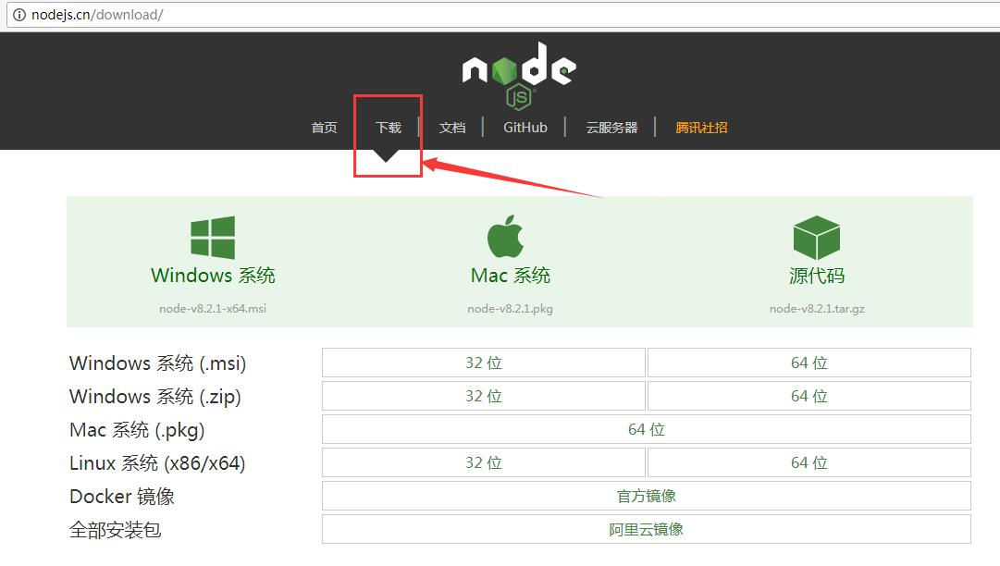

# 将网页转换为图片和PDF

> 通过NodeJS调用HeadLess-Chrome来实现。

`Headless` 模式是指没有图形界面(GUI)的程序。

本文先介绍需要使用到的相关技术, 然后再演示如何如何使用 HeadLess-Chrome；比如通过命令行调用， 以及通过NodeJS来调用HeadLess-Chrome。 至于C++的API调用方式, 请参考官网文档。

使用HeadLess模式-Chrome 的好处是: 

- 不需要显卡支持, 可以在服务器环境运行, 包括Linux以及Windows系统。

- 用于自动化测试、可以执行自定义的JS，和在开发者控制台执行的效果一样。 

- 加入IP代理池, 拿来刷点击量/投票，能破解大部分高级预防措施，算是不错的选择。好用的IP池，比如蘑菇代理: <http://www.moguproxy.com/>。


###  1. 安装 Chrome

下载并安装最新版的Chrome, 至少Chrome60+。可以搜索 `离线安装 Chrome` 找到下载地址。

官网地址为: <https://www.google.com/chrome/>


### 2. 使用命令行方式

安装完成后, 会自动将Chrome程序所在的路径加入系统PATH。 

例如在Windows的命令行中执行:

```
PATH
```

可以看到, 其中有 `C:\Program Files (x86)\Google\Chrome\Application` 之类的记录。

如果要简单启动 chrome, 则和普通程序一样, 在命令行直接执行 `chrome` 即可.

```
chrome http://cncounter.com
```

当然，也直接带上一个网址。

2.1 生成页面截图

使用如下命令:

```
chrome --headless --screenshot=C:/cncounter.screenshot.png  --window-size=1024,768 http://cncounter.com
```

其中, `--headless` 指明使用后台模式, 不打开图形界面。

`--screenshot=C:/cncounter.screenshot.png` 说明需要执行界面截图操作, 参数值就是保存的路径,可以是绝对路径或者相对路径。

`--window-size=1024,768` 指定可视窗口的宽高, 如果页面很长,则需要指定很大的高度。

最后的 `http://cncounter.com` 则是网页的地址。


生成的是网页加载完成后的界面截图。

如果有重定向, 则保存的截图为重定向后的网页界面, 因为在 `DOMContentLoaded` 事件触发之后才会执行截屏操作。

如果找不到本地安装的 chrome, 可能需要手动配置PATH环境变量, 或者设置 alias。请参考本文末尾的相关链接。


2.2 将网页保存为PDF文件:

```
chrome --headless --print-to-pdf=C:/cncounter.pdf  http://www.cncounter.com
```

其中的 `--print-to-pdf` 参数指定了需要打印为PDF, 以及保存路径。


2.3 其他命令行参数:


- 启动debug监听端口; 在此模式下不会自动退出。

```
--remote-debugging-port=9222
```

介绍此参数的原因, 是因为NodeJS版本的API, 本质上就是启动一个监听端口, 然后通过 `chrome-remote-interface` 协议与这个端口进行通信。


- 自定义 user-agent 字符串: 

```
--user-agent="Renfufei.Test 02"
--user-agent="Mozilla/5.0 (Windows NT 6.1; Win64; x64) AppleWebKit/537.36 (KHTML, like Gecko) Chrome/71.0.3578.98 Safari/537.36"
```
指定 user-agent 的好处, 是可以模拟各种客户端, 因为某些服务端会对这个Header做出不同的响应。


- 指定超时时间, 超过此时间未加载完成, 则会强制触发 DOMContentLoaded 事件。 目前默认值是 `30000ms`, 即30秒。 

```
--timeout=1000
```

- 指定 repl, 启动完成后会接收命令行输入,作为JS脚本执行:

```
--repl
```

- 指定窗口大小:

```
--window-size=1280,800
```

- 打印页面到 PDF 文件:

```
--print-to-pdf=C:/xxx.pdf
```

- 截屏:

```
--screenshot=C:/xxxx.png
```


这些参数有些是互斥的。而且只在 `headless` 模式下生效。

在Linux和MacOSX系统下的用法基本相同, 除了文件路径的写法不一样。

总体来说, 命令行参数能传递的信息非常少, 不灵活, 而且大部分参数还不支持命令行进行指定, 期待以后的版本会有增强。

更多信息请参考本文末尾的链接。


### 3. 安装NodeJS

我们需要在本地先安装 NodeJS。

NodeJS的中文网站是: <http://nodejs.cn/>, 简介如下:

> * Node.js 是一个基于 Chrome V8 引擎的 JavaScript 运行环境。 
> * Node.js 使用了一个事件驱动、非阻塞式 I/O 的模型，使其轻量又高效。 
> * Node.js 的包管理器 npm，是全球最大的开源库生态系统。

下载地址: <http://nodejs.cn/download/>

NodeJS的下载界面如下:




建议下载最新版本,如 NodeJS v10.14 等。

下载完成后, 安装到默认目录, 查看版本号的命令是: `node -v`

示例:

```
node -v
v8.1.3

npm -v
5.0.3
```

NodeJS安装完成后, 会自动配置node环境, 以及 npm 等工具。

其中, node 是一个 REPL 环境, 在其中可以执行各种JS脚本, 当然, 也可以直接指定需要执行的JS文件, 示例如下。

```
C:\Users\Administrator>node
> Math.pow(2, 8)
256

> console.log(':'+new Date().getTime())
:1517903686795
undefined

> .exit

```

和Chrome浏览器中的-开发者控制台(Console)很像, 因为都基于V8引擎。

npm 全称是 node package manage, 即NodeJS的软件包管理工具.

如果某些安装包被墙, 则可以先安装淘宝的 cnpm 工具, 其使用方式和npm基本上完全一致。

全局安装 cnpm:

```
npm install -g cnpm --registry=https://registry.npm.taobao.org
```

安装完成后, 使用命令 `cnpm -v` 查看版本:

```
C:\Users\Administrator>cnpm -v
cnpm@6.0.0 
......省略部分
registry=https://registry.npm.taobao.org
```


### 4. 安装依赖


#### 安装 cnpm 

因为墙的原因, 用淘宝的 cnpm 来安装会更方便, cnpm 自动使用淘宝提供的镜像源。

```
npm install -g cnpm --registry=https://registry.npm.taobao.org
```

此处和第三步介绍的一致。


#### 安装puppeteer

> puppeteer, 音[,pʌpɪ'tɪr]; 类似: 帕皮提尔; 意思是 `操纵,傀儡师`;

Puppeteer是一个上层API, 封装了几乎所有可用的操作, 内置了Chrome, 使用起来非常方便。

 
在工作目录下, 创建 puppeteer的demo项目, 初始化, 并安装依赖:

windows命令行下切换盘符:

```
C:\Users\Administrator>e:
E:\>
```

然后创建目录, 当然也可以通过鼠标创建。

```
mkdir puppeteerdemo
```

接着执行项目初始化

```
cd puppeteerdemo

cnpm init -y
```

然后安装`puppeteer`依赖:

```
cnpm i puppeteer  --save
```

这里, `cnpm i` 中的 `i`, 等价于 `install`, 算是简写。

其中 `--save` 的意思,则是指定将依赖信息写入到 `package.json` 文件中;

安装过程中,大约需要下载100多MB的文件, 请耐心等待。

如果出错, 可能需要使用代理, 请到社区咨询或者搜索相关错误信息。


### 5. 使用puppeteer截屏

> 相关的文件在这个目录可以找到:  <https://github.com/cncounter/translation/tree/master/tiemao_2018/05_headless-chrome-node-js/>


创建一个 `demo-screenshot.js` 文件:


```
// 加载依赖库
const puppeteer = require('puppeteer');

(async () => {
  // 创建浏览器实例
  const browser = await puppeteer.launch();
  // 打开新标签页
  const page = await browser.newPage();
  // 打开页面
  await page.goto('http://www.cncounter.com');
  // 截屏; path 可以使用相对路径或者绝对路径
  await page.screenshot({path: 'cncounter_home.png'});
  // 执行完成之后, 关闭浏览器
  await browser.close();
})();

```


然后在命令行中使用node启动:

```
node demo-screenshot.js
```

稍等片刻, 即可在相对路径中, 看到保存的截屏图片, `cncounter_home.png`。

当然, 在Windows下,将这种命令保存为 `.cmd` 文件, 就可以鼠标双击打开了。 例如先新建文本文件 `XXXX.txt`, 编辑内容, 再另存为, 或者修改文件后缀都可以。


### 6. 使用puppeteer打印PDF

创建一个 `demo-printpdf.js` 文件:

```
// 加载依赖库
const puppeteer = require('puppeteer');

(async () => {
  // 创建浏览器实例
  const browser = await puppeteer.launch();
  // 打开新标签页
  const page = await browser.newPage();
  // 打开页面
  await page.goto('http://www.cncounter.com');
  // 配置选项
  var pdf_option = {
          // 保存路径, 可以为绝对路径
          path: 'cncounter_home.pdf', 
          // 是否显示页眉页脚, 默认 false
          displayHeaderFooter : false,
          // 打印背景图片, 默认 false
          printBackground : true,
          // 水平方向, 默认 false
          //landscape : true,
          // 纸张尺寸, 默认 'Letter', 如:
          // Letter:Legal:Tabloid:Ledger:或:
          // A0:A1:A2:A3:A4:A5:A6:
          format : 'A4', 
          // 页边距
          margin : {
              top    : '10px',
              right  : '10px',
              bottom : '10px',
              left   : '10px',
          }
      };
  // 可以设置媒介样式为 screen, 默认则是打印机'print' 
  await page.emulateMedia('screen');
  // 打印PDF
  await page.pdf(pdf_option);

  // 执行完成, 关闭浏览器
  await browser.close();
})();

```

然后在命令行中使用node启动:

```
node demo-printpdf.js
```

稍等片刻, 执行完成后, 即可在指定路径下看到 `cncounter_home.pdf` 文件, 打开试试?

更多puppeteer相关的API和配置项请参考: <https://github.com/GoogleChrome/puppeteer/blob/master/docs/api.md>


#### 6.2 解决乱码问题

要将HTML中的文字展示出来, 系统需要安装有相应的字体文件, 否则, 系统只能展示为问号 "?" 啦。


Linux 中文乱码问题, 请参考: <http://182.92.149.152/python/article_96.html>

首先将Windows下对应的字体文件, 复制到Linux的某个目录中, 然后才能安装。


```
# 进入字体存放目录
cd /usr/share/fonts/windows

mkfontscale

mkfontdir

fc-cache -fv

source /etc/profile

```

如果是 CentOS7.2/7.3的依赖库问题, 请参考: <https://segmentfault.com/a/1190000011382062>

比如执行:

```
sudo yum -y install pango.x86_64 libXcomposite.x86_64 libXcursor.x86_64 libXdamage.x86_64 libXext.x86_64 libXi.x86_64 libXtst.x86_64 cups-libs.x86_64 libXScrnSaver.x86_64 libXrandr.x86_64 GConf2.x86_64 alsa-lib.x86_64 atk.x86_64 gtk3.x86_64
```

```
sudo yum -y update nss
```


### 7. 使用简单的http服务

NodeJS 通过 http/https 模块来提供web服务。

### 7.1 基本的http服务

创建 `demo-server.js` 文件

```
// 模块以及端口号
const http = require('http');
const http_port = 80;

// 请求处理器
const requestHandler = (request, response) => {
  console.log("request.url="+request.url);
  response.end('Hello Node.js Server!');
};

// server实例
const server = http.createServer(requestHandler);
// 监听
server.listen(http_port, function(err){
  if (err) {
    return console.error('something bad happened', err);
  }
  console.log(`server is listening on ${http_port}`);
});

```

启动服务器:

```
node demo-server.js
```

然后用浏览器打开页面试试: <http://localhost:80/>

如果要打断命令行程序, 按 `CTRL+C` 组合键即可。


### 7.2 使用express框架

安装 express 框架:

```
cnpm install express --save

cnpm install express-handlebars --save

```

其中 `--save` 选项,指定将依赖信息写入到 `package.json` 文件中;

此处安装 `express-handlebars` 是因为后面的小节中会使用到。


创建 `demo-express.js` 文件:

```
// express参考API: http://expressjs.com/en/api.html

// 模块依赖
const path = require('path');
const express = require('express');
// 端口号
const http_port = 80;
// express服务实例
const server = express();

// 请求 Mapping
// get, post, put, all 等方法
server.get('/', function(request, response){
    // express 包装的参数
    var params = request.query;
    response.json(params);
});

// 启动监听
server.listen(http_port, function(err){
  if (err) {
    // 如果启动时发生错误:
    return console.error('something bad happened', err);
  }
  console.log(`server is listening on ${http_port}`);
});
```

启动 express 服务器:

```
node demo-express.js
```

然后可以访问地址: <http://localhost:80/?authorName=tiemao>

修改一下附带的参数, 看看结果有什么不同。

我们还可以设置调试模式:


```
set DEBUG=express*
node demo-express.js
```

继续访问地址: <http://localhost:80/?authorName=tiemao>, 可以看到控制台输出了很多带颜色的日志信息。

参考 Node Hero - Your First Node.js HTTP Server: <https://blog.risingstack.com/your-first-node-js-http-server/>


#### 7.3. 集成http服务与PDF打印


创建 printpdf.js 文件/模块:

```
// 简单的打印PDF的模块
// 提供2个方法: 
// initBrowser(); 初始化浏览器
// printpdf(config, browser);  打印
!(function(exports){

    // 加载依赖库
    const puppeteer = require('puppeteer');

    async function initBrowser(){
      // 创建浏览器实例
      const browser = await puppeteer.launch();
      return browser;
    };

    async function printpdf(config, browser){
        //
        var browser = config.browser;
        var needCloseBrowser = false;
        //
        if(!browser){
            browser = await initBrowser();
            needCloseBrowser = true;
        }
        // 打开新标签页
        const pageTab = await browser.newPage();
        
        // 请求URL
        var url = config.url;
        // 文件保存路径
        var path = config.path;
        // 回调地址
        var callback = config.callback;
        // 打开页面
        await pageTab.goto(url);
        //
        var pdf_option = {
              // 保存路径, 可以为绝对路径
              path: path,
              // 缩放倍数, 默认 1
              //scale: 1,
              // 页眉模板
              //headerTemplate: '',
              // 页脚模板
              //footerTemplate: '',
              // 是否显示页眉页脚, 默认 false
              displayHeaderFooter : false,
              // 打印背景图片, 默认 false
              printBackground : true,
              // 水平方向, 默认 false
              //landscape : true,
              // 打印页码范围, 默认空串表示所有,格式: '1-5, 8, 11-13'
              // pageRanges : '',
              // 纸张尺寸, 默认 'Letter', 如:
              // Letter:Legal:Tabloid:Ledger:
              // A0:A1:A2:A3:A4:A5:A6:
              format : 'A4',
              // format 优先级比 width 和 height 高
              // 可以带单位,支持'px','cm','in','mm'
              //width : 800,
              //height : '600px',
              // 页边距
              margin : {
                  top    : '1cm',
                  right  : '1cm',
                  bottom : '1cm',
                  left   : '1cm',
              }
          };
      // 模拟 screen 媒介样式来打印PDF
      await pageTab.emulateMedia('screen');
      // 打印PDF
      await pageTab.pdf(pdf_option);

      // 关闭标签页
      await pageTab.close()

      // 执行完成之后, 关闭浏览器
      if(needCloseBrowser){
        await browser.close();
      }
    };

    //
    exports.initBrowser = initBrowser;
    exports.printpdf = printpdf;

// end
})(exports);
```


创建 express-pdf.js 文件:

```
// express参考API: http://expressjs.com/en/api.html

// 模块依赖
var http = require('http');
const path = require('path');
const express = require('express');
// 端口号
const http_port = 80;
// express服务实例
const server = express();
//
const printpdf = require('./printpdf.js');

// 请求 Mapping; get, post, put, all 等

server.get('/printpdf.json', function(request, response){
    // express 包装的参数
    var params = request.query;
    // 请求URL
    var url = params.url;
    // 文件保存路径
    var path = params.path;
    // 回调地址
    var callback = params.callback;
    //
    var startMillis = new Date().getTime();

    //
    var config = {
        url : url,
        path : path,
        callback : callback
    };
    var promise = printpdf.printpdf(config);
    //
    promise.then(function(){
        //
        var successMillis = new Date().getTime();
        var costMillis = successMillis - startMillis;
        //
        console.log("costMillis=", costMillis);
        //  加上成功标识
        // 回调通知
        callback && http.get(callback, function(resp){
            let data = '';
            // A chunk of data has been recieved.
            resp.on('data', (chunk) => {
                data += chunk;
                data = data.trim();
            });
            resp.on('end', () => {
                console.log("request:"+callback, ";statusCode=", resp.statusCode);
                console.log("data="+data);
            });
        });
    }).catch(function(err){
        //
        console.error(err);
        // ...可以加上错误消息
        // 回调通知
        callback && http.get(callback);
    });
    // 返回JSON数据
    response.json(params);
});


// 启动监听
server.listen(http_port, function(err){
  if (err) {
    // 如果启动时发生错误:
    return console.error('something bad happened', err);
  }
  console.log(`server is listening on ${http_port}`);
});

```


启动服务器:

```
node express-pdf.js
```

在浏览器输入地址,加入参数访问即可查看效果:

<http://localhost/pdf.json?callback=http%3A%2F%2Fwww.cncounter.com%2Ftest%2Fcounter.jsp%3Fformat%3Djson&url=http%3A%2F%2Fwww.cncounter.com&path=E%3A%2Fcncounter_home.pdf>


#### 7.4 截屏并保存


创建 puppeteer-screenshot.js 文件:

```
// 简单的截屏模块
// 提供2个方法: 
// initBrowser(); 初始化浏览器
// screenshot(config, browser); 
!(function(exports){

    // 加载依赖库
    const puppeteer = require('puppeteer');

    async function initBrowser(){
      // 创建浏览器实例
      const browser = await puppeteer.launch();
      return browser;
    };

    async function screenshot(config, browser){
        //
        var browser = config.browser;
        var needCloseBrowser = false;
        //
        if(!browser){
            browser = await initBrowser();
            needCloseBrowser = true;
        }
        // 打开新标签页
        const pageTab = await browser.newPage();
        
        // 请求URL
        var url = config.url;
        // 文件保存路径
        var path = config.path;
        // 回调地址
        var callback = config.callback;
        // 打开页面
        await pageTab.goto(url);
        //
        var screenshot_option = {
              // 保存路径, 绝对/相对路径
              path: path,
              // jpeg or png
              type: 'png',
              // 是否为全页面截屏, 默认 false
              fullPage : true,
              // 省略白色背景, 可能为透明, 默认 false
              omitBackground : false
          };
      // 模拟 screen 媒介样式
      await pageTab.emulateMedia('screen');
      // 截屏screenshot
      var buffer = await pageTab.screenshot(screenshot_option);

      // 关闭标签页
      await pageTab.close()
      // 执行完成之后, 关闭浏览器
      if(needCloseBrowser){
        await browser.close();
      }
    };

    //
    exports.initBrowser = initBrowser;
    exports.screenshot = screenshot;

// end
})(exports);
```


创建 express-screenshot.js 文件:

```
// express参考API: http://expressjs.com/en/api.html

// 模块依赖
var http = require('http');
const path = require('path');
const express = require('express');
// 端口号
const http_port = 80;
// express服务实例
const server = express();
//
const screenshot = require('./puppeteer-screenshot.js');

// 请求 Mapping; get, post, put, all 等

server.get('/screenshot.json', function(request, response){
    // express 包装的参数
    var params = request.query;
    // 请求URL
    var url = params.url;
    // 文件保存路径
    var path = params.path;
    // 文件名称
    var filename = params.filename;
    // 回调地址
    var callback = params.callback;
    //
    var startMillis = new Date().getTime();

    //
    var config = {
        url : url,
        path : path,
        callback : callback
    };
    var promise = screenshot.screenshot(config);
    //
    promise.then(function(){
        //
        var successMillis = new Date().getTime();
        var costMillis = successMillis - startMillis;
        //
        console.log("costMillis=", costMillis);
        //  加上成功标识
        // 回调通知
        callback && http.get(callback, function(resp){
            let data = '';
            // A chunk of data has been recieved.
            resp.on('data', (chunk) => {
                data += chunk;
                data = data.trim();
            });
            resp.on('end', () => {
                console.log("request:"+callback, ";statusCode=", resp.statusCode);
                console.log("data="+data);
            });
        });
    }).catch(function(err){
        //
        console.error(err);
        //  加上错误消息
        // 回调通知
        callback && http.get(callback);
    });

    response.json(params);
});

// 启动监听
server.listen(http_port, function(err){
  if (err) {
    // 如果启动时发生错误:
    return console.error('something bad happened', err);
  }
  console.log(`server is listening on ${http_port}`);
});

```


启动服务器:

```
node express-screenshot.js
```

在浏览器输入地址和参数,即可查看效果:

<http://localhost/screenshot.json?callback=http%3A%2F%2Fwww.cncounter.com%2Ftest%2Fcounter.jsp%3Fformat%3Djson&url=https%3A%2F%2Fraw.githubusercontent.com%2Fcncounter%2Fcncounter-web%2Fmaster%2Fsrc%2Fmain%2Fwebapp%2FWEB-INF%2Fweb.xml&path=E%3A%2Fcncounter-web-xml.png>


### 8. 文件下载

创建 testdownload.js 文件:

```
// 模块依赖
const fs = require('fs');
const path = require('path');
const express = require('express');
// 端口号
const http_port = 80;
// express服务实例
const server = express();
// 可以为绝对路径;
var storagePath = "workspace";

// 示例: http://localhost:80/download/cncounter_home.pdf
// 对应的文件为: ${storagePath}/cncounter_home.pdf
server.get('/download/:fileName', function(req, res, next) {
  // 实现文件下载 
  var fileName = req.params.fileName;
  // 文件路径
  var filePath = storagePath + "/" + fileName;
  var stats = fs.statSync(filePath); 
  if(stats.isFile()){
    res.set({
      'Content-Type': 'application/octet-stream',
      'Content-Disposition': 'attachment; filename='+fileName,
      'Content-Length': stats.size
    });
    fs.createReadStream(filePath).pipe(res);
  } else {
    res.end(404);
  }
});

// 启动监听
server.listen(http_port, function(err){
  if (err) {
    // 如果启动时发生错误:
    return console.error('something bad happened', err);
  }
  console.log(`server is listening on ${http_port}`);
});

```

启动服务器:

```
node testdownload.js
```

假设项目根目录下存在 `workspace/cncounter_home.pdf` 文件。

浏览器访问类似地址即可下载: <http://localhost:80/download/cncounter_home.pdf>

使用 storagePath 或者类似变量的目的, 是将程序和存储分开。


### 总结

Chrome 的 headless 模式可用于自动化测试，尽管有一些不完善的地方。
毕竟是真实的浏览器, 比起其他前端自动化测试工具来说, 具有很大优势。


参考: <https://www.sitepoint.com/headless-chrome-node-js/>


相关链接:


1. [Getting Started with Headless Chrome](https://developers.google.com/web/updates/2017/04/headless-chrome)

1. [Chrome-Headless模式shell命令行参数1](https://cs.chromium.org/chromium/src/headless/app/headless_shell.cc)

1. [Chrome-Headless模式shell命令行开关](https://cs.chromium.org/chromium/src/headless/app/headless_shell_switches.cc)

1. [DIV.IO中文文章: Chrome Headless 模式  ](https://div.io/topic/1978)

1. [Headless Chromium README.md](https://chromium.googlesource.com/chromium/src/+/master/headless/README.md)

1. [Chrome DevTools Protocol ](https://chromedevtools.github.io/devtools-protocol/)

1. [Automated testing with Headless Chrome](https://developers.google.com/web/updates/2017/06/headless-karma-mocha-chai)

1. [phantomjs官网](http://phantomjs.org/)

1. [casperjs官网](http://casperjs.org/)

1. [Puppeteer API](https://developers.google.com/web/tools/puppeteer/)

1. [puppeteer相关的API和配置项](https://github.com/GoogleChrome/puppeteer/blob/master/docs/api.md)

1. [MDN: async function 简介](https://developer.mozilla.org/en-US/docs/Web/JavaScript/Reference/Statements/async_function)

1. [sitepoint文章: Async Function 实战](https://www.sitepoint.com/simplifying-asynchronous-coding-async-functions/)

1. [NodeJS中文网-API文档](http://nodejs.cn/api/http.html)
