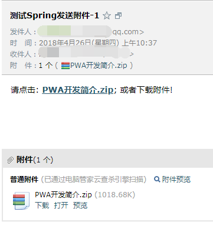
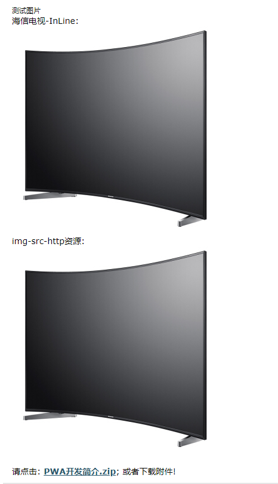

# spring通过QQ邮箱发送Email

> 本文简要介绍如何通过Spring框架的支持,通过QQ邮箱来发送简单文本邮件,以及附件。

spring-context-support很早就内置支持邮件发送。

当然, 官方文档明确指出, 需要依赖 JavaMail 这个库。


在这个年代, 我们很少自己搭建 smtp 服务器来发送邮件, 一般都是使用邮件提供商的服务。 例如 QQ邮箱, 企业邮箱, 163, 或者阿里云之类的厂商。

注册一个账号， 然后参考邮件服务商的帮助中心, 以及账户设置页面, 获取smtp服务器端口信息, 以及你注册的账号和密码, 保存到一个比较安全的地方。


## 相关依赖。

pom.xml中的依赖如下:

```
<dependency>
    <groupId>org.springframework</groupId>
    <artifactId>spring-context-support</artifactId>
    <version>4.0.7.RELEASE</version>
</dependency>
<dependency>
    <groupId>javax.mail</groupId>
    <artifactId>mail</artifactId>
    <version>1.4.7</version>
</dependency>
<dependency>
    <groupId>commons-io</groupId>
    <artifactId>commons-io</artifactId>
    <version>2.2</version>
</dependency>
```

其中, `commons-io` 根据需要决定, 本文中使用了 IOUtils工具类, 提供了很多方便又强大的IO工具方法, 有兴趣可以研究一下。


## Spring-Mail 相关的接口与实现类

- `MailSender` , 发送简单邮件的顶层接口。
- `JavaMailSender` , 继承顶层接口, 支持发送 MIME 邮件。
- `JavaMailSenderImpl` 实现类, 顾名思义。
- `SimpleMailMessage` 类, 简单邮件信息, 包括 `from`, `to`, `cc`, `subject` 以及 `text` 字段。
- `MimeMessagePreparator` 接口, 用于 MIME 邮件回调。
- `MimeMessageHelper` 辅助类, 可用于创建 MIME 邮件。支持图片、附件、以及 HTML 样式等。


## 简单测试代码

下面是简单的测试代码。 实际使用时请参考本文末尾的相关链接。把代码组织好看一点,好用一点。

```
package com.cncounter.test.spring;

import org.springframework.mail.MailException;
import org.springframework.mail.SimpleMailMessage;
import org.springframework.mail.javamail.JavaMailSenderImpl;

public class TestSpringEmail {
    public static void main(String[] args) {
        //
        sendTextEmail();
    }
    public static void sendTextEmail() {
        //
        JavaMailSenderImpl mailSender = new JavaMailSenderImpl();
        // 参考QQ邮箱帮助中心
        mailSender.setHost("smtp.qq.com"); // QQ邮箱smtp发送服务器地址
        //mailSender.setPort(465); // QQ这个端口不可用
        mailSender.setPort(587);// 端口号
        mailSender.setUsername("10001@qq.com"); // 使用你自己的账号
        mailSender.setPassword("usbusbcnzztbsbtob"); // 授权码-发短信获取
        // 邮件信息
        SimpleMailMessage msg = new SimpleMailMessage();
        msg.setFrom("10001@qq.com"); // 发件人邮箱
        msg.setTo("10086@vip.qq.com"); // 收件人邮箱
        msg.setSubject("测试Spring邮件"); // 标题
        msg.setText("您的订单号码: 20181120075; 请勿告诉别人!"); // 文本信息
        try {
            mailSender.send(msg);
            System.out.println("邮件发送成功!"); // 没有报错就是好消息 :-)
        } catch (MailException ex) {
            System.err.println("发送失败:" + ex.getMessage());
        }
    }
}

```

测试结果如下图所示:


可以看到, 简单验证码之类的文本, 通过这些封装好的工具类, 代码编写很容易。


## 发送附件示例

以下是发送附件的示例。 根据需要, 可以发送多个附件。

```
package com.cncounter.test.spring;

import org.apache.commons.io.IOUtils;
import org.springframework.core.io.ByteArrayResource;
import org.springframework.mail.MailException;
import org.springframework.mail.javamail.*;

import javax.mail.MessagingException;
import javax.mail.internet.MimeMessage;
import java.io.*;
import java.util.Properties;

public class TestSpringAttachEmail {
    public static void main(String[] args) throws Exception {
        // 发送带附件的MIME邮件
        sendAttachmentEmail();
    }

    // 发送带附件的MIME邮件
    public static void sendAttachmentEmail() throws MessagingException, IOException {
        // 邮件发送器
        JavaMailSender mailSender = getJavaMailSender();
        // MIME 邮件
        MimeMessage mimeMessage = mailSender.createMimeMessage();
        // 辅助类; 明确使用 UTF-8 编码; 否则HTML报中文乱码
        MimeMessageHelper helper = new MimeMessageHelper(mimeMessage, true, "UTF-8");
        //
        boolean isHTML = true;
        // 邮件信息
        helper.setFrom("10001@qq.com"); // 发件人邮箱
        helper.setTo("10086@vip.qq.com"); // 收件人邮箱
        helper.setSubject("测试Spring发送附件-1"); // 标题
        helper.setText("请点击: <a href='http://www.yuledanao.com/dl/PWA_INTRO.zip'><b>PWA开发简介.zip</b></a>;" +
                " 或者下载附件!", isHTML); // HTML-信息

        // 增加1个附件; 可以使用多种资源API
        String fileName1 = "E:/PWA开发简介.zip";
        InputStream inputStream1 = new FileInputStream(fileName1);
        //
        // Java Mail 会打开2次 InputStreamResource
	// 第一次确定编码, 第二次才执行编码。
        ByteArrayResource byteResource1 =
                new ByteArrayResource(IOUtils.toByteArray(inputStream1));
        // 所以不能使用 InputStreamResource
        // InputStreamResource attachment1 = new InputStreamResource(inputStream1);
        helper.addAttachment("PWA开发简介.zip", byteResource1);
        try {
            mailSender.send(mimeMessage);
            System.out.println("邮件发送成功!"); // 没有报错就是好消息 :-)
        } catch (MailException ex) {
            System.err.println("发送失败:" + ex.getMessage());
        } finally {
            IOUtils.closeQuietly(inputStream1);
        }
    }

    // 获取邮件发送器
    public static JavaMailSender getJavaMailSender() {
        //
        JavaMailSenderImpl mailSender = new JavaMailSenderImpl();
        // 参考QQ邮箱帮助中心
        mailSender.setHost("smtp.qq.com"); // QQ邮箱smtp发送服务器地址
        //mailSender.setPort(465); // QQ这个端口不可用? 为什么?
        mailSender.setPort(587);// 端口号
        mailSender.setUsername("10001@qq.com"); // 使用你自己的账号
        mailSender.setPassword("usbusbcnzztbsbtob"); // 授权码-发短信获取
        //
        // 相关属性配置, 也可以不修改,使用默认值
        Properties props = mailSender.getJavaMailProperties();
        props.put("mail.transport.protocol", "smtp");// 协议
        props.put("mail.smtp.auth", "true");// 登录
        props.put("mail.smtp.starttls.enable", "true");//使用SSL
        props.put("mail.debug", "true");// 调试信息输出
        //
        return mailSender;
    }
}
```

当然, 具体的代码请根据需要进行适当的封装。 比如自定义工具类。

结果如下图所示:




## 发送内联图片示例

有两种手段,请根据需要选择: 

1. HTML嵌入http路径的图片。
2. 以内联资源的方式发送图片。

以下是这两种内联图片的示例:


```
package com.cncounter.test.spring;

import org.apache.commons.io.IOUtils;
import org.springframework.core.io.ByteArrayResource;
import org.springframework.mail.MailException;
import org.springframework.mail.javamail.JavaMailSender;
import org.springframework.mail.javamail.JavaMailSenderImpl;
import org.springframework.mail.javamail.MimeMessageHelper;

import javax.mail.MessagingException;
import javax.mail.internet.MimeMessage;
import java.io.FileInputStream;
import java.io.IOException;
import java.io.InputStream;
import java.util.Properties;

public class TestSpringImageEmail {
    public static void main(String[] args) throws Exception {
        // 发送带内联图片的MIME邮件
        sendImageEmail();
    }

    // 发送带内联图片的MIME邮件
    public static void sendImageEmail() throws MessagingException, IOException {
        // 邮件发送器
        JavaMailSender mailSender = getJavaMailSender();
        // MIME 邮件
        MimeMessage mimeMessage = mailSender.createMimeMessage();
        // 辅助类; 明确使用 UTF-8 编码; 否则HTML报中文乱码
        MimeMessageHelper helper = new MimeMessageHelper(mimeMessage, true, "UTF-8");
        //
        boolean isHTML = true;
        // 邮件信息
        helper.setFrom("100001@qq.com"); // 发件人邮箱
        helper.setTo("10086@cncounter.cn"); // 收件人邮箱
        helper.setSubject("测试Spring发送内联图片-3"); // 标题
        helper.setText("<h1>测试图片</h1>" +
                "海信电视-InLine:" +
                "<br/>" +
                "<a target='_blank' href='http://www.yuledanao.com/dl/haixin.png'></a>" +
                "<br/>" +
                "img-src-http资源:" +
                "<br/>" +
                "<a target='_blank' href='http://www.yuledanao.com/dl/haixin.png'></a>" +
                "<br/>" +
                "<br/>" +
                "请点击: <a target='_blank' href='http://www.yuledanao.com/dl/PWA_INTRO.zip'><b>PWA开发简介.zip</b></a>;" +
                " 或者下载附件!", isHTML); // HTML-信息
        // cid - content-ID
        // 增加内联图片:
        // 不作为附件发送
        String imageName1 = "E:/haixin.png";
        InputStream imageInputStream1 = new FileInputStream(imageName1);
        ByteArrayResource imageResource1 =
                new ByteArrayResource(IOUtils.toByteArray(imageInputStream1));
        helper.addInline("image1", imageResource1, "image/png");

        // 增加1个附件; 可以使用多种资源API
        String fileName1 = "E:/PWA开发简介.zip";
        InputStream inputStream1 = new FileInputStream(fileName1);
        //
        // Java Mail 会打开2次 InputStreamResource;
        // 第一次确定编码, 第二次才执行编码。
        ByteArrayResource byteResource1 =
                new ByteArrayResource(IOUtils.toByteArray(inputStream1));
        // 所以不能直接使用 InputStreamResource
        // InputStreamResource attachment1 = new InputStreamResource(inputStream1);
        helper.addAttachment("PWA开发简介.zip", byteResource1);
        try {
            mailSender.send(mimeMessage);
            System.out.println("邮件发送成功!"); // 没有报错就是好消息 :-)
        } catch (MailException ex) {
            System.err.println("发送失败:" + ex.getMessage());
        } finally {
            IOUtils.closeQuietly(inputStream1);
        }
    }

    // 获取邮件发送器
    public static JavaMailSender getJavaMailSender() {
        //
        JavaMailSenderImpl mailSender = new JavaMailSenderImpl();
        // 参考QQ邮箱帮助中心
        mailSender.setHost("smtp.qq.com"); // QQ邮箱smtp发送服务器地址
        //mailSender.setPort(465); // QQ这个端口不可用? 为什么?
        mailSender.setPort(587);// 端口号
        mailSender.setUsername("100001@qq.com"); // 使用你自己的账号
        mailSender.setPassword("usbusbcnzztbsbtob"); // 授权码-发短信获取
        //
        // 相关属性配置, 也可以不修改,使用默认值
        Properties props = mailSender.getJavaMailProperties();
        props.put("mail.transport.protocol", "smtp");// 协议
        props.put("mail.smtp.auth", "true");// 登录
        props.put("mail.smtp.starttls.enable", "true");//使用SSL
        //props.put("mail.debug", "true");// 调试信息输出
        //
        return mailSender;
    }
}
```

如果在公网上没有固定的HTTP服务器或者CDN服务器, 则需要使用内联的方式来发送图片。

可以从网络上下载到图片资源, 则引用 HTTP 资源更简单便捷。 

需要CSS样式则设置HTML元素的style属性即可。

执行结果如下图所示:




和发送附件并不冲突。如果需要发送很多图片, 可以使用模板技术, 以及 Map/Bean来封装传入的数据。


更多信息, 请参考相关链接。


## 相关链接

Spring Email使用教程: <http://www.baeldung.com/spring-email>

spring集成Email文档: <https://docs.spring.io/spring/docs/current/spring-framework-reference/integration.html#mail>

日期: 2018年4月8日
