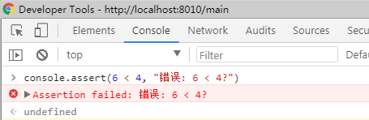
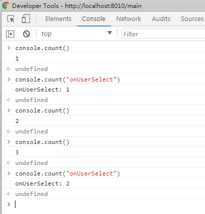
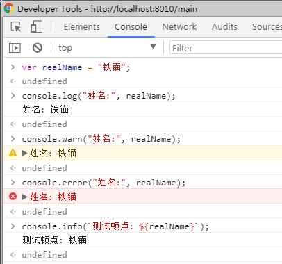
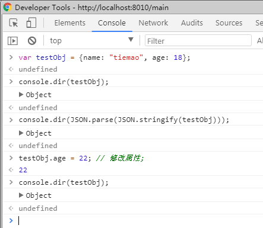
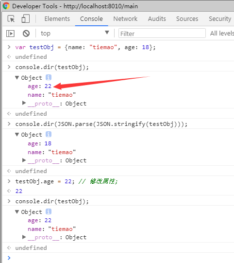

# 11_chrome_console

API 

## 1. assert

断言语法:

```
console.assert(expression, object)
```

示例:

```
console.assert(6 < 4, "错误: 6 < 4?");
```

结果如下图所示:




## 2. count

调用次数语法如下:

```
console.count(label)
```

示例:

```
console.count();
console.count("onUserSelect");
console.count();
console.count();
console.count("onUserSelect");
```

结果截图如下:




## 3. log


打印日志语法如下:

```
console.log(object [, object, ...])
```

类似地, 还有: 

```
console.debug(object [, object, ...])
console.info(object [, object, ...])
console.warn(object [, object, ...])
console.error(object [, object, ...])
```

这些函数的语法都一样,只是输出的日志级别不同。

示例如下:

```
var realName = "铁锚";
console.log("姓名:", realName);
console.warn("姓名:", realName);
console.error("姓名:", realName);
console.info(`测试顿点: ${realName}`);
```

请注意,如果使用顿点, 即 Markdown 中的code引用符号, 则可以解析上下文中的变量。 和 shell 之类的语法类似。

截图如下:




格式说明符

参考: <https://developers.google.com/web/tools/chrome-devtools/console/console-write#_8>

示例: 

打开  <https://www.baidu.com/>, 然后查看 Console。


## dir

展开某个对象, 语法如下:

```
console.dir(object)
```

注意, 这是懒加载方式的展示。如果某个对象内部的属性发生变化, 则显示的是展开时的最新值。

解决思路: 序列化之后, 再反序列化, 如 JSON.parse 与 JSON.stringify;

示例:

```
var testObj = {name: "tiemao", age: 18};
console.dir(testObj);
console.dir(JSON.parse(JSON.stringify(testObj)));
testObj.age = 22; // 修改属性;
console.dir(testObj);
```

如果先不展开各个对象, 则截图如下:




修改属性之后, 再展开之后, 可以看出点问题:




所以、特殊情况下,请考虑使用序列化, 或者深度clone之后, 再用 dir 打印信息。


##

console.dirxml(object)

## 

console.group(object[, object, ...])

console.groupCollapsed(object[, object, ...])

console.groupEnd()

##

console.profile([label])
console.profileEnd()


##

console.time(label)

console.timeStamp([label])

##

console.trace(object)


参考: <https://developers.google.com/web/tools/chrome-devtools/console/console-reference>

