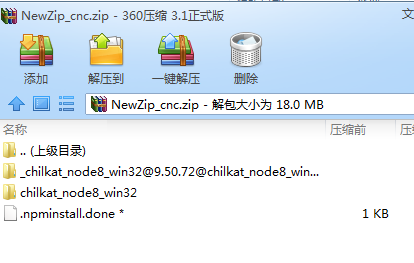

# NodejS对ZIP文件加密

### 1、安装nodejs

建议选择 nodeJS 8.0 及以上版本。

下载页面: <http://nodejs.cn/download/>


### 2、初始化项目。

```
npm init -y
```

### 3、根据代码, 安装对应平台的包。

chilkat是一套跨平台的工具组件,

```
var os = require('os');
if (os.platform() == 'win32') {  
    var chilkat = require('chilkat_node8_win32'); 
} else if (os.platform() == 'linux') {
    if (os.arch() == 'arm') {
        var chilkat = require('chilkat_node8_arm');
    } else if(os.arch() == 'x86') {
        var chilkat = require('chilkat_node8_linux32');
    } else {
        var chilkat = require('chilkat_node8_linux64');
    }
} else if (os.platform() == 'darwin') {
    var chilkat = require('chilkat_node8_macosx');
}
var zip = new chilkat.Zip();
// ...

```

如 windows 平台, 则安装 `chilkat_node8_win32` 这个包。

```
cnpm i chilkat_node8_win32 --save

```

原则上, cnpm 或者 npm 都可以安装。


### 4、示例代码

> index.js

```
// 判断操作系统
var os = require('os');
if (os.platform() == 'win32') {  
    var chilkat = require('chilkat_node8_win32'); 
} else if (os.platform() == 'linux') {
    if (os.arch() == 'arm') {
        var chilkat = require('chilkat_node8_arm');
    } else os.arch() == 'x86') {
        var chilkat = require('chilkat_node8_linux32');
    } else {
        var chilkat = require('chilkat_node8_linux64');
    }
} else if (os.platform() == 'darwin') {
    var chilkat = require('chilkat_node8_macosx');
}

// 执行该示例
chilkatExample();

// 简单示例
function chilkatExample() {
	//
	var zipFileName = "NewZip_cnc.zip"; //保存路径
	var zipPassword = "cncounter"; // 密码
	// src文件信息
	var srcFiles = "E:/CODE_ALL/zip-passwd/node_modules/*";

    // 初始化一个实例
	var zip = new chilkat.Zip();

    var success; // flag

    //  任意密钥,可以免费试用30天。
	var reg_key = "Anything for 30-day trial";
    success = zip.UnlockComponent(reg_key);
    if (success !== true) {
        console.log('UnlockComponent-密钥过期:', zip.LastErrorText);
        return;
    }

    success = zip.NewZip(zipFileName);
    if (success !== true) {
        console.log('NewZip-创建失败:', zipFileName, zip.LastErrorText);
        return;
    }

    //  设置使用 AES 加密方式.
    //  值为4, 表示兼容 WinZip 的 AES 加密.
    zip.Encryption = 4;
    //  Key 长度,可以是 128, 192, 或者 256 bits.
    zip.EncryptKeyLength = 128;
    //  设置AES加密密码:
    zip.EncryptPassword = zipPassword;

    var recurse = true; // 递归遍历目录
    success = zip.AppendFiles(srcFiles, recurse);
	// 此时只是添加文件引用信息, 尚未开始压缩和写入。
    if (success !== true) {
        console.log('AppendFiles:',zip.LastErrorText);
        return;
    }
    //  创建加密zip文件, 文件路径由前面的 NewZip 指定
    var success = zip.WriteZipAndClose();
    if (success !== true) {
        console.log("WriteZipAndClose-文件写入失败", zip.LastErrorText);
        return;
    }
    console.log("AES方式加密的zip文件创建成功.");
};

```

### 5、运行与测试

使用node来执行脚本:

```
node index.js

```

如果不报错, 就可以看到新创建的zip文件, 如:



其中文件名后面的 `*` 号, 表示加密文件内容的意思。

使用 "360压缩" 或者其他程序进行解压, 输入正确的密码, 对比解压后的文件与原始文件内容一致, 测试通过。


### 参考:

- 示例: <https://www.example-code.com/nodejs/zip_createAesEncrypted.asp>
- 依赖: <https://www.npmjs.com/package/chilkat_node8_win32>

日期: 2018年5月13日

作者: 铁锚 <https://blog.csdn.net/renfufei>