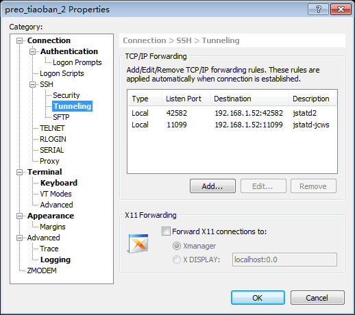
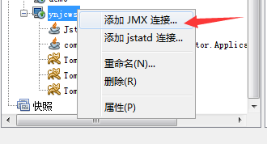

# JVM内存问题诊断示例1


问题描述:

    网站经常挂掉, 原因疑似Java进程被杀死。

配置信息:

    服务器 : 阿里云ECS, CentOS 7.2
    IP地址 : 192.168.1.52
    CPU    : 4核-虚拟CPU Intel Xeon E5-2650 2.60GHz
    物理内存: 8GB


## 现状:

1. 内存不足
    说明: 4个Java进程, 2.1+1.7+1.7+1.3 =6.8G, 已占用绝大部分内存。
    建议: 加大内存到16GB
2. 


## 诊断步骤:


查看OOM终结者日志:

Linux系统的OOM终结者, Out of memory killer。

```
sudo cat /var/log/messages | grep killer -A 2 -B 2

```

假如物理内存不足, Linux 会找出一头比较壮的进程来杀掉。

参考: <https://blog.csdn.net/renfufei/article/details/78178757>

经排查发现, 具有如下日志:

```
$ sudo cat /var/log/messages | grep killer -A 2 -B 2
May 21 09:55:01 ynjcws1 systemd: Started Session 500687 of user root.
May 21 09:55:02 ynjcws1 systemd: Starting Session 500687 of user root.
May 21 09:55:23 ynjcws1 kernel: java invoked oom-killer: gfp_mask=0x201da, order=0, oom_score_adj=0
May 21 09:55:24 ynjcws1 kernel: java cpuset=/ mems_allowed=0
May 21 09:55:24 ynjcws1 kernel: CPU: 3 PID: 25434 Comm: java Not tainted 3.10.0-514.6.2.el7.x86_64 #1
--
May 21 12:05:01 ynjcws1 systemd: Started Session 500843 of user root.
May 21 12:05:01 ynjcws1 systemd: Starting Session 500843 of user root.
May 21 12:05:22 ynjcws1 kernel: jstatd invoked oom-killer: gfp_mask=0x201da, order=0, oom_score_adj=0
May 21 12:05:22 ynjcws1 kernel: jstatd cpuset=/ mems_allowed=0
May 21 12:05:23 ynjcws1 kernel: CPU: 2 PID: 10467 Comm: jstatd Not tainted 3.10.0-514.6.2.el7.x86_64 #1
```

可以确定, 确实是物理内存不足引起的。

> 提示: 所有启动的 `-Xmx` 加起来, 大于系统的剩余内存, 就可能发生这种情况。


查看IP地址:

```
ifconfig
```

查看CPU信息:

```
cat /proc/cpuinfo
```

查看内存信息

```
free -h
```

内存使用量排序:

```
top -o %MEM
```

剩余可用内存:

```
cat /proc/meminfo | grep MemAvailable
```


查看Java进程信息:

```
sudo jps -v
```

## 远程监控JVM

查看JDK安装目录:

```
whereis javac
whereis jstatd
```

上传文件:

```
sudo rz -y
```

jstatd 配置目录:

```
sudo mkdir -p /etc/java
cd /etc/java/
```

相关文件的内容如下: 

```
# jstatd必须指定安全策略
$ cat jstatd.all.policy 

grant codebase "file:${java.home}/../lib/tools.jar" { 
   permission java.security.AllPermission; 
};

# 启动脚本
$ cat startjstatd.sh

/usr/local/jdk1.8.0_74/bin/jstatd -p 11099 -J-Djava.security.policy=/etc/java/jstatd.all.policy &

# 修改权限
$ sudo chmod 744 startjstatd.sh

```

启动jstatd:

```
sudo ./startjstatd.sh
```

查看相关端口号:

```
$ sudo netstat -ntlp | grep jstatd

tcp        0      0 0.0.0.0:42582           0.0.0.0:*               LISTEN      10379/jstatd
tcp        0      0 0.0.0.0:11099           0.0.0.0:*               LISTEN      10379/jstatd
```

如果要使用隧道, 则这两个端口都需要代理。比如使用 Xshell。

步骤: 

1、本机增加一个IP, 和服务器IP一致(如192.168.1.52)。
2、本机配置 hosts, 如 `192.168.1.52   ynjcws`
3、Xshell代理对应的2个端口号。如下图所示:



可以参考: <http://www.freeoa.net/osuport/sysadmin/the-three-port-forwarding-on-xshell_1888.html>

4、JVisualVM 监听远程主机, 如下图所示:


然后应该就可以看到相关的进程信息。

如果想查看某个进行更详细的信息, 需要增加启动参数, 指定JMX端口号。 如:

```
export JAVA_OPTS="$JAVA_OPTS 
	-Dcom.sun.management.jmxremote.port=19999
	-Dcom.sun.management.jmxremote.ssl=false
	-Dcom.sun.management.jmxremote.authenticate=false
	-Djava.rmi.server.hostname=192.168.1.52"
```

然后在客户端添加 JMX 连接。



参考: <https://github.com/cncounter/cncounter/blob/v0.0.4/%E6%9C%8D%E5%8A%A1%E5%99%A8config/Linux_web2/server_op_log.md#%E9%85%8D%E7%BD%AE-jmx-%E8%BF%9C%E7%A8%8B%E6%9C%8D%E5%8A%A1>


相关链接: [27_jvm_analysize_demo2.md](../27_jvm_analysize_demo2/27_jvm_analysize_demo2.md)


2018年5月21日


