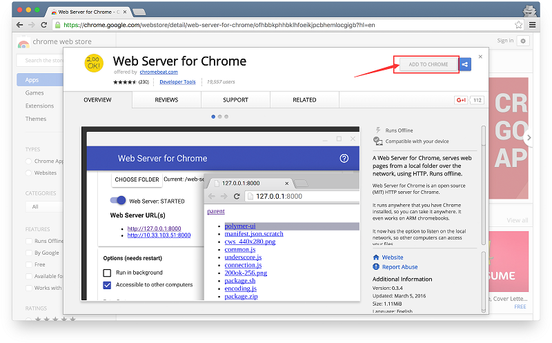
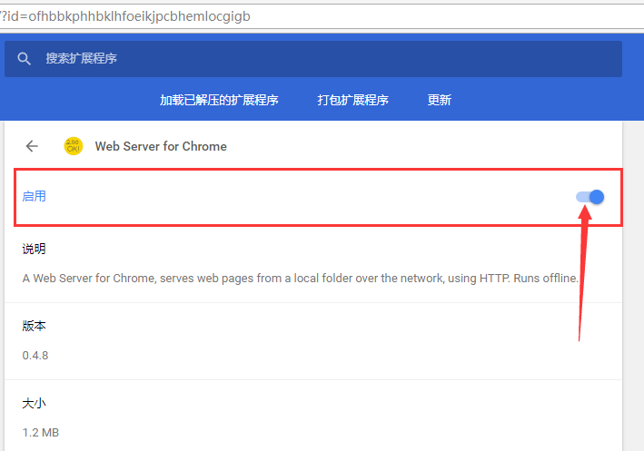
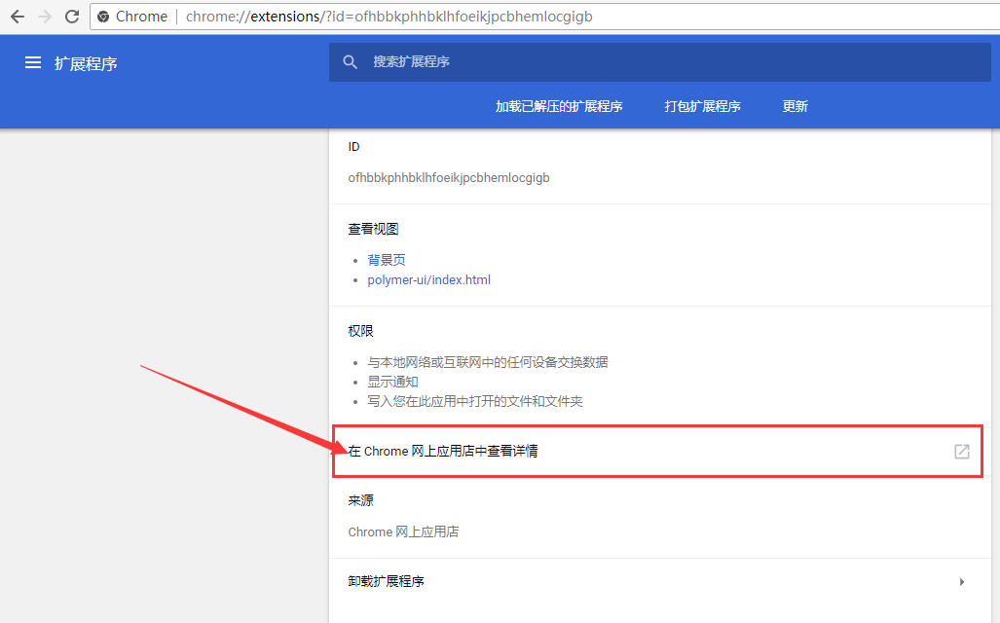
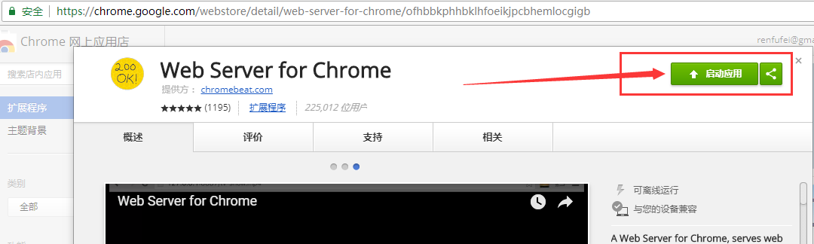
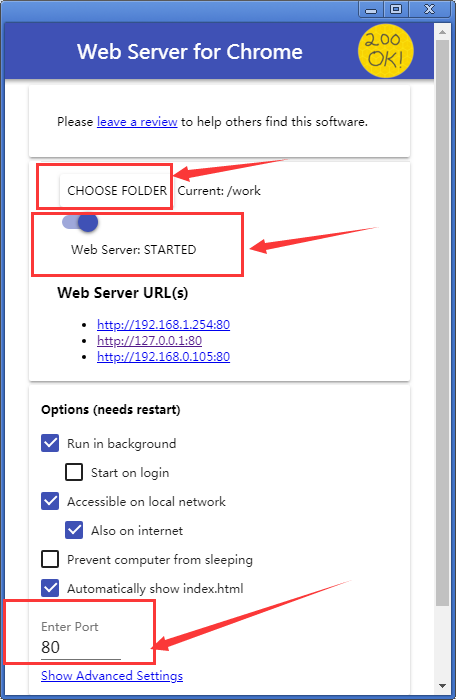
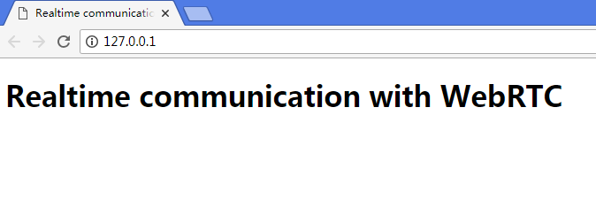

## 3. Get the sample code

## WebRTC基础实践 - 3. 获取示例代码

## Download the code

## 下载示例代码

If you're familiar with git, you can download the code for this codelab from GitHub by cloning it:

如果安装有git工具, 直接用下面的脚本, 从GitHub克隆代码即可:

```
git clone https://github.com/googlecodelabs/webrtc-web.git

```


Alternatively, click the following button to download a .zip file of the code:

或者, 点击链接下载 zip 压缩包:  <https://github.com/googlecodelabs/webrtc-web/archive/master.zip>

> 如果下载失败或者本地网络受限, 可通过小工具页面下载: <http://www.cncounter.com/tools/download.php?targetfilename=random.zip&origfileurl=https%3A%2F%2Fgithub.com%2Fgooglecodelabs%2Fwebrtc-web%2Farchive%2Fmaster.zip>


Open the downloaded zip file. This will unpack a project folder (**adaptive-web-media**) that contains one folder for each step of this codelab, along with all of the resources you will need.

下载完成后进行解压, 里面是一个自适应的网络资源项目(**adaptive-web-media**), 包含多个步骤对应的文件夹, 以及部分资源。

You'll be doing all your coding work in the directory named **work**.

预定的工作目录是 **work**。

The **step-nn** folders contain a finished version for each step of this codelab. They are there for reference.

类似 **step-xx** 的文件夹, 则包含了教程中每一个步骤对应的完成状态。仅供参考。

## Install and verify web server

## 安装并验证 web server

While you're free to use your own web server, this codelab is designed to work well with the Chrome Web Server. If you don't have that app installed yet, you can install it from the Chrome Web Store.

建议使用你比较熟悉的web服务器, 如 Nginx, Tomcat, NodeJS等等, 只要能以 `http://` 协议(不能是 `file://` 协议)访问到 work 目录下的文件即可。


> -------------------------------------------------------


下面的内容, 主要讲解的是, 在没有其他服务器可选的情况下, 如何使用 Chrome Web Server 扩展应用来模拟一个web服务器。需要从 Chrome Web Store 网站进行安装。

[Install Web Server for Chrome](https://chrome.google.com/webstore/detail/web-server-for-chrome/ofhbbkphhbklhfoeikjpcbhemlocgigb?hl=en)




After installing the **Web Server for Chrome** app, click on the Chrome Apps shortcut from the bookmarks bar, a New Tab page, or from the App Launcher:

安装完成之后, 进入 "更多工具 -- 扩展程序 " 页面(<chrome://extensions/>) , 找到这个Chrome 应用, 点击详细信息, 并启用:



接着将此页面下拉, 在新版本的Chrome中, 可能需要先点击 "在 Chrome 网上应用店中查看详情":



然后在Chrome网上应用店的页面中, 点击启动:





启动完成之后配置相关信息, 如端口号。

点击 **CHOOSE FOLDER** 可以配置WebRoot文件夹, 这里选择我们解压后的 `/work` 目录。





Click the **CHOOSE FOLDER** button, and select the **work** folder you just created. This will enable you to view your work in progress in Chrome via the URL highlighted in the Web Server dialog in the **Web Server URL(s)** section.

在配置项 **Options** 下面, 选中 **Automatically show index.html** , 则可以自动使用 index 作为默认页面。 


Then stop and restart the server by sliding the toggle labeled **Web Server: STARTED** to the left and then back to the right.

接下来需要停止并重启一次 server, 通过滑动切换标签 **Web Server: STARTED**,  (即先滑到左边, 再滑到到右边)。


Now visit your work site in your web browser by clicking on the highlighted Web Server URL. You should see a page that looks like this, which corresponds to **work/index.html**:

在 **Web Server URL(s)** 下面会显示相应的链接。点击其中一个, 默认打开的就是 **`work/index.html`** 文件。

如下图所示:




Obviously, this app is not yet doing anything interesting — so far, it's just a minimal skeleton we're using to make sure your web server is working properly. You'll add functionality and layout features in subsequent steps.

显然, 现在程序里什么都没有, 只是个空架子, 目的是为了确保web服务器运行正常. 在接下来的小节中, 我们会逐步添加功能和界面布局。

From this point forward, all testing and verification should be performed using this web server setup. You'll usually be able to get away with simply refreshing your test browser tab.

如果一切正常, 那么后面的测试和验证都可以使用这个 web server 配置。 

修改源文件并保存之后, 只需要刷新浏览器标签页, 就可以查看最新效果了。


原文链接: <https://codelabs.developers.google.com/codelabs/webrtc-web/#0>

翻译人员: 铁锚 - <https://blog.csdn.net/renfufei>

翻译日期: 2018年07月02日
