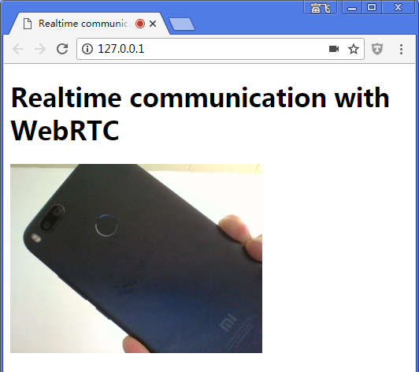

## 4. Stream video from your webcam

## 4. 从web摄像头获取视频流

## What you'll learn

## 本节要点

In this step you'll find out how to:

在本节的课程中, 我们将学习以下知识点:

*   Get a video stream from your webcam.
*   Manipulate stream playback.
*   Use CSS and SVG to manipulate video.

* 从web摄像头获取视频流(video stream)
* 播放视频流
* 使用CSS和SVG来处理视频。

A complete version of this step is in the `step-01` folder.

本节的完整版代码位于 `step-01` 文件夹中。

## A dash of HTML...

## HTML代码

Add a `video` element and a `script` element to `index.html` in your `work` directory:

在 `work` 目录下的 `index.html` 文件中, 增加 `video` 标签和 `script` 标签:

```
<!DOCTYPE html>
<html>
<head>
  <title>Realtime communication with WebRTC</title>
  <link rel="stylesheet" href="css/main.css" />
</head>

<body>
  <h1>Realtime communication with WebRTC</h1>
  <!-- 增加的代码在下面这里: -->
  <video autoplay playsinline></video>
  <script src="js/main.js"></script>
</body>

</html>
```

> 注意: 如果有中文, 则 `.html` 文件需要使用 UTF-8 编码保存/另存。


## ...and a pinch of JavaScript

## JavaScript代码

Add the following to **main.js** in your **js** folder:

在 `js` 目录下的 `main.js` 文件中, 加上下面的代码:


```
'use strict';

// 本节只需要使用到 video (video: true).
const mediaStreamConstraints = {
  video: true,
};

// 用于播放视频流stream 的 video元素.
const localVideo = document.querySelector('video');

// Local stream that will be reproduced on the video.
let localStream;

// success 处理函数;  by adding the MediaStream to the video element.
function gotLocalMediaStream(mediaStream) {
  localStream = mediaStream;
  localVideo.srcObject = mediaStream;
}

// error 处理函数;  将 error 信息打印到 console.
function handleLocalMediaStreamError(error) {
  console.log('navigator.getUserMedia error: ', error);
}

// 初始化 media stream.
navigator.mediaDevices.getUserMedia(mediaStreamConstraints)
  .then(gotLocalMediaStream).catch(handleLocalMediaStreamError);
```


> All the JavaScript examples here use `'use strict';` to avoid common coding gotchas.

> 本教程的所有 JavaScript 代码, 都在起始处加上 `'use strict';` 这样能避免很多新手常犯的编程错误。

> Find out more about what that means in [ECMAScript 5 Strict Mode, JSON, and More](http://ejohn.org/blog/ecmascript-5-strict-mode-json-and-more/).

> 关于严格模式的更多信息, 可以参考 [ECMAScript 5 Strict Mode, JSON, and More](http://ejohn.org/blog/ecmascript-5-strict-mode-json-and-more/)。

## Try it out

## 试试

Open `index.html` in your browser and you should see something like this (featuring the view from your webcam, of course!):

开放`index.html`




## How it works

## 它是如何工作的

Following the `getUserMedia()` call, the browser requests permission from the user to access their camera (if this is the first time camera access has been requested for the current origin). If successful, a [MediaStream](https://developer.mozilla.org/en/docs/Web/API/MediaStream) is returned, which can be used by a media element via the `srcObject` attribute:

后,`getUserMedia()`.如果成功,则返回(MediaStream)(https://developer.mozilla.org/en/docs/Web/API/MediaStream),这可以通过使用的媒体元素`srcObject`属性:

```
navigator.mediaDevices.getUserMedia(mediaStreamConstraints)
  .then(gotLocalMediaStream).catch(handleLocalMediaStreamError);

}
```


```
function gotLocalMediaStream(mediaStream) {
  localVideo.srcObject = mediaStream;
}
```


The `constraints` argument allows you to specify what media to get. In this example, video only, since audio is disabled by default:

的`constraints`参数允许您指定媒体得到什么。在这个例子中,视频,因为音频默认是禁用:

```
const mediaStreamConstraints = {
  video: true,
};
```


You can use constraints for additional requirements such as video resolution:

您可以使用约束等附加要求视频分辨率:

```
const hdConstraints = {
  video: {
    width: {
      min: 1280
    },
    height: {
      min: 720
    }
  }
}
```


The [MediaTrackConstraints specification](https://w3c.github.io/mediacapture-main/getusermedia.html#media-track-constraints) lists all potential constraint types, though not all options are supported by all browsers. If the resolution requested isn't supported by the currently selected camera, `getUserMedia()` will be rejected with an `OverconstrainedError` and the user will not be prompted to give permission to access their camera.

.`getUserMedia()`将被拒绝`OverconstrainedError`

> You can view a demo showing how to use constraints to request different resolutions [here](https://simpl.info/getusermedia/constraints/), and a demo using constraints to choose camera and microphone [here](https://simpl.info/getusermedia/sources/).

> 您可以查看一个演示如何使用约束要求不同的决议(这里)(https://simpl.信息/ getusermedia /约束/),和一个演示使用约束选择摄像头和麦克风(这里)(https://simpl.info/getusermedia/sources/)。

If `getUserMedia()` is successful, the video stream from the webcam is set as the source of the video element:

如果`getUserMedia()`成功,摄像头的视频设置视频元素的来源:

```
function gotLocalMediaStream(mediaStream) {
  localVideo.srcObject = mediaStream;
}
```


## Bonus points

## 加分

*   The `localStream` object passed to `getUserMedia()` is in global scope, so you can inspect it from the browser console: open the console, type _stream_ and press Return. (To view the console in Chrome, press Ctrl-Shift-J, or Command-Option-J if you're on a Mac.)
*   What does `localStream.getVideoTracks()` return?
*   Try calling `localStream.getVideoTracks()[0].stop()`.
*   Look at the constraints object: what happens when you change it to `{audio: true, video: true}`?
*   What size is the video element? How can you get the video's natural size from JavaScript, as opposed to display size? Use the Chrome Dev Tools to check.*   Try adding CSS filters to the video element. For example:

*`localStream`对象传递给`getUserMedia()`在全球范围内,所以你可以从浏览器控制台检查:打开控制台,类型_stream_并按返回.(查看控制台在Chrome,新闻Ctrl-Shift-J或Command-Option-J如果你在Mac)。
*是什么`localStream.getVideoTracks()`回报呢?
*试着打电话`localStream.getVideoTracks()[0].stop()``{audio: true, video: true}`吗?
.*尝试添加CSS过滤器视频元素。例如:

```
video {
  filter: blur(4px) invert(1) opacity(0.5);
}
```


*   Try adding SVG filters. For example:

*尝试添加SVG过滤器。例如:

```
video {
   filter: hue-rotate(180deg) saturate(200%);
}
```


## What you learned

## 你学到了什么

In this step you learned how to:

在这个步骤中,您了解了如何:

*   Get video from your webcam.
*   Set media constraints.
*   Mess with the video element.


A complete version of this step is in the **step-01** folder.

一个完整版的这一步是* * step-01 * *文件夹。

## Tips

## 提示

*   Don't forget the `autoplay` attribute on the `video` element. Without that, you'll only see a single frame!
*   There are lots more options for `getUserMedia()` constraints. Take a look at the demo at [webrtc.github.io/samples/src/content/peerconnection/constraints](https://webrtc.github.io/samples/src/content/peerconnection/constraints/). As you'll see, there are lots of interesting WebRTC samples on that site.

不要忘记你的`autoplay``video`元素。没有,你只会看到一个单帧!
*有更多选择`getUserMedia()`.如您所见,该网站上有很多有趣的WebRTC样本。

## Best practice

## 最佳实践

*   Make sure your video element doesn't overflow its container. We've added `width` and `max-width` to set a preferred size and a maximum size for the video. The browser will calculate the height automatically:

*确保你的视频不溢出容器元素。我们增加了`width`和`max-width`设置首选大小和最大大小的视频。浏览器将自动计算高度:

```
video {
  max-width: 100%;
  width: 320px;
}
```


## Next up

## 接下来

You've got video, but how do you stream it? Find out in the next step!

你有视频,但是如何流吗?在下一步中找到!

