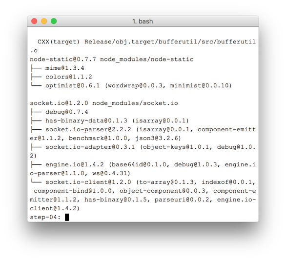

## 7. Set up a signaling service to exchange messages

## 7. 配置信令服务

## What you'll learn

## 本节内容

In this step, you'll find out how to:

在本节课程中, 将学习以下内容:

- Use `npm` to install project dependencies as specified in **package.json**
- Run a Node.js server and use node-static to serve static files.
- Set up a messaging service on Node.js using Socket.IO.
- Use that to create 'rooms' and exchange messages.

- 通过 `npm` 安装 `package.json` 文件中指定的项目依赖
- 运行Node.js服务器, 通过 node-static 提供静态文件服务。
- 用Socket.IO创建消息传递服务
- 创建聊天室以及发送聊天消息。

A complete version of this step is in the **step-04** folder.

本节的完整版代码位于 `step-04` 文件夹中。

## Concepts

## 基本概念

In order to set up and maintain a WebRTC call, WebRTC clients (peers) need to exchange metadata:

要创建并维持WebRTC调用, 客户端之间需要交换元数据:

- Candidate (network) information.
- **Offer** and **answer** messages providing information about media, such as resolution and codecs.

- 候选网络信息
- **Offer**(提供) 并且 **answer**(回应) 媒体相关的信息, 比如分辨率(resolution)和编解码器(codecs)。

In other words, an exchange of metadata is required before peer-to-peer streaming of audio, video, or data can take place. This process is called **signaling**.

换句话说, 在传输流媒体音频、视频或数据之前, 需要先交换元数据信息。这个过程称之为 **signaling**(信令)。

In the previous steps, the sender and receiver RTCPeerConnection objects are on the same page, so 'signaling' is simply a matter of passing metadata between objects.

在前面的小节中, 发送方和接收方的 RTCPeerConnection 对象都在同一个页, 所以传递信令的过程特别简单, 在对象间直接传递就行。

In a real world application, the sender and receiver RTCPeerConnections run in web pages on different devices, and you need a way for them to communicate metadata.

在现实世界中, 发送方和接收方是不同的设备, 所以需要具备交换元数据的通道。

For this, you use a **signaling server**: a server that can pass messages between WebRTC clients (peers). The actual messages are plain text: stringified JavaScript objects.

为此, 我们需要 **signaling server**(信令服务器): 为WebRTC客户端(peers)之间通信传递消息的服务器。 实际上这些消息都是纯文本格式的: 字符串形式的JavaScript对象。

## Prerequisite: Install Node.js

## 环境准备: 安装Node.js

In order to run the next steps of this codelab (folders **step-04** to **step-06**) you will need to run a server on localhost using Node.js.

要运行本节和接下来的实例代码(**step-04** 到 **step-06**), 需要在本机安装并运行 Node.js 服务器。

You can download and install Node.js from [this link](https://nodejs.org/en/download/) or via your preferred [package manager](https://nodejs.org/en/download/package-manager/).

Node.js中文网下载链接: <http://nodejs.cn/download/>; 当然也可以直接Node.js官网下载: <https://nodejs.org/en/download/>。 另外, 某些平台上也可以通过包管理器进行安装, 参考: <https://nodejs.org/en/download/package-manager/>。

Once installed, you will be able to import the dependencies required for the next steps (running `npm install`), as well as running a small localhost server to execute the codelab (running `node index.js`). These commands will be indicated later, when they are required.

安装完成后, 可以通过 `npm install` 来安装相关的依赖, 并通过 `node index.js` 命令来启动本地服务器。后面会在必要时介绍这些命令。


## About the app

## app简介

WebRTC uses a client-side JavaScript API, but for real-world usage also requires a signaling (messaging) server, as well as STUN and TURN servers. You can find out more [here](https://www.html5rocks.com/en/tutorials/webrtc/infrastructure/).

WebRTC使用客户端方式的JavaScript API, 但在实际应用中, 还需要有信令服务器(消息服务), 以及 STUN 和 TURN 服务器。 更多信息请参考 <https://www.html5rocks.com/en/tutorials/webrtc/infrastructure/>。

In this step you'll build a simple Node.js signaling server, using the Socket.IO Node.js module and JavaScript library for messaging. Experience with Node.js and Socket.IO will be useful, but not crucial; the messaging components are very simple.

在本节课程中, 我们将构建一个简单的 Node.js 信令服务器, 使用Socket.IO模块以及JavaScript库来传递消息。如果熟悉Node.js和Socket.IO会更容易理解, 不熟悉也没关系;消息组件非常简单易懂。

**Choosing the right signaling server**

**选择正确的信令服务器**

This codelab uses [Socket.IO](http://socket.io/) for a signaling server.

本教程使用 [Socket.IO](http://socket.io/) 作为信令服务器。

The design of Socket.IO makes it straightforward to build a service to exchange messages, and Socket.IO is suited to learning about WebRTC signaling because of its built-in concept of 'rooms'.

Socket.IO的设计使得创建消息交换服务非常简单, 而且 Socket.IO 非常适用于学习WebRTC信令, 因为其内置了 “聊天室”(rooms) 的概念。

**However, for a production service, there are better alternatives. **See [How to Select a Signaling Protocol for Your Next WebRTC Project](https://bloggeek.me/siganling-protocol-webrtc/).

但对于生产环境而言, 还有更多更好的选择。 请参考 [How to Select a Signaling Protocol for Your Next WebRTC Project](https://bloggeek.me/siganling-protocol-webrtc/)。

In this example, the server (the Node.js application) is implemented in **index.js**, and the client that runs on it (the web app) is implemented in **index.html**.

在本示例中, Node.js服务器启动的是 **index.js** 文件, 客户端则是打开对应的 **index.html** 文件。

The Node.js application in this step has two tasks.

在这一步中,  Node.js程序有两个任务。

First, it acts as a message relay:

一、 作为消息中继服务器:

```
socket.on('message', function (message) {
  log('Got message: ', message);
  socket.broadcast.emit('message', message);
});
```


Second, it manages WebRTC video chat 'rooms':

二、 管理WebRTC视频聊天室:

```
if (numClients === 0) {
  socket.join(room);
  socket.emit('created', room, socket.id);
} else if (numClients === 1) {
  socket.join(room);
  socket.emit('joined', room, socket.id);
  io.sockets.in(room).emit('ready');
} else { // max two clients
  socket.emit('full', room);
}
```


Our simple WebRTC application will permit a maximum of two peers to share a room.

这个简单的WebRTC应用, 一个房间最多只允许两个人使用。

## HTML & JavaScript

## HTML和JavaScript代码

Update **index.html** so it looks like this:

更新 **index.html** 文件, 内容如下:

```
<!DOCTYPE html>
<html>

<head>
  <title>Realtime communication with WebRTC</title>
  <link rel="stylesheet" href="css/main.css" />
</head>

<body>
  <h1>Realtime communication with WebRTC</h1>
  <script src="/socket.io/socket.io.js"></script>
  <script src="js/main.js"></script>
</body>
</html>
```


You won't see anything on the page in this step: all logging is done to the browser console. (To view the console in Chrome, press Ctrl-Shift-J, or Command-Option-J if you're on a Mac.)

页面上没有太多东西: 所有的日志信息都输出到浏览器控制台了。(要打开Chrome控制台, 请点击 `Ctrl-Shift-J`, Mac系统则是 `Command-Option-J`)。

Replace **js/main.js** with the following:

替换 **js/main.js** 的内容:

```
'use strict';

var isInitiator;

window.room = prompt("Enter room name:");

var socket = io.connect();

if (room !== "") {
  console.log('Message from client: Asking to join room ' + room);
  socket.emit('create or join', room);
}

socket.on('created', function(room, clientId) {
  isInitiator = true;
});

socket.on('full', function(room) {
  console.log('Message from client: Room ' + room + ' is full :^(');
});

socket.on('ipaddr', function(ipaddr) {
  console.log('Message from client: Server IP address is ' + ipaddr);
});

socket.on('joined', function(room, clientId) {
  isInitiator = false;
});

socket.on('log', function(array) {
  console.log.apply(console, array);
});
```


## Set up Socket.IO to run on Node.js

## 设置Node.js中使用的 Socket.IO

In the HTML file, you may have seen that you are using a Socket.IO file:

在HTML文件中, 你可能看到了, 我们使用了 Socket.IO 的一个文件:

```
<script src="/socket.io/socket.io.js"></script>
```


At the top level of your **work** directory create a file named **package.json** with the following contents:

在 **work** 目录中创建一个名为 **package.json** 的文件, 内容如下:

```
{
  "name": "webrtc-codelab",
  "version": "0.0.1",
  "description": "WebRTC codelab",
  "dependencies": {
    "node-static": "^0.7.10",
    "socket.io": "^1.2.0"
  }
}
```


This is an app manifest that tells Node Package Manager (`npm`) what project dependencies to install.

这是一个应用程序清单文件, 告诉Node的包管理器(`npm`)需要安装哪些依赖项。

To install dependencies (such as `/socket.io/socket.io.js`), run the following from the command line terminal, in your **work** directory:

要安装依赖, (如 `/socket.io/socket.io.js` ), 可以在命令行中, **work** 目录下执行命令:

```
npm install
```

如果是在国内, 可以使用以下 cnpm,

先全局安装 cnpm:

```
npm install -g cnpm
```

再使用cnpm:

```
cnpm install
```


You should see an installation log that ends something like this:

安装日志类似这样:




As you can see, `npm` has installed the dependencies defined in **package.json**.

可以看到, `npm` 安装了 **package.json** 中定义的依赖关系。

Create a new file **index.js** at the top level of your **work** directory (not in the **js** directory) and add the following code:

在 **work** 目录下创建一个新文件**index.js**(注意服务端脚本不放在 **js** 目录下), 文件内容如下:

```
'use strict';

var os = require('os');
var nodeStatic = require('node-static');
var http = require('http');
var socketIO = require('socket.io');

var fileServer = new(nodeStatic.Server)();
var app = http.createServer(function(req, res) {
  fileServer.serve(req, res);
}).listen(8080);

var io = socketIO.listen(app);
io.sockets.on('connection', function(socket) {

  // convenience function to log server messages on the client
  function log() {
    var array = ['Message from server:'];
    array.push.apply(array, arguments);
    socket.emit('log', array);
  }

  socket.on('message', function(message) {
    log('Client said: ', message);
    // for a real app, would be room-only (not broadcast)
    socket.broadcast.emit('message', message);
  });

  socket.on('create or join', function(room) {
    log('Received request to create or join room ' + room);

    var clientsInRoom = io.sockets.adapter.rooms[room];
    var numClients = clientsInRoom ? Object.keys(clientsInRoom.sockets).length : 0;

    log('Room ' + room + ' now has ' + numClients + ' client(s)');

    if (numClients === 0) {
      socket.join(room);
      log('Client ID ' + socket.id + ' created room ' + room);
      socket.emit('created', room, socket.id);

    } else if (numClients === 1) {
      log('Client ID ' + socket.id + ' joined room ' + room);
      io.sockets.in(room).emit('join', room);
      socket.join(room);
      socket.emit('joined', room, socket.id);
      io.sockets.in(room).emit('ready');
    } else { // max two clients
      socket.emit('full', room);
    }
  });

  socket.on('ipaddr', function() {
    var ifaces = os.networkInterfaces();
    for (var dev in ifaces) {
      ifaces[dev].forEach(function(details) {
        if (details.family === 'IPv4' && details.address !== '127.0.0.1') {
          socket.emit('ipaddr', details.address);
        }
      });
    }
  });

});
```


From the command line terminal, run the following command in the **work** directory:

打开命令行终端, 在**work**目录下执行命令:

```
node index.js
```

> 当然, 也可以保存为启动脚本, 如 `startup_index.cmd` 文件。


From your browser, open **localhost:8080**.

打开浏览器, 输入地址: <http://localhost:8080>。

Each time you open this URL, you will be prompted to enter a room name. To join the same room, choose the same room name each time, such as 'foo'.

打开页面时, 会提示用户输入房间号。如果要加入同一个房间, 则两个客户端输入相同的房间号即可, 如 "cnc"。

Open a new tab page, and open **localhost:8080** again. Choose the same room name.

再打开第二个标签页, 输入地址: <http://localhost:8080>。 输入同样的房间号。

Open **localhost:8080** in a third tab or window. Choose the same room name again.

再打开第三个标签页, 输入地址: <http://localhost:8080>。 也输入同样的房间号。

Check the console in each of the tabs: you should see the logging from the JavaScript above.

然后查看每个选项卡的控制台日志信息, 应该能看到上面的JavaScript中打印的日志信息。

## Bonus points

## 练习与实践

1. What alternative messaging mechanisms might be possible? What problems might you encounter using 'pure' WebSocket?
2. What issues might be involved with scaling this application? Can you develop a method for testing thousands or millions of simultaneous room requests?
3. This app uses a JavaScript prompt to get a room name. Work out a way to get the room name from the URL. For example *localhost:8080/foo* would give the room name `foo`.

1. 有哪些可选的消息传递机制? 如果纯粹使用 WebSocket, 会遇到哪些问题?
2. 扩展这个应用程序， 会涉及哪些问题? 你能用某种技术来模拟成千上万个并发请求吗?
3. 这个应用程序使用了一个JavaScript来让用户输入房间号。 试试将房间号放置到URL之中。例如 <http://localhost:8080/cnc> 则对应房间号 `cnc`。

## What you learned

## 知识点回顾

In this step, you learned how to:

在本节课程中, 我们学到了:

- Use npm to install project dependencies as specified in package.json
- Run a Node.js server to server static files.
- Set up a messaging service on Node.js using socket.io.
- Use that to create 'rooms' and exchange messages.


- 通过 `npm` 安装 `package.json` 清单文件中指定的项目依赖
- 运行Node.js服务器,  提供静态文件服务。
- 用Socket.IO创建消息传递服务
- 创建聊天室以及发送聊天消息。

A complete version of this step is in the **step-04** folder.

本节的完整版代码位于 `step-04` 文件夹中。

## Find out more

## 了解更多

- [Socket.io chat-example repo](https://github.com/rauchg/chat-example)
- [WebRTC in the real world: STUN, TURN and signaling](http://www.html5rocks.com/en/tutorials/webrtc/infrastructure/)
- [The term 'signaling' in WebRTC](https://www.webrtc-experiment.com/docs/WebRTC-Signaling-Concepts.html)


## Next up

## 后续内容

Find out how to use signaling to enable two users to make a peer connection.

使用信令, 让两个客户端建立对等连接。

