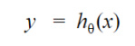
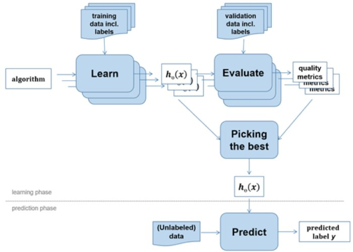
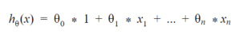
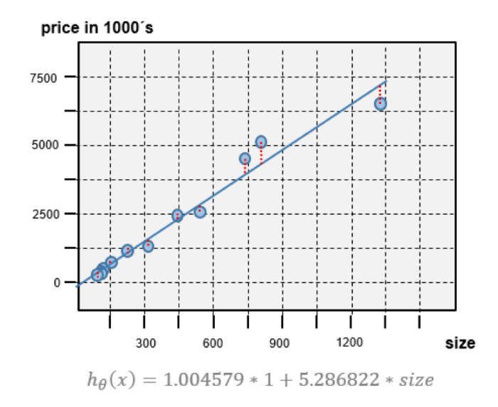
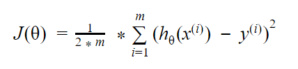
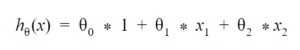
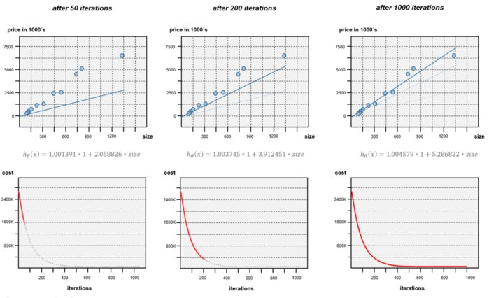
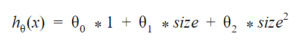
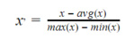
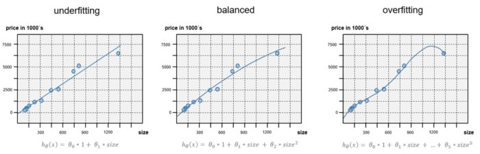

# Machine learning for Java developers

### Set up a machine learning algorithm and develop your first prediction function in Java


Self-driving cars, face detection software, and voice controlled speakers all are built on machine learning technologies and frameworks--and these are just the first wave. Over the next decade, a new generation of products will transform our world, initiating new approaches to software development and the applications and products that we create and use.

As a Java developer, you want to get ahead of this curve *now*--when tech companies are beginning to seriously invest in machine learning. What you learn today, you can build on over the next five years, but you have to start somewhere.

This article will get you started. You will begin with a first impression of how machine learning works, followed by a short guide to implementing and training a machine learning algorithm. After studying the internals of the learning algorithm and features that you can use to train, score, and select the best-fitting prediction function, you'll get an overview of using a JVM framework, Weka, to build machine learning solutions. This article focuses on supervised machine learning, which is the most common approach to developing intelligent applications.

## Machine learning and artificial intelligence

Machine learning has evolved from the field of artificial intelligence, which seeks to produce machines capable of mimicking human intelligence. Although machine learning is an emerging trend in computer science, artificial intelligence is not a new scientific field. The Turing test, developed by Alan Turing in the early 1950s, was one of the first tests created to determine whether a computer could have real intelligence. According to the Turing test, a computer could prove human intelligence by tricking a human into believing it was also human.

Many state-of-the-art machine learning approaches are based on decades-old concepts. What has changed over the past decade is that computers (and distributed computing platforms) now have the processing power required for machine learning algorithms. Most machine learning algorithms demand a huge number of matrix multiplications and other mathematical operations to process. The computational technology to manage these calculations didn't exist even two decades ago, but it does today.

Machine learning enables programs to execute quality improvement processes and extend their capabilities without human involvement. A program built with machine learning is capable of updating or extending its own code.

## Supervised learning vs. unsupervised learning

Supervised learning and unsupervised learning are the most popular approaches to machine learning. Both require feeding the machine a massive number of data records to correlate and learn from. Such collected data records are commonly known as a *feature vectors.* In the case of an individual house, a feature vector might consist of features such as overall house size, number of rooms, and the age of the house.

**[ Learn Java from beginning concepts to advanced design patterns in this comprehensive 12-part course! ]**

In *supervised learning*, a machine learning algorithm is trained to correctly respond to questions related to feature vectors. To train an algorithm, the machine is fed a set of feature vectors and an associated label. Labels are typically provided by a human annotator, and represent the right "answer" to a given question. The learning algorithm analyzes feature vectors and their correct labels to find internal structures and relationships between them. Thus, the machine learns to correctly respond to queries.

As an example, an intelligent real estate application might be trained with feature vectors including the size, number of rooms, and respective age for a range of houses. A human labeler would label each house with the correct house price based on these factors. By analyzing that data, the real estate application would be trained to answer the question: "*How much money could I get for this house?*"

After the training process is over, new input data will not be labeled. The machine will be able to correctly respond to queries, even for unseen, unlabeled feature vectors.

In *unsupervised learning*, the algorithm is programmed to predict answers without human labeling, or even questions. Rather than predetermine labels or what the results should be, unsupervised learning harnesses massive data sets and processing power to discover previously unknown correlations. In consumer product marketing, for instance, unsupervised learning could be used to identify hidden relationships or consumer grouping, eventually leading to new or improved marketing strategies.

This article focuses on supervised machine learning, which is the most common approach to machine learning today.

### Supervised machine learning

All machine learning is based on data. For a supervised machine learning project, you will need to label the data in a meaningful way for the outcome you are seeking. In Table 1, note that each row of the house record includes a label for "house price." By correlating row data to the house price label, the algorithm will eventually be able to predict market price for a house not in its data set (note that house-size is based on square meters, and house price is based on euros).

## Table 1. House records

| FEATURE           | FEATURE         | FEATURE      | LABEL                   |
| ----------------- | --------------- | ------------ | ----------------------- |
| Size of house     | Number of rooms | Age of house | Estimated cost of house |
| 90 m2 / 295 ft    | 2 rooms         | 23 years     | 249,000 €               |
| 101 m2 / 331 ft   | 3 rooms         | n/a          | 338,000 €               |
| 1330 m2 / 4363 ft | 11 rooms        | 12 years     | 6,500,000 €             |

At early stages, you will likely label data records by hand, but you could eventually train your program to automate this process. You've probably seen this with email applications, where moving email into your spam folder results in the query "Is this spam?" When you respond, you are training the program to recognize mail that you don't want to see. The application's spam filter learns to label future mail from the same source, or bearing similar content, and dispose of it.

Labeled data sets are required for training and testing purposes only. After this phase is over, the machine learning algorithm works on unlabeled data instances. For instance, you could feed the prediction algorithm a new, unlabeled house record and it would automatically predict the expected house price based on training data.

## How machines learn to predict

The challenge of supervised machine learning is to find the proper prediction function for a specific question. Mathematically, the challenge is to find the input-output function that takes the input variables *x* and returns the prediction value *y*. This *hypothesis function* (hθ) is the output of the training process. Often the hypothesis function is also called *target* or *prediction* function.



In most cases, *x* represents a multiple-data point. In our example, this could be a two-dimensional data point of an individual house defined by the *house-size* value and the *number-of-rooms* value. The array of these values is referred to as the *feature vector*. Given a concrete target function, the function can be used to make a prediction for each feature vector *x*. To predict the price of an individual house, you could call the target function by using the feature vector { 101.0, 3.0 } containing the house size and the number of rooms:

```
// target function h (which is the output of the learn process)
Function<Double[], Double> h = ...;

// set the feature vector with house size=101 and number-of-rooms=3
Double[] x = new Double[] { 101.0, 3.0 };

// and predicted the house price (label)
double y = h.apply(x);


```

In Listing 1, the array variable *x *value represents the feature vector of the house. The *y* value returned by the target function is the predicted house price.

The challenge of machine learning is to define a target function that will work as accurately as possible for unknown, unseen data instances. In machine learning, the target function (hθ) is sometimes called a *model*. This model is the result of the learning process.



Based on labeled training examples, the learning algorithm looks for structures or patterns in the training data. From these, it produces a model that generalize well from that data.

Typically, the learning process is *explorative*. In most cases, the process will be performed multiple times by using different variations of learning algorithms and configurations.

Eventually, all the models will be evaluated based on performance metrics, and the best one will be selected. That model will then be used to compute predictions for future unlabeled data instances.

### Linear regression

To train a machine to think, the first step is to choose the learning algorithm you'll use. *Linear regression *is one of the simplest and most popular supervised learning algorithms. This algorithm assumes that the relationship between input features and the outputted label is [linear](https://en.wikipedia.org/wiki/Linear_function). The generic linear regression function below returns the predicted value by summarizing each element of the *feature vector* multiplied by a *theta parameter (θ)*. The theta parameters are used within the training process to adapt or "tune" the regression function based on the training data.



In the linear regression function, theta parameters and feature parameters are enumerated by a subscription number. The subscription number indicates the position of theta parameters (θ) and feature parameters (x) within the vector. Note that feature x0 is a constant offset term set with the value *1* for computational purposes. As a result, the index of a domain-specific feature such as house-size will start with x1. As an example, if x1 is set for the first value of the House feature vector, house size, then x2 will be set for the next value, number-of-rooms, and so forth.

Listing 2 shows a Java implementation of this linear regression function, shown mathematically as hθ(x) . For simplicity, the calculation is done using the data type `double`. Within the `apply()` method, it is expected that the first element of the array has been set with a value of 1.0 outside of this function.

#### Listing 2. Linear regression in Java

```
public class LinearRegressionFunction implements Function<Double[], Double> {
   private final double[] thetaVector;

   LinearRegressionFunction(double[] thetaVector) {
      this.thetaVector = Arrays.copyOf(thetaVector, thetaVector.length);
   }

   public Double apply(Double[] featureVector) {
      // for computational reasons the first element has to be 1.0
      assert featureVector[0] == 1.0;

      // simple, sequential implementation
      double prediction = 0;
      for (int j = 0; j < thetaVector.length; j++) {
         prediction += thetaVector[j] * featureVector[j];
      }
      return prediction;
   }

   public double[] getThetas() {
      return Arrays.copyOf(thetaVector, thetaVector.length);
   }
}


```

In order to create a new instance of the `LinearRegressionFunction`, you must set the theta parameter. The theta parameter, or vector, is used to adapt the generic regression function to the underlying training data. The program's theta parameters will be tuned during the learning process, based on training examples. The quality of the trained target function can only be as good as the quality of the given training data.

In the example below the `LinearRegressionFunction` will be instantiated to predict the house price based on house size. Considering that x0 has to be a constant value of 1.0, the target function is instantiated using two theta parameters. The theta parameters are the output of a learning process. After creating the new instance, the price of a house with size of 1330 square meters will be predicted as follows:

```
// the theta vector used here was output of a train process
double[] thetaVector = new double[] { 1.004579, 5.286822 };
LinearRegressionFunction targetFunction = new LinearRegressionFunction(thetaVector);

// create the feature vector function with x0=1 (for computational reasons) and x1=house-size
Double[] featureVector = new Double[] { 1.0, 1330.0 };

// make the prediction
double predictedPrice = targetFunction.apply(featureVector);


```

The target function's prediction line is shown as a blue line in the chart below. The line has been computed by executing the target function for all the house-size values. The chart also includes the price-size pairs used for training.



So far the prediction graph seems to fit well enough. The graph coordinates (the intercept and slope) are defined by the theta vector `{ 1.004579, 5.286822 }`. But how do you know that this theta vector is the best fit for your application? Would the function fit better if you changed the first or second theta parameter? To identify the best-fitting theta parameter vector, you need a *utility function*, which will evaluate how well the target function performs.

## Scoring the target function

In machine learning, a *cost function* (J(θ)) is used to compute the mean error, or "cost" of a given target function.



The cost function indicates how well the model fits with the training data. To determine the cost of the trained target function above, you would compute the *squared error* of each house example (*i*). The *error* is the distance between the calculated *y* value and the real *y* value of a house example *i*.

For instance, the real price of the house with size of 1330 is 6,500,000 €. In contrast, the predicted house price of the trained target function is 7,032,478 €: a gap (or error) of 532,478 €. You can also find this gap in the chart above. The gap (or error) is shown as a vertical dotted red line for each training price-size pair.

To compute the *cost* of the trained target function, you must summarize the squared error for each house in the example and calculate the mean value. The smaller the cost value of J(θ), the more precise the target function's predictions will be.

In Listing 3, the simple Java implementation of the cost function takes as input the target function, the list of training records, and their associated labels. The predicted value will be computed in a loop, and the error will be calculated by subtracting the real label value.

Afterward, the squared error will be summarized and the mean error will be calculated. The cost will be returned as a double value:

```
public static double cost(Function<Double[], Double> targetFunction,
                          List<Double[]> dataset,
                          List<Double> labels) {
   int m = dataset.size();
   double sumSquaredErrors = 0;

   // calculate the squared error ("gap") for each training example and add it to the total sum
   for (int i = 0; i < m; i++) {
      // get the feature vector of the current example
      Double[] featureVector = dataset.get(i);
      // predict the value and compute the error based on the real value (label)
      double predicted = targetFunction.apply(featureVector);
      double label = labels.get(i);
      double gap = predicted - label;
      sumSquaredErrors += Math.pow(gap, 2);
   }

   // calculate and return the mean value of the errors (the smaller the better)
   return (1.0 / (2 * m)) * sumSquaredErrors;
}


```

## Training the target function

Although the cost function helps to evaluate the quality of the target function and theta parameters, respectively, you still need to compute the best-fitting theta parameters. You can use the *gradient descent *algorithm for this calculation.

### Gradient descent

Gradient descent minimizes the cost function, meaning that it's used to find the theta combinations that produces the *lowest cost* (J(θ)) based on the training data.

Here is a simplified algorithm to compute new, better fitting thetas:


Within each iteration a new, better value will be computed for each individual θ parameter of the theta vector. The learning rate α controls the size of the computing step within each iteration. This computation will be repeated until you reach a theta values combination that fits well. As an example, the linear regression function below has three theta parameters:



Within each iteration a new value will be computed for each theta parameter: θ0, θ1, and θ2 in parallel. After each iteration, you will be able to create a new, better-fitting instance of the `LinearRegressionFunction` by using the new theta vector of `{θ0, θ1, θ2}`.

Listing 4 shows Java code for the gradient descent algorithm. The thetas of the regression function will be trained using the training data, data labels, and the learning rate (α). The output of the function is an improved target function using the new theta parameters. The `train()` method will be called again and again, and fed the new target function and the new thetas from the previous calculation. These calls will be repeated until the tuned target function's cost reaches a minimal plateau:

```
public static LinearRegressionFunction train(LinearRegressionFunction targetFunction,
                                             List<Double[]> dataset,
                                             List<Double> labels,
                                             double alpha) {
   int m = dataset.size();
   double[] thetaVector = targetFunction.getThetas();
   double[] newThetaVector = new double[thetaVector.length];

   // compute the new theta of each element of the theta array
   for (int j = 0; j < thetaVector.length; j++) {
      // summarize the error gap * feature
      double sumErrors = 0;
      for (int i = 0; i < m; i++) {
         Double[] featureVector = dataset.get(i);
         double error = targetFunction.apply(featureVector) - labels.get(i);
         sumErrors += error * featureVector[j];
      }

      // compute the new theta value
      double gradient = (1.0 / m) * sumErrors;
      newThetaVector[j] = thetaVector[j] - alpha * gradient;
   }

   return new LinearRegressionFunction(newThetaVector);
}


```

To validate that the cost decreases continuously, you can execute the cost function J(θ) after each training step. With each iteration, the cost must decrease. If it doesn't, then the value of the learning rate parameter is too large, and the algorithm will shoot past the minimum value. In this case the gradient descent algorithm fails.

The diagram below shows the target function using the computed, new theta parameter, starting with an initial theta vector of `{ 1.0, 1.0 }`. The left-side column shows the prediction graph after 50 iterations; the middle column after 200 iterations; and the right column after 1,000 iterations. As you see, the cost decreases after each iteration, as the new target function fits better and better. After 500 to 600 iterations the theta parameters no longer change significantly and the cost reaches a stable plateau. The accuracy of the target function will no longer significantly improve from this point.



In this case, although the cost will no longer decrease significantly after 500 to 600 iterations, the target function is still not optimal; it seems to *underfit*. In machine learning, the term *underfitting* is used to indicate that the learning algorithm does not capture the underlying trend of the data.

Based on real-world experience, it is expected that the the price per square metre will *decrease* for larger properties. From this we conclude that the model used for the training process, the target function, does not fit the data well enough. Underfitting is often due to an excessively simple model. In this case, it's the result of our simple target function using a single house-size feature only. That data alone is not enough to accurately predict the cost of a house.

## Adding features and feature scaling

If you discover that your target function doesn't fit the problem you are trying to solve, you can adjust it. A common way to correct underfitting is to add more features into the feature vector.

In the housing-price example, you could add other house characteristics such as the number of rooms or age of the house. Rather than using the single domain-specific feature vector of `{ size }` to describe a house instance, you could usea multi-valued feature vector such as `{ size, number-of-rooms, age }`.

In some cases, there aren't enough features in the available training data set. In this case, you can try adding polynomial features, which are computed by existing features. For instance, you could extend the house-price target function to include a computed squared-size feature (x2):



Using multiple features requires *feature scaling*, which is used to standardize the range of different features. For instance, the value range of `size2` feature is a magnitude larger than the range of the size feature. Without feature scaling, the `size2` feature will dominate the cost function. The error value produced by the `size2` feature will be much higher than the error value produced by the size feature. A simple algorithm for feature scaling is:



This algorithm is implemented by the `FeaturesScaling`class in the example code below. The `FeaturesScaling`class provides a factory method to create a scaling function adjusted on the training data. Internally, instances of the training data are used to compute the average, minimum, and maximum constants. The resulting function consumes a feature vector and produces a new one with scaled features. The feature scaling is required for the training process, as well as for the prediction call, as shown below:

```
// create the dataset
List<Double[]> dataset = new ArrayList<>();
dataset.add(new Double[] { 1.0,  90.0,  8100.0 });   // feature vector of house#1
dataset.add(new Double[] { 1.0, 101.0, 10201.0 });   // feature vector of house#2
dataset.add(new Double[] { 1.0, 103.0, 10609.0 });   // ...
//...

// create the labels
List<Double> labels = new ArrayList<>();
labels.add(249.0);        // price label of house#1
labels.add(338.0);        // price label of house#2
labels.add(304.0);        // ...
//...

// scale the extended feature list
Function<Double[], Double[]> scalingFunc = FeaturesScaling.createFunction(dataset);
List<Double[]>  scaledDataset  = dataset.stream().map(scalingFunc).collect(Collectors.toList());

// create hypothesis function with initial thetas and train it with learning rate 0.1
LinearRegressionFunction targetFunction =  new LinearRegressionFunction(new double[] { 1.0, 1.0, 1.0 });
for (int i = 0; i < 10000; i++) {
   targetFunction = Learner.train(targetFunction, scaledDataset, labels, 0.1);
}


// make a prediction of a house with size if 600 m2
Double[] scaledFeatureVector = scalingFunc.apply(new Double[] { 1.0, 600.0, 360000.0 });
double predictedPrice = targetFunction.apply(scaledFeatureVector);


```

As you add more and more features, you may find that the target function fits better and better--but beware! If you go too far, and add too many features, you could end up with a target function that is *overfitting*.

### Overfitting and cross-validation

Overfitting occurs when the target function or model fits the training data *too well*, by capturing noise or random fluctuations in the training data. A pattern of overfitting behavior is shown in the graph on the far-right side below:



Although an overfitting model matches very well on the training data, it will perform badly when asked to solve for unknown, unseen data. There are a few ways to avoid overfitting.

- Use a larger set of training data.
- Use an improved machine learning algorithm by considering regularization.
- Use fewer features, as shown in the middle diagram above.

If your predictive model overfits, you should remove any features that do not contribute to its accuracy. The challenge here is to find the features that contribute most meaningfully to your prediction output.

As shown in the diagrams, overfitting can be identified by visualizing graphs. Even though this works well using two dimensional or three dimensional graphs, it will become difficult if you use more than two domain-specific features. This is why cross-validation is often used to detect overfitting.

In a cross-validation, you evaluate the trained models using an unseen validation data set after the learning process has completed. The available, labeled data set will be split into three parts:

- The* training data set*.
- The *validation data set.*
- The* test data set.*

In this case, 60 percent of the house example records may be used to train different variants of the target algorithm. After the learning process, half of the remaining, untouched example records will be used to validate that the trained target algorithms work well for unseen data.

Typically, the best-fitting target algorithms will then be selected. The other half of untouched example data will be used to calculate error metrics for the final, selected model. While I won't introduce them here, there are other variations of this technique, such as* k fold cross-validation.*

## Machine learning tools and frameworks: Weka

As you've seen, developing and testing a target function requires well-tuned configuration parameters, such as the proper learning rate or iteration count. The example code I've shown reflects a very small set of the possible configuration parameters, and the examples have been simplified to keep the code readable. In practice, you will likely rely on machine learning frameworks, libraries, and tools.

Most frameworks or libraries implement an extensive collection of machine learning algorithms. Additionally, they provide convenient high-level APIs to train, validate, and process data models. Weka is one of the most popular frameworks for the JVM.

Weka provides a Java library for programmatic usage, as well as a graphical workbench to train and validate data models. In the code below, the Weka library is used to create a training data set, which includes features and a label. The `setClassIndex()` method is used to mark the label column. In Weka, the label is defined as a *class*:

```
// define the feature and label attributes
ArrayList<Attribute> attributes = new ArrayList<>();
Attribute sizeAttribute = new Attribute("sizeFeature");
attributes.add(sizeAttribute);
Attribute squaredSizeAttribute = new Attribute("squaredSizeFeature");
attributes.add(squaredSizeAttribute);
Attribute priceAttribute = new Attribute("priceLabel");
attributes.add(priceAttribute);


// create and fill the features list with 5000 examples
Instances trainingDataset = new Instances("trainData", attributes, 5000);
trainingDataset.setClassIndex(trainingSet.numAttributes() - 1);
Instance instance = new DenseInstance(3);

instance.setValue(sizeAttribute, 90.0);
instance.setValue(squaredSizeAttribute, Math.pow(90.0, 2));
instance.setValue(priceAttribute, 249.0);
trainingDataset.add(instance);
Instance instance = new DenseInstance(3);
instance.setValue(sizeAttribute, 101.0);
...


```

The data set or Instance object can also be stored and loaded as a file. Weka uses an ARFF (Attribute Relation File Format), which is supported by the graphical Weka workbench. This data set is used to train the target function, known as a *classifier* in Weka.

Recall that in order to train a target function, you have to first choose the machine learning algorithm. In the code below, an instance of the `LinearRegression` classifier will be created. This classifier will be train by calling the `buildClassifier()`. The `buildClassifier()` method tunes the theta parameters based on the training data to find the best-fitting model. Using Weka, you do not have to worry about setting a learning rate or iteration count. Weka also does the feature scaling internally.

```
Classifier targetFunction = new LinearRegression();
targetFunction.buildClassifier(trainingDataset);


```

Once it's established, the target function can be used to predict the price of a house, as shown below:

```
Instances unlabeledInstances = new Instances("predictionset", attributes, 1);
unlabeledInstances.setClassIndex(trainingSet.numAttributes() - 1);
Instance unlabeled = new DenseInstance(3);
unlabeled.setValue(sizeAttribute, 1330.0);
unlabeled.setValue(squaredSizeAttribute, Math.pow(1330.0, 2));
unlabeledInstances.add(unlabeled);

double prediction  = targetFunction.classifyInstance(unlabeledInstances.get(0));


```

Weka provides an `Evaluation` class to validate the trained classifier or model. In the code below, a dedicated validation data set is used to avoid biased results. Measures such as the cost or error rate will be printed to the console. Typically, evaluation results are used to compare models that have been trained using different machine-learning algorithms, or a variant of these:

```
Evaluation evaluation = new Evaluation(trainingDataset);
evaluation.evaluateModel(targetFunction, validationDataset);
System.out.println(evaluation.toSummaryString("Results", false));


```

The examples above uses linear regression, which predicts a numeric-valued output such as a house price based on input values. Linear regression supports the prediction of continuous, numeric values. To predict binary Yes/No values or classifiers, you could use a machine learning algorithm such as decision tree, neural network, or logistic regression:

```
// using logistic regression
Classifier targetFunction = new Logistic();
targetFunction.buildClassifier(trainingSet);


```

You might use one of these learning algorithms to predict whether an email was spam or ham, or to predict whether a house for sale could be a top-seller or not. If you wanted to train your algorithm to predict whether a house is likely to sell quickly, you would need to label your example records with a new classifying label such as `topseller`:

```
// using topseller label attribute instead price label attribute
ArrayList<String> classVal = new ArrayList<>();
classVal.add("true");
classVal.add("false");

Attribute topsellerAttribute = new Attribute("topsellerLabel", classVal);
attributes.add(topsellerAttribute);


```

This training set could be used to train a new prediction classifier: `topseller`. Once trained, the prediction call will return the class label index, which can be used to get the predicted value:

```
int idx = (int) targetFunction.classifyInstance(unlabeledInstances.get(0));
String prediction = classVal.get(idx);
 
 
```

## Conclusion

Although machine learning is closely related to statistics and uses many mathematical concepts, machine learning tools make it possible to start integrating machine learning into your programs without knowing a great deal about mathematics. That said, the better you understand the inner working of machine learning algorithms such as linear regression, which we explored in this article, the more you will be able to choose the right algorithm and configure it for optimal performance.

### Related links

A good way to get deeper into machine learning is to take an online course such as Andrew Ng's [Machine Learning](https://www.coursera.org/learn/machine-learning/) course or Udacity's [Intro to Machine Learning](https://www.udacity.com/course/intro-to-machine-learning--ud120).


<https://www.javaworld.com/article/3224505/application-development/e-developers.html>

